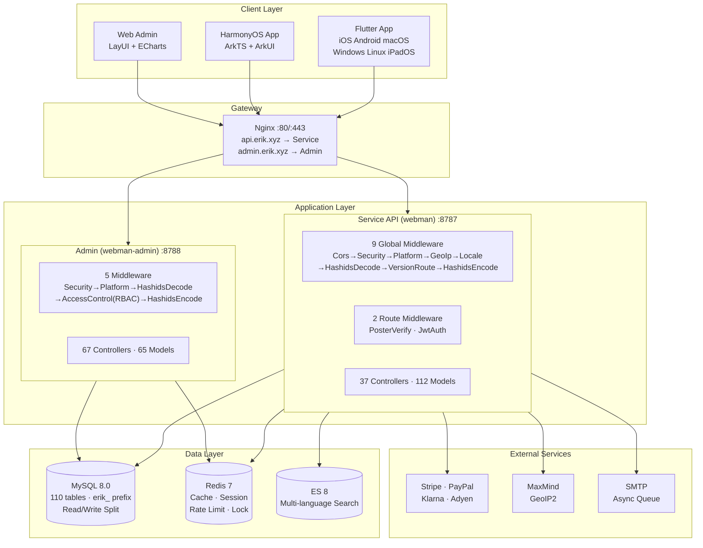
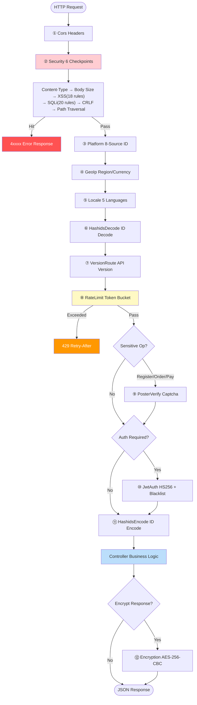
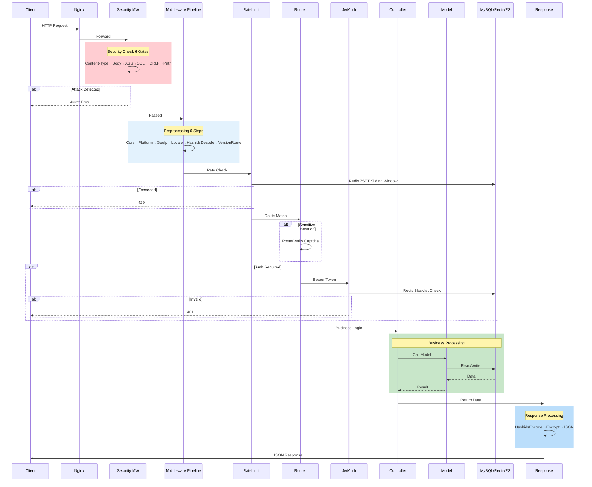

# Erik Shop — Cross-Border E-Commerce Platform (Full Edition)

Copyright (c) 2026 erik <erik@erik.xyz> — https://erik.xyz

## Editions

> Lite (MIT Open Source): `lite` | Standard (Commercial): `standard` | Full (Commercial): `full`
>
> Commercial license inquiries: **erik@erik.xyz** | Edition comparison: [docs/VERSIONS.md](docs/VERSIONS.md)

## Overview

A full-stack cross-border e-commerce platform built on the webman ecosystem, covering B2C, B2B, and multi-vendor marketplace scenarios.

### Architecture

| Layer | Technology | Directory |
|-------|-----------|-----------|
| Business API | webman + illuminate/database + erikwang2013/* | `service/` |
| Admin Panel | webman-admin + LayUI + ECharts | `admin/` |
| Mobile/Desktop | Flutter (iOS/Android/macOS/Windows/Linux) | `apps/flutter/` |
| HarmonyOS | ArkTS + ArkUI (HarmonyOS NEXT) | `apps/harmonyos/` |

### Tech Stack

**Server:** PHP 8.1+, webman 2.1, MySQL 8.0, Redis 7, Elasticsearch 8
**Core packages:** snowflake-php, hashids, jwt-webman, encryption, encryptable, poster-php, webman-scout, season
**Payments:** Stripe, PayPal, Klarna, Adyen
**Clients:** Flutter 3.x (Riverpod + GoRouter + Dio), HarmonyOS API 12+ (ArkTS + ArkUI)

## Architecture Diagrams

> Full diagram collection: [docs/diagrams.md](docs/diagrams.md)

### System Architecture



### Request Processing Flow



### Feature Module Map

```mermaid
graph TB
    CENTER["Erik Shop Cross-Border E-Commerce"]

    CENTER --> B2C["B2C Retail<br/>Multi-language · Multi-currency<br/>SKU · Cart · Orders"]
    CENTER --> B2B["B2B Wholesale<br/>Tiered Pricing · Verification<br/>RFQ · Quotes"]
    CENTER --> MART["Multi-Vendor<br/>Seller Onboarding<br/>Revenue Split"]
    CENTER --> CROSS["Compliance<br/>HS Code · Tariff Rules<br/>VAT/IOSS · Labels"]
    CENTER --> LOGISTICS["Logistics<br/>Zone Rates · DHL/UPS<br/>Overseas Warehouse"]
    CENTER --> PAY["Payments<br/>Stripe · PayPal<br/>Klarna · Adyen · 3DS"]
    CENTER --> MKT["Marketing<br/>Coupons · Flash Sales<br/>Group Buy · Affiliate"]
    CENTER --> MULTI["Multi-Platform<br/>Amazon · eBay · Shopee<br/>Listings · Orders"]
    CENTER --> SUPPLY["Supply Chain<br/>Suppliers · Procurement<br/>QC · Inventory Ledger"]
    CENTER --> RISK["Risk & Compliance<br/>Rule Engine · KYC<br/>GDPR · CCPA"]
    CENTER --> SECM["Security<br/>15 Attack Detections<br/>XSS · SQLi · XXE · SSRF"]
    CENTER --> PERF["Performance<br/>Rate Limit · Cache-Aside<br/>Circuit Breaker · R/W Split"]
    CENTER --> GROWTH["Growth<br/>Points · Gift Cards<br/>A/B Testing · Subscriptions"]
    CENTER --> CMS["Content<br/>CMS · FAQ · Knowledge Base<br/>Size Charts · Feed Sync"]
    CENTER --> CS["Support<br/>WebSocket IM<br/>Knowledge Base"]
    CENTER --> INFRA["Infrastructure<br/>Snowflake · Hashids<br/>JWT · AES · Poster"]
    CENTER --> CLIENTS["Multi-Client<br/>Flutter 5 Platforms<br/>HarmonyOS · Web"]

    style CENTER fill:#1565c0,color:#fff
```



### Request Lifecycle



> See [full diagram collection](docs/diagrams.md) for 6 diagrams including order lifecycle and deployment architecture.

## Quick Start

### Method 1: Web Installer (Recommended)

```bash
# 1. Install admin dependencies
cd admin && composer install

# 2. Start the admin panel
php start.php start -d

# 3. Open the installer in your browser
# http://127.0.0.1:8788/app/admin/install/step1
# Fill in database credentials → set admin account → done

# 4. Install and start the API service
cd ../service && composer install && php start.php start -d
```

> The web installer automatically: creates the database → imports 70 tables → generates `service/.env` and `admin/.env` (with random crypto keys) → creates the admin account → reloads services

### Method 2: Manual Installation

See [INSTALL.md](INSTALL.md) for detailed manual setup instructions.

### Docker Deployment

```bash
# Configure environment
cp .env.example .env  # set DB_PASS / JWT_SECRET etc.

# Start all services
docker-compose up -d
# nginx:80 → service:8787 + admin:8788
# MySQL:3306, Redis:6379, ES:9200
```

## Project Structure

```
shop-php/
  install.sql       # One-click install SQL (70 tables), auto-imported by web installer
  service/          PHP API (webman)            — 37 controllers + 63 models + 9 middleware
  admin/            Admin panel (webman-admin)   — 67 controllers + 65 models + web installer
  apps/flutter/     Flutter client              — 9 pages + 5 languages + PC adaptive layout
  apps/harmonyos/   HarmonyOS client            — 8 pages + ArkTS
  docker/           Docker deployment           — Nginx + PHP + MySQL + Redis + ES
  docs/             Design documentation
```

## Feature Coverage

| Dimension | Coverage |
|-----------|----------|
| **B2C Retail** | Multi-language products, multi-currency pricing, SKU, cart, orders, payments, refunds, returns |
| **B2B Wholesale** | Tiered pricing (MOQ), business verification (tax ID/license), RFQ quotes |
| **Multi-Vendor Marketplace** | Seller onboarding + product review + revenue splitting |
| **Cross-Border Compliance** | HS Code library, tariff rules, VAT/IOSS, compliance labels (FDA/CE/RoHS) |
| **International Logistics** | Zone-based shipping rates, overseas warehouses, HS customs declaration, commercial invoices |
| **Payments** | Stripe/PayPal/Klarna/Adyen, BNPL, 3DS verification |
| **Marketing** | Coupons (zone-limited), banners (region-visible), flash sales, group buying, affiliate system |
| **Multi-Platform** | Amazon/eBay/Shopee/Lazada/Temu product listings + order aggregation |
| **Supply Chain** | Supplier ratings, purchase orders, quality inspection, inventory ledger (immutable), transfers |
| **Risk & Compliance** | Rule engine (scoring pipeline), KYC verification, GDPR/CCPA data requests, Cookie consent |
| **Security** | 15 attack detection types (XSS/SQLi/XXE/SSRF/CRLF/path traversal/file upload/brute force) |
| **Performance** | Token bucket rate limiting, cache-aside (avalanche + penetration protection), circuit breaker, DB read/write split |
| **Membership** | Points rules, membership tiers + benefits, gift cards, price alerts, subscription auto-buy, A/B testing |
| **Content** | CMS multi-language pages, FAQ, knowledge base, size charts, email templates, product feed sync |
| **Customer Service** | WebSocket real-time IM, knowledge base (schema ready) |
| **Infrastructure** | Snowflake distributed IDs, Hashids obfuscation, JWT auth, AES encryption, GeoIP detection |
| **Multi-Platform Tracking** | 8 source platform identification (iOS/iPadOS/macOS/Windows/Linux/Android/HarmonyOS/Web) + DB logging |
| **Testing** | 23 tests / 68 assertions — ALL PASS (Security + JWT + API response) |

## Core Design

- **Snowflake PKs**: All 70 tables use `erikwang2013/snowflake-php` generated bigint IDs
- **Hashids Interface**: Middleware auto-encodes/decodes — transparent to controllers
- **Encryptable Fields**: email/mobile/address and other PII encrypted at database level
- **JWT Auth**: HS256 + blacklist + auto-refresh
- **API Versioning**: `API-Version` header routing, not in URL paths
- **Poster Verification**: Random human-verification (slide/puzzle/click) for sensitive operations

## Documentation

| Document | Description |
|----------|-------------|
| [中文 README](README.md) | Chinese documentation |
| [INSTALL.md](INSTALL.md) | Installation guide (web installer + manual) |
| [AUDIT-REPORT.md](AUDIT-REPORT.md) | Installation system audit report |
| [Features](docs/features.md) | Complete feature matrix, workflows, API endpoints, state machines |
| [Diagrams](docs/diagrams.md) | Architecture, flowchart, feature map, lifecycle, deployment (6 Mermaid diagrams) |
| [Architecture](docs/architecture-full.md) | System architecture diagrams, middleware pipeline, data/security/payment architecture |
| [Design](docs/design.md) | Database schema, API specification, security, i18n |
| [API Reference](docs/api.md) | 71 API endpoints (static documentation) |
| [API Docs (live)](http://localhost:8787/apidoc/) | Auto-generated by hg/apidoc (6 groups: auth/products/trade/shipping-customs/users-marketing/ops) |
| [Deployment](docs/deployment.md) | Docker/manual deployment, environment variables, operations |

## Running Tests

```bash
cd service && php vendor/bin/phpunit tests/
# 23 tests, 68 assertions — ALL PASS
# SecurityTest(16): XSS + SQL injection + XXE + SSRF + file + path traversal
# JwtTest(4): encode/decode validation
# ApiResponseTest(3): success/fail/paginate format
```

## License

Copyright (c) 2026 erik <erik@erik.xyz> — https://erik.xyz
