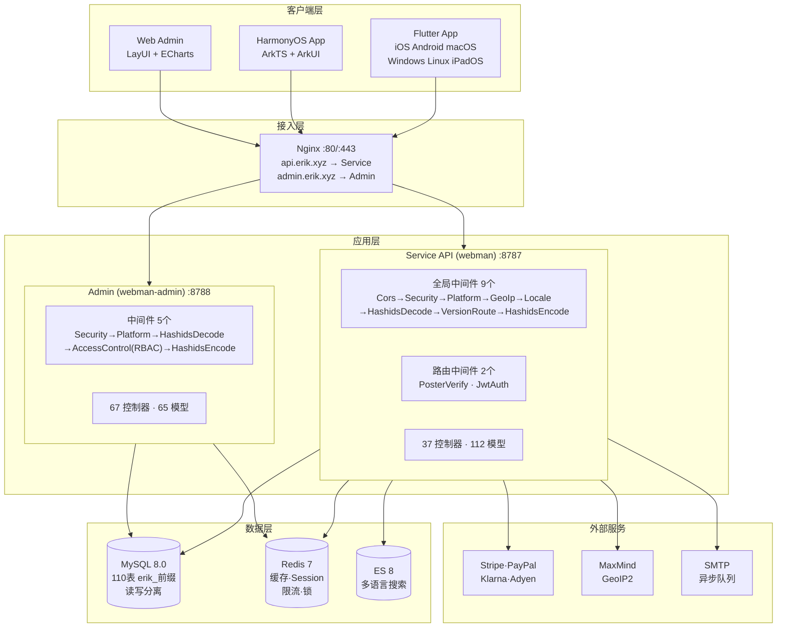
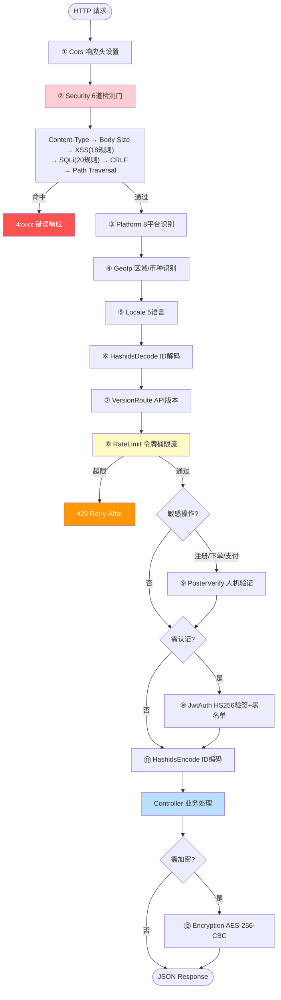
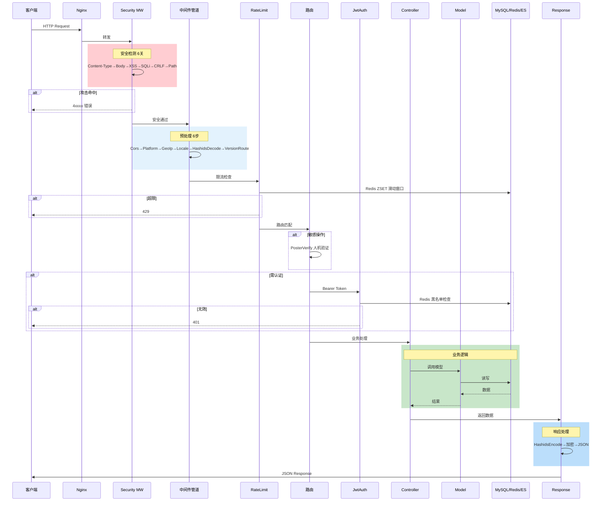

# Erik Shop — 跨境电商平台 完整版(Full)

Copyright (c) 2026 erik <erik@erik.xyz> — https://erik.xyz

## 版本

> 简化版 (MIT开源): `lite` | 标准版 (商业): `standard` | 完整版 (商业): `full`
>
> 商业授权联系: **erik@erik.xyz** | 版本对比: [docs/VERSIONS.md]

## 项目简介

基于 webman 全家桶构建的全栈跨境电商平台，覆盖 B2C/B2B 场景和第三方卖家入驻。

### 技术架构

| 层级 | 技术 | 目录 |
|------|------|------|
| 业务 API | webman + illuminate/database + erikwang2013/* | `service/` |
| 管理后台 | webman-admin + LayUI + ECharts | `admin/` |
| 客户端 | Flutter (iOS/Android/macOS/Windows/Linux) | `apps/flutter/` |
| 鸿蒙客户端 | ArkTS + ArkUI (HarmonyOS NEXT) | `apps/harmonyos/` |

### 技术栈

**服务端：** PHP 8.1+, webman 2.1, MySQL 8.0, Redis 7, Elasticsearch 8
**核心包：** snowflake-php, hashids, jwt-webman, encryption, encryptable, poster-php, webman-scout, season
**支付：** Stripe, PayPal, Klarna, Adyen
**客户端：** Flutter 3.x (Riverpod + GoRouter + Dio), HarmonyOS API 12+ (ArkTS + ArkUI)

## 架构图集

> 完整图集及大图查看：[docs/diagrams.md](docs/diagrams.md)

### 系统架构图



### 请求处理流程图



### 功能模块全景图

```mermaid
graph TB
    CENTER["Erik Shop 跨境电商平台"]

    CENTER --> B2C["B2C零售<br/>多语言商品·SKU<br/>购物车·订单·退款"]
    CENTER --> B2B["B2B批发<br/>阶梯定价·企业认证<br/>询价·报价"]
    CENTER --> MART["多商家入驻<br/>卖家审核·商品审核<br/>分成分账"]
    CENTER --> CROSS["跨境合规<br/>HS Code·关税规则<br/>VAT/IOSS·合规标签"]
    CENTER --> LOGISTICS["国际物流<br/>分区运费·DHL/UPS<br/>海外仓·商业发票"]
    CENTER --> PAY["支付系统<br/>Stripe·PayPal<br/>Klarna·Adyen·3DS"]
    CENTER --> MKT["营销中心<br/>优惠券·秒杀<br/>拼团·分销"]
    CENTER --> MULTI["多平台<br/>Amazon·eBay·Shopee<br/>刊登·订单聚合"]
    CENTER --> SUPPLY["供应链<br/>供应商评级·采购<br/>质检·库存流水"]
    CENTER --> RISK["风控合规<br/>规则引擎·KYC<br/>GDPR·CCPA"]
    CENTER --> SECM["安全防护<br/>15类攻击检测<br/>XSS·SQLi·XXE·SSRF"]
    CENTER --> PERF["高并发<br/>令牌桶·Cache-Aside<br/>熔断·读写分离"]
    CENTER --> GROWTH["会员增长<br/>积分·礼品卡<br/>AB测试·订阅购"]
    CENTER --> CMS["内容管理<br/>CMS·FAQ·知识库<br/>尺码表·Feed同步"]
    CENTER --> CS["客服<br/>WebSocket IM<br/>知识库"]
    CENTER --> INFRA["基础设施<br/>Snowflake·Hashids<br/>JWT·AES·Poster"]
    CENTER --> CLIENTS["多端覆盖<br/>Flutter 5平台<br/>HarmonyOS·Web"]

    style CENTER fill:#1565c0,color:#fff
```



### 请求生命周期图



> 更多细节见 [完整架构图集](docs/diagrams.md)（含订单生命周期、部署架构等 6 张图）

## 快速开始

### 方式一：Web 一键安装（推荐）

```bash
# 1. 安装 admin 依赖
cd admin && composer install

# 2. 启动管理后台
php start.php start -d

# 3. 浏览器打开安装向导
# http://127.0.0.1:8788/app/admin/install/step1
# 填入数据库信息 → 设置管理员账号 → 完成

# 4. 安装依赖并启动 API
cd ../service && composer install && php start.php start -d
```

> 安装向导自动完成：建库 → 导入 70 张表 → 生成 service/.env 和 admin/.env（含随机密钥） → 创建管理员 → 重载服务

### 方式二：命令行手动安装

详见 [INSTALL.md](INSTALL.md)

### Docker 部署

```bash
# 配置环境变量
cp .env.example .env  # 或设置 DB_PASS / JWT_SECRET 等变量

# 一键启动全部服务
docker-compose up -d
# nginx:80 → service:8787 + admin:8788
# MySQL:3306, Redis:6379, ES:9200
```

详见 [部署文档](docs/deployment.md)

## 项目结构

```
shop-php/
  install.sql       # 一键安装 SQL（70 张表），Web 安装向导自动导入
  service/          PHP业务API (webman)        — 37控制器 + 63模型 + 9全局中间件
  admin/            管理后台 (webman-admin)      — 67控制器 + 65模型 + ECharts仪表盘 + Web安装向导
  apps/flutter/     Flutter客户端              — 9页面 + 5语言 + PC自适应
  apps/harmonyos/   鸿蒙客户端                  — 8页面 + ArkTS
  docker/           Docker部署                  — Nginx + PHP + MySQL + Redis + ES
  docs/             设计文档
```

## 功能覆盖

| 维度 | 覆盖内容 |
|------|---------|
| **B2C零售** | 多语言商品、分币种定价、SKU、购物车、订单、支付、退款、退货 |
| **B2B批发** | 阶梯定价(MOQ)、企业认证(税号/营业执照)、询价 |
| **多商家入驻** | 卖家审核、商品审核、分成分账 |
| **跨境合规** | HS Code编码库、关税规则、VAT/IOSS、各国合规标签(FDA/CE/RoHS) |
| **国际物流** | 物流分区运费、海外仓(发货仓+退货仓)、HS申报、商业发票/装箱单 |
| **支付** | Stripe/PayPal/Klarna/Adyen、BNPL先买后付、3DS验证 |
| **营销** | 优惠券(分区+新老客)、轮播图(区域可见)、秒杀、拼团、分销(链接+佣金+提现) |
| **多平台** | Amazon/eBay/Shopee/Lazada/Temu商品刊登+订单聚合 |
| **供应链** | 供应商评级、采购→质检→入库、库存流水(不可变账本)、调拨 |
| **风控合规** | 规则引擎(旁路打分)、KYC实名、GDPR/CCPA数据请求、Cookie Consent |
| **安全防护** | 15类攻击检测(XSS/SQL注入/XXE/SSRF/CRLF/路径遍历/文件上传/暴力破解/HTTP方法/Host/CORS) |
| **高并发** | 令牌桶限流、Cache-Aside缓存(防雪崩+防穿透)、熔断器、DB读写分离、连接池优化 |
| **会员增长** | 积分规则、会员等级权益、礼品卡、降价提醒、订阅周期购、AB测试 |
| **内容管理** | CMS多语言页面、FAQ、知识库、尺码对照表、邮件模板、商品Feed同步 |
| **客服** | WebSocket实时IM、知识库(表结构已建) |
| **基础设施** | Snowflake分布式ID、Hashids接口混淆、JWT认证、AES加密、GeoIP区域识别 |
| **多端覆盖** | Flutter(iOS/Android/macOS/Windows/Linux/iPadOS)+HarmonyOS(ArkTS)+Web Admin |
| **平台追踪** | 8平台来源识别(iOS/iPadOS/macOS/Windows/Linux/Android/HarmonyOS/Web)+DB记录 |
| **测试** | 23 tests / 68 assertions — ALL PASS (Security+Jwt+ApiResponse) |

## 核心设计

- **Snowflake主键**：70张表全部使用 `erikwang2013/snowflake-php` 生成的bigint ID
- **Hashids接口**：中间件自动编码/解码，控制器无感知
- **Encryptable加密**：email/mobile/address等敏感字段数据库级加密
- **JWT认证**：HS256 + 黑名单 + 自动刷新
- **API版本**：`API-Version` header路由，不在URL中
- **Poster验证**：敏感操作(注册/下单/支付)随机人机验证

## 文档

| 文档 | 说明 |
|------|------|
| [README-EN.md](README-EN.md) | English documentation |
| [INSTALL.md](INSTALL.md) | 安装指南（Web 一键安装 + 手动安装） |
| [AUDIT-REPORT.md](AUDIT-REPORT.md) | 安装系统审查报告 |
| [功能设计文档](docs/features.md) | 完整功能矩阵、业务流程、API端点设计、状态机 |
| [架构图集](docs/diagrams.md) | 架构图、流程图、功能图、生命周期图、部署图（6张Mermaid图） |
| [架构设计文档](docs/architecture-full.md) | 系统架构图、中间件管道、数据架构、安全架构、支付架构 |
| [设计文档](docs/design.md) | 数据库表设计、API规范、安全方案、国际化 |
| [架构文档](docs/architecture.md) | 目录结构、模型继承链、关键包 |
| [API接口文档](docs/api.md) | 71个API端点 (静态文档) |
| [hg/apidoc接口文档](http://localhost:8787/apidoc/) | hg/apidoc自动生成 (6分组: 认证/商品/交易/物流海关/用户营销/运营) |
| [部署文档](docs/deployment.md) | Docker/手动部署、环境变量、运维命令 |


## 开源不易，欢迎支持

| 微信 | 支付宝 |
|:---:|:---:|
|  |  |

---


## 测试

```bash
make test             # 推荐方式
cd service && php vendor/bin/phpunit tests/   # 原生命令
# 23 tests, 68 assertions — ALL PASS
```

## 开发工具

```bash
make help             # 查看所有命令
make lint             # PHP 语法检查
make check            # phpstan 静态分析
make fix              # php-cs-fixer 代码格式化
```

CI/CD: `.github/workflows/ci.yml` — PHP 8.1/8.2/8.3 矩阵测试

## License

Copyright (c) 2026 erik <erik@erik.xyz> — https://erik.xyz
