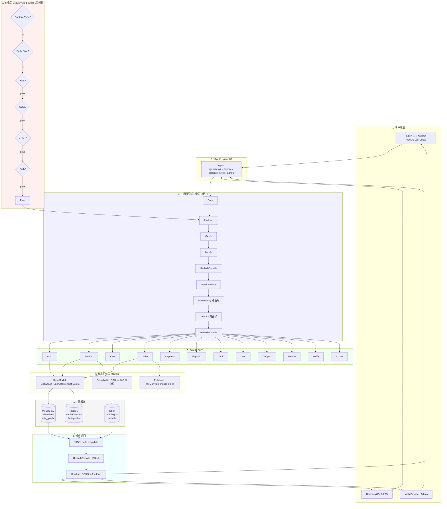
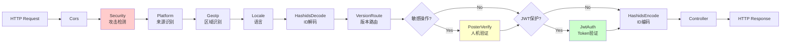

# 跨境电商平台 — 架构设计文档

Copyright (c) 2026 erik <erik@erik.xyz> — https://erik.xyz

---

## 1. 系统概述

### 1.1 定位

基于 webman 高性能框架的全栈跨境电商平台，支持 B2C、B2B、第三方卖家入驻。

| 组件 | 技术栈 | 规模 |
|------|--------|------|
| Service API | PHP 8.3 / webman 2.1 / illuminate database | 36控制器 + 112模型 + 9中间件 |
| Admin | webman-admin / LayUI / ECharts | 67控制器 + 65模型 + 5中间件 |
| Flutter | Riverpod / GoRouter / Dio | 25 Dart文件 / 12页面 |
| HarmonyOS | ArkTS / ArkUI | 12 ETS文件 / 8页面 |
| 数据库 | MySQL 8.0 + Redis 7 + ES 8 | 110张表 |

### 1.2 核心指标

| 指标 | 值 |
|------|-----|
| API P99 | <200ms |
| 并发 | 10000+ (32 worker常驻内存) |
| 表数 | 110 |
| 端点 | 71 |
| 中间件 | 11 (service:9全局+2路由 / admin:5全局) |
| 语言 | zh_CN, zh_HK, en, ja, ko |
| 币种 | 19种独立定价 |
| 支付 | Stripe / PayPal / Klarna / Adyen |

---

## 2. 系统架构图


### 2.1 完整设计流程图



**流程图说明:**

| 层 | 说明 |
|----|------|
| 1.客户端层 | Flutter 5平台 + HarmonyOS + Web Admin, 全部通过 HTTP/JSON 通信 |
| 2.接入层 | Nginx 按域名分流: api→service, admin→admin |
| 3.安全层 | SecurityMiddleware 6道检测门, 任一道命中即返回错误码 |
| 4.中间件管道 | 8个全局MW串行处理 + 2个路由级MW(PosterVerify敏感操作, JwtAuth认证接口) |
| 5.控制器层 | 36个API控制器按功能分组, 处理全部业务逻辑 |
| 6.模型层 | 112个Eloquent模型, BaseModel提供Snowflake ID/Encryptable/SoftDelete, 68表外键关联 |
| 7.数据层 | MySQL(110表erik_前缀/snowflake主键) + Redis(缓存/Session/限流/Poster) + ES(多语言搜索) |
| 8.响应返回 | JSON统一格式 → HashidsEncode编码ID → CORS/X-Platform Headers → 返回客户端 |

### 2.2 进程模型

```
webman Master (:8787)
  ├── HTTP Worker x32 (CPU×4, 常驻内存, DB连接池)
  ├── Monitor Process (文件监控+内存监控)
  └── SnowflakeWorker (启动时初始化Snowflake单例)
```

---

## 3. 中间件管道

### 3.1 Service API 完整管道



### 3.2 Service 中间件详情

| # | 中间件 | 类型 | 功能 |
|---|--------|------|------|
| 1 | Cors | 全局 | Access-Control-* 响应头, OPTIONS预检返回200 |
| 2 | SecurityMiddleware | 全局 | XSS/SQL注入/CRLF/路径遍历/Content-Type/请求体10MB |
| 4 | PlatformMiddleware | 全局 | X-Platform header + UA降级识别8个平台 |
| 5 | GeoIpMiddleware | 全局 | MaxMind GeoIP2 未登录用户区域/币种/语言识别 |
| 6 | LocaleMiddleware | 全局 | Accept-Language解析, 5语言精确匹配→降级→默认 |
| 7 | HashidsDecode | 全局 | URL/Body中 `*_id` 字段 hashid→snowflake ID |
| 8 | VersionRoute | 全局 | API-Version header→控制器命名空间(v1/v2)映射 |
| 9 | PosterVerify | 路由 | 注册/下单/支付 Redis验证token |
| 10 | JwtAuth | 路由 | Bearer Token HS256验签+过期+userId注入 |
| 11 | HashidsEncode | 全局 | 响应JSON递归遍历, snowflake ID→hashid |

### 3.3 Admin 管道

```
请求 → SecurityMiddleware → PlatformMiddleware → HashidsDecode
     → webman-admin AccessControl(内置RBAC) → HashidsEncode → 控制器
```

| # | Admin中间件 | 功能 |
|---|------------|------|
| 1 | SecurityMiddleware | XSS/SQL注入/CRLF/路径遍历/Content-Type/20MB |
| 2 | PlatformMiddleware | X-Platform + UA 8平台识别 |
| 3 | HashidsDecode | 请求 hashid→snowflake ID |
| - | AccessControl(内置) | 管理员角色权限验证 |
| 4 | HashidsEncode | 响应 snowflake ID→hashid |

---

