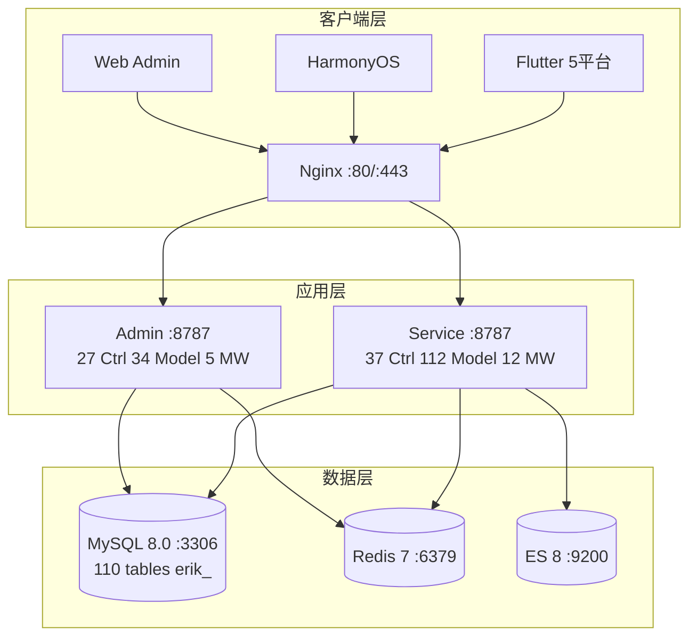

# 跨境电商平台 — 架构设计文档 (完整版 Pro)

Copyright (c) 2026 erik <erik@erik.xyz> — https://erik.xyz

---

## 1. 系统概述

基于 webman 高性能框架的全栈跨境电商平台，支持 B2C、B2B、第三方卖家入驻。

| 组件 | 技术栈 | 规模 |
|------|--------|------|
| Service API | PHP 8.3 / webman 2.1 | 37控制器 + 112模型 + 12中间件 |
| Admin | webman-admin / LayUI / ECharts | 27控制器 + 34模型 + 5中间件 |
| Flutter | Riverpod / GoRouter / Dio | 25 Dart文件 / 12页面 |
| HarmonyOS | ArkTS / ArkUI | 13 ETS文件 / 8页面 |
| 数据库 | MySQL 8.0 + Redis 7 + ES 8 | 110张表 |

### 核心指标

| 指标 | 值 |
|------|-----|
| API P99 | <200ms |
| 并发 | 10000+ (32 worker常驻内存) |
| 表数 | 110 |
| 端点 | 71 |
| 中间件 | Service:12(9全局+2路由+1静态) / Admin:5 |
| 语言 | zh_CN, zh_HK, en, ja, ko |
| 币种 | 19种独立定价 |
| 支付 | Stripe / PayPal / Klarna / Adyen |

---

## 2. 系统架构



### 进程模型

```
webman Master (:8787)
  ├── HTTP Worker x32 (CPU×4, 常驻内存, DB连接池)
  ├── Monitor Process (文件监控+内存监控)
  └── SnowflakeWorker (启动时初始化Snowflake单例)
```

---

## 3. 中间件管道

### 3.1 Service API

```
请求 → Cors → Security(15类攻击检测) → RateLimit(令牌桶限流)
     → Platform(8平台识别) → GeoIp(区域) → Locale(5语言)
     → HashidsDecode → VersionRoute
     → (PosterVerify 人机验证) → (JwtAuth Token) → HashidsEncode → 控制器
```

| # | 中间件 | 类型 | 功能 |
|---|--------|------|------|
| 1 | Cors | 全局 | Access-Control-* |
| 2 | SecurityMiddleware | 全局 | 15类攻击检测 |
| 3 | RateLimitMiddleware | 全局 | 令牌桶滑动窗口限流 |
| 4 | PlatformMiddleware | 全局 | 8平台来源识别 |
| 5 | GeoIpMiddleware | 全局 | 区域/币种/语言识别 |
| 6 | LocaleMiddleware | 全局 | 5语言解析 |
| 7 | HashidsDecode | 全局 | hashid→snowflake ID |
| 8 | VersionRoute | 全局 | API-Version→命名空间 |
| 9 | PosterVerify | 路由 | 人机验证(注册/下单/支付) |
| 10 | JwtAuth | 路由 | JWT Bearer验证 |
| 11 | HashidsEncode | 全局 | snowflake ID→hashid |

### 3.2 Admin

```
Security → Platform → HashidsDecode → AccessControl(内置RBAC) → HashidsEncode
```

---

## 4. 安全架构

### 4.1 15类攻击检测

| # | 攻击类型 | 错误码 | Service | Admin |
|---|---------|--------|---------|-------|
| 1 | XSS跨站脚本 (18条正则) | 40001 | ✅ | ✅ |
| 2 | SQL注入 (20条正则) | 40002 | ✅ | ✅ |
| 3 | CRLF Header注入 | 40003 | ✅ | ✅ |
| 4 | 路径遍历 | 40004 | ✅ | ✅ |
| 5 | 请求体限制 (10MB/20MB) | 40005 | ✅ | ✅ |
| 6 | Content-Type校验 | 40006 | ✅ | ✅ |
| 7 | 文件上传校验 | 40009 | ✅ | ✅ |
| 8 | HTTP安全响应头 | — | ✅ | ✅ |
| 9 | 暴力破解防护 | 40008 | ✅ | ✅ |
| 10 | XXE实体注入 | 40010 | ✅ | ✅ |
| 11 | SSRF服务器伪造 | 40011 | ✅ | ✅ |
| 12 | HTTP方法校验 | 40012 | ✅ | ✅ |
| 13 | Host头校验 | 40013 | ✅ | — |
| 14 | 敏感数据脱敏 | — | ✅ | ✅ |
| 15 | CORS白名单 | — | ⚠️ | ⚠️ |

### 4.2 三层加密

| 层级 | 技术 | 包 |
|------|------|-----|
| 传输层 | AES-256-CBC | erikwang2013/encryption |
| 数据库层 | Encryptable trait | erikwang2013/encryptable |
| ID混淆 | Hashids | erikwang2013/hashids |

---

## 5. 国际化 (i18n)

| 层级 | 实现 |
|------|------|
| Service | LocaleMiddleware + resource/translations/{locale}/messages.php (5语言×45key) |
| Admin | resource/translations/{locale}/messages.php (5语言×45key) |
| Flutter | AppLocalizations (5语言硬编码) + Riverpod Provider + SharedPreferences持久化 |
| API Header | Accept-Language: zh_CN|zh_HK|en|ja|ko |

---

## 6. 平台追踪

| 平台 | X-Platform | 识别方式 |
|------|-----------|---------|
| iOS | ios | Flutter Platform.isIOS + TargetPlatform.iOS |
| iPadOS | ipados | Flutter Platform.isIOS + !TargetPlatform.iOS |
| macOS | macos | Flutter Platform.isMacOS / UA Macintosh |
| Windows | windows | Flutter Platform.isWindows / UA Windows |
| Linux | linux | Flutter Platform.isLinux / UA Linux |
| Android | android | Flutter Platform.isAndroid / UA Android |
| HarmonyOS | harmonyos | ArkTS硬编码 / UA HarmonyOS |
| Web | web | kIsWeb / UA默认 |

DB字段: `erik_orders.platform`, `erik_payments.platform`, `erik_operation_logs.platform`, `erik_users.last_login_platform`, `erik_search_logs.platform`, `erik_chat_messages.platform`

---

## 7. API文档 (hg/apidoc)

### Service API

| 项目 | 说明 |
|------|------|
| 访问 | http://localhost:8787/apidoc/ |
| 分组 | 6组: 认证/商品/交易/物流海关/用户营销/运营工具 |
| 注解 | 6控制器/23方法/168条 |
| Header | Authorization, API-Version, Accept-Language, X-Platform |
| 响应 | code+msg+data (success/error统一格式) |

### Admin API

| 项目 | 说明 |
|------|------|
| 访问 | http://admin.localhost:8787/apidoc/ |
| 分组 | 7组: 商品管理/订单交易/物流管理/海关税务/营销工具/基础数据/数据分析 |
| 注解 | 27控制器全覆盖/80条 |
| 功能 | ShopProduct/ShopOrder/ShopCoupon/ShopDashboard/ShopExport + 22个 |

---

## 8. 测试

23 tests / 68 assertions — ALL PASS

| 测试类 | 数量 | 覆盖 |
|--------|:---:|------|
| SecurityTest | 16 | XSS+SQLi+XXE+SSRF+File+Path+Null byte+Benchmark |
| JwtTest | 4 | encode/decode/invalid/empty |
| ApiResponseTest | 3 | success(code=0)/fail(error code)/paginate(list+meta) |

```bash
cd service && php vendor/bin/phpunit tests/
```

---

## 9. 部署

Docker: `docker compose up -d` (nginx + service + admin + mysql + redis + es)
手动: `cd service && php start.php start -d` / `cd admin && php start.php start -d`

---

## 10. 项目统计

| 维度 | 数量 |
|------|------|
| PHP源文件 (service) | 210 |
| PHP源文件 (admin) | 137 |
| Dart (Flutter) | 25 |
| ArkTS (HarmonyOS) | 13 |
| 数据库表 | 110 |
| API端点 | 71 |
| 中间件 | Service:12 / Admin:5 |
| 工具类 | 9 |
| 配置项 | 32 |
| 测试 | 23 tests, 68 assertions |
| Skills | 16 |
| 文档 | 7 |
| 翻译 | 10文件 (5语言×2端) |
| **总计** | **~650** |
