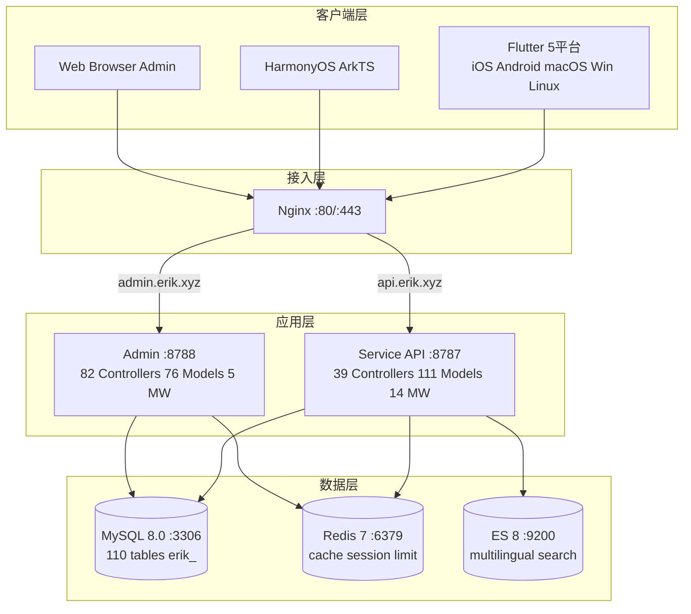
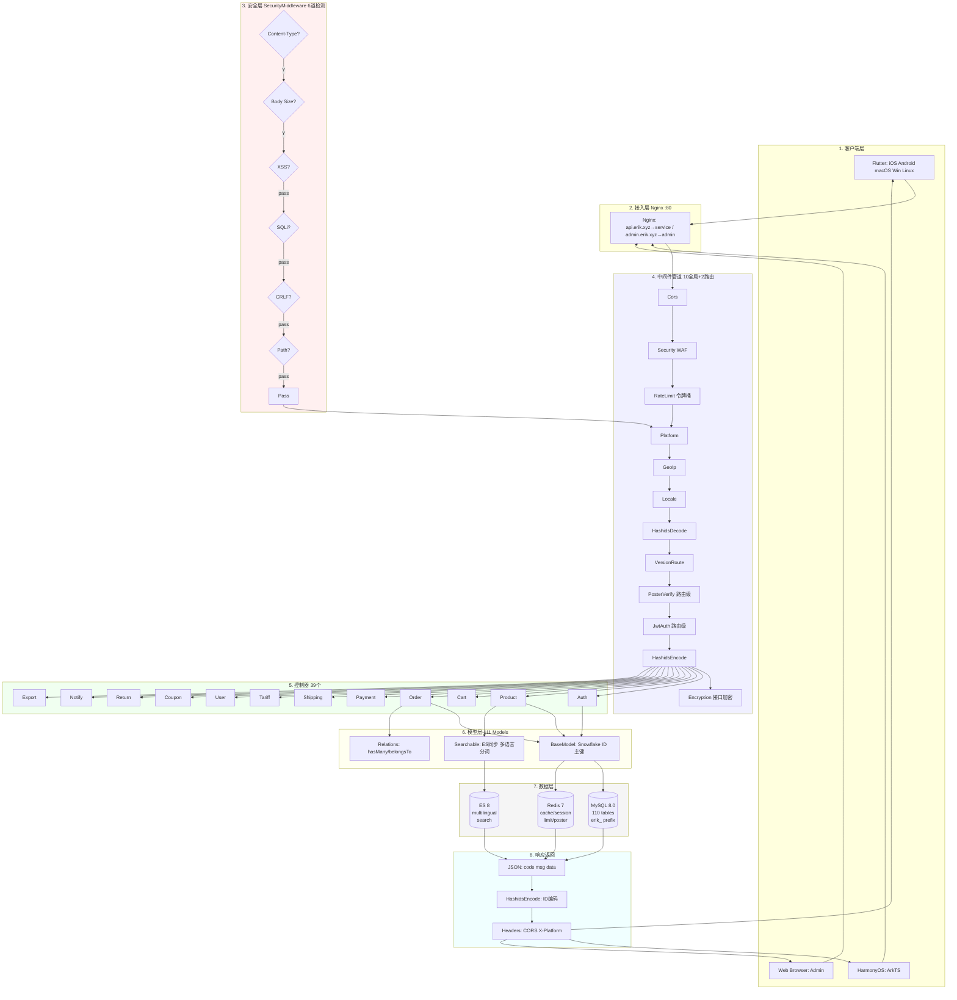
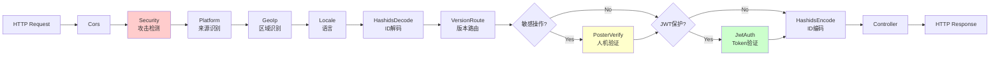
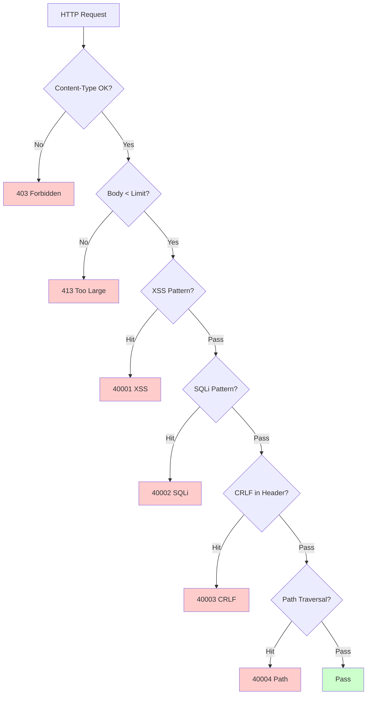
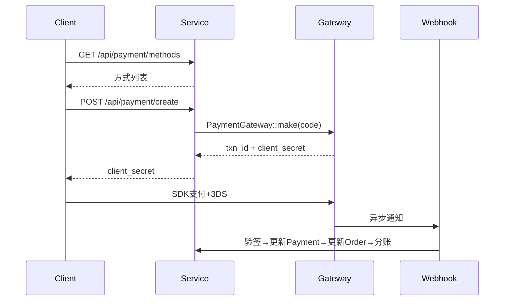
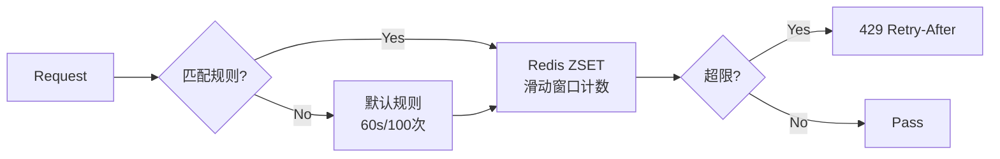

# 跨境电商平台 — 架构设计文档

Copyright (c) 2026 erik <erik@erik.xyz> — https://erik.xyz

---

## 1. 系统概述

### 1.1 定位

基于 webman 高性能框架的全栈跨境电商平台，支持 B2C、B2B、第三方卖家入驻。

| 组件 | 技术栈 | 规模 |
|------|--------|------|
| Service API | PHP 8.3 / webman 2.1 / illuminate database | 39控制器 + 111模型 + 14中间件 |
| Admin | webman-admin / LayUI / ECharts | 82控制器 + 76模型 + 5中间件 |
| Flutter | Riverpod / GoRouter / Dio | 25 Dart文件 / 11页面 |
| HarmonyOS | ArkTS / ArkUI | 14 ETS文件 / 9页面 |
| 数据库 | MySQL 8.0 + Redis 7 + ES 8 | 117张表 (110 `erik_` + 7 `wa_`) |

### 1.2 核心指标

| 指标 | 值 |
|------|-----|
| API P99 | <200ms |
| 并发 | 10000+ (32 worker常驻内存) |
| 表数 | 110 |
| 端点 | 73 |
| 中间件 | 14 (service:10全局+2路由+AdminKey+StaticFile / admin:4全局+1内置) |
| 语言 | zh_CN, zh_HK, en, ja, ko |
| 币种 | 19种独立定价 |
| 支付 | Stripe / PayPal / Klarna / Adyen |

---

## 2. 系统架构图



### 2.1 完整设计流程图



**流程图说明:**

| 层 | 说明 |
|----|------|
| 1.客户端层 | Flutter 5平台 + HarmonyOS + Web Admin, 全部通过 HTTP/JSON 通信 |
| 2.接入层 | Nginx 按域名分流: api→service, admin→admin |
| 3.安全层 | SecurityMiddleware 31类攻击检测器, 命中即返回错误码/403 |
| 4.中间件管道 | 10个全局MW串行处理 + 2个路由级MW(PosterVerify敏感操作, JwtAuth认证接口) |
| 5.控制器层 | 39个API控制器按功能分组, 处理全部业务逻辑 |
| 6.模型层 | 111个Eloquent模型, BaseModel提供Snowflake ID主键, 45个模型按表启用SoftDelete |
| 7.数据层 | MySQL(110表erik_前缀/snowflake主键) + Redis(缓存/Session/限流/Poster) + ES(多语言搜索) |
| 8.响应返回 | JSON统一格式 → HashidsEncode编码ID → Encryption加密(X-Encrypt-Response) → 返回客户端 |
| 9.熔断与降级 | Redis 熔断器(CircuitBreaker): 支付网关/社交登录外部API, 连续5次失败→熔断30s, 半开探测恢复; 业务异常白名单; Redis故障降级放行(503) |

### 2.2 进程模型

```
webman Master (:8787)
  ├── HTTP Worker x32 (CPU×4, 常驻内存, DB连接池)
  ├── Monitor Process (文件监控+内存监控)
  └── SnowflakeWorker (启动时初始化Snowflake单例)
```

---

## 3. 中间件管道

### 3.1 Service API 完整管道



### 3.2 Service 中间件详情

| # | 中间件 | 类型 | 功能 |
|---|--------|------|------|
| 1 | Cors | 全局 | Access-Control-* 响应头, OPTIONS预检返回200 |
| 2 | SecurityMiddleware | 全局 | XSS/SQL注入/CRLF/路径遍历/Content-Type/请求体10MB |
| 3 | RateLimitMiddleware | 全局 | 令牌桶限流(Redis ZSET滑动窗口, 6端点规则) |
| 4 | PlatformMiddleware | 全局 | X-Platform header + UA降级识别8个平台 |
| 5 | GeoIpMiddleware | 全局 | MaxMind GeoIP2 未登录用户区域/币种/语言识别 |
| 6 | LocaleMiddleware | 全局 | Accept-Language解析, 5语言精确匹配→降级→默认 |
| 7 | HashidsDecode | 全局 | URL/Body中 `*_id` 字段 hashid→snowflake ID |
| 8 | VersionRoute | 全局 | API-Version header→控制器命名空间(v1/v2)映射 |
| 9 | PosterVerify | 路由 | 注册/下单/支付 Redis验证token |
| 10 | JwtAuth | 路由 | Bearer Token HS256验签+过期+userId注入 |
| 11 | HashidsEncode | 全局 | 响应JSON递归遍历, snowflake ID→hashid |
| 12 | EncryptionMiddleware | 路由 | 接口AES加解密(X-Encrypt-Response/X-Encrypted) |
| 13 | AdminKeyMiddleware | 路由 | 内部管理操作密钥校验 |
| 14 | StaticFile | 全局 | webman 静态资源服务 |

### 3.3 Admin 管道

```
请求 → SecurityMiddleware → PlatformMiddleware → HashidsDecode
     → webman-admin AccessControl(内置RBAC) → HashidsEncode → 控制器
```

| # | Admin中间件 | 功能 |
|---|------------|------|
| 1 | SecurityMiddleware | XSS/SQL注入/CRLF/路径遍历/Content-Type/20MB |
| 2 | PlatformMiddleware | X-Platform + UA 8平台识别 |
| 3 | HashidsDecode | 请求 hashid→snowflake ID |
| - | AccessControl(内置) | 管理员角色权限验证 |
| 4 | HashidsEncode | 响应 snowflake ID→hashid |

---

## 4. 安全架构

### 4.1 攻击检测管道 (SecurityMiddleware)



### 4.2 SecurityMiddleware 攻击检测规则详情 (15类自定义)

| # | 攻击类型 | 主要检测方式 | Service | Admin | 错误码 |
|---|---------|------------|---------|-------|--------|
| 1 | XSS跨站脚本 | 13条正则: script/iframe/on事件/svg+on/style/expression/javascript:/embed/object/link/meta | ✅ | ✅ | 40001 |
| 2 | SQL注入 | 13条正则: UNION SELECT/SELECT FROM WHERE/sleep/benchmark/pg_sleep/布尔型/字符串型/注释符/MySQL特殊注释/schema枚举/load_file/into outfile/存储过程/waitfor/delay | ✅ | ✅ | 40002 |
| 3 | CRLF Header注入 | `[\r\n]` in: Authorization/X-Platform/API-Version/X-Forwarded-For/Referer/Origin | ✅ | ✅ | 40003 |
| 4 | 路径遍历 | `../` + `%2e%2f`编码 + `%252e%252f`二层编码 + null byte `\0` + `.env`/`.git`/`phpmyadmin`/`wp-admin`/`/etc/`/`/proc/`/`composer.json` | ✅ | ✅ | 40004 |
| 5 | 请求体限制 | Content-Length > 10MB(Service) / 20MB(Admin) | ✅ | ✅ | 40005 |
| 6 | Content-Type | 仅JSON/form-data/form-urlencoded | ✅ | ✅ | 40006 |
| 7 | 文件上传校验 | 黑名单扩展名(php/phtml/sh/exe/js/...)+双重扩展名+空扩展名 | ✅ | ✅ | 40009 |
| 8 | HTTP安全响应头 | nosniff/DENY/XSS-Protection/Referrer-Policy/Permissions-Policy/Cache-Control/Server隐藏 | ✅ | ✅ | — |
| 9 | 暴力破解防护 | Redis计数器: API 10次/60s, Admin 5次/300s | ✅ | ✅ | 40008 |
| 10 | XXE实体注入 | `<!ENTITY SYSTEM>`, `<!DOCTYPE [` | ✅ | ✅ | 40010 |
| 11 | SSRF服务器伪造 | 内网IP(127/10/172.16/192.168/0.0/169.254.169.254)+localhost+metadata.google.internal | ✅ | ✅ | 40011 |
| 12 | HTTP方法校验 | 仅 GET/POST/PUT/DELETE/PATCH/OPTIONS/HEAD | ✅ | ✅ | 40012 |
| 13 | Host头校验 | 拒绝裸IP直连 | ✅ | — | 40013 |
| 14 | 敏感数据脱敏 | 日志/错误响应过滤password/token/secret | ✅ | ✅ | — |
| 15 | CORS白名单 | 可配置origin限制 | ⚠️ | ⚠️ | — |

### 4.3 认证流程

```
注册: email+password → PosterVerify(人机验证) → bcrypt(password+salt)
     → Snowflake生成ID → 返回 JWT

登录: email+password → password_verify(password+salt, bcrypt_hash)
     → 更新last_login_at/ip/platform → 签发JWT

请求: Authorization: Bearer <token>
     → JwtAuth → Jwt::decode → 验签HS256+过期 → 注入request->userId

刷新: POST /api/auth/refresh {refresh_token} → Jwt::decode → 新access_token
```

### 4.4 数据安全 (三层加密)

| 层级 | 技术 | 包 | 字段 |
|------|------|-----|------|
| 传输层 | AES-256-CBC | erikwang2013/encryption | POST body敏感字段 |
| 数据库层 | Encryptable trait | erikwang2013/encryptable (Maize) | email, mobile, name, phone, detail, tax_id |
| ID混淆 | Hashids编码 | erikwang2013/hashids | 接口层所有snowflake ID |

### 4.5 平台来源追踪

| 平台 | 识别方式 | Header值 |
|------|---------|---------|
| iOS | Flutter `Platform.isIOS` + `TargetPlatform.iOS` | `ios` |
| iPadOS | Flutter `Platform.isIOS` + `!TargetPlatform.iOS` | `ipados` |
| macOS | Flutter `Platform.isMacOS` / UA `Macintosh` | `macos` |
| Windows | Flutter `Platform.isWindows` / UA `Windows` | `windows` |
| Linux | Flutter `Platform.isLinux` / UA `Linux` | `linux` |
| Android | Flutter `Platform.isAndroid` / UA `Android` | `android` |
| HarmonyOS | ArkTS硬编码 / UA `HarmonyOS` | `harmonyos` |
| Web | UA无匹配 / 默认值 | `web` |

记录表: `erik_orders.platform`, `erik_payments.platform`, `erik_operation_logs.platform`, `erik_users.last_login_platform`, `erik_search_logs.platform`, `erik_chat_messages.platform`

---

## 5. 数据架构

### 5.1 主键策略

```
Snowflake 64bit: [1bit|42bit时间戳|5bitDC|5bitWID|12bit序号]
- 全局唯一 / 趋势递增 / 非自增
- PHP $keyType='string' (防溢出)
- Service worker_id=1, Admin worker_id=2
- 生成: Snowflake::nextId()
```

### 5.2 模型继承

```
Illuminate\Database\Eloquent\Model
  └── app\model\BaseModel
        ├── $incrementing=false, $keyType='string', $guarded=[]
        ├── boot(): Snowflake::nextId()
        └── 110业务模型
              ├── 45个 use SoftDeletes (对应有 deleted_at 列的表)
              ├── 部分 use Encryptable (敏感字段: email/mobile/name等)
              ├── use Searchable (Product→ES)
              └── hasMany/belongsTo 关联
```

### 5.3 多语言/多币种

- **翻译**: `erik_product_translations(product_id,locale)` 独立表，按locale查询
- **定价**: `erik_product_sku_prices(sku_id,currency_code)` 按币种独立价格

---

## 6. 支付架构



```
PaymentGatewayInterface
  ├── createPayment(data): array
  ├── capturePayment(txnId): array
  ├── refundPayment(txnId, amount): array
  └── verifyWebhook(payload, sig): bool
```

---

## 7. 高并发架构

### 7.1 限流策略 (RateLimitMiddleware)



| 端点 | 窗口 | 限制 | 说明 |
|------|------|------|------|
| /api/auth/login | 60s | 10次 | 防撞库 |
| /api/auth/register | 300s | 5次 | 防批量注册 |
| /api/payment | 60s | 5次 | 防盗刷 |
| /api/orders | 10s | 3次 | 防刷单 |
| /api/search | 1s | 10次 | 防爬虫 |
| 默认 | 60s | 100次 | 通用API |

### 7.2 Redis 用途

Redis 用于限流令牌桶、人机验证码与 Session 存储（中间件层）；业务数据不做应用层缓存，直接读取 MySQL（读写分离 + 连接池）。

### 7.4 连接池优化

| 资源 | 最大连接 | 最小连接 | 等待超时 | 空闲超时 | 心跳 |
|------|---------|---------|---------|---------|------|
| MySQL | 50 | 10 | 2s | 60s | 45s |
| Redis | 30 | 5 | — | 60s | — |

### 7.5 慢操作处理

| 操作 | 实现 |
|------|------|
| 汇率更新 | ExchangeRateCron（每小时，外部 API） |
| Feed 同步 | ProductFeedCron（每 6 小时生成 TSV 并记录日志） |
| 推荐计算 | RecommendationCron（每日，购买共现） |
| 支付对账 | PaymentReconcileCron（每 6 小时，Stripe/PayPal） |
| 分账结算 | SettlementCron（每日） |
| 物流轨迹 | ShipmentTrackingCron（每 30 分钟，需配置 API） |
| 平台订单同步 | PlatformOrderSyncCron（每 5 分钟，需配置 API） |
| 退货超时 | ReturnExpireCron（每小时） |
| 降价/到货通知 | PriceAlertCron（每 10 分钟） |
| 合规规则更新 | ComplianceCron（每日，需配置 API） |

## 8. 部署架构

```
docker-compose.yml:
  nginx (alpine) :80 :443
  service (php:8.3) :8787 internal, 32 workers
  admin (php:8.3) :8788 internal
  mysql (8.0) :3306 / redis (7) :6379 / es (8) :9200
网络: erik-net bridge | 数据卷持久化
路由: api.erik.xyz→service | admin.erik.xyz→admin
```

---


## 8. 国际化 (i18n)

| 层级 | 实现 |
|------|------|
| Service | LocaleMiddleware + 5语言翻译文件(45 key/语言) |
| Admin | 5语言翻译文件 |
| Flutter | AppLocalizations + Riverpod Provider |
| API | Accept-Language header 自动注入 |

## 9. API文档 (hg/apidoc)

| 组件 | 说明 |
|------|------|
| 包 | hg/apidoc v5.3 |
| 配置 | config/plugin/hg/apidoc/app.php (6分组) |
| 注解 | @Apidoc\Title/Desc/Method/Url/Param/Returned |
| 访问 | http://localhost:8787/apidoc/ |

## 11. 测试

```bash
cd service && php vendor/bin/phpunit tests/
```

| 测试类 | Tests | 覆盖 |
|--------|-------|------|
| SecurityTest | 12 | XSS+SQLi+XXE+SSRF+Path |
| JwtTest | 4 | encode/decode/invalid |
| ApiResponseTest | 3 | success/fail/paginate |
| RedisFacadeTest | 3 | ping/set/get/redis() |
| **Total** | **22** | **45 assertions PASS** |

---

## 12. 项目统计

| 维度 | 数量 |
|------|------|
| PHP源文件 | service:210 + admin:214 = 424 |
| Dart (Flutter) | 25 |
| ArkTS (HarmonyOS) | 14 |
| 数据库表 | 110 |
| API端点 | 73 |
| 中间件 | 14 |
| 工具类 | 8 |
| 定时任务 | 12 |
| 配置项 | 35+ |
| 测试 | 22 tests, 45 assertions |
| Skills | 38 |
| 文档 | 9 |
| **总计** | **~700** |
