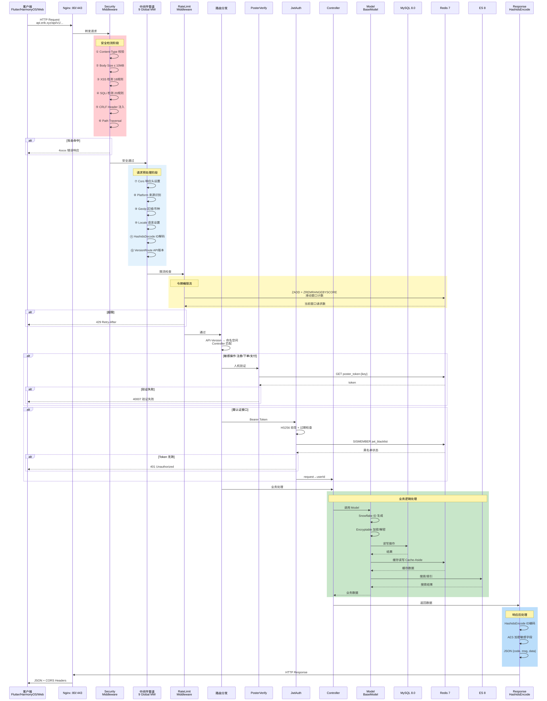

# 跨境电商平台 — 架构图集

Copyright (c) 2026 erik <erik@erik.xyz> — https://erik.xyz

---

## 一、系统架构图

---

## 二、请求处理流程图（中间件管道）

---

## 三、功能模块全景图

> 功能图涵盖 19 大功能模块（含报表中心、平台统计），Mermaid 源见 [03-feature-module-map.mmd](03-feature-module-map.mmd)。

---

## 四、请求生命周期图

---

## 五、订单生命周期图

---

## 六、部署架构图

---

## 七、安全架构图

### 安全防护总览

| 层级 | 防线 | 技术/包 | 覆盖范围 |
|------|------|---------|---------|
| 第一层 | 网络边界 | Nginx SSL + 反向代理 + Host校验 | Service + Admin |
| 第二层 | WAF 攻击检测 | `erikwang2013/security-php` 31个检测器 | XSS/SQLi/CRLF/路径遍历/XXE/SSRF/文件上传/方法/Host/Content-Type/Body 等 |
| 第三层 | 流量控制 + 依赖韧性 | RateLimitMiddleware + 暴力破解 Redis 计数器 + CircuitBreaker | 令牌桶限流(6端点) + 登录/注册防爆 + 支付/社交登录熔断(5次失败→30s, 半开恢复) |
| 第四层 | 身份认证 | PosterVerify + JwtAuth HS256 | 人机验证(滑块/拼图/点击) + Bearer Token + 双token刷新 |
| 第五层 | 数据安全 | Hashids + AES-256-CBC + Encryptable | 三层加密: ID混淆/传输加密/数据库字段加密 |
| 第六层 | 响应安全 | HTTP 安全头 + 敏感脱敏 | nosniff/DENY/XSS-Protection/Referrer-Policy/日志脱敏 |
| 持续 | 审计追溯 | PlatformMiddleware + OperationLogs | 8平台来源追踪 + 6表记录 + 操作日志 |

---

## 八、多币种结算流程图

### 多币种结算说明

**多币种定价**：商品 SKU 按 `currency_code` 分币种定价，下单时订单锁定收款币种（USD / EUR / GBP / CNY 等）。

**汇率服务**：`erik_exchange_rates` 汇率表支持 manual 手动维护与 exchangerate-api 自动拉取，按 `effective_at` 生效时间版本化管理，结算时取支付时点汇率快照。

**原币扣款**：Stripe / PayPal / Klarna / Adyen 按订单币种原币扣款，Webhook 验签确认到账后更新支付与订单状态。

**分账结算**：支付成功后自动生成 `PlatformSettlements` 平台分账（订单总额 + 平台佣金 + 支付网关手续费，按订单币种记账）；卖家结算 `MerchantSettlements`（订单金额 → 抽成率 → 结算金额）、供应商结算 `SupplierSettlements`、分销佣金提现 `AffiliatePayouts` 四线独立结算，状态 0 待结算 / 1 已结算。

**汇兑损益**：`CurrencyExchangeGainsLosses` 追踪收款币种与结算币种差异，对比支付时汇率与结算时汇率，正数 = 汇兑收益、负数 = 汇兑亏损，支撑跨境电商多币种对账与审计。

---

## 图例索引

| 编号 | 图名 | 类型 | 用途 |
|------|------|------|------|
| 一 | 系统架构图 | 架构图 | 展示系统全貌：客户端→CDN边缘层(Origin-Pull回源)→接入→应用→数据→外部服务 |
| 二 | 请求处理流程图 | 流程图 | 展示 HTTP 请求经过 12 级中间件管道(10全局+2路由)的完整路径 |
| 三 | 功能模块全景图 | 功能图 | 展示 19 大功能模块及其细分功能点（含报表中心、平台统计） |
| 四 | 请求生命周期图 | 生命周期 | 展示从请求到响应的完整时序和各阶段交互 |
| 五 | 订单生命周期图 | 生命周期 | 展示订单从购物车到完成/退款的所有状态流转 |
| 六 | 部署架构图 | 架构图 | 展示 Docker Compose 容器编排、网络、数据卷（含 CDN 边缘层与上传目录持久化） |
| 七 | 安全架构图 | 架构图 | 展示 6 层纵深防御体系：边界→WAF→流量/韧性(限流+熔断)→认证→数据→响应 |
| 八 | 多币种结算流程图 | 流程图 | 展示分币种定价→支付→分账→结算→汇兑损益的完整链路 |
