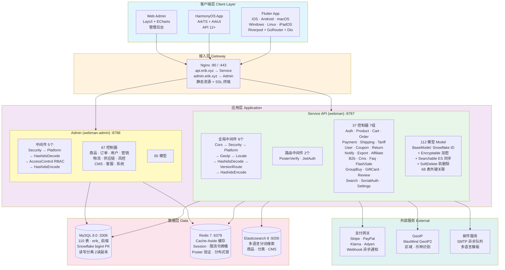
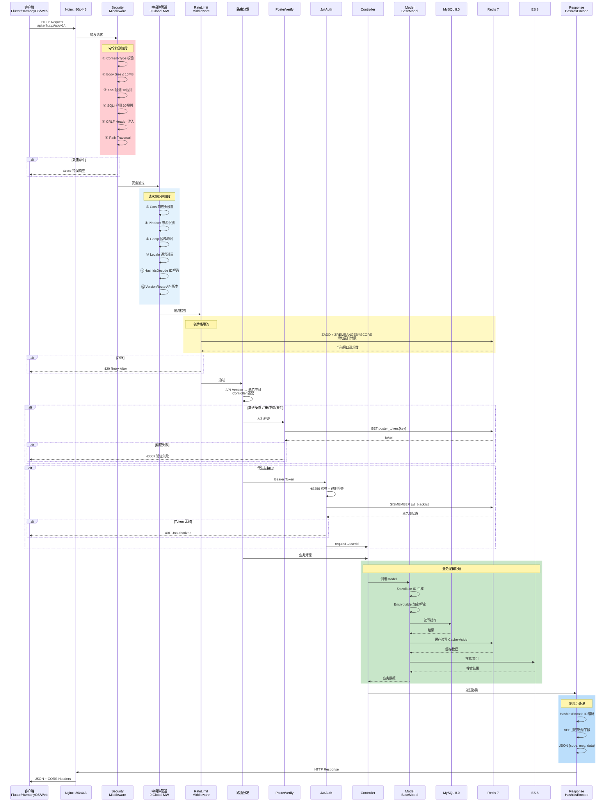
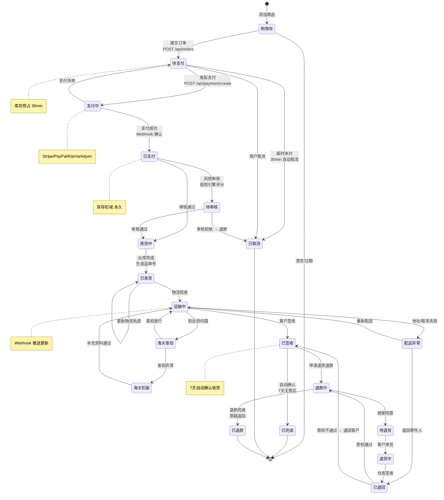
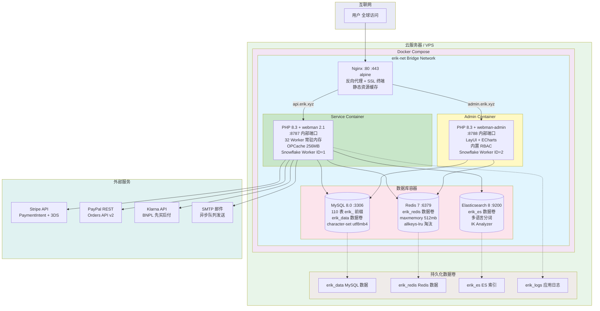

# 跨境电商平台 — 架构图集

Copyright (c) 2026 erik <erik@erik.xyz> — https://erik.xyz

---

## 一、系统架构图

---

## 二、请求处理流程图（中间件管道）

```mermaid
graph TB
    START(["HTTP 请求到达"]) --> CORS["① Cors<br/>Access-Control-* 响应头<br/>OPTIONS 预检返回 200"]

    CORS --> SEC["② Security 攻击检测<br/>━━━━━━━━━━━━━━━"]
    SEC --> SEC1{"Content-Type<br/>合法?"}
    SEC1 -->|否| E403["403 Forbidden"]
    SEC1 -->|是| SEC2{"Body Size<br/>≤ 10MB?"}
    SEC2 -->|否| E413["413 Too Large"]
    SEC2 -->|是| SEC3{"XSS 检测<br/>18条规则"}
    SEC3 -->|命中| E40001["40001 XSS 拦截"]
    SEC3 -->|通过| SEC4{"SQLi 检测<br/>20条规则"}
    SEC4 -->|命中| E40002["40002 SQLi 拦截"]
    SEC4 -->|通过| SEC5{"CRLF 检测<br/>Header 注入"}
    SEC5 -->|命中| E40003["40003 CRLF 拦截"]
    SEC5 -->|通过| SEC6{"路径遍历<br/>检测"}
    SEC6 -->|命中| E40004["40004 Path 拦截"]
    SEC6 -->|通过| SEC_PASS["安全检测通过"]

    SEC_PASS --> PLAT["③ Platform<br/>X-Platform Header<br/>+ UA 降级识别<br/>8 平台来源"]

    PLAT --> GEO["④ GeoIp<br/>MaxMind GeoIP2<br/>未登录用户<br/>区域/币种/语言识别"]

    GEO --> LOCALE["⑤ Locale<br/>Accept-Language 解析<br/>5 语言精确匹配 → 降级 → 默认"]

    LOCALE --> HDEC["⑥ HashidsDecode<br/>请求中 *_id 字段<br/>hashid → snowflake ID"]

    HDEC --> VER["⑦ VersionRoute<br/>API-Version Header<br/>→ v1/v2 命名空间路由"]

    VER --> RATE["⑧ RateLimit<br/>Redis ZSET 滑动窗口<br/>令牌桶限流"]

    RATE -->|超限| E429["429 Too Many Requests<br/>Retry-After 响应头"]
    RATE -->|通过| ROUTE_CHECK{"路由匹配?"}

    ROUTE_CHECK -->|敏感操作<br/>注册/下单/支付| POSTER["⑨ PosterVerify<br/>Redis 验证 token<br/>滑块/拼图/点击"]
    ROUTE_CHECK -->|需认证| JWT_START["⑩ JwtAuth"]
    ROUTE_CHECK -->|公开接口| HENC

    POSTER --> JWT_START

    JWT_START --> JWT_CHECK{"Bearer Token<br/>HS256 验签"}
    JWT_CHECK -->|失效/过期| E401["401 Unauthorized"]
    JWT_CHECK -->|有效| JWT_INJECT["注入 request→userId<br/>检查黑名单"]

    JWT_INJECT --> HENC["⑪ HashidsEncode<br/>响应 JSON 递归遍历<br/>snowflake ID → hashid"]

    HENC --> CTRL["Controller<br/>业务逻辑处理<br/>Model 查询 · 验证 · 计算"]

    CTRL --> ENC_RESP{"需加密响应?"}

    ENC_RESP -->|是| ENC["⑫ Encryption<br/>AES-256-CBC 加密<br/>X-Encrypted: 1 Header"]
    ENC_RESP -->|否| RESP
    ENC --> RESP(["JSON Response<br/>{code, msg, data}<br/>+ CORS Headers<br/>+ X-Platform Header"])

    style SEC fill:#ffcdd2
    style RATE fill:#fff9c4
    style POSTER fill:#ffe0b2
    style JWT_START fill:#c8e6c9
    style CTRL fill:#bbdefb
    style START fill:#e8eaf6
    style RESP fill:#e8eaf6
    style E403 fill:#ff5252,color:#fff
    style E413 fill:#ff5252,color:#fff
    style E40001 fill:#ff5252,color:#fff
    style E40002 fill:#ff5252,color:#fff
    style E40003 fill:#ff5252,color:#fff
    style E40004 fill:#ff5252,color:#fff
    style E429 fill:#ff9800,color:#fff
    style E401 fill:#ff5252,color:#fff
```

---

## 三、功能模块全景图

```mermaid
graph TB
    CENTER["Erik Shop<br/>跨境电商平台 Full"]

    CENTER --> B2C["B2C 零售"]
    CENTER --> B2B["B2B 批发"]
    CENTER --> MART["多商家入驻"]
    CENTER --> CROSS["跨境合规"]
    CENTER --> LOGISTICS["国际物流"]
    CENTER --> PAY["支付系统"]
    CENTER --> MKT["营销中心"]
    CENTER --> MULTI["多平台管理"]
    CENTER --> SUPPLY["供应链"]
    CENTER --> RISK["风控合规"]
    CENTER --> SECURITY["安全防护"]
    CENTER --> PERF["高并发"]
    CENTER --> GROWTH["会员增长"]
    CENTER --> CMS["内容管理"]
    CENTER --> CS["客服系统"]
    CENTER --> INFRA["基础设施"]
    CENTER --> CLIENTS["多端覆盖"]

    B2C --> B2C_DETAIL["多语言商品 · 分币种定价<br/>SKU 库存 · 购物车<br/>订单 · 退款 · 退货"]

    B2B --> B2B_DETAIL["阶梯定价 MOQ<br/>企业认证 税号/营业执照<br/>询价 报价"]

    MART --> MART_DETAIL["卖家审核入驻<br/>商品审核上架<br/>分成分账结算"]

    CROSS --> CROSS_DETAIL["HS Code 编码库<br/>关税规则 目的国+HS→税率<br/>VAT/IOSS 欧盟<br/>合规标签 FDA/CE/RoHS"]

    LOGISTICS --> LOGISTICS_DETAIL["物流分区运费 重量阶梯<br/>DHL/UPS/FedEx/EMS<br/>海外仓 发货+退货<br/>商业发票/装箱单 PDF"]

    PAY --> PAY_DETAIL["Stripe PaymentIntent<br/>PayPal REST API<br/>Klarna BNPL 先买后付<br/>Adyen 全球支付<br/>3DS 验证 · Webhook 分账"]

    MKT --> MKT_DETAIL["优惠券 分区+新老客<br/>轮播图 区域可见<br/>秒杀 限时限量<br/>拼团 成团人数+有效期<br/>分销 链接+佣金+提现"]

    MULTI --> MULTI_DETAIL["Amazon · eBay<br/>Shopee · Lazada · Temu<br/>商品刊登 · 订单聚合<br/>多店铺管理"]

    SUPPLY --> SUPPLY_DETAIL["供应商档案+评级<br/>采购单 审核→收货→质检<br/>库存流水 不可变账本<br/>调拨管理"]

    RISK --> RISK_DETAIL["规则引擎 旁路打分<br/>KYC 实名认证<br/>GDPR/CCPA 数据请求<br/>Cookie Consent 版本管理"]

    SECURITY --> SECURITY_DETAIL["15类攻击检测<br/>XSS · SQL注入 · CRLF<br/>路径遍历 · XXE · SSRF<br/>文件上传 · 暴力破解<br/>Host · CORS · 脱敏"]

    PERF --> PERF_DETAIL["令牌桶限流 滑动窗口<br/>Cache-Aside 防雪崩+穿透<br/>熔断器 5次→60s<br/>DB读写分离 2读副本<br/>连接池 DB 50/10 · Redis 30/5"]

    GROWTH --> GROWTH_DETAIL["会员等级+权益<br/>积分规则+流水<br/>礼品卡 余额+兑换<br/>降价/到货提醒<br/>AB测试 流量分配+置信度"]

    CMS --> CMS_DETAIL["CMS 多语言页面<br/>FAQ · 知识库<br/>尺码对照表 服装/鞋类<br/>邮件模板 多语言<br/>商品Feed Google/Meta"]

    CS --> CS_DETAIL["WebSocket 实时 IM<br/>chat_sessions<br/>chat_messages<br/>知识库多语言"]

    INFRA --> INFRA_DETAIL["Snowflake 分布式 ID<br/>Hashids 接口混淆<br/>JWT HS256 + 黑名单<br/>AES-256-CBC 加密<br/>Encryptable 数据库加密<br/>Poster 人机验证<br/>GeoIP 区域识别"]

    CLIENTS --> CLIENTS_DETAIL["Flutter 5平台<br/>iOS · Android · macOS<br/>Windows · Linux · iPadOS<br/>HarmonyOS ArkTS<br/>Web Admin LayUI+ECharts"]

    style CENTER fill:#1565c0,color:#fff,stroke:#0d47a1
    style B2C fill:#e3f2fd
    style B2B fill:#e8f5e9
    style MART fill:#fff3e0
    style CROSS fill:#fce4ec
    style LOGISTICS fill:#f3e5f5
    style PAY fill:#e0f2f1
    style MKT fill:#fff9c4
    style MULTI fill:#ede7f6
    style SUPPLY fill:#efebe9
    style RISK fill:#ffebee
    style SECURITY fill:#ffcdd2
    style PERF fill:#b3e5fc
    style GROWTH fill:#c8e6c9
    style CMS fill:#ffe0b2
    style CS fill:#d1c4e9
    style INFRA fill:#b2dfdb
    style CLIENTS fill:#bbdefb
```

---

## 四、请求生命周期图

---

## 五、订单生命周期图

---

## 六、部署架构图

---

## 图例索引

| 编号 | 图名 | 类型 | 用途 |
|------|------|------|------|
| 一 | 系统架构图 | 架构图 | 展示系统全貌：客户端→接入→应用→数据→外部服务 |
| 二 | 请求处理流程图 | 流程图 | 展示 HTTP 请求经过 12 级中间件管道的完整路径 |
| 三 | 功能模块全景图 | 功能图 | 展示 16 大功能模块及其细分功能点 |
| 四 | 请求生命周期图 | 生命周期 | 展示从请求到响应的完整时序和各阶段交互 |
| 五 | 订单生命周期图 | 生命周期 | 展示订单从购物车到完成/退款的所有状态流转 |
| 六 | 部署架构图 | 架构图 | 展示 Docker Compose 容器编排、网络、数据卷 |
