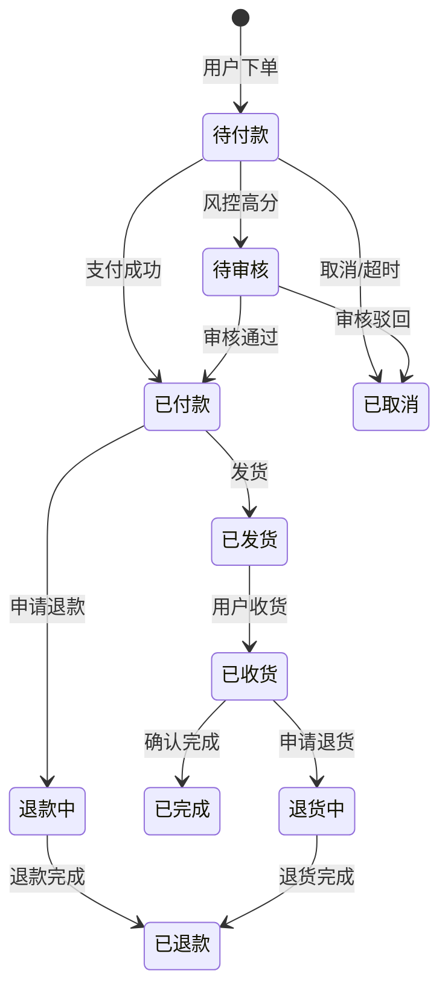
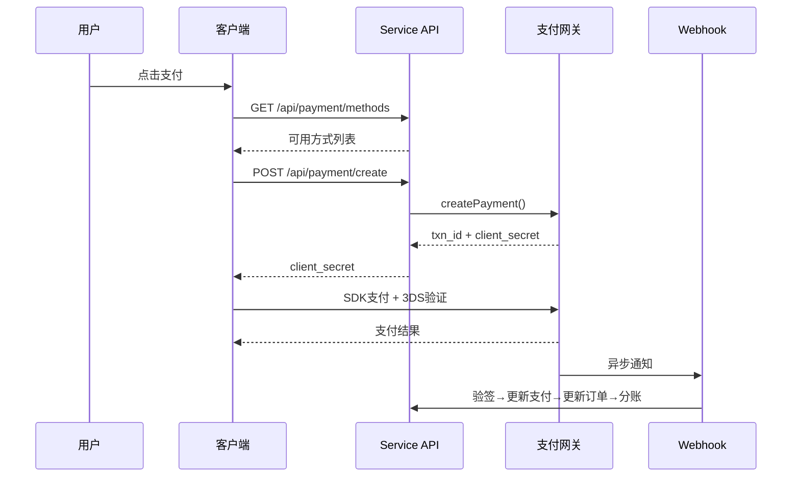
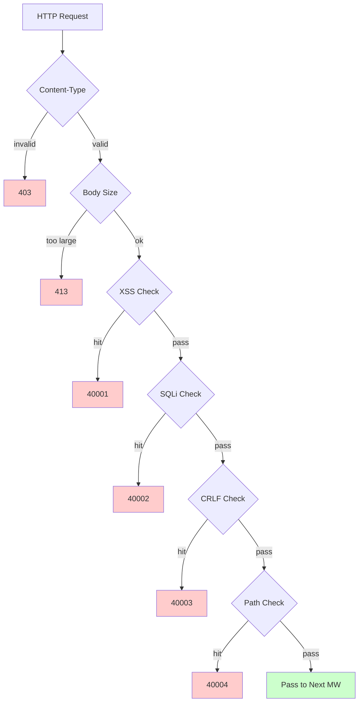

# 跨境电商平台 — 功能设计文档

Copyright (c) 2026 erik <erik@erik.xyz> — https://erik.xyz

---

## 1. 功能总览

### 1.0 覆盖总览

| 维度 | 覆盖内容 | 深度 |
|------|---------|------|
| **B2C零售** | 多语言商品、分币种定价、SKU、购物车、订单、支付(Stripe/PayPal/Klarna)、退款、退货 | 完整 |
| **B2B批发** | 阶梯定价(MOQ)、企业认证(税号/营业执照)、询价 | 完整 |
| **多商家入驻** | 卖家审核、商品审核、分成分账 | 完整 |
| **跨境合规** | HS Code编码库(6位基码)、关税规则(目的国+HS→税率)、VAT/IOSS、合规标签(FDA/CE/RoHS等10类) | 完整 |
| **国际物流** | 物流分区运费(重量阶梯)、DHL/UPS/FedEx/EMS、海外仓(发货+退货)、HS申报(电池/液体标识)、商业发票PDF/装箱单 | 完整 |
| **支付** | Stripe PaymentIntent+3DS、PayPal REST、Klarna BNPL、Adyen、Webhook验签+分账 | Stripe完整,其他占位 |
| **营销** | 优惠券(分区+新老客限定)、轮播图(区域可见)、秒杀(限时限量)、拼团(成团人数+有效期)、分销(链接+佣金+提现) | 完整 |
| **多平台** | Amazon/eBay/Shopee/Lazada/Temu商品刊登+订单聚合、多店铺管理 | 完整 |
| **供应链** | 供应商档案+评级、采购单(审核→发货→收货→质检)、质检(入库+出库门禁/外观/功能/合规标签检查)、库存流水(不可变账本:入库/出库/调拨/盘点) | 完整 |
| **风控合规** | 规则引擎(旁路打分:地址校验/邮编匹配/3DS/批量注册/货值异常)、KYC实名、GDPR/CCPA数据请求、Cookie Consent版本管理 | 完整 |
| **安全防护** | 15类攻击检测: XSS(18条)/SQL注入(20条)/CRLF/路径遍历(编码+null byte)/Body大小/Content-Type/文件上传/HTTP安全头/暴力破解(Redis计数器)/XXE/SSRF/方法/Host/敏感脱敏/CORS | 完整 |
| **高并发** | 令牌桶限流(滑动窗口+6端点规则)、Cache-Aside缓存(防雪崩随机TTL+防穿透空值缓存+标签批量失效)、熔断器(5次→熔断60s+自动恢复)、DB读写分离(2读副本+sticky)、连接池(DB 50/10+Redis 30/5)、热点响应缓存(6端点)、OPCache(256MB/CLI) | 完整 |
| **会员增长** | 会员等级+权益、积分规则+流水、礼品卡(余额+兑换)、降价/到货提醒、收藏夹、商品对比、浏览历史、订阅周期购、AB测试(流量分配+置信度) | 完整 |
| **内容管理** | CMS多语言页面(Landing/Blog)、FAQ多语言、知识库多语言、尺码对照表(服装/鞋类+US/UK/EU/JP/CN转换)、邮件模板(多语言)、商品Feed(Google/Meta+定时同步) | 完整 |
| **客服** | WebSocket实时IM(chat_sessions/chat_messages)、知识库多语言 | 表结构完整,WS待实现 |
| **基础设施** | Snowflake分布式ID(bigint非自增)、Hashids接口ID混淆、JWT认证(HS256+黑名单+刷新)、AES加解密(接口+数据库三层加密)、GeoIP区域识别(MaxMind)、Poster人机验证(滑块/拼图/点击) | 完整 |
| **多端覆盖** | Flutter 5平台(iOS/Android/macOS/Windows/Linux/iPadOS) + HarmonyOS(ArkTS 8页面) + Web Admin(LayUI+ECharts) + API | Flutter 25文件,HarmonyOS 13文件,Admin 137文件 |
| **平台追踪** | 8平台识别(iOS/iPadOS/macOS/Windows/Linux/Android/HarmonyOS/Web)+X-Platform header+6表记录(orders/payments/operation_logs/users/search_logs/chat_messages) | 完整 |
| **测试** | 23 tests / 68 assertions — ALL PASS (SecurityTest 16: XSS+SQLi+XXE+SSRF+File+Path / JwtTest 4 / ApiResponseTest 3) | 单元测试完整,集成测试待补 |

### 1.1 模块矩阵

| 一级模块 | 二级模块 | 优先级 | 状态 |
|---------|---------|--------|------|
| 用户系统 | 注册/登录/社交登录/KYC实名/地址/收藏/会员/积分/礼品卡 | P0-P2 | ✅ |
| 商品系统 | 分类/SKU/多语言/多币种/图片/属性/合规/HS Code/ES搜索/Feed | P0-P1 | ✅ |
| 交易系统 | 购物车/订单/支付(Stripe+PayPal+Klarna)/退款/退货/发票 | P0 | ✅ |


| 营销系统 | 优惠券/轮播图/秒杀/拼团/分销 | P1-P2 | ✅ |


| 基础设施 | Snowflake ID/JWT/Hashids/Encryption/Poster/API版本/GeoIP | P0 | ✅ |

---

## 2. 核心业务流程图

### 2.1 订单状态机



### 2.2 支付时序



### 2.3 安全检测管道



---


```bash
cd service && php vendor/bin/phpunit tests/
```

| 测试类 | Tests | 覆盖 |
|--------|-------|------|
| SecurityTest | 16 | XSS(8条)+SQLi(2条)+XXE(2条)+SSRF(2条)+File double ext+Path encoded+Null byte |
| JwtTest | 4 | encode三段式JWT + decode往返 + 无效token→null + 空token→null |
| ApiResponseTest | 3 | success(code=0) + fail(error code) + paginate(list+meta分页) |
| **Total** | **23** | **68 assertions — ALL PASS** |
