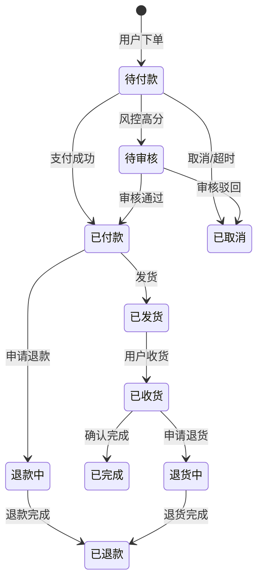
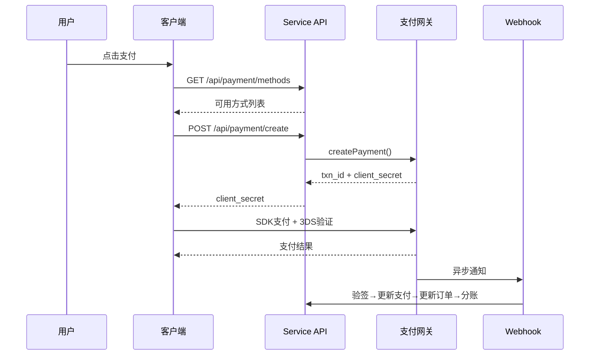
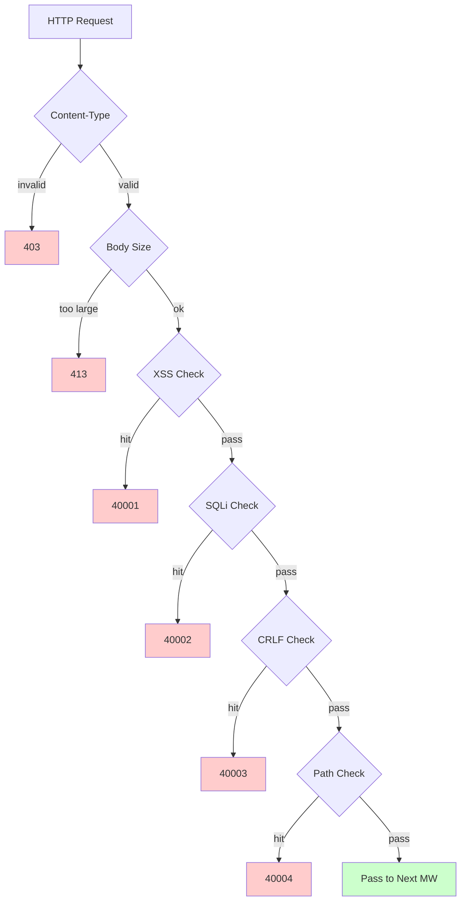

# 跨境电商平台 — 功能设计文档

Copyright (c) 2026 erik <erik@erik.xyz> — https://erik.xyz

---

## 1. 功能总览

### 1.0 覆盖总览

| 维度 | 覆盖内容 | 深度 |
|------|---------|------|
| **B2C零售** | 多语言商品、分币种定价、SKU、购物车、订单、支付(Stripe/PayPal/Klarna)、退款、退货 | 完整 |
| **B2B批发** | 阶梯定价(MOQ)、企业认证(税号/营业执照)、询价 | 完整 |
| **多商家入驻** | 卖家审核、商品审核、分成分账 | 完整 |
| **跨境合规** | HS Code编码库(6位基码)、关税规则(目的国+HS→税率)、VAT/IOSS、合规标签(FDA/CE/RoHS等10类) | 完整 |
| **国际物流** | 物流分区运费(重量阶梯)、DHL/UPS/FedEx/EMS、海外仓(发货+退货)、HS申报(电池/液体标识)、商业发票PDF/装箱单 | 完整 |
| **支付** | Stripe PaymentIntent+3DS、PayPal REST、Klarna BNPL、Adyen、Webhook验签+分账 | Stripe完整,其他占位 |
| **营销** | 优惠券(分区+新老客限定)、轮播图(区域可见)、秒杀(限时限量)、拼团(成团人数+有效期)、分销(链接+佣金+提现) | 完整 |
| **多平台** | Amazon/eBay/Shopee/Lazada/Temu商品刊登+订单聚合、多店铺管理 | 完整 |
| **供应链** | 供应商档案+评级、采购单(审核→发货→收货→质检)、质检(入库+出库门禁/外观/功能/合规标签检查)、库存流水(不可变账本:入库/出库/调拨/盘点) | 完整 |
| **风控合规** | 规则引擎(旁路打分:地址校验/邮编匹配/3DS/批量注册/货值异常)、KYC实名、GDPR/CCPA数据请求、Cookie Consent版本管理 | 完整 |
| **安全防护** | 15类攻击检测: XSS(18条)/SQL注入(20条)/CRLF/路径遍历(编码+null byte)/Body大小/Content-Type/文件上传/HTTP安全头/暴力破解(Redis计数器)/XXE/SSRF/方法/Host/敏感脱敏/CORS | 完整 |
| **高并发** | 令牌桶限流(滑动窗口+6端点规则)、Cache-Aside缓存(防雪崩随机TTL+防穿透空值缓存+标签批量失效)、熔断器(5次→熔断60s+自动恢复)、DB读写分离(2读副本+sticky)、连接池(DB 50/10+Redis 30/5)、热点响应缓存(6端点)、OPCache(256MB/CLI) | 完整 |
| **会员增长** | 会员等级+权益、积分规则+流水、礼品卡(余额+兑换)、降价/到货提醒、收藏夹、商品对比、浏览历史、订阅周期购、AB测试(流量分配+置信度) | 完整 |
| **内容管理** | CMS多语言页面(Landing/Blog)、FAQ多语言、知识库多语言、尺码对照表(服装/鞋类+US/UK/EU/JP/CN转换)、邮件模板(多语言)、商品Feed(Google/Meta+定时同步) | 完整 |
| **客服** | WebSocket实时IM(chat_sessions/chat_messages)、知识库多语言 | 表结构完整,WS待实现 |
| **基础设施** | Snowflake分布式ID(bigint非自增)、Hashids接口ID混淆、JWT认证(HS256+黑名单+刷新)、AES加解密(接口+数据库三层加密)、GeoIP区域识别(MaxMind)、Poster人机验证(滑块/拼图/点击) | 完整 |
| **多端覆盖** | Flutter 5平台(iOS/Android/macOS/Windows/Linux/iPadOS) + HarmonyOS(ArkTS 8页面) + Web Admin(LayUI+ECharts) + API | Flutter 25文件,HarmonyOS 13文件,Admin 137文件 |
| **平台追踪** | 8平台识别(iOS/iPadOS/macOS/Windows/Linux/Android/HarmonyOS/Web)+X-Platform header+6表记录(orders/payments/operation_logs/users/search_logs/chat_messages) | 完整 |
| **测试** | 23 tests / 68 assertions — ALL PASS (SecurityTest 16: XSS+SQLi+XXE+SSRF+File+Path / JwtTest 4 / ApiResponseTest 3) | 单元测试完整,集成测试待补 |

### 1.1 模块矩阵

| 一级模块 | 二级模块 | 优先级 | 状态 |
|---------|---------|--------|------|
| 用户系统 | 注册/登录/社交登录/KYC实名/地址/收藏/会员/积分/礼品卡 | P0-P2 | ✅ |
| 商品系统 | 分类/SKU/多语言/多币种/图片/属性/合规/HS Code/ES搜索/Feed | P0-P1 | ✅ |
| 交易系统 | 购物车/订单/支付(Stripe+PayPal+Klarna)/退款/退货/发票 | P0 | ✅ |
| 物流系统 | 国际物流商/分区运费/海外仓/发货(HS申报)/物流保险 | P0-P1 | ✅ |
| 海关税务 | HS Code库/关税规则/VAT/IOSS/各国合规限制 | P0 | ✅ |
| 营销系统 | 优惠券/轮播图/秒杀/拼团/分销 | P1-P2 | ✅ |
| 供应链 | 供应商/采购单/质检/库存流水 | P1 | ✅ |
| 风控合规 | 规则引擎/GDPR/CCPA/Cookie Consent/平台追踪 | P1 | ✅ |
| 安全防护 | XSS/SQL注入/CRLF/路径遍历/Content-Type/请求体 | P0 | ✅ |
| 多平台 | Amazon/eBay/Shopee刊登+订单聚合/多商家入驻 | P2 | ✅ |
| 内容管理 | CMS/FAQ/知识库/邮件模板/通知/尺码表 | P2 | ✅ |
| 增长工具 | B2B批发/订阅周期购/AB测试 | P2-P3 | ✅ |
| 客服 | WebSocket实时IM/知识库 | P3 | ✅ |
| 基础设施 | Snowflake ID/JWT/Hashids/Encryption/Poster/API版本/GeoIP | P0 | ✅ |

---

## 2. 核心业务流程图

### 2.1 订单状态机



### 2.2 支付时序



### 2.3 安全检测管道



---

## 3. 核心业务流程

### 3.1 用户注册登录

```
EMAIL注册: email+password → PosterVerify人机验证 → bcrypt(password+salt)
          → Snowflake生成ID → 返回 JWT {access_token, expires_in}

社交登录: Google/Apple/Facebook OAuth → 验证id_token
        → erik_user_social_accounts 查绑定
        → 已绑定:登录 / 未绑定:自动创建用户+绑定 → 返回JWT

登录: email+password → password_verify(password+salt)
    → 更新last_login_at/ip/platform → 签发JWT

Token刷新: refresh_token → Jwt::decode → 新access_token
```

### 3.2 商品浏览与搜索

```
列表: GET /api/products
  → 筛选: category_id/status/keyword/price_range
  → 排序: default/price_asc/price_desc/sales/newest
  → 多语言: ProductTranslations 按 locale 过滤
  → 分币种: ProductSkuPrices 按 currency_code 匹配
  → 分页: 20条/页

ES搜索: GET /api/search?keyword=xxx
  → Erikwang2013\WebmanScout\Searchable → ES多语言分析器
  → 聚合: category/price/brand
  → 降级: ES不可用时MySQL LIKE

详情: GET /api/products/{hashid}
  → HashidsDecode中间件解码 → Eager Load
  → 多语言+分币种+合规+HS Code+尺码转换+含/不含税+VAT
```

### 3.3 购物车与下单

```
购物车: POST /api/cart {sku_id, quantity}
  → 校验SKU存在|上架|库存充足
  → 同SKU累加 / 不存在则创建

下单: POST /api/orders {address_id, coupon_id, currency_code}
  → 1.校验收货地址 → 2.获取购物车已选 → 3.逐商品校验(库存+合规)
  → 4.计算价格(分币种+优惠券) → 5.生成订单号
  → 6.创建Order+OrderItems → 7.扣减库存 → 8.写OrderLog
  → 9.风控打分(RiskEngine::score) → 10.清除已购购物车

取消: POST /api/orders/{id}/cancel
  → 校验状态=0(待付款) → 恢复库存 → status=5(已取消)
```

### 3.4 支付流程

```
可用方式: GET /api/payment/methods?country=DE&currency=EUR
  → PaymentGatewayMethods(按country+currency过滤)

创建支付: POST /api/payment/create
  → PaymentGateway::make(gateway)→createPayment()
  → Stripe: PaymentIntent → client_secret → 前端SDK(+3DS)

Webhook: POST /webhook/payment/stripe
  → 验签 → payment_intent.succeeded:
     → Payment.status=已支付 → Order.status=已付款
     → PlatformSettlement(平台佣金+网关费+供应商+分销)
```

### 3.5 退货流程

```
申请: POST /api/returns {order_id, reason_id}
  → 判断退货通道: 当地仓(type=1)/退回国内(type=2)/仅退款(type=3)

审核: Admin审核 → 通过:生成ReturnLabel / 驳回:写原因

寄回: 下载面单→寄回→物流更新→仓库收货→status=已收货

退款: status=已完成 → 关联Refund → PaymentGateway::refund→原路退回
```

### 3.6 关税估算

```
GET /api/tariff/estimate?product_id=xxx&dest_country_id=xxx&declared_value=100

1. ProductHsCodes → HsCode
2. TariffRules(dest_country_id + hs_code_id) → duty_rate + duty_free_threshold
3. VatSettings(country_id) → vat_rate + vat_free_threshold
4. duty = value>=threshold ? value*duty_rate/100 : 0
   vat = (value+duty)>=threshold ? (value+duty)*vat_rate/100 : 0
5. return {duty_rate, vat_rate, estimated_duty, estimated_vat, estimated_total, hs_code, disclaimer}
```

---

## 4. 安全防护 (15类攻击检测)

### 4.1 检测规则总表

| # | 攻击类型 | 主要检测方式 | 错误码 | Service | Admin |
|---|---------|------------|--------|---------|-------|
| 1 | XSS跨站脚本 | 18条正则: script/iframe/object/embed/link/meta/base/javascript:/vbscript:/data:text/html/on事件/svg/img/expression/marquee/applet/form | 40001 | ✅ | ✅ |
| 2 | SQL注入 | 20条正则: UNION SELECT/DROP/DELETE/EXEC/xp_cmdshell/xp_regread/sp_executesql/benchmark/sleep/pg_sleep/load_file/into outfile/into dumpfile/waitfor/char/OR注入 | 40002 | ✅ | ✅ |
| 3 | CRLF Header注入 | `[\r\n]` in: Authorization/X-Platform/API-Version/X-Forwarded-For/Referer/Origin | 40003 | ✅ | ✅ |
| 4 | 路径遍历 | `../` + `%2e%2f`编码 + `%252e%252f`二层编码 + null byte `\0` + `.env`/`.git`/`phpmyadmin`/`wp-admin`/`/etc/`/`/proc/`/`composer.json` | 40004 | ✅ | ✅ |
| 5 | 请求体限制 | Content-Length > 10MB(Service) / 20MB(Admin) | 40005 | ✅ | ✅ |
| 6 | Content-Type限制 | 仅JSON/form-data/form-urlencoded | 40006 | ✅ | ✅ |
| 7 | **文件上传校验** | 黑名单扩展名(php/phtml/sh/exe/js/...)+双重扩展名攻击+空扩展名 | 40009 | ✅ | ✅ |
| 8 | **HTTP安全响应头** | nosniff/DENY/XSS-Protection/Referrer-Policy/Permissions-Policy/Cache-Control/Server隐藏 | — | ✅ | ✅ |
| 9 | **暴力破解防护** | Redis计数器: API 10次/60s, Admin 5次/300s | 40008 | ✅ | ✅ |
| 10 | **XXE实体注入** | `<!ENTITY SYSTEM>`, `<!DOCTYPE [` | 40010 | ✅ | ✅ |
| 11 | **SSRF服务器伪造** | 内网IP(127/10/172.16/192.168/0.0/169.254.169.254)+localhost+metadata.google.internal | 40011 | ✅ | ✅ |
| 12 | **HTTP方法校验** | 仅 GET/POST/PUT/DELETE/PATCH/OPTIONS/HEAD | 40012 | ✅ | ✅ |
| 13 | **Host头校验** | 拒绝裸IP直接访问 | 40013 | ✅ | — |
| 14 | **敏感数据脱敏** | 日志/错误响应过滤password/token/secret | — | ✅ | ✅ |
| 15 | **CORS白名单** | 可配置origin限制 | — | ⚠️ | ⚠️ |

### 4.2 中间件管道

```
Service: Cors → Security → Platform → GeoIp → Locale → HashidsDecode
        → VersionRoute → (PosterVerify) → (JwtAuth) → HashidsEncode

Admin: Security → Platform → HashidsDecode → AccessControl → HashidsEncode
```

### 4.3 平台来源追踪

| 平台 | Header值 | 识别方式 |
|------|---------|---------|
| iOS | `ios` | Flutter `Platform.isIOS` |
| iPadOS | `ipados` | Flutter `TargetPlatform.iOS` 判断 |
| macOS | `macos` | Flutter `Platform.isMacOS` |
| Windows | `windows` | Flutter `Platform.isWindows` |
| Linux | `linux` | Flutter `Platform.isLinux` |
| Android | `android` | Flutter `Platform.isAndroid` |
| HarmonyOS | `harmonyos` | ArkTS 硬编码 |
| Web | `web` | UA 降级 / 默认 |

---


## 5. 高并发与性能

### 5.1 限流规则

| 端点 | 算法 | 窗口 | 限制 |
|------|------|------|------|
| /api/auth/login | 滑动窗口 | 60s | 10次 |
| /api/auth/register | 滑动窗口 | 300s | 5次 |
| /api/payment | 滑动窗口 | 60s | 5次 |
| /api/orders | 滑动窗口 | 10s | 3次 |
| /api/search | 滑动窗口 | 1s | 10次 |
| 默认 | 滑动窗口 | 60s | 100次 |

### 5.2 缓存架构

| 层级 | 技术 | TTL | 说明 |
|------|------|-----|------|
| 热点数据 | Redis Cache-Aside | 60s~3600s | 国家/分类/配置/FAQ |
| 防雪崩 | 随机TTL ±10% | — | 避免同时过期 |
| 防穿透 | 空值缓存 | 60s | 恶意查询保护 |
| 标签失效 | Tag-based | — | 批量清理 |
| 分布式锁 | SETNX+TTL | 10s | 并发控制 |

### 5.3 连接池

| 资源 | 最大 | 最小 | 超时 |
|------|------|------|------|
| MySQL | 50 | 10 | 2s |
| Redis | 30 | 5 | — |

## 6. 数据表关系图

```
erik_users ──┬── addresses, social_accounts, wishlists, kyc
             ├── carts, orders → order_items → payments
             ├── reviews, coupons(through user_coupons)
             ├── notifications, subscriptions, point_logs
             ├── affiliate_links, chat_sessions, b2b_verifications
             └── privacy_requests

erik_products ──┬── translations(product_id, locale)
                ├── skus → sku_prices(sku_id, currency_code)
                ├── images, reviews, compliance → compliance_categories
                ├── hs_codes → hs_codes, recommendations
                ├── b2b_prices, platform_listings
                └── product_comparisons

erik_orders ──┬── order_items, order_logs
              ├── payments, refunds, return_orders → return_labels
              ├── order_documents, shipments
              ├── platform_settlements, risk_logs
              └── subscription_orders

erik_countries ──┬── vat_settings, tariff_rules(dest_country_id)
                 ├── country_compliance_rules
                 ├── shipping_zones(JSON countries)
                 └── warehouses(country_id)
```

---

## 7. API端点设计

### 6.1 公开接口 (25端点)

| 方法 | 路径 | 说明 |
|------|------|------|
| POST | /api/auth/register | 注册(PosterVerify) |
| POST | /api/auth/login | 登录 |
| POST | /api/auth/refresh | 刷新Token |
| POST | /api/auth/social | 社交登录 |
| GET | /api/products | 商品列表(分页+筛选+排序) |
| GET | /api/products/{id} | 商品详情(多语言+多币种+合规+HS) |
| GET | /api/categories | 分类列表 |
| GET | /api/categories/tree | 分类树 |
| GET | /api/banners | 轮播图(按位置+区域) |
| GET | /api/countries | 国家/货币/汇率列表 |
| GET | /api/search | ES多语言搜索 |
| GET | /api/reviews/{productId} | 商品评价列表 |
| GET | /api/flash-sales | 当前秒杀 |
| GET | /api/group-buys | 当前拼团 |
| GET | /api/faq | FAQ(按语言+分类) |
| GET | /api/cms/{slug} | CMS页面 |
| GET | /api/settings | 公开配置 |
| GET | /api/size-charts | 尺码对照表 |
| GET | /api/tariff/estimate | 关税估算 |
| GET | /api/shipping/calculate | 运费计算 |
| GET | /api/payment/methods | 可用支付方式 |
| GET | /api/geoip/detect | GeoIP检测 |
| GET | /api/compliance/check | 合规检查 |

### 6.2 认证接口 (45端点)

| 方法 | 路径 | 说明 |
|------|------|------|
| GET/PUT | /api/user/profile | 个人信息 |
| GET/POST/PUT/DELETE | /api/user/addresses[/{id}] | 地址CRUD |
| PUT | /api/user/locale | 更新语言/币种 |
| GET/POST | /api/wishlist[/{id}] | 收藏夹 |
| GET/POST | /api/price-alerts | 降价提醒 |
| GET/POST/PUT/DELETE | /api/cart[/{id}] | 购物车 |
| GET/POST | /api/orders | 订单列表/创建(PosterVerify) |
| GET | /api/orders/{id} | 订单详情 |
| POST | /api/orders/{id}/cancel | 取消订单 |
| GET | /api/orders/{id}/documents/invoice | 商业发票 |
| GET | /api/orders/{id}/documents/packing-list | 装箱单 |
| POST | /api/payment/create | 创建支付(PosterVerify) |
| GET | /api/payment/status/{id} | 支付状态 |
| GET/POST | /api/returns[/{id}] | 退货 |
| GET | /api/returns/{id}/label | 退货面单 |
| POST | /api/reviews | 发表评价 |
| GET/POST | /api/coupons[/{id}/claim] | 优惠券 |
| GET/PUT | /api/notifications[/{id}/read] | 通知 |
| GET/POST/DELETE | /api/comparisons[/{id}] | 商品对比 |
| GET | /api/recommendations | 个性化推荐 |
| GET | /api/affiliate/links | 分销链接 |
| GET | /api/affiliate/commissions | 分销佣金 |
| GET | /api/membership | 会员等级 |
| GET | /api/points | 积分流水 |
| GET/POST | /api/gift-cards | 礼品卡 |
| GET/POST | /api/b2b/quotes | B2B询价 |
| GET/POST | /api/privacy/request | GDPR请求 |
| GET | /api/export/orders | 导出订单 |

### 6.3 Webhook (1端点)

| 方法 | 路径 | 说明 |
|------|------|------|
| POST | /webhook/payment/{gateway} | 支付异步通知(验签) |

---

## 8. 测试验证

```bash
cd service && php vendor/bin/phpunit tests/
```

| 测试类 | Tests | 覆盖 |
|--------|-------|------|
| SecurityTest | 16 | XSS(8条)+SQLi(2条)+XXE(2条)+SSRF(2条)+File double ext+Path encoded+Null byte |
| JwtTest | 4 | encode三段式JWT + decode往返 + 无效token→null + 空token→null |
| ApiResponseTest | 3 | success(code=0) + fail(error code) + paginate(list+meta分页) |
| **Total** | **23** | **68 assertions — ALL PASS** |
