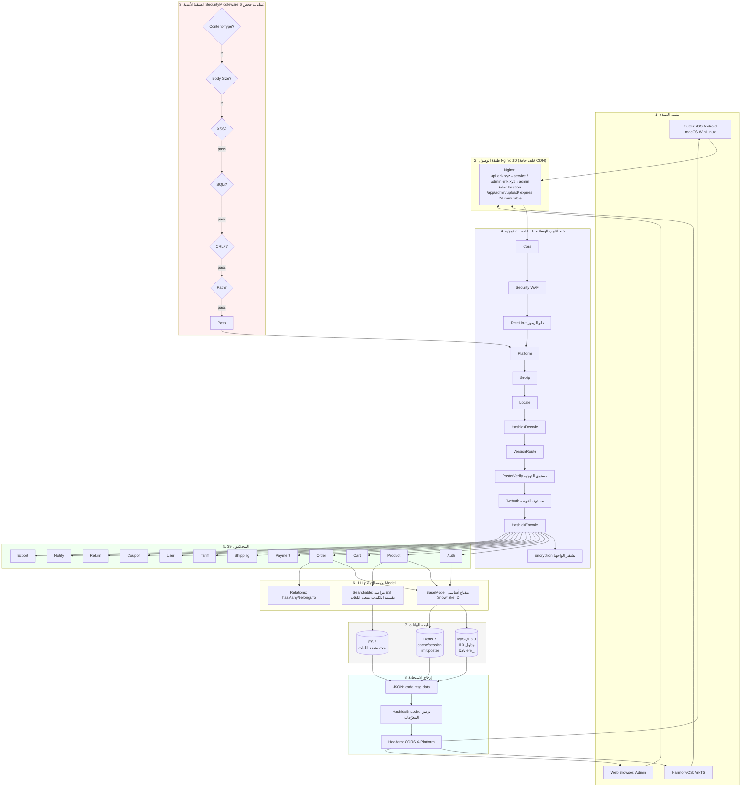
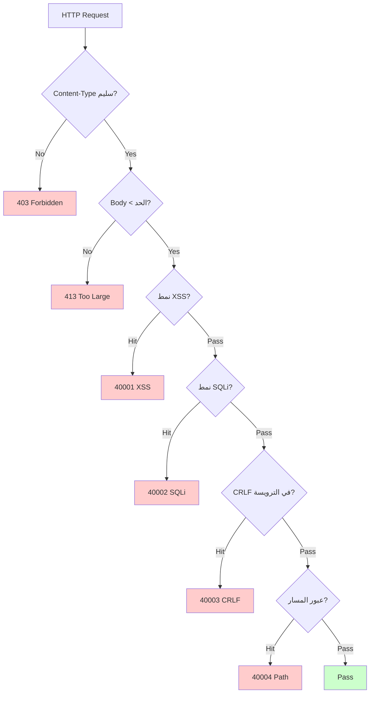
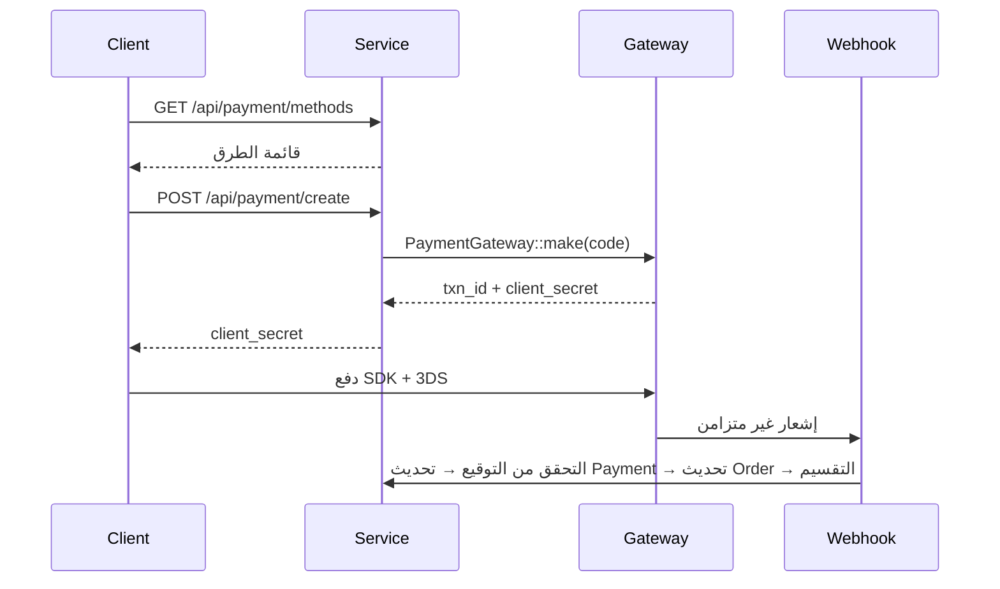
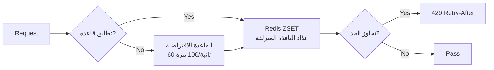

# منصة التجارة الإلكترونية عبر الحدود — وثيقة تصميم البنية

Copyright (c) 2026 erik <erik@erik.xyz> — https://erik.xyz

---

## 1. نظرة عامة على النظام

### 1.1 التموضع

منصة تجارة إلكترونية كاملة عبر الحدود مبنية على إطار webman عالي الأداء، تدعم B2C وB2B واستضافة البائعين من طرف ثالث.

| المكوّن | حزمة التقنيات | الحجم |
|------|--------|------|
| Service API | PHP 8.3 / webman 2.1 / illuminate database | 39 متحكمًا + 111 نموذجًا + 14 وسيطة |
| Admin | webman-admin / LayUI / ECharts | 82 متحكمًا + 76 نموذجًا + 5 وسائط |
| Flutter | Riverpod / GoRouter / Dio | 25 ملف Dart / 11 صفحة |
| HarmonyOS | ArkTS / ArkUI | 14 ملف ETS / 9 صفحات |
| قاعدة البيانات | MySQL 8.0 + Redis 7 + ES 8 | 117 جدولًا (110 `erik_` + 7 `wa_`) |

### 1.2 المؤشرات الأساسية

| المؤشر | القيمة |
|------|-----|
| API P99 | <200ms |
| التزامن | 10000+ (32 worker دائمة الذاكرة) |
| عدد الجداول | 110 |
| عدد النقاط | 73 |
| الوسائط | 14 (service: 10 عامة + 2 توجيه + AdminKey + StaticFile / admin: 4 عامة + 1 مدمجة) |
| اللغات | zh_CN, zh_HK, en, ja, ko |
| العملات | تسعير مستقل لـ 19 عملة |
| الدفع | Stripe / PayPal / Klarna / Adyen |

---

## 2. مخطط بنية النظام

```mermaid
graph TD
    subgraph Clients[طبقة العملاء]
        F[Flutter 5 منصات<br/>iOS Android macOS Win Linux]
        H[HarmonyOS ArkTS]
        W[Web Browser Admin]
    end
    E1[CDN Edge<br/>Cloudflare / CloudFront / Aliyun / Tencent<br/>https://{CDN_DOMAIN}{path}]
    subgraph Gateway[طبقة الوصول]
        N[Nginx :80/:443<br/>location /app/admin/upload/<br/>expires 7d immutable]
    end
    subgraph Apps[طبقة التطبيقات]
        S[Service API :8787<br/>39 متحكمًا 111 نموذجًا 14 وسيطة]
        A[Admin :8788<br/>82 متحكمًا 76 نموذجًا 5 وسائط]
    end
    subgraph Data[طبقة البيانات]
        M[(MySQL 8.0 :3306<br/>110 tables erik_)]
        R[(Redis 7 :6379<br/>cache session limit)]
        E[(ES 8 :9200<br/>multilingual search)]
    end
    F & H & W --> E1
    E1 -->|CNAME| N
    N -->|api.erik.xyz| S
    N -->|admin.erik.xyz| A
    S --> M
    S --> R
    S --> E
    A --> M
    A --> R
```

### 2.1 مخطط التصميم الكامل



**شرح المخطط:**

| الطبقة | الوصف |
|----|------|
| 1. طبقة العملاء | Flutter 5 منصات + HarmonyOS + Web Admin، جميعها تتواصل عبر HTTP/JSON |
| 2. طبقة الوصول | خلف حافة CDN (Cloudflare/CloudFront/Aliyun/Tencent، CNAME إلى نطاق admin) يوزّع Nginx حسب النطاق: api→service، admin→admin؛ `/app/admin/upload/` مخزّن مؤقتًا 7 أيام immutable |
| 3. الطبقة الأمنية | SecurityMiddleware بـ 31 كاشف هجوم، عند الإصابة يُرجع رمز خطأ/403 |
| 4. خط أنابيب الوسائط | 10 وسائط عامة MW تسلسلية + وسيطتا توجيه (PosterVerify للعمليات الحساسة، JwtAuth للواجهات المصادقة) |
| 5. طبقة المتحكمين | 39 متحكم API مقسمون حسب الوظيفة، يعالجون جميع منطق الأعمال |
| 6. طبقة النماذج | 111 نموذج Eloquent، يوفر BaseModel مفتاح أساسي Snowflake ID، و45 نموذجًا تفعّل SoftDelete حسب الجدول |
| 7. طبقة البيانات | MySQL (110 جداول بادئة erik_/مفتاح أساسي snowflake) + Redis (الذاكرة المؤقتة/Session/تحديد المعدل/Poster) + ES (البحث متعدد اللغات) |
| 8. الاستجابة | تنسيق JSON موحد → ترميز HashidsEncode للمعرّفات → تشفير Encryption (X-Encrypt-Response) → إرجاع للعميل |

### 2.2 نموذج العمليات

```
webman Master (:8787)
  ├── HTTP Worker x32 (CPU×4, الذاكرة الدائمة، تجمع اتصالات DB)
  ├── Monitor Process (مراقبة الملفات + مراقبة الذاكرة)
  └── SnowflakeWorker (تهيئة Singleton الخاص بـ Snowflake عند الإقلاع)

```

---

## 3. خط أنابيب الوسائط

### 3.1 خط أنابيب Service API الكامل

```mermaid
graph LR
    A[HTTP Request] --> B[Cors]
    B --> C[Security<br/>كشف الهجمات]
    C --> D[Platform<br/>تمييز المصدر]
    D --> E[GeoIp<br/>تمييز المنطقة]
    E --> F[Locale<br/>اللغة]
    F --> G[HashidsDecode<br/>فك المعرّفات]
    G --> H[VersionRoute<br/>توجيه الإصدار]
    H --> I{عملية حساسة?}
    I -->|Yes| J[PosterVerify<br/>تحقق بشري]
    I -->|No| K{محمية JWT?}
    J --> K
    K -->|Yes| L[JwtAuth<br/>التحقق من Token]
    K -->|No| M[HashidsEncode<br/>ترميز المعرّفات]
    L --> M
    M --> N[Controller]
    N --> O[HTTP Response]
    style C fill:#fcc
    style J fill:#ffc
    style L fill:#cfc
```



### 3.2 تفاصيل وسائط Service

| # | الوسيطة | النوع | الوظيفة |
|---|--------|------|------|
| 1 | Cors | عامة | ترويسات استجابة Access-Control-*، OPTIONS preflight تُرجع 200 |
| 2 | SecurityMiddleware | عامة | XSS/حقن SQL/CRLF/عبور المسار/Content-Type/جسم الطلب 10MB |
| 3 | RateLimitMiddleware | عامة | تحديد المعدل بدلو الرموز (Redis ZSET نافذة منزلقة، قواعد لـ 6 نقاط) |
| 4 | PlatformMiddleware | عامة | ترويسة X-Platform + تحديد 8 منصات بالتراجع إلى UA |
| 5 | GeoIpMiddleware | عامة | MaxMind GeoIP2 تحديد منطقة/عملة/لغة المستخدمين غير المسجلين |
| 6 | LocaleMiddleware | عامة | تحليل Accept-Language، تطابق دقيق لـ 5 لغات → تراجع → افتراضي |
| 7 | HashidsDecode | عامة | حقول `*_id` في URL/Body من hashid → snowflake ID |
| 8 | VersionRoute | عامة | ترويسة API-Version → مساحة اسم المتحكم (v1/v2) |
| 9 | PosterVerify | توجيه | التسجيل/الطلب/الدفع التحقق من token في Redis |
| 10 | JwtAuth | توجيه | Bearer Token تحقق HS256 + انتهاء الصلاحية + حقن userId |
| 11 | HashidsEncode | عامة | اجتياز JSON الاستجابة بشكل تكراري، snowflake ID → hashid |
| 12 | EncryptionMiddleware | توجيه | تشفير/فك تشفير الواجهة AES (X-Encrypt-Response/X-Encrypted) |
| 13 | AdminKeyMiddleware | توجيه | التحقق من مفتاح عمليات الإدارة الداخلية |
| 14 | StaticFile | عامة | خدمة الملفات الثابتة في webman |

### 3.3 خط أنابيب Admin

```
طلب → SecurityMiddleware → PlatformMiddleware → HashidsDecode
     → webman-admin AccessControl (مدمج RBAC) → HashidsEncode → المتحكم
```

| # | وسيطة Admin | الوظيفة |
|---|------------|------|
| 1 | SecurityMiddleware | XSS/حقن SQL/CRLF/عبور المسار/Content-Type/20MB |
| 2 | PlatformMiddleware | X-Platform + تحديد 8 منصات عبر UA |
| 3 | HashidsDecode | طلب hashid → snowflake ID |
| - | AccessControl (مدمجة) | التحقق من صلاحيات أدوار المديرين |
| 4 | HashidsEncode | استجابة snowflake ID → hashid |

---

## 4. البنية الأمنية

### 4.1 خط أنابيب كشف الهجمات (SecurityMiddleware)



### 4.2 تفاصيل قواعد كشف الهجمات في SecurityMiddleware (15 نوعًا مخصصًا)

| # | نوع الهجوم | طريقة الكشف الرئيسية | Service | Admin | رمز الخطأ |
|---|---------|------------|---------|-------|--------|
| 1 | XSS البرمجة النصية عبر المواقع | 13 تعبيرًا نمطيًا: script/iframe/on events/svg+on/style/expression/javascript:/embed/object/link/meta | ✅ | ✅ | 40001 |
| 2 | حقن SQL | 13 تعبيرًا نمطيًا: UNION SELECT/SELECT FROM WHERE/sleep/benchmark/pg_sleep/نوع منطقي/نوع سلسلة/رموز التعليق/تعليقات MySQL الخاصة/تعداد schema/load_file/into outfile/الإجراءات المخزنة/waitfor/delay | ✅ | ✅ | 40002 |
| 3 | حقن ترويسة CRLF | `[\r\n]` في: Authorization/X-Platform/API-Version/X-Forwarded-For/Referer/Origin | ✅ | ✅ | 40003 |
| 4 | عبور المسار | `../` + ترميز `%2e%2f` + ترميز مزدوج `%252e%252f` + null byte `\0` + `.env`/`.git`/`phpmyadmin`/`wp-admin`/`/etc/`/`/proc/`/`composer.json` | ✅ | ✅ | 40004 |
| 5 | حد جسم الطلب | Content-Length > 10MB (Service) / 20MB (Admin) | ✅ | ✅ | 40005 |
| 6 | Content-Type | JSON/form-data/form-urlencoded فقط | ✅ | ✅ | 40006 |
| 7 | التحقق من رفع الملفات | امتدادات القائمة السوداء (php/phtml/sh/exe/js/...) + الامتداد المزدوج + الامتداد الفارغ | ✅ | ✅ | 40009 |
| 8 | ترويسات استجابة HTTP الأمنية | nosniff/DENY/XSS-Protection/Referrer-Policy/Permissions-Policy/Cache-Control/إخفاء Server | ✅ | ✅ | — |
| 9 | حماية القوة الغاشمة | عداد Redis: API 10 مرات/60 ثانية، Admin 5 مرات/300 ثانية | ✅ | ✅ | 40008 |
| 10 | حقن كيانات XXE | `<!ENTITY SYSTEM>`، `<!DOCTYPE [` | ✅ | ✅ | 40010 |
| 11 | SSRF تزييف الخادم | عناوين IP الداخلية (127/10/172.16/192.168/0.0/169.254.169.254) + localhost + metadata.google.internal | ✅ | ✅ | 40011 |
| 12 | التحقق من طريقة HTTP | GET/POST/PUT/DELETE/PATCH/OPTIONS/HEAD فقط | ✅ | ✅ | 40012 |
| 13 | التحقق من ترويسة Host | رفض الاتصال المباشر بعنوان IP مكشوف | ✅ | — | 40013 |
| 14 | إخفاء البيانات الحساسة | تصفية password/token/secret من السجلات/استجابات الأخطاء | ✅ | ✅ | — |
| 15 | القائمة البيضاء CORS | تحديد أصل origin قابل للتهيئة | ⚠️ | ⚠️ | — |

### 4.3 تدفق المصادقة

```
التسجيل: email+password → PosterVerify (تحقق بشري) → bcrypt(password+salt)
     → توليد معرّف Snowflake → إرجاع JWT

تسجيل الدخول: email+password → password_verify(password+salt, bcrypt_hash)
     → تحديث last_login_at/ip/platform → إصدار JWT

الطلب: Authorization: Bearer <token>
     → JwtAuth → Jwt::decode → تحقق توقيع HS256 + انتهاء الصلاحية → حقن request->userId

التحديث: POST /api/auth/refresh {refresh_token} → Jwt::decode → access_token جديد
```

### 4.4 أمان البيانات (تشفير ثلاثي الطبقات)

| الطبقة | التقنية | الحزمة | الحقول |
|------|------|-----|------|
| النقل | AES-256-CBC | erikwang2013/encryption | الحقول الحساسة في جسم POST |
| قاعدة البيانات | Encryptable trait | erikwang2013/encryptable (Maize) | email, mobile, name, phone, detail, tax_id |
| إخفاء المعرّفات | ترميز Hashids | erikwang2013/hashids | جميع معرّفات snowflake في طبقة الواجهة |

### 4.5 تتبع مصادر المنصات

| المنصة | طريقة التحديد | قيمة الترويسة |
|------|---------|---------|
| iOS | Flutter `Platform.isIOS` + `TargetPlatform.iOS` | `ios` |
| iPadOS | Flutter `Platform.isIOS` + `!TargetPlatform.iOS` | `ipados` |
| macOS | Flutter `Platform.isMacOS` / UA `Macintosh` | `macos` |
| Windows | Flutter `Platform.isWindows` / UA `Windows` | `windows` |
| Linux | Flutter `Platform.isLinux` / UA `Linux` | `linux` |
| Android | Flutter `Platform.isAndroid` / UA `Android` | `android` |
| HarmonyOS | ترميز صريح ArkTS / UA `HarmonyOS` | `harmonyos` |
| Web | لا تطابق UA / القيمة الافتراضية | `web` |

جداول التسجيل: `erik_orders.platform`, `erik_payments.platform`, `erik_operation_logs.platform`, `erik_users.last_login_platform`, `erik_search_logs.platform`, `erik_chat_messages.platform`

---

## 5. بنية البيانات

### 5.1 استراتيجية المفتاح الأساسي

```
Snowflake 64bit: [1bit|42bit طابع زمني|5bit DC|5bit WID|12bit تسلسل]
- فريد عالميًا / متزايد الاتجاه / غير ذاتي الزيادة
- PHP $keyType='string' (لمنع الفائض)
- Service worker_id=1، Admin worker_id=2
- التوليد: Snowflake::nextId()
```

### 5.2 سلسلة وراثة النماذج

```
Illuminate\Database\Eloquent\Model
  └── app\model\BaseModel
        ├── $incrementing=false, $keyType='string', $guarded=[]
        ├── boot(): Snowflake::nextId()
        └── 110 نماذج أعمال
              ├── 45 نموذجًا تستخدم SoftDeletes (للجداول التي تحتوي عمود deleted_at)
              ├── البعض يستخدم Encryptable (حقول حساسة: email/mobile/name إلخ)
              ├── use Searchable (Product→ES)
              └── ارتباطات hasMany/belongsTo
```

### 5.3 تعدد اللغات/تعدد العملات

- **الترجمة**: `erik_product_translations(product_id,locale)` جدول مستقل، استعلام حسب locale
- **التسعير**: `erik_product_sku_prices(sku_id,currency_code)` أسعار مستقلة حسب العملة

---

## 6. بنية الدفع



```
PaymentGatewayInterface
  ├── createPayment(data): array
  ├── capturePayment(txnId): array
  ├── refundPayment(txnId, amount): array
  └── verifyWebhook(payload, sig): bool
```

---

## 7. بنية الالتزام العالي

### 7.1 استراتيجية تحديد المعدل (RateLimitMiddleware)



| النقطة | النافذة | الحد | الوصف |
|------|------|------|------|
| /api/auth/login | 60 ثانية | 10 مرات | منع تجربة كلمات المرور |
| /api/auth/register | 300 ثانية | 5 مرات | منع التسجيل الجماعي |
| /api/payment | 60 ثانية | 5 مرات | منع الاحتيال |
| /api/orders | 10 ثوانٍ | 3 مرات | منع الطلبات الوهمية |
| /api/search | 1 ثانية | 10 مرات | منع الزواحف |
| الافتراضي | 60 ثانية | 100 مرة | API عام |

### 7.2 استخدامات Redis

يُستخدم Redis لتحديد المعدل بدلو الرموز والتحقق البشري وتخزين Session (طبقة الوسائط)؛ بيانات الأعمال لا تخضع للتخزين المؤقت على مستوى التطبيق، وتُقرأ مباشرة من MySQL (فصل القراءة/الكتابة + تجمع الاتصالات). أما الملفات الثابتة (صور المنتجات/اللافتات) فتُخزَّن مؤقتًا عند حافة CDN (immutable لمدة 7 أيام)، ويُطهَّر التخزين المؤقت تلقائيًا عند تعديل/حذف المنتجات أو اللافتات.

### 7.4 تحسين تجمع الاتصالات

| المورد | أقصى اتصال | أدنى اتصال | مهلة الانتظار | مهلة الخمول | نبض القلب |
|------|---------|---------|---------|---------|------|
| MySQL | 50 | 10 | 2 ثانية | 60 ثانية | 45 ثانية |
| Redis | 30 | 5 | — | 60 ثانية | — |

### 7.5 معالجة العمليات البطيئة

| العملية | التنفيذ |
|------|------|
| تحديث أسعار الصرف | ExchangeRateCron (كل ساعة، API خارجي) |
| مزامنة Feed | ProductFeedCron (كل 6 ساعات يولّد TSV ويسجل السجلات) |
| حساب التوصيات | RecommendationCron (يوميًا، تكرار الشراء المشترك) |
| مطابقة الدفع | PaymentReconcileCron (كل 6 ساعات، Stripe/PayPal) |
| تسوية التقسيم | SettlementCron (يوميًا) |
| تتبع اللوجستيات | ShipmentTrackingCron (كل 30 دقيقة، يتطلب تهيئة API) |
| مزامنة طلبات المنصات | PlatformOrderSyncCron (كل 5 دقائق، يتطلب تهيئة API) |
| انتهاء مهلة الإرجاع | ReturnExpireCron (كل ساعة) |
| تنبيهات انخفاض السعر/التوفر | PriceAlertCron (كل 10 دقائق) |
| تحديث قواعد الامتثال | ComplianceCron (يوميًا، يتطلب تهيئة API) |

## 8. بنية النشر

```
docker-compose.yml:
  nginx (alpine) :80 :443
  service (php:8.3) :8787 internal, 32 workers
  admin (php:8.3) :8788 internal
  mysql (8.0) :3306 / redis (7) :6379 / es (8) :9200
حافة CDN: Cloudflare/CloudFront/Aliyun/Tencent (CNAME إلى نطاق admin) + nginx /app/admin/upload/ expires 7d immutable
أحجام رفع مستمرة: admin_uploads:/app/plugin/admin/public/upload | service_public:/app/public/documents
الشبكة: erik-net bridge | استمرار أحجام البيانات | التوجيه: api.erik.xyz→service | admin.erik.xyz→admin
```

---


## 8. التدويل (i18n)

| الطبقة | التنفيذ |
|------|------|
| Service | LocaleMiddleware + ملفات ترجمة لـ 5 لغات (45 مفتاحًا/لغة) |
| Admin | ملفات ترجمة لـ 5 لغات |
| Flutter | AppLocalizations + Riverpod Provider |
| API | حقن تلقائي عبر ترويسة Accept-Language |

## 9. توثيق API (hg/apidoc)

| المكوّن | الوصف |
|------|------|
| الحزمة | hg/apidoc v5.3 |
| الإعداد | config/plugin/hg/apidoc/app.php (6 مجموعات) |
| التعليقات | @Apidoc\Title/Desc/Method/Url/Param/Returned |
| الوصول | http://localhost:8787/apidoc/ |

## 11. الاختبارات

```bash
cd service && php vendor/bin/phpunit tests/
```

| فئة الاختبار | Tests | التغطية |
|--------|-------|------|
| SecurityTest | 12 | XSS+SQLi+XXE+SSRF+Path |
| JwtTest | 4 | encode/decode/invalid |
| ApiResponseTest | 3 | success/fail/paginate |
| RedisFacadeTest | 3 | ping/set/get/redis() |
| **الإجمالي** | **22** | **45 assertions PASS** |

---

## 12. إحصائيات المشروع

| البُعد | العدد |
|------|------|
| ملفات PHP المصدرية | service:210 + admin:214 = 424 |
| Dart (Flutter) | 25 |
| ArkTS (HarmonyOS) | 14 |
| جداول قاعدة البيانات | 110 |
| نقاط API | 73 |
| الوسائط | 14 |
| فئات الأدوات | 8 |
| المهام المجدولة | 12 |
| عناصر الإعداد | 36+ |
| الاختبارات | 22 tests, 45 assertions |
| المهارات | 38 |
| الوثائق | 9 |
| **الإجمالي** | **~700** |
