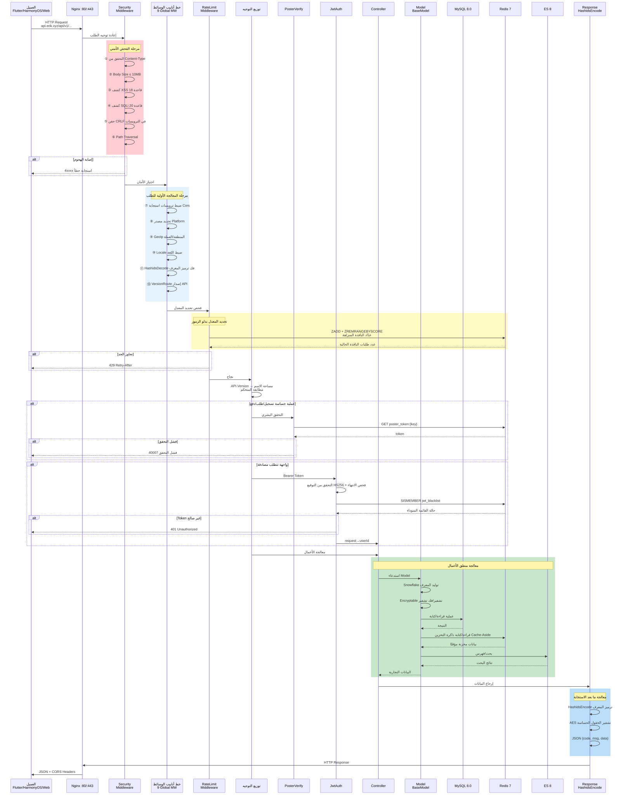

# منصة التجارة الإلكترونية عبر الحدود — مجموعة الرسوم البيانية للبنية

Copyright (c) 2026 erik <erik@erik.xyz> — https://erik.xyz

---

## 1. مخطط بنية النظام

---

## 2. مخطط تدفق معالجة الطلبات (خط أنابيب الوسائط)

---

## 3. خريطة وحدات الميزات الشاملة

---

## 4. مخطط دورة حياة الطلب

---

## 5. مخطط دورة حياة الطلب

---

## 6. مخطط بنية النشر

---

## 7. مخطط البنية الأمنية

### نظرة عامة على الحماية الأمنية

| الطبقة | خط الدفاع | التقنية/الحزمة | نطاق التغطية |
|------|------|---------|---------|
| الطبقة الأولى | حد الشبكة | Nginx SSL + الوكيل العكسي + التحقق من Host | Service + Admin |
| الطبقة الثانية | كشف هجمات WAF | كواشف `erikwang2013/security-php` الـ31 | XSS/SQLi/CRLF/عبور المسار/XXE/SSRF/رفع الملفات/الطرق/Host/Content-Type/Body وغيرها |
| الطبقة الثالثة | التحكم في الحركة + مرونة الاعتماديات | RateLimitMiddleware + عداد القوة الغاشمة في Redis + CircuitBreaker | تحديد المعدل بدلو الرموز (6 نقاط) + حماية تسجيل الدخول/التسجيل من القوة الغاشمة + قاطع دائرة الدفع/تسجيل الدخول الاجتماعي (5 إخفاقات → 30 ثانية، استعادة شبه مفتوحة) |
| الطبقة الرابعة | مصادقة الهوية | PosterVerify + JwtAuth HS256 | التحقق البشري (شريط انزلاق/لغز/نقر) + Bearer Token + تجديد الرمز المزدوج |
| الطبقة الخامسة | أمان البيانات | Hashids + AES-256-CBC + Encryptable | تشفير ثلاثي الطبقات: إخفاء المعرّفات/تشفير النقل/تشفير حقول قاعدة البيانات |
| الطبقة السادسة | أمان الاستجابة | ترويسات HTTP الأمنية + إخفاء البيانات الحساسة | nosniff/DENY/XSS-Protection/Referrer-Policy/إخفاء السجلات |
| مستمر | التدقيق والتتبع | PlatformMiddleware + OperationLogs | تتبع مصادر 8 منصات + تسجيل في 6 جداول + سجلات العمليات |

---

## 8. مخطط تدفق التسوية متعددة العملات

### شرح التسوية متعددة العملات

**التسعير متعدد العملات**: تُسعَّر منتجات SKU حسب `currency_code` لكل عملة، وعند الطلب تُثبَّت عملة التحصيل (USD / EUR / GBP / CNY وغيرها).

**خدمة أسعار الصرف**: يدعم جدول `erik_exchange_rates` الصيانة اليدوية manual والسحب التلقائي من exchangerate-api، مع إدارة النسخ حسب وقت السريان `effective_at`، وتُلتقط لقطة سعر الصرف في وقت الدفع عند التسوية.

**الخصم بالعملة الأصلية**: Stripe / PayPal / Klarna / Adyen تخصم بالعملة الأصلية حسب عملة الطلب، ويتم تحديث حالة الدفع والطلب بعد تأكيد وصول الأموال عبر التحقق من توقيع Webhook.

**التسوية المقسومة**: بعد نجاح الدفع تُنشأ تلقائيًا تسوية المنصة `PlatformSettlements` (إجمالي الطلب + عمولة المنصة + رسوم بوابة الدفع، مُسجلة بعملة الطلب)؛ تسوية البائع `MerchantSettlements` (مبلغ الطلب ← نسبة الخصم ← مبلغ التسوية)، تسوية المورد `SupplierSettlements`، وسحب عمولة التوزيع `AffiliatePayouts` — أربعة خطوط تسوية مستقلة، الحالة 0 قيد التسوية / 1 تم التسوية.

**أرباح/خسائر الصرف**: يتتبع `CurrencyExchangeGainsLosses` الفرق بين عملة التحصيل وعملة التسوية، بمقارنة سعر الصرف وقت الدفع مع سعر الصرف وقت التسوية، الموجب = ربح صرف والسالب = خسارة صرف، لدعم مطابقة الحسابات والتدقيق متعدد العملات في التجارة عبر الحدود.

---

## فهرس الرسوم

| الرقم | اسم الرسم | النوع | الاستخدام |
|------|------|------|------|
| 1 | مخطط بنية النظام | مخطط بنية | عرض النظام بالكامل: العملاء → الوصول → التطبيقات → البيانات → الخدمات الخارجية |
| 2 | مخطط تدفق معالجة الطلبات | مخطط تدفق | عرض المسار الكامل لطلب HTTP عبر خط أنابيب الوسائط المكون من 12 مستوى (10 عامة + 2 توجيه) |
| 3 | خريطة وحدات الميزات الشاملة | مخطط وظائف | عرض 17 وحدة ميزات رئيسية ونقاط وظائفها التفصيلية |
| 4 | مخطط دورة حياة الطلب | دورة حياة | عرض التسلسل الزمني الكامل من الطلب إلى الاستجابة وتفاعلات كل مرحلة |
| 5 | مخطط دورة حياة الطلب | دورة حياة | عرض جميع انتقالات حالة الطلب من سلة التسوق إلى الاكتمال/الاسترداد |
| 6 | مخطط بنية النشر | مخطط بنية | عرض تنظيم حاويات Docker Compose والشبكة وأحجام البيانات |
| 7 | مخطط البنية الأمنية | مخطط بنية | عرض نظام الدفاع العميق المكون من 6 طبقات: الحدود → WAF → الحركة/المرونة (تحديد المعدل + قاطع الدائرة) → المصادقة → البيانات → الاستجابة |
| 8 | مخطط تدفق التسوية متعددة العملات | مخطط تدفق | عرض السلسلة الكاملة: التسعير حسب العملة → الدفع → التقسيم → التسوية → أرباح/خسائر الصرف |
