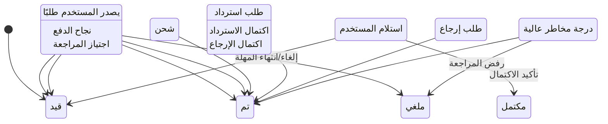
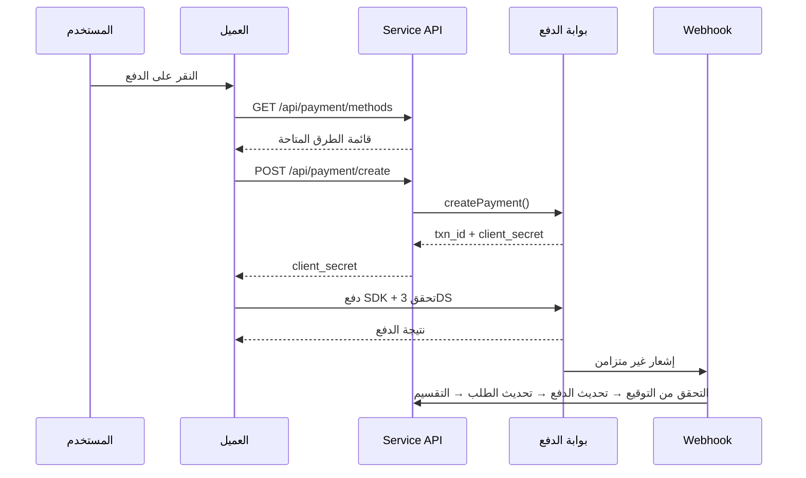
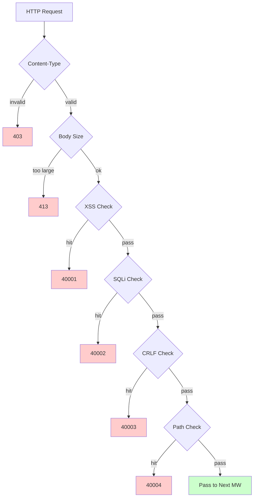

# منصة التجارة الإلكترونية عبر الحدود — وثيقة تصميم الميزات

Copyright (c) 2026 erik <erik@erik.xyz> — https://erik.xyz

---


## تتبع المنصات

### تمييز 8 منصات

| المنصة | Header | Flutter | Admin |
|------|--------|---------|-------|
| iOS | `ios` | Platform.isIOS + TargetPlatform.iOS | UA iPhone |
| iPadOS | `ipados` | Platform.isIOS + !TargetPlatform.iOS | UA iPad |
| macOS | `macos` | Platform.isMacOS | UA Macintosh |
| Windows | `windows` | Platform.isWindows | UA Windows |
| Linux | `linux` | Platform.isLinux | UA Linux |
| Android | `android` | Platform.isAndroid | UA Android |
| HarmonyOS | `harmonyos` | — | UA HarmonyOS |
| Web | `web` | kIsWeb | الافتراضي |

### حقول تتبع DB

| الجدول | الحقل | الوصف |
|----|------|------|
| erik_orders | platform VARCHAR(16) | منصة إصدار الطلب |
| erik_payments | platform VARCHAR(16) | منصة الدفع |
| erik_operation_logs | platform VARCHAR(16) | منصة العملية |
| erik_users | last_login_platform VARCHAR(16) | منصة تسجيل الدخول |
| erik_search_logs | platform VARCHAR(16) | منصة البحث |
| erik_chat_messages | platform VARCHAR(16) | مصدر الرسالة |

## 1. نظرة عامة على الميزات

### 1.0 نظرة عامة على التغطية

| البُعد | المحتوى المغطى | العمق |
|------|---------|------|
| **بيع التجزئة B2C** | منتجات متعددة اللغات، تسعير لكل عملة، SKU، سلة تسوق، طلبات، دفع (Stripe/PayPal/Klarna)، استرداد، إرجاع | كامل |
| **الجملة B2B** | تسعير متدرج (MOQ)، تحقق الشركات (رقم ضريبي/سجل تجاري)، استفسار الأسعار | كامل |
| **استضافة البائعين** | مراجعة البائعين، مراجعة المنتجات، توزيع العمولات والتسوية | كامل |
| **الامتثال عبر الحدود** | مكتبة رموز HS Code (رمز أساسي من 6 أرقام)، قواعد الرسوم الجمركية (الدولة الوجهة + HS → نسبة الضريبة)، VAT/IOSS، ملصقات الامتثال (FDA/CE/RoHS وغيرها من 10 فئات) | كامل |
| **اللوجستيات الدولية** | رسوم الشحن حسب المناطق (تدرج الوزن)، DHL/UPS/FedEx/EMS، مستودعات خارجية (شحن + إرجاع)، إقرار HS (بطاريات/سوائل)، فاتورة تجارية PDF/قائمة تعبئة | كامل |
| **الدفع** | Stripe PaymentIntent + 3DS، PayPal REST، Klarna BNPL، Adyen، Webhook تحقق توقيع + تقسيم | Stripe كامل، والبقية نائب |
| **التسويق** | قسائم (تقسيم مناطق + تقييد عملاء جدد/قدامى)، صور دائرية (مرئية حسب المنطقة)، بيع خاطف (وقت محدد/كمية محدودة)، شراء جماعي (عدد الأعضاء + مدة الصلاحية)، توزيع (رابط + عمولة + سحب) | كامل |
| **متعدد المنصات** | Amazon/eBay/Shopee/Lazada/Temu نشر المنتجات + تجميع الطلبات، إدارة متاجر متعددة | كامل |
| **سلسلة التوريد** | ملفات الموردين + التقييم، أوامر الشراء (مراجعة → شحن → استلام → فحص جودة)، فحص الجودة (بوابات إدخال/إخراج/مظهر/وظيفة/فحص ملصقات الامتثال)، سجل المخزون (دفتر غير قابل للتغيير: إدخال/إخراج/تحويل/جرد) | كامل |
| **المخاطر والامتثال** | محرك القواعد (تقييم جانبي: التحقق من العنوان/مطابقة الرمز البريدي/3DS/التسجيل الجماعي/قيمة شاذة)، تحقق KYC، طلبات بيانات GDPR/CCPA، إدارة إصدارات موافقة Cookie | كامل |
| **الحماية الأمنية** | يغلف SecurityMiddleware كواشف security-php الـ31: XSS (13 قاعدة)/حقن SQL (13 قاعدة)/CRLF/عبور المسار (ترميز + null byte)/حجم Body/Content-Type/رفع الملفات/ترويسات HTTP الأمنية/القوة الغاشمة (عداد Redis)/XXE/SSRF/الطرق/Host/إخفاء البيانات الحساسة/CORS | كامل |
| **الالتزام العالي** | تحديد المعدل بدلو الرموز (نافذة منزلقة + قواعد 6 نقاط)، قاطع الدائرة (الدفع/تسجيل الدخول الاجتماعي، 5 إخفاقات → كسر 30 ثانية + استعادة شبه مفتوحة)، فصل القراءة/الكتابة في DB (نسختا قراءة + sticky)، تجمع الاتصالات (DB 50/10 + Redis 30/5)، OPCache (128MB، بيئة Docker) | كامل |
| **نمو الأعضاء** | مستويات العضوية + الامتيازات، قواعد النقاط + السجلات، بطاقات الهدايا (الرصيد + الاستبدال)، تنبيهات انخفاض السعر/التوفر، المفضلة، مقارنة المنتجات، سجل التصفح، الشراء الدوري بالاشتراك، اختبار AB (توزيع الحركة + مستوى الثقة) | كامل |
| **إدارة المحتوى** | صفحات CMS متعددة اللغات (Landing/Blog)، FAQ متعدد اللغات، قاعدة معرفة متعددة اللغات، جدول مقاسات (ملابس/أحذية + تحويل US/UK/EU/JP/CN)، قوالب البريد (متعددة اللغات)، خلاصات المنتجات (Google/Meta + مزامنة مجدولة) | كامل |
| **خدمة العملاء** | محادثة فورية WebSocket (chat_sessions/chat_messages)، قاعدة معرفة متعددة اللغات | بنية الجداول مكتملة، WS قيد التنفيذ |
| **البنية التحتية** | معرّف Snowflake الموزع (bigint غير ذاتي الزيادة)، إخفاء معرّفات الواجهة Hashids، مصادقة JWT (HS256 + تجديد رمز مزدوج access/refresh)، تشفير/فك تشفير AES (تشفير ثلاثي الطبقات للواجهة وقاعدة البيانات)، تمييز المنطقة GeoIP (MaxMind)، التحقق البشري Poster (شريط انزلاق/لغز/نقر) | كامل |
| **التغطية متعددة الأطراف** | Flutter 5 منصات (iOS/Android/macOS/Windows/Linux/iPadOS) + HarmonyOS (ArkTS 9 صفحات) + Web Admin (LayUI+ECharts) + API | Flutter 25 ملفًا، HarmonyOS 14 ملفًا، Admin 239 ملفًا |
| **تتبع المنصات** | تمييز 8 منصات (iOS/iPadOS/macOS/Windows/Linux/Android/HarmonyOS/Web) + ترويسة X-Platform + تسجيل في 6 جداول (orders/payments/operation_logs/users/search_logs/chat_messages) | كامل |
| **الاختبارات** | 22 tests / 45 assertions — ALL PASS (SecurityTest 12: XSS+SQLi+XXE+SSRF+Path / JwtTest 4 / ApiResponseTest 3 / RedisFacadeTest 3) | اختبارات الوحدة كاملة، اختبارات التكامل قيد الإضافة |

### 1.1 مصفوفة الوحدات

| الوحدة الرئيسية | الوحدة الفرعية | الأولوية | الحالة |
|---------|---------|--------|------|
| نظام المستخدمين | تسجيل/دخول/دخول اجتماعي/KYC/عناوين/مفضلة/عضوية/نقاط/بطاقات هدايا | P0-P2 | ✅ |
| نظام المنتجات | تصنيفات/SKU/متعدد اللغات/متعدد العملات/صور/خصائص/امتثال/HS Code/بحث ES/Feed | P0-P1 | ✅ |
| نظام المعاملات | سلة تسوق/طلبات/دفع (Stripe+PayPal+Klarna)/استرداد/إرجاع/فواتير | P0 | ✅ |
| نظام اللوجستيات | شركات شحن دولية/رسوم المناطق/مستودعات خارجية/شحن (إقرار HS)/تأمين الشحن | P0-P1 | ✅ |
| الجمارك والضرائب | مكتبة HS Code/قواعد الرسوم/VAT/IOSS/قيود الامتثال للدول | P0 | ✅ |
| نظام التسويق | قسائم/صور دائرية/بيع خاطف/شراء جماعي/توزيع | P1-P2 | ✅ |
| سلسلة التوريد | موردون/أوامر شراء/فحص جودة/سجل مخزون | P1 | ✅ |
| المخاطر والامتثال | محرك قواعد/GDPR/CCPA/موافقة Cookie/تتبع منصات | P1 | ✅ |
| الحماية الأمنية | XSS/حقن SQL/CRLF/عبور المسار/Content-Type/جسم الطلب | P0 | ✅ |
| متعدد المنصات | Amazon/eBay/Shopee نشر + تجميع طلبات/استضافة بائعين متعددين | P2 | ✅ |
| إدارة المحتوى | CMS/FAQ/قاعدة معرفة/قوالب بريد/إشعارات/جداول مقاسات | P2 | ✅ |
| أدوات النمو | جملة B2B/شراء دوري بالاشتراك/اختبار AB | P2-P3 | ✅ |
| خدمة العملاء | محادثة فورية WebSocket/قاعدة معرفة | P3 | ✅ |
| البنية التحتية | Snowflake ID/JWT/Hashids/Encryption/Poster/إصدار API/GeoIP | P0 | ✅ |

---

## 2. مخططات العمليات التجارية الأساسية

### 2.1 آلة حالات الطلب





### 2.3 خط أنابيب الكشف الأمني



---

## 3. العمليات التجارية الأساسية

### 3.1 تسجيل المستخدم وتسجيل الدخول

```
التسجيل بالبريد: email+password → التحقق البشري PosterVerify → bcrypt(password+salt)
          → توليد معرّف Snowflake → إرجاع JWT {access_token, expires_in}

الدخول الاجتماعي: Google/Apple/Facebook OAuth → التحقق من id_token
        → البحث عن الربط في erik_user_social_accounts
        → مرتبط: دخول / غير مرتبط: إنشاء مستخدم تلقائيًا + ربط → إرجاع JWT

الدخول: email+password → password_verify(password+salt)
    → تحديث last_login_at/ip/platform → إصدار JWT

تحديث Token: refresh_token → Jwt::decode → access_token جديد
```

### 3.2 تصفح المنتجات والبحث

```
القائمة: GET /api/products
  → فلترة: category_id/status/keyword/price_range
  → ترتيب: default/price_asc/price_desc/sales/newest
  → تعدد اللغات: فلترة ProductTranslations حسب locale
  → حسب العملة: مطابقة ProductSkuPrices وفق currency_code
  → ترقيم الصفحات: 20 عنصرًا/صفحة

بحث ES: GET /api/search?keyword=xxx
  → Erikwang2013\WebmanScout\Searchable → محلل ES متعدد اللغات
  → تجميع: category/price/brand
  → تخفيض الدرجة: MySQL LIKE عند تعذر ES

التفاصيل: GET /api/products/{hashid}
  → فك الترميز بواسطة وسيطة HashidsDecode → Eager Load
  → تعدد لغات + حسب العملة + امتثال + HS Code + تحويل المقاسات + شامل/غير شامل الضريبة + VAT
```

### 3.3 سلة التسوق وإصدار الطلب

```
سلة التسوق: POST /api/cart {sku_id, quantity}
  → التحقق من وجود SKU | منشور | مخزون كافٍ
  → تراكم لنفس SKU / إنشاء إن لم يوجد

إصدار الطلب: POST /api/orders {address_id, coupon_id, currency_code}
  → 1. التحقق من عنوان التسليم → 2. الحصول على المحدد في سلة التسوق → 3. التحقق لكل منتج (مخزون + امتثال)
  → 4. حساب السعر (حسب العملة + قسيمة) → 5. توليد رقم الطلب
  → 6. إنشاء Order + OrderItems → 7. خصم المخزون → 8. كتابة OrderLog
  → 9. تسجيل المخاطر (RiskEngine::score) → 10. مسح سلة التسوق المشتراة

الإلغاء: POST /api/orders/{id}/cancel
  → التحقق من الحالة =0 (قيد الدفع) → استعادة المخزون → status=5 (ملغي)
```

### 3.4 تدفق الدفع

```
الطرق المتاحة: GET /api/payment/methods?country=DE&currency=EUR
  → PaymentGatewayMethods (فلترة وفق country+currency)

إنشاء الدفع: POST /api/payment/create
  → PaymentGateway::make(gateway)→createPayment()
  → Stripe: PaymentIntent → client_secret → SDK الطرف الأمامي (+3DS)

Webhook: POST /webhook/payment/stripe
  → التحقق من التوقيع → payment_intent.succeeded:
     → Payment.status=تم الدفع → Order.status=تم الدفع
     → PlatformSettlement (عمولة المنصة + رسوم البوابة + المورد + التوزيع)
```

### 3.5 تدفق الإرجاع

```
الطلب: POST /api/returns {order_id, reason_id}
  → تحديد قناة الإرجاع: مستودع محلي (type=1) / إعادة إلى الداخل (type=2) / استرداد فقط (type=3)

المراجعة: مراجعة Admin → قبول: توليد ReturnLabel / رفض: كتابة السبب

الإعادة: تنزيل الملصق → إعادة الشحن → تحديث اللوجستيات → استلام المستودع → status=تم الاستلام

الاسترداد: status=مكتمل → ربط Refund → PaymentGateway::refund → إرجاع بنفس الطريق
```

### 3.6 تقدير الرسوم الجمركية

```
GET /api/tariff/estimate?product_id=xxx&dest_country_id=xxx&declared_value=100

1. ProductHsCodes → HsCode
2. TariffRules(dest_country_id + hs_code_id) → duty_rate + duty_free_threshold
3. VatSettings(country_id) → vat_rate + vat_free_threshold
4. duty = value>=threshold ? value*duty_rate/100 : 0
   vat = (value+duty)>=threshold ? (value+duty)*vat_rate/100 : 0
5. return {duty_rate, vat_rate, estimated_duty, estimated_vat, estimated_total, hs_code, disclaimer}
```

---

## 4. الحماية الأمنية (يغلف SecurityMiddleware كواشف security-php الـ31)

### 4.1 الجدول العام لقواعد الكشف

| # | نوع الهجوم | طريقة الكشف الرئيسية | رمز الخطأ | Service | Admin |
|---|---------|------------|--------|---------|-------|
| 1 | XSS البرمجة النصية عبر المواقع | 13 تعبيرًا نمطيًا: script/iframe/on events/svg+on/style/expression/javascript:/embed/object/link/meta | 40001 | ✅ | ✅ |
| 2 | حقن SQL | 13 تعبيرًا نمطيًا: UNION SELECT/SELECT FROM WHERE/sleep/benchmark/pg_sleep/نوع منطقي/نوع سلسلة/رموز تعليق/تعليقات MySQL خاصة/تعداد schema/load_file/into outfile/إجراءات مخزنة/waitfor/delay | 40002 | ✅ | ✅ |
| 3 | حقن ترويسة CRLF | `[\r\n]` في: Authorization/X-Platform/API-Version/X-Forwarded-For/Referer/Origin | 40003 | ✅ | ✅ |
| 4 | عبور المسار | `../` + ترميز `%2e%2f` + ترميز مزدوج `%252e%252f` + null byte `\0` + `.env`/`.git`/`phpmyadmin`/`wp-admin`/`/etc/`/`/proc/`/`composer.json` | 40004 | ✅ | ✅ |
| 5 | حد جسم الطلب | Content-Length > 10MB (Service) / 20MB (Admin) | 40005 | ✅ | ✅ |
| 6 | حد Content-Type | JSON/form-data/form-urlencoded فقط | 40006 | ✅ | ✅ |
| 7 | **التحقق من رفع الملفات** | امتدادات القائمة السوداء (php/phtml/sh/exe/js/...) + هجوم الامتداد المزدوج + الامتداد الفارغ | 40009 | ✅ | ✅ |
| 8 | **ترويسات HTTP الأمنية** | nosniff/DENY/XSS-Protection/Referrer-Policy/Permissions-Policy/Cache-Control/إخفاء Server | — | ✅ | ✅ |
| 9 | **حماية القوة الغاشمة** | عداد Redis: API 10 مرات/60 ثانية، Admin 5 مرات/300 ثانية | 40008 | ✅ | ✅ |
| 10 | **حقن كيانات XXE** | `<!ENTITY SYSTEM>`، `<!DOCTYPE [` | 40010 | ✅ | ✅ |
| 11 | **SSRF تزييف الخادم** | عناوين IP الداخلية (127/10/172.16/192.168/0.0/169.254.169.254) + localhost + metadata.google.internal | 40011 | ✅ | ✅ |
| 12 | **التحقق من طرق HTTP** | GET/POST/PUT/DELETE/PATCH/OPTIONS/HEAD فقط | 40012 | ✅ | ✅ |
| 13 | **التحقق من ترويسة Host** | رفض الوصول المباشر بعنوان IP مكشوف | 40013 | ✅ | — |
| 14 | **إخفاء البيانات الحساسة** | تصفية password/token/secret من السجلات/استجابات الأخطاء | — | ✅ | ✅ |
| 15 | **القائمة البيضاء CORS** | تقييد origin قابل للتهيئة | — | ⚠️ | ⚠️ |

### 4.2 خط أنابيب الوسائط

```
Service: Cors → Security → Platform → GeoIp → Locale → HashidsDecode
        → VersionRoute → (PosterVerify) → (JwtAuth) → HashidsEncode

Admin: Security → Platform → HashidsDecode → AccessControl → HashidsEncode
```

### 4.3 تتبع مصادر المنصات

| المنصة | قيمة Header | طريقة التحديد |
|------|---------|---------|
| iOS | `ios` | Flutter `Platform.isIOS` |
| iPadOS | `ipados` | تحديد عبر Flutter `TargetPlatform.iOS` |
| macOS | `macos` | Flutter `Platform.isMacOS` |
| Windows | `windows` | Flutter `Platform.isWindows` |
| Linux | `linux` | Flutter `Platform.isLinux` |
| Android | `android` | Flutter `Platform.isAndroid` |
| HarmonyOS | `harmonyos` | ترميز صريح ArkTS |
| Web | `web` | تراجع UA / افتراضي |

---


## 5. الالتزام العالي والأداء

### 5.1 قواعد تحديد المعدل

| النقطة | الخوارزمية | النافذة | الحد |
|------|------|------|------|
| /api/auth/login | نافذة منزلقة | 60 ثانية | 10 مرات |
| /api/auth/register | نافذة منزلقة | 300 ثانية | 5 مرات |
| /api/payment | نافذة منزلقة | 60 ثانية | 5 مرات |
| /api/orders | نافذة منزلقة | 10 ثوانٍ | 3 مرات |
| /api/search | نافذة منزلقة | 1 ثانية | 10 مرات |
| الافتراضي | نافذة منزلقة | 60 ثانية | 100 مرة |

### 5.2 استخدامات Redis

| الاستخدام | التنفيذ |
|------|------|
| تحديد المعدل بدلو الرموز | Redis ZSET نافذة منزلقة |
| التحقق البشري | حالة رمز التحقق PosterVerify |
| تخزين Session | تخزين Redis KV |

بيانات الأعمال لا تخضع للتخزين المؤقت على مستوى التطبيق، وتُقرأ مباشرة من MySQL (فصل القراءة/الكتابة + تجمع الاتصالات).

### 5.3 تجمع الاتصالات

| المورد | الحد الأقصى | الحد الأدنى | المهلة |
|------|------|------|------|
| MySQL | 50 | 10 | 2 ثانية |
| Redis | 30 | 5 | — |

## 6. مخطط علاقات الجداول

```
erik_users ──┬── addresses, social_accounts, wishlists, kyc
             ├── carts, orders → order_items → payments
             ├── reviews, coupons(through user_coupons)
             ├── notifications, subscriptions, point_logs
             ├── affiliate_links, chat_sessions, b2b_verifications
             └── privacy_requests

erik_products ──┬── translations(product_id, locale)
                ├── skus → sku_prices(sku_id, currency_code)
                ├── images, reviews, compliance → compliance_categories
                ├── hs_codes → hs_codes, recommendations
                ├── b2b_prices, platform_listings
                └── product_comparisons

erik_orders ──┬── order_items, order_logs
              ├── payments, refunds, return_orders → return_labels
              ├── order_documents, shipments
              ├── platform_settlements, risk_logs
              └── subscription_orders

erik_countries ──┬── vat_settings, tariff_rules(dest_country_id)
                 ├── country_compliance_rules
                 ├── shipping_zones(JSON countries)
                 └── warehouses(country_id)
```

---

## 7. واجهات API

قائمة نقاط API الكاملة (23 نقطة عامة + 47 نقطة مصادقة + Webhook + Admin/Health)، انظر [توثيق واجهات API](api.md).

---

## 8. التحقق بالاختبارات

```bash
cd service && php vendor/bin/phpunit tests/
```

| فئة الاختبار | Tests | التغطية |
|--------|-------|------|
| SecurityTest | 12 | XSS (3 قواعد) + SQLi (قاعدتان) + XXE (قاعدتان) + SSRF (قاعدة) + Path (قاعدتان) + تسريب بطاقة ائتمان (قاعدة) + مرور عادي (قاعدة) |
| JwtTest | 4 | JWT ثلاثي الأجزاء encode + رحلة decode + token غير صالح → null + token فارغ → null |
| ApiResponseTest | 3 | success (code=0) + fail (رمز خطأ) + paginate (قائمة + ترقيم meta) |
| RedisFacadeTest | 3 | ping + رحلة set/get + دالة مساعدة redis() (تُتخطى عند تعذر Redis) |
| **الإجمالي** | **22** | **45 assertions — ALL PASS** |
