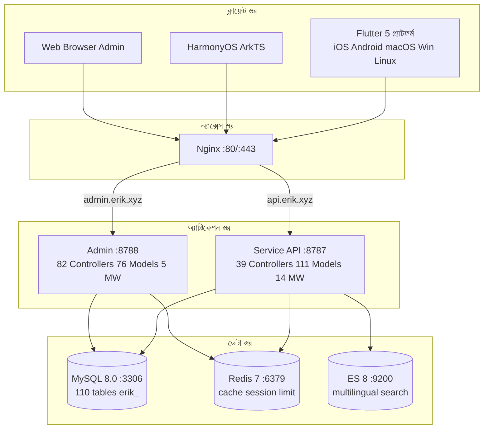
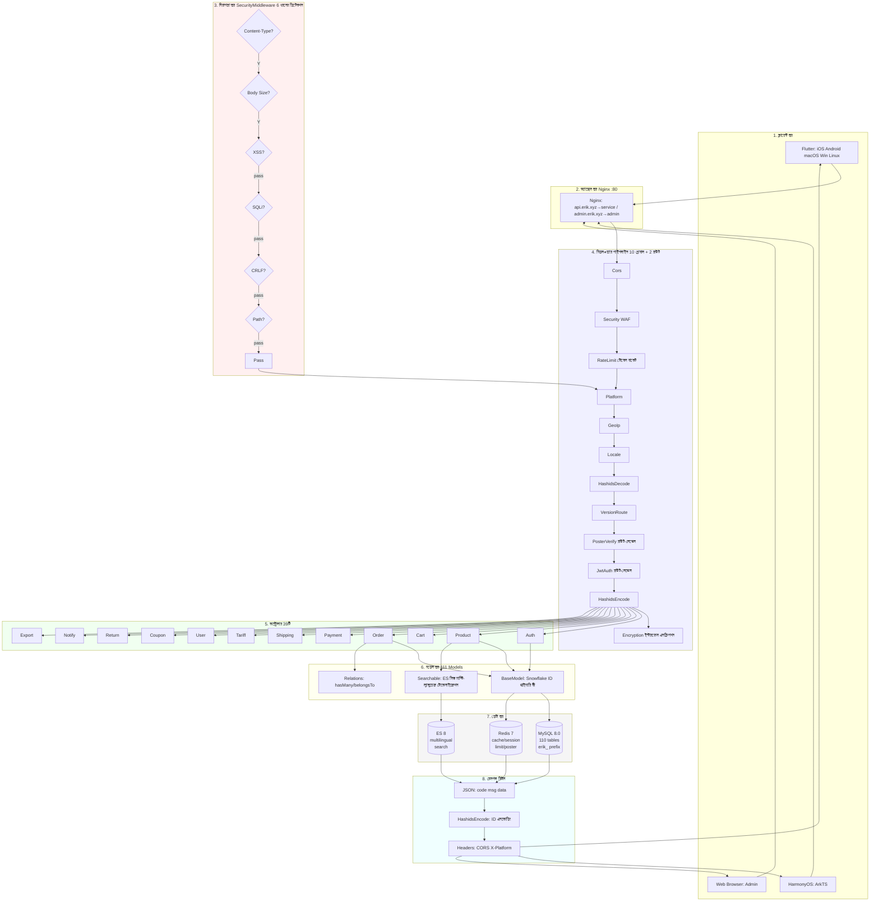
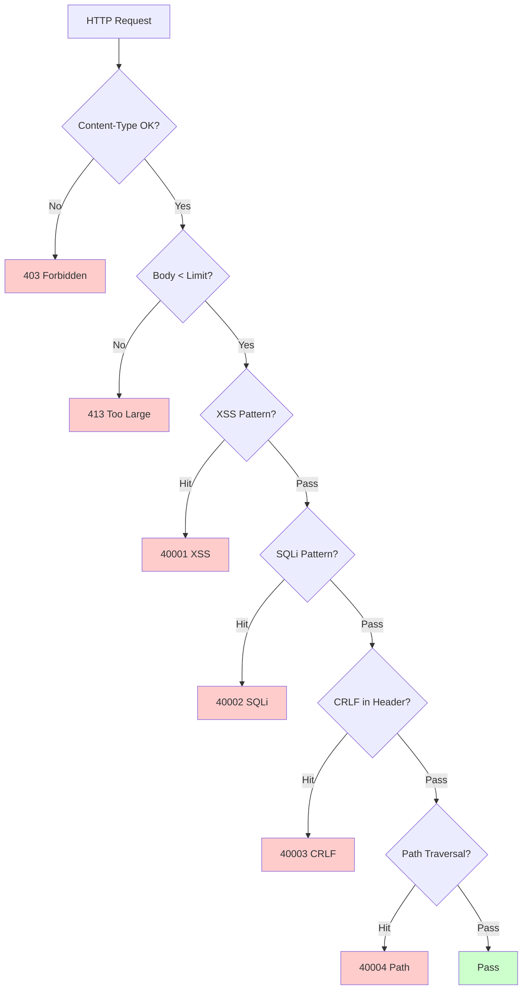
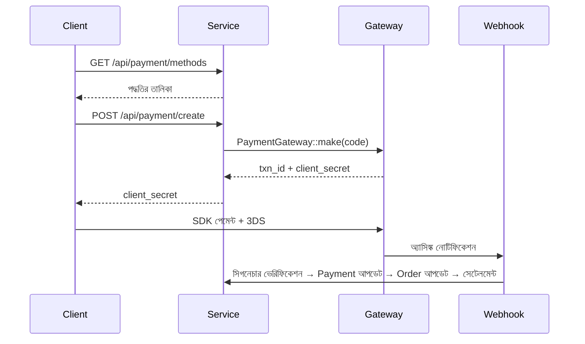
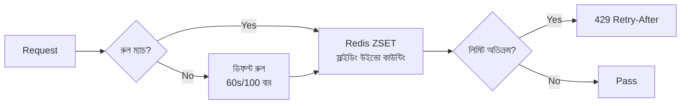

# ক্রস-বর্ডার ই-কমার্স প্ল্যাটফর্ম — আর্কিটেকচার ডিজাইন ডকুমেন্ট

> এই নথিটি মূল চীনা ডকুমেন্টেশনের মেশিন অনুবাদ। মূল: [চীনা মূল](../../architecture-full.md).

Copyright (c) 2026 erik <erik@erik.xyz> — https://erik.xyz

---

## 1. সিস্টেম ওভারভিউ

### 1.1 পজিশনিং

webman হাই-পারফরম্যান্স ফ্রেমওয়ার্কভিত্তিক ফুল-স্ট্যাক ক্রস-বর্ডার ই-কমার্স প্ল্যাটফর্ম, B2C, B2B, থার্ড-পার্টি সেলার অনবোর্ডিং সাপোর্ট করে।

| কম্পোনেন্ট | টেকনোলজি স্ট্যাক | স্কেল |
|------|--------|------|
| Service API | PHP 8.3 / webman 2.1 / illuminate database | 39 কন্ট্রোলার + 111 মডেল + 14 মিডলওয়্যার |
| Admin | webman-admin / LayUI / ECharts | 82 কন্ট্রোলার + 76 মডেল + 5 মিডলওয়্যার |
| Flutter | Riverpod / GoRouter / Dio | 25 Dart ফাইল / 11 পেজ |
| HarmonyOS | ArkTS / ArkUI | 14 ETS ফাইল / 9 পেজ |
| ডেটাবেস | MySQL 8.0 + Redis 7 + ES 8 | 117 টেবিল (110 `erik_` + 7 `wa_`) |

### 1.2 মূল মেট্রিক

| মেট্রিক | মান |
|------|-----|
| API P99 | <200ms |
| কনকারেন্সি | 10000+ (32 worker মেমরিতে স্থায়ী) |
| টেবিল সংখ্যা | 110 |
| এন্ডপয়েন্ট | 73 |
| মিডলওয়্যার | 14 (service: 10 গ্লোবাল + 2 রাউট + AdminKey + StaticFile / admin: 4 গ্লোবাল + 1 বিল্ট-ইন) |
| ভাষা | zh_CN, zh_HK, en, ja, ko |
| মুদ্রা | 19 প্রকারের আলাদা প্রাইসিং |
| পেমেন্ট | Stripe / PayPal / Klarna / Adyen |

---

## 2. সিস্টেম আর্কিটেকচার ডায়াগ্রাম



### 2.1 সম্পূর্ণ ডিজাইন ফ্লো ডায়াগ্রাম



**ফ্লো ডায়াগ্রাম বিবরণ:**

| স্তর | বিবরণ |
|----|------|
| 1. ক্লায়েন্ট স্তর | Flutter 5 প্ল্যাটফর্ম + HarmonyOS + Web Admin, সব HTTP/JSON দিয়ে যোগাযোগ করে |
| 2. অ্যাক্সেস স্তর | Nginx ডোমেইন অনুযায়ী ডিভার্ট: api→service, admin→admin |
| 3. নিরাপত্তা স্তর | SecurityMiddleware 31 ধরনের অ্যাটাক ডিটেক্টর, হিট হলে এরর কোড/403 রিটার্ন |
| 4. মিডলওয়্যার পাইপলাইন | 10 গ্লোবাল MW সিরিয়াল প্রসেসিং + 2 রাউট-লেভেল MW (PosterVerify সংবেদনশীল অপারেশন, JwtAuth অথেনটিকেশন ইন্টারফেস) |
| 5. কন্ট্রোলার স্তর | 39 API কন্ট্রোলার ফিচার অনুযায়ী গ্রুপ করা, সব বিজনেস লজিক হ্যান্ডল করে |
| 6. মডেল স্তর | 111 Eloquent মডেল, BaseModel Snowflake ID প্রাইমারি কী সরবরাহ করে, 45 মডেল টেবিল অনুযায়ী SoftDelete সক্রিয় |
| 7. ডেটা স্তর | MySQL (110 টেবিল erik_ প্রিফিক্স/snowflake প্রাইমারি কী) + Redis (ক্যাশ/Session/রেট লিমিট/Poster) + ES (মাল্টি-ল্যাঙ্গুয়েজ সার্চ) |
| 8. রেসপন্স রিটার্ন | JSON ইউনিফাইড ফরম্যাট → HashidsEncode দিয়ে ID এনকোড → Encryption এনক্রিপ্ট (X-Encrypt-Response) → ক্লায়েন্টে রিটার্ন |

### 2.2 প্রসেস মডেল

```
webman Master (:8787)
  ├── HTTP Worker x32 (CPU×4, মেমরিতে স্থায়ী, DB কানেকশন পুল)
  ├── Monitor Process (ফাইল মনিটরিং + মেমরি মনিটরিং)
  └── SnowflakeWorker (স্টার্টআপে Snowflake সিঙ্গলটন ইনিশিয়ালাইজ)
```

---

## 3. মিডলওয়্যার পাইপলাইন

### 3.1 Service API সম্পূর্ণ পাইপলাইন

```mermaid
graph LR
    A[HTTP Request] --> B[Cors]
    B --> C[Security<br/>অ্যাটাক ডিটেকশন]
    C --> D[Platform<br/>সোর্স আইডেন্টিফিকেশন]
    D --> E[GeoIp<br/>অঞ্চল আইডেন্টিফিকেশন]
    E --> F[Locale<br/>ভাষা]
    F --> G[HashidsDecode<br/>ID ডিকোড]
    G --> H[VersionRoute<br/>ভার্সন রাউটিং]
    H --> I{সংবেদনশীল অপারেশন?}
    I -->|Yes| J[PosterVerify<br/>হিউম্যান ভেরিফিকেশন]
    I -->|No| K{JWT প্রোটেকশন?}
    J --> K
    K -->|Yes| L[JwtAuth<br/>Token ভেরিফিকেশন]
    K -->|No| M[HashidsEncode<br/>ID এনকোডিং]
    L --> M
    M --> N[Controller]
    N --> O[HTTP Response]
    style C fill:#fcc
    style J fill:#ffc
    style L fill:#cfc
```



### 3.2 Service মিডলওয়্যার বিবরণ

| # | মিডলওয়্যার | টাইপ | ফাংশন |
|---|--------|------|------|
| 1 | Cors | গ্লোবাল | Access-Control-* রেসপন্স হেডার, OPTIONS প্রিফ্লাইট 200 রিটার্ন |
| 2 | SecurityMiddleware | গ্লোবাল | XSS/SQL ইনজেকশন/CRLF/পাথ ট্রাভার্সাল/Content-Type/রিকোয়েস্ট বডি 10MB |
| 3 | RateLimitMiddleware | গ্লোবাল | টোকেন বাকেট রেট লিমিট (Redis ZSET স্লাইডিং উইন্ডো, 6 এন্ডপয়েন্ট রুল) |
| 4 | PlatformMiddleware | গ্লোবাল | X-Platform header + UA ডিগ্রেডেশন দিয়ে 8 প্ল্যাটফর্ম আইডেন্টিফিকেশন |
| 5 | GeoIpMiddleware | গ্লোবাল | MaxMind GeoIP2 দিয়ে নন-লগইন ইউজারের অঞ্চল/মুদ্রা/ভাষা আইডেন্টিফিকেশন |
| 6 | LocaleMiddleware | গ্লোবাল | Accept-Language পার্সিং, 5 ভাষা সুনির্দিষ্ট ম্যাচ→ডিগ্রেডেশন→ডিফল্ট |
| 7 | HashidsDecode | গ্লোবাল | URL/Body-এর `*_id` ফিল্ড hashid→snowflake ID |
| 8 | VersionRoute | গ্লোবাল | API-Version header→কন্ট্রোলার নেমস্পেস (v1/v2) ম্যাপিং |
| 9 | PosterVerify | রাউট | রেজিস্ট্রেশন/অর্ডার/পেমেন্ট Redis token ভেরিফিকেশন |
| 10 | JwtAuth | রাউট | Bearer Token HS256 সিগনেচার + মেয়াদোত্তীর্ণতা + userId ইনজেকশন |
| 11 | HashidsEncode | গ্লোবাল | রেসপন্স JSON রিকার্সিভ ট্রাভার্সাল, snowflake ID→hashid |
| 12 | EncryptionMiddleware | রাউট | ইন্টারফেস AES এনক্রিপশন/ডিক্রিপশন (X-Encrypt-Response/X-Encrypted) |
| 13 | AdminKeyMiddleware | রাউট | ইন্টারনাল ম্যানেজমেন্ট অপারেশন কী ভেরিফিকেশন |
| 14 | StaticFile | গ্লোবাল | webman স্ট্যাটিক রিসোর্স সার্ভিস |

### 3.3 Admin পাইপলাইন

```
রিকোয়েস্ট → SecurityMiddleware → PlatformMiddleware → HashidsDecode
     → webman-admin AccessControl(বিল্ট-ইন RBAC) → HashidsEncode → কন্ট্রোলার
```

| # | Admin মিডলওয়্যার | ফাংশন |
|---|------------|------|
| 1 | SecurityMiddleware | XSS/SQL ইনজেকশন/CRLF/পাথ ট্রাভার্সাল/Content-Type/20MB |
| 2 | PlatformMiddleware | X-Platform + UA 8 প্ল্যাটফর্ম আইডেন্টিফিকেশন |
| 3 | HashidsDecode | রিকোয়েস্ট hashid→snowflake ID |
| - | AccessControl(বিল্ট-ইন) | অ্যাডমিন রোল পারমিশন ভেরিফিকেশন |
| 4 | HashidsEncode | রেসপন্স snowflake ID→hashid |

---

## 4. নিরাপত্তা আর্কিটেকচার

### 4.1 অ্যাটাক ডিটেকশন পাইপলাইন (SecurityMiddleware)



### 4.2 SecurityMiddleware অ্যাটাক ডিটেকশন রুল বিবরণ (15 ধরনের কাস্টম)

| # | অ্যাটাক টাইপ | মূল ডিটেকশন পদ্ধতি | Service | Admin | এরর কোড |
|---|---------|------------|---------|-------|--------|
| 1 | XSS ক্রস-সাইট স্ক্রিপ্টিং | 13 রেজেক্স: script/iframe/on ইভেন্ট/svg+on/style/expression/javascript:/embed/object/link/meta | ✅ | ✅ | 40001 |
| 2 | SQL ইনজেকশন | 13 রেজেক্স: UNION SELECT/SELECT FROM WHERE/sleep/benchmark/pg_sleep/বুলিয়ান টাইপ/স্ট্রিং টাইপ/কমেন্ট চিহ্ন/MySQL বিশেষ কমেন্ট/schema এনুমারেশন/load_file/into outfile/স্টোরড প্রোসিডিউর/waitfor/delay | ✅ | ✅ | 40002 |
| 3 | CRLF Header ইনজেকশন | `[\r\n]` in: Authorization/X-Platform/API-Version/X-Forwarded-For/Referer/Origin | ✅ | ✅ | 40003 |
| 4 | পাথ ট্রাভার্সাল | `../` + `%2e%2f` এনকোডিং + `%252e%252f` ডাবল এনকোডিং + null byte `\0` + `.env`/`.git`/`phpmyadmin`/`wp-admin`/`/etc/`/`/proc/`/`composer.json` | ✅ | ✅ | 40004 |
| 5 | রিকোয়েস্ট বডি লিমিট | Content-Length > 10MB (Service) / 20MB (Admin) | ✅ | ✅ | 40005 |
| 6 | Content-Type | শুধুমাত্র JSON/form-data/form-urlencoded | ✅ | ✅ | 40006 |
| 7 | ফাইল আপলোড ভ্যালিডেশন | ব্ল্যাকলিস্ট এক্সটেনশন (php/phtml/sh/exe/js/...) + ডাবল এক্সটেনশন + খালি এক্সটেনশন | ✅ | ✅ | 40009 |
| 8 | HTTP সিকিউরিটি রেসপন্স হেডার | nosniff/DENY/XSS-Protection/Referrer-Policy/Permissions-Policy/Cache-Control/Server লুকানো | ✅ | ✅ | — |
| 9 | ব্রুট-ফোর্স প্রতিরক্ষা | Redis কাউন্টার: API 10 বার/60s, Admin 5 বার/300s | ✅ | ✅ | 40008 |
| 10 | XXE এন্টিটি ইনজেকশন | `<!ENTITY SYSTEM>`, `<!DOCTYPE [` | ✅ | ✅ | 40010 |
| 11 | SSRF সার্ভার-সাইড ফোরজারি | ইন্টারনাল IP (127/10/172.16/192.168/0.0/169.254.169.254) + localhost + metadata.google.internal | ✅ | ✅ | 40011 |
| 12 | HTTP মেথড ভ্যালিডেশন | শুধুমাত্র GET/POST/PUT/DELETE/PATCH/OPTIONS/HEAD | ✅ | ✅ | 40012 |
| 13 | Host হেডার ভ্যালিডেশন | বেয়ার IP ডাইরেক্ট অ্যাক্সেস নিষিদ্ধ | ✅ | — | 40013 |
| 14 | সংবেদনশীল ডেটা ডেসেনসিটাইজেশন | লগ/এরর রেসপন্স থেকে password/token/secret ফিল্টার | ✅ | ✅ | — |
| 15 | CORS হোয়াইটলিস্ট | কনফিগারযোগ্য origin সীমাবদ্ধতা | ⚠️ | ⚠️ | — |

### 4.3 অথেনটিকেশন ফ্লো

```
রেজিস্ট্রেশন: email+password → PosterVerify(হিউম্যান ভেরিফিকেশন) → bcrypt(password+salt)
     → Snowflake দিয়ে ID তৈরি → JWT রিটার্ন

লগইন: email+password → password_verify(password+salt, bcrypt_hash)
     → last_login_at/ip/platform আপডেট → JWT ইস্যু

রিকোয়েস্ট: Authorization: Bearer <token>
     → JwtAuth → Jwt::decode → HS256 সিগনেচার + মেয়াদোত্তীর্ণতা → request->userId ইনজেকশন

রিফ্রেশ: POST /api/auth/refresh {refresh_token} → Jwt::decode → নতুন access_token
```

### 4.4 ডেটা সিকিউরিটি (তিন স্তরের এনক্রিপশন)

| স্তর | প্রযুক্তি | প্যাকেজ | ফিল্ড |
|------|------|-----|------|
| ট্রান্সপোর্ট স্তর | AES-256-CBC | erikwang2013/encryption | POST body সংবেদনশীল ফিল্ড |
| ডেটাবেস স্তর | Encryptable trait | erikwang2013/encryptable (Maize) | email, mobile, name, phone, detail, tax_id |
| ID অবফাসকেশন | Hashids এনকোডিং | erikwang2013/hashids | ইন্টারফেস স্তরের সব snowflake ID |

### 4.5 প্ল্যাটফর্ম সোর্স ট্র্যাকিং

| প্ল্যাটফর্ম | আইডেন্টিফিকেশন পদ্ধতি | Header মান |
|------|---------|---------|
| iOS | Flutter `Platform.isIOS` + `TargetPlatform.iOS` | `ios` |
| iPadOS | Flutter `Platform.isIOS` + `!TargetPlatform.iOS` | `ipados` |
| macOS | Flutter `Platform.isMacOS` / UA `Macintosh` | `macos` |
| Windows | Flutter `Platform.isWindows` / UA `Windows` | `windows` |
| Linux | Flutter `Platform.isLinux` / UA `Linux` | `linux` |
| Android | Flutter `Platform.isAndroid` / UA `Android` | `android` |
| HarmonyOS | ArkTS হার্ডকোড / UA `HarmonyOS` | `harmonyos` |
| Web | UA ম্যাচ নেই / ডিফল্ট মান | `web` |

রেকর্ড টেবিল: `erik_orders.platform`, `erik_payments.platform`, `erik_operation_logs.platform`, `erik_users.last_login_platform`, `erik_search_logs.platform`, `erik_chat_messages.platform`

---

## 5. ডেটা আর্কিটেকচার

### 5.1 প্রাইমারি কী স্ট্র্যাটেজি

```
Snowflake 64bit: [1bit|42bit টাইমস্ট্যাম্প|5bitDC|5bitWID|12bit সিকোয়েন্স]
- গ্লোবালি ইউনিক / ট্রেন্ডিং ইনক্রিমেন্টাল / নন-অটো-ইনক্রিমেন্ট
- PHP $keyType='string' (ওভারফ্লো প্রতিরোধ)
- Service worker_id=1, Admin worker_id=2
- জেনারেশন: Snowflake::nextId()
```

### 5.2 মডেল ইনহেরিটেন্স

```
Illuminate\Database\Eloquent\Model
  └── app\model\BaseModel
        ├── $incrementing=false, $keyType='string', $guarded=[]
        ├── boot(): Snowflake::nextId()
        └── 110 বিজনেস মডেল
              ├── 45টি use SoftDeletes (deleted_at কলাম থাকা টেবিলের জন্য)
              ├── কিছু use Encryptable (সংবেদনশীল ফিল্ড: email/mobile/name ইত্যাদি)
              ├── use Searchable (Product→ES)
              └── hasMany/belongsTo অ্যাসোসিয়েশন
```

### 5.3 মাল্টি-ল্যাঙ্গুয়েজ/মাল্টি-কারেন্সি

- **ট্রান্সলেশন**: `erik_product_translations(product_id,locale)` আলাদা টেবিল, locale অনুযায়ী কুয়েরি
- **প্রাইসিং**: `erik_product_sku_prices(sku_id,currency_code)` কারেন্সি অনুযায়ী আলাদা প্রাইস

---

## 6. পেমেন্ট আর্কিটেকচার



```
PaymentGatewayInterface
  ├── createPayment(data): array
  ├── capturePayment(txnId): array
  ├── refundPayment(txnId, amount): array
  └── verifyWebhook(payload, sig): bool
```

---

## 7. হাই কনকারেন্সি আর্কিটেকচার

### 7.1 রেট লিমিট স্ট্র্যাটেজি (RateLimitMiddleware)



| এন্ডপয়েন্ট | উইন্ডো | সীমা | বিবরণ |
|------|------|------|------|
| /api/auth/login | 60s | 10 বার | ক্রেডেনশিয়াল স্টাফিং প্রতিরোধ |
| /api/auth/register | 300s | 5 বার | ব্যাচ রেজিস্ট্রেশন প্রতিরোধ |
| /api/payment | 60s | 5 বার | কার্ড ফ্রড প্রতিরোধ |
| /api/orders | 10s | 3 বার | স্প্যাম অর্ডার প্রতিরোধ |
| /api/search | 1s | 10 বার | ক্রলার প্রতিরোধ |
| ডিফল্ট | 60s | 100 বার | সাধারণ API |

### 7.2 Redis-এর ব্যবহার

Redis রেট লিমিট টোকেন বাকেট, হিউম্যান ভেরিফিকেশন কোড ও Session স্টোরেজে ব্যবহৃত হয় (মিডলওয়্যার স্তর); বিজনেস ডেটা অ্যাপ্লিকেশন-লেভেল ক্যাশ করা হয় না, সরাসরি MySQL থেকে পড়া হয় (রিড-রাইট সেপারেশন + কানেকশন পুল)।

### 7.4 কানেকশন পুল অপটিমাইজেশন

| রিসোর্স | সর্বোচ্চ সংযোগ | সর্বনিম্ন সংযোগ | ওয়েট টাইমআউট | আইডল টাইমআউট | হার্টবিট |
|------|---------|---------|---------|---------|------|
| MySQL | 50 | 10 | 2s | 60s | 45s |
| Redis | 30 | 5 | — | 60s | — |

### 7.5 ধীর অপারেশন হ্যান্ডলিং

| অপারেশন | বাস্তবায়ন |
|------|------|
| এক্সচেঞ্জ রেট আপডেট | ExchangeRateCron (প্রতি ঘণ্টা, বাহ্যিক API) |
| Feed সিঙ্ক | ProductFeedCron (প্রতি 6 ঘণ্টায় TSV জেনারেট ও লগ) |
| রেকমেন্ডেশন ক্যালকুলেশন | RecommendationCron (দৈনিক, ক্রয় কো-অকারেন্স) |
| পেমেন্ট রিকনসিলিয়েশন | PaymentReconcileCron (প্রতি 6 ঘণ্টা, Stripe/PayPal) |
| সেটেলমেন্ট | SettlementCron (দৈনিক) |
| লজিস্টিক ট্র্যাকিং | ShipmentTrackingCron (প্রতি 30 মিনিট, API কনফিগ প্রয়োজন) |
| প্ল্যাটফর্ম অর্ডার সিঙ্ক | PlatformOrderSyncCron (প্রতি 5 মিনিট, API কনফিগ প্রয়োজন) |
| রিটার্ন টাইমআউট | ReturnExpireCron (প্রতি ঘণ্টা) |
| প্রাইস ড্রপ/স্টক অ্যালার্ট | PriceAlertCron (প্রতি 10 মিনিট) |
| কমপ্লায়েন্স রুল আপডেট | ComplianceCron (দৈনিক, API কনফিগ প্রয়োজন) |

## 8. ডিপ্লয়মেন্ট আর্কিটেকচার

```
docker-compose.yml:
  nginx (alpine) :80 :443
  service (php:8.3) :8787 internal, 32 workers
  admin (php:8.3) :8788 internal
  mysql (8.0) :3306 / redis (7) :6379 / es (8) :9200
নেটওয়ার্ক: erik-net bridge | ডেটা ভলিউম পারসিস্টেন্স
রাউটিং: api.erik.xyz→service | admin.erik.xyz→admin
```

---


## 9. ইন্টারন্যাশনালাইজেশন (i18n)

| স্তর | বাস্তবায়ন |
|------|------|
| Service | LocaleMiddleware + 5 ভাষার ট্রান্সলেশন ফাইল (45 key/ভাষা) |
| Admin | 5 ভাষার ট্রান্সলেশন ফাইল |
| Flutter | AppLocalizations + Riverpod Provider |
| API | Accept-Language header স্বয়ংক্রিয় ইনজেকশন |

## 10. API ডকুমেন্টেশন (hg/apidoc)

| কম্পোনেন্ট | বিবরণ |
|------|------|
| প্যাকেজ | hg/apidoc v5.3 |
| কনফিগ | config/plugin/hg/apidoc/app.php (6 গ্রুপ) |
| অ্যানোটেশন | @Apidoc\Title/Desc/Method/Url/Param/Returned |
| অ্যাক্সেস | http://localhost:8787/apidoc/ |

## 11. টেস্ট

```bash
cd service && php vendor/bin/phpunit tests/
```

| টেস্ট ক্লাস | Tests | কভারেজ |
|--------|-------|------|
| SecurityTest | 12 | XSS+SQLi+XXE+SSRF+Path |
| JwtTest | 4 | encode/decode/invalid |
| ApiResponseTest | 3 | success/fail/paginate |
| RedisFacadeTest | 3 | ping/set/get/redis() |
| **Total** | **22** | **45 assertions PASS** |

---

## 12. প্রজেক্ট পরিসংখ্যান

| মাত্রা | সংখ্যা |
|------|------|
| PHP সোর্স ফাইল | service:210 + admin:214 = 424 |
| Dart (Flutter) | 25 |
| ArkTS (HarmonyOS) | 14 |
| ডেটাবেস টেবিল | 110 |
| API এন্ডপয়েন্ট | 73 |
| মিডলওয়্যার | 14 |
| টুল ক্লাস | 8 |
| শিডিউলড টাস্ক | 12 |
| কনফিগ আইটেম | 35+ |
| টেস্ট | 22 tests, 45 assertions |
| Skills | 38 |
| ডকুমেন্ট | 9 |
| **মোট** | **~700** |
