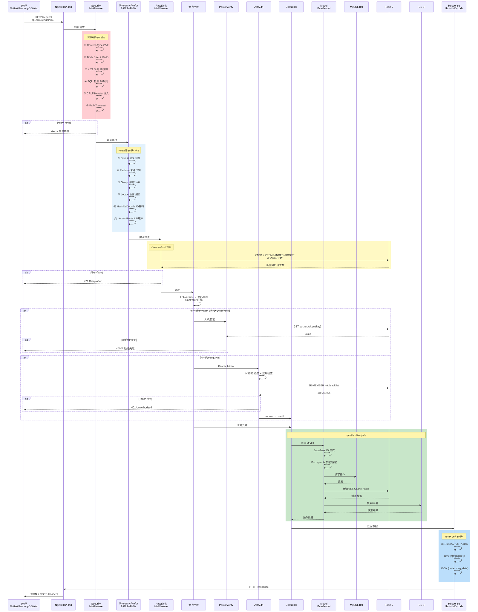

# ক্রস-বর্ডার ই-কমার্স প্ল্যাটফর্ম — আর্কিটেকচার ডায়াগ্রাম সেট

> এই নথিটি মূল চীনা ডকুমেন্টেশনের মেশিন অনুবাদ। মূল: [চীনা মূল](../../diagrams.md).

Copyright (c) 2026 erik <erik@erik.xyz> — https://erik.xyz

---

## ১. সিস্টেম আর্কিটেকচার ডায়াগ্রাম

---

## ২. রিকোয়েস্ট প্রসেসিং ফ্লো ডায়াগ্রাম (মিডলওয়্যার পাইপলাইন)

---

## ৩. ফিচার মডিউল প্যানোরামা ডায়াগ্রাম

---

## ৪. রিকোয়েস্ট লাইফসাইকেল ডায়াগ্রাম

---

## ৫. অর্ডার লাইফসাইকেল ডায়াগ্রাম

---

## ৬. ডিপ্লয়মেন্ট আর্কিটেকচার ডায়াগ্রাম

---

## ৭. নিরাপত্তা আর্কিটেকচার ডায়াগ্রাম

### নিরাপত্তা প্রতিরক্ষা ওভারভিউ

| স্তর | প্রতিরক্ষা লাইন | প্রযুক্তি/প্যাকেজ | কভারেজ পরিধি |
|------|------|---------|---------|
| প্রথম স্তর | নেটওয়ার্ক বাউন্ডারি | Nginx SSL + রিভার্স প্রক্সি + Host ভ্যালিডেশন | Service + Admin |
| দ্বিতীয় স্তর | WAF অ্যাটাক ডিটেকশন | `erikwang2013/security-php` 31 ডিটেক্টর | XSS/SQLi/CRLF/পাথ ট্রাভার্সাল/XXE/SSRF/ফাইল আপলোড/মেথড/Host/Content-Type/Body ইত্যাদি |
| তৃতীয় স্তর | ট্রাফিক কন্ট্রোল + ডিপেন্ডেন্সি রেজিলিয়েন্স | RateLimitMiddleware + ব্রুট ফোর্স Redis কাউন্টার + CircuitBreaker | টোকেন বাকেট রেট লিমিট (6 এন্ডপয়েন্ট) + লগইন/রেজিস্ট্রেশন অ্যান্টি-ব্রুট ফোর্স + পেমেন্ট/সোশ্যাল লগইন সার্কিট ব্রেকার (5টি ব্যর্থতা → 30s, হাফ-ওপেন রিকভারি) |
| চতুর্থ স্তর | আইডেন্টিটি অথেনটিকেশন | PosterVerify + JwtAuth HS256 | হিউম্যান ভেরিফিকেশন (স্লাইডার/পাজল/ক্লিক) + Bearer Token + ডুয়াল-টোকেন রিফ্রেশ |
| পঞ্চম স্তর | ডেটা সিকিউরিটি | Hashids + AES-256-CBC + Encryptable | তিন স্তরের এনক্রিপশন: ID অবফাসকেশন/ট্রান্সপোর্ট এনক্রিপশন/ডেটাবেস ফিল্ড এনক্রিপশন |
| ষষ্ঠ স্তর | রেসপন্স সিকিউরিটি | HTTP সিকিউরিটি হেডার + সংবেদনশীল ডেটা ডেসেনসিটাইজেশন | nosniff/DENY/XSS-Protection/Referrer-Policy/লগ ডেসেনসিটাইজেশন |
| অবিরত | অডিট ট্রেসেবিলিটি | PlatformMiddleware + OperationLogs | 8 প্ল্যাটফর্ম সোর্স ট্র্যাকিং + 6 টেবিলে রেকর্ড + অপারেশন লগ |

---

## ৮. মাল্টি-কারেন্সি সেটেলমেন্ট ফ্লো ডায়াগ্রাম

### মাল্টি-কারেন্সি সেটেলমেন্ট বিবরণ

**মাল্টি-কারেন্সি প্রাইসিং**: প্রোডাক্ট SKU `currency_code` অনুযায়ী কারেন্সি-ভিত্তিক প্রাইসিং করে, অর্ডার দেওয়ার সময় রিসিভিং কারেন্সি লক হয় (USD / EUR / GBP / CNY ইত্যাদি)।

**এক্সচেঞ্জ রেট সার্ভিস**: `erik_exchange_rates` রেট টেবিল manual ম্যানুয়াল মেইনটেনেন্স ও exchangerate-api অটো ফেচ সাপোর্ট করে, `effective_at` কার্যকর সময় অনুযায়ী ভার্সনিং হয়, সেটেলমেন্টের সময় পেমেন্ট মোমেন্টের রেট স্ন্যাপশট নেওয়া হয়।

**অরিজিনাল কারেন্সি চার্জ**: Stripe / PayPal / Klarna / Adyen অর্ডার কারেন্সিতে অরিজিনাল কারেন্সি চার্জ করে, Webhook সিগনেচার ভেরিফিকেশনে পেমেন্ট নিশ্চিত হলে পেমেন্ট ও অর্ডার স্ট্যাটাস আপডেট হয়।

**সেটেলমেন্ট বিভাজন**: পেমেন্ট সফল হলে স্বয়ংক্রিয়ভাবে `PlatformSettlements` প্ল্যাটফর্ম সেটেলমেন্ট তৈরি হয় (অর্ডার টোটাল + প্ল্যাটফর্ম কমিশন + পেমেন্ট গেটওয়ে ফি, অর্ডার কারেন্সিতে হিসাব); সেলার সেটেলমেন্ট `MerchantSettlements` (অর্ডার অ্যামাউন্ট → কমিশন রেট → সেটেলমেন্ট অ্যামাউন্ট), সাপ্লায়ার সেটেলমেন্ট `SupplierSettlements`, অ্যাফিলিয়েট কমিশন উইথড্রয়াল `AffiliatePayouts` — চারটি স্বাধীন সেটেলমেন্ট লাইন, স্ট্যাটাস 0 মুলতুবি / 1 সেটেল্ড।

**ফরেক্স গেইন/লস**: `CurrencyExchangeGainsLosses` রিসিভিং কারেন্সি ও সেটেলমেন্ট কারেন্সির পার্থক্য ট্র্যাক করে, পেমেন্টের রেট ও সেটেলমেন্টের রেট তুলনা করে, পজিটিভ = ফরেক্স গেইন, নেগেটিভ = ফরেক্স লস — ক্রস-বর্ডার ই-কমার্স মাল্টি-কারেন্সি রিকনসিলিয়েশন ও অডিট সাপোর্ট করে।

---

## ডায়াগ্রাম সূচক

| নম্বর | ডায়াগ্রাম নাম | টাইপ | উদ্দেশ্য |
|------|------|------|------|
| ১ | সিস্টেম আর্কিটেকচার ডায়াগ্রাম | আর্কিটেকচার ডায়াগ্রাম | সিস্টেমের সম্পূর্ণ চিত্র: ক্লায়েন্ট→অ্যাক্সেস→অ্যাপ্লিকেশন→ডেটা→বাহ্যিক সার্ভিস |
| ২ | রিকোয়েস্ট প্রসেসিং ফ্লো ডায়াগ্রাম | ফ্লো ডায়াগ্রাম | HTTP রিকোয়েস্ট 12 স্তরের মিডলওয়্যার পাইপলাইন (10 গ্লোবাল + 2 রাউট) পেরিয়ে যাওয়ার সম্পূর্ণ পথ |
| ৩ | ফিচার মডিউল প্যানোরামা ডায়াগ্রাম | ফিচার ডায়াগ্রাম | 17 টি বড় ফিচার মডিউল ও তাদের বিস্তারিত ফিচার পয়েন্ট |
| ৪ | রিকোয়েস্ট লাইফসাইকেল ডায়াগ্রাম | লাইফসাইকেল | রিকোয়েস্ট থেকে রেসপন্স পর্যন্ত সম্পূর্ণ সিকোয়েন্স ও প্রতিটি ধাপের ইন্টারঅ্যাকশন |
| ৫ | অর্ডার লাইফসাইকেল ডায়াগ্রাম | লাইফসাইকেল | কার্ট থেকে সম্পন্ন/রিফান্ড পর্যন্ত অর্ডারের সব স্ট্যাটাস ট্রানজিশন |
| ৬ | ডিপ্লয়মেন্ট আর্কিটেকচার ডায়াগ্রাম | আর্কিটেকচার ডায়াগ্রাম | CDN এজ, Docker Compose কনটেইনার অর্কেস্ট্রেশন, নেটওয়ার্ক, ডেটা ভলিউম (স্থায়ী আপলোড ভলিউম admin_uploads / service_public সহ) |
| ৭ | নিরাপত্তা আর্কিটেকচার ডায়াগ্রাম | আর্কিটেকচার ডায়াগ্রাম | 6 স্তরের ডিফেন্স-ইন-ডেপথ সিস্টেম: বাউন্ডারি→WAF→ট্রাফিক/রেজিলিয়েন্স (রেট লিমিট + সার্কিট ব্রেকার)→অথেনটিকেশন→ডেটা→রেসপন্স |
| ৮ | মাল্টি-কারেন্সি সেটেলমেন্ট ফ্লো ডায়াগ্রাম | ফ্লো ডায়াগ্রাম | কারেন্সি-ভিত্তিক প্রাইসিং→পেমেন্ট→সেটেলমেন্ট→ফরেক্স গেইন/লস সম্পূর্ণ চেইন |
