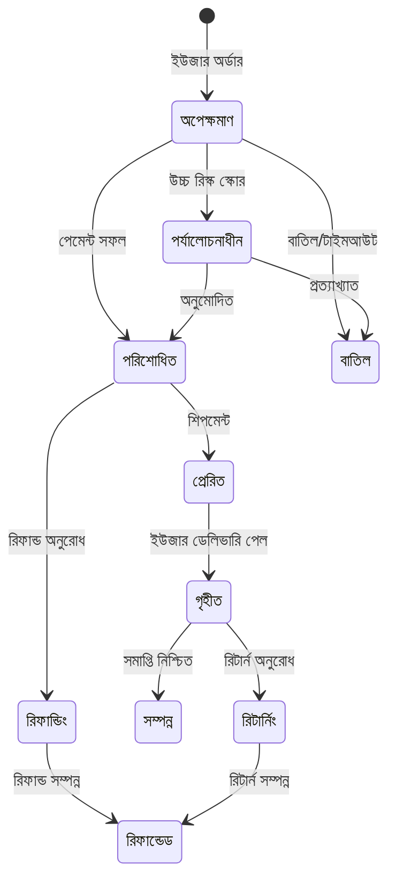
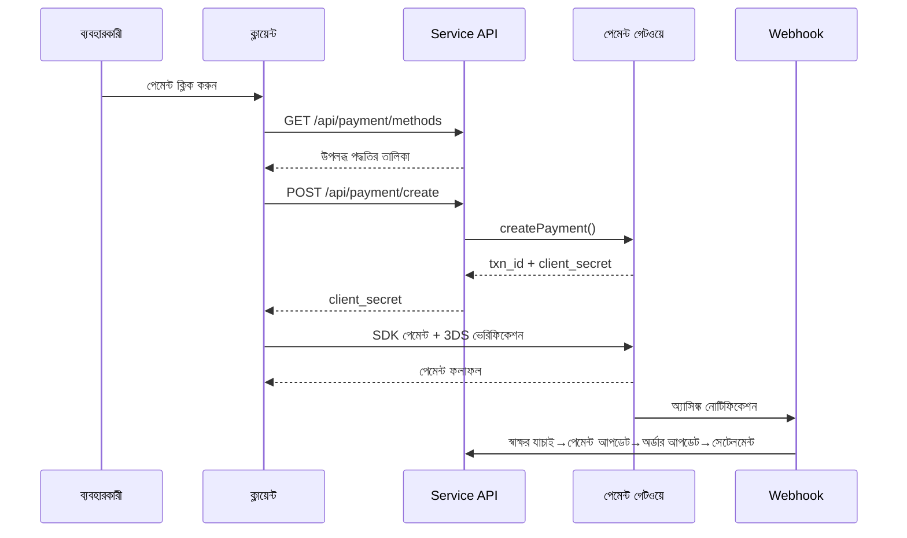
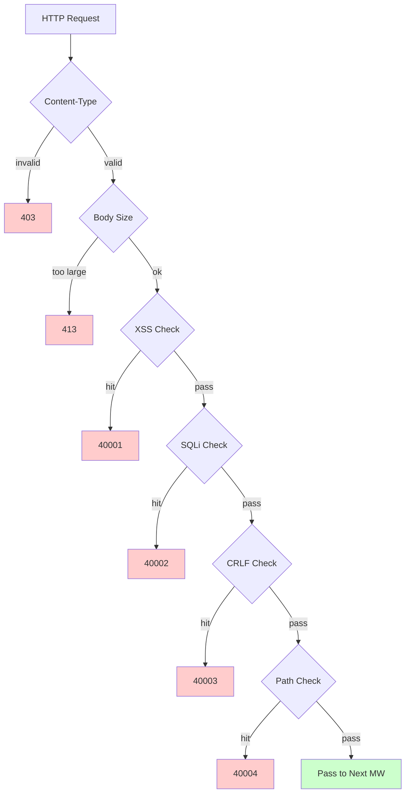

# ক্রস-বর্ডার ই-কমার্স প্ল্যাটফর্ম — ফিচার ডিজাইন ডকুমেন্ট

> এই নথিটি মূল চীনা ডকুমেন্টেশনের মেশিন অনুবাদ। মূল: [চীনা মূল](../../features.md).

Copyright (c) 2026 erik <erik@erik.xyz> — https://erik.xyz

---


## প্ল্যাটফর্ম ট্র্যাকিং

### 8 প্ল্যাটফর্ম আইডেন্টিফিকেশন

| প্ল্যাটফর্ম | Header | Flutter | Admin |
|------|--------|---------|-------|
| iOS | `ios` | Platform.isIOS + TargetPlatform.iOS | UA iPhone |
| iPadOS | `ipados` | Platform.isIOS + !TargetPlatform.iOS | UA iPad |
| macOS | `macos` | Platform.isMacOS | UA Macintosh |
| Windows | `windows` | Platform.isWindows | UA Windows |
| Linux | `linux` | Platform.isLinux | UA Linux |
| Android | `android` | Platform.isAndroid | UA Android |
| HarmonyOS | `harmonyos` | — | UA HarmonyOS |
| Web | `web` | kIsWeb | ডিফল্ট |

### DB ট্র্যাকিং ফিল্ড

| টেবিল | ফিল্ড | বিবরণ |
|----|------|------|
| erik_orders | platform VARCHAR(16) | অর্ডার দেওয়ার প্ল্যাটফর্ম |
| erik_payments | platform VARCHAR(16) | পেমেন্ট প্ল্যাটফর্ম |
| erik_operation_logs | platform VARCHAR(16) | অপারেশন প্ল্যাটফর্ম |
| erik_users | last_login_platform VARCHAR(16) | লগইন প্ল্যাটফর্ম |
| erik_search_logs | platform VARCHAR(16) | সার্চ প্ল্যাটফর্ম |
| erik_chat_messages | platform VARCHAR(16) | মেসেজ উৎস |

## 1. ফিচার ওভারভিউ

### 1.0 কভারেজ ওভারভিউ

| মাত্রা | কভারেজ কনটেন্ট | গভীরতা |
|------|---------|------|
| **B2C রিটেইল** | মাল্টি-ল্যাঙ্গুয়েজ প্রোডাক্ট, কারেন্সি-ভিত্তিক প্রাইসিং, SKU, কার্ট, অর্ডার, পেমেন্ট (Stripe/PayPal/Klarna), রিফান্ড, রিটার্ন | সম্পূর্ণ |
| **B2B হোলসেল** | লেয়ার্ড প্রাইসিং (MOQ), এন্টারপ্রাইজ ভেরিফিকেশন (ট্যাক্স নম্বর/বিজনেস লাইসেন্স), কোয়োট | সম্পূর্ণ |
| **মাল্টি-মার্চেন্ট অনবোর্ডিং** | সেলার রিভিউ, প্রোডাক্ট রিভিউ, কমিশন ও সেটেলমেন্ট | সম্পূর্ণ |
| **ক্রস-বর্ডার কমপ্লায়েন্স** | HS Code কোড লাইব্রেরি (6 ডিজিট বেস কোড), শুল্ক রুল (গন্তব্য দেশ + HS→ট্যাক্স রেট), VAT/IOSS, কমপ্লায়েন্স লেবেল (FDA/CE/RoHS সহ 10 ক্যাটাগরি) | সম্পূর্ণ |
| **ইন্টারন্যাশনাল লজিস্টিক** | লজিস্টিক জোন ফ্রেট (ওজন লেয়ারিং), DHL/UPS/FedEx/EMS, ওভারসিজ ওয়ারহাউস (শিপমেন্ট + রিটার্ন), HS ডিক্লারেশন (ব্যাটারি/লিকুইড লেবেল), কমার্শিয়াল ইনভয়েস PDF/প্যাকিং লিস্ট | সম্পূর্ণ |
| **পেমেন্ট** | Stripe PaymentIntent+3DS, PayPal REST, Klarna BNPL, Adyen, Webhook সিগনেচার ভেরিফিকেশন + সেটেলমেন্ট | Stripe সম্পূর্ণ, অন্যগুলো প্লেসহোল্ডার |
| **মার্কেটিং** | কুপন (জোন + নতুন/পুরনো কাস্টমার সীমাবদ্ধতা), ব্যানার (অঞ্চলভিত্তিক দৃশ্যমানতা), ফ্ল্যাশ সেল (সময় ও পরিমাণ সীমিত), গ্রুপ বাই (মিনিমাম সদস্য + ভ্যালিডিটি), অ্যাফিলিয়েট (লিংক + কমিশন + উইথড্রয়াল) | সম্পূর্ণ |
| **মাল্টি-প্ল্যাটফর্ম** | Amazon/eBay/Shopee/Lazada/Temu প্রোডাক্ট লিস্টিং + অর্ডার অ্যাগ্রিগেশন, মাল্টি-স্টোর ম্যানেজমেন্ট | সম্পূর্ণ |
| **সাপ্লাই চেইন** | সাপ্লায়ার প্রোফাইল + রেটিং, প্রকিউরমেন্ট অর্ডার (রিভিউ→শিপ→রিসিভ→কোয়ালিটি চেক), কোয়ালিটি চেক (ইনবাউন্ড+আউটবাউন্ড গেট/চেহারা/ফাংশন/কমপ্লায়েন্স লেবেল চেক), ইনভেন্টরি লেজার (ইমিউটেবল অ্যাকাউন্টিং: ইনবাউন্ড/আউটবাউন্ড/ট্রান্সফার/কাউন্টিং) | সম্পূর্ণ |
| **রিস্ক ও কমপ্লায়েন্স** | রুল ইঞ্জিন (বাইপাস স্কোরিং: ঠিকানা ভেরিফিকেশন/পোস্টাল কোড ম্যাচ/3DS/ব্যাচ রেজিস্ট্রেশন/মূল্য অস্বাভাবিকতা), KYC রিয়েল-নেম, GDPR/CCPA ডেটা রিকোয়েস্ট, Cookie Consent ভার্সন ম্যানেজমেন্ট | সম্পূর্ণ |
| **নিরাপত্তা প্রতিরক্ষা** | SecurityMiddleware-এ security-php 31 ডিটেক্টর: XSS(13 রেজেক্স)/SQL ইনজেকশন(13 রেজেক্স)/CRLF/পাথ ট্রাভার্সাল(এনকোডিং + null byte)/Body সাইজ/Content-Type/ফাইল আপলোড/HTTP সিকিউরিটি হেডার/ব্রুট ফোর্স(Redis কাউন্টার)/XXE/SSRF/মেথড/Host/সেন্সিটিভ ডেসেনসিটাইজেশন/CORS | সম্পূর্ণ |
| **হাই কনকারেন্সি** | টোকেন বাকেট রেট লিমিট (স্লাইডিং উইন্ডো + 6 এন্ডপয়েন্ট রুল), সার্কিট ব্রেকার (পেমেন্ট/সোশ্যাল লগইন, 5টি ব্যর্থতা → 30s খোলা + হাফ-ওপেন রিকভারি), DB রিড-রাইট সেপারেশন (2 রিড রেপ্লিকা + sticky), কানেকশন পুল (DB 50/10 + Redis 30/5), OPCache (128MB, Docker পরিবেশ) | সম্পূর্ণ |
| **মেম্বার গ্রোথ** | মেম্বারশিপ লেভেল + বেনিফিট, পয়েন্ট রুল + লেজার, গিফট কার্ড (ব্যালেন্স + রিডিম), প্রাইস ড্রপ/স্টক অ্যালার্ট, উইশলিস্ট, প্রোডাক্ট তুলনা, ব্রাউজ হিস্ট্রি, সাবস্ক্রিপশন পিরিয়ডিক পারচেজ, AB টেস্ট (ট্রাফিক অ্যালোকেশন + কনফিডেন্স) | সম্পূর্ণ |
| **কনটেন্ট ম্যানেজমেন্ট** | CMS মাল্টি-ল্যাঙ্গুয়েজ পেজ (Landing/Blog), FAQ মাল্টি-ল্যাঙ্গুয়েজ, নলেজ বেস মাল্টি-ল্যাঙ্গুয়েজ, সাইজ চার্ট (কাপড়/জুতা + US/UK/EU/JP/CN কনভার্সন), ইমেইল টেমপ্লেট (মাল্টি-ল্যাঙ্গুয়েজ), প্রোডাক্ট Feed (Google/Meta + শিডিউলড সিঙ্ক) | সম্পূর্ণ |
| **কাস্টমার সার্ভিস** | WebSocket রিয়েল-টাইম IM (chat_sessions/chat_messages), নলেজ বেস মাল্টি-ল্যাঙ্গুয়েজ | টেবিল স্ট্রাকচার সম্পূর্ণ, WS বাস্তবায়ন বাকি |
| **ইনফ্রাস্ট্রাকচার** | Snowflake ডিস্ট্রিবিউটেড ID (bigint নন-অটো-ইনক্রিমেন্ট), Hashids ইন্টারফেস ID অবফাসকেশন, JWT অথেনটিকেশন (HS256 + access/refresh ডুয়াল-টোকেন রিফ্রেশ), AES এনক্রিপশন/ডিক্রিপশন (ইন্টারফেস + ডেটাবেস তিন স্তর), GeoIP অঞ্চল আইডেন্টিফিকেশন (MaxMind), Poster হিউম্যান ভেরিফিকেশন (স্লাইডার/পাজল/ক্লিক) | সম্পূর্ণ |
| **CDN এক্সিলারেশন** | অরিজিন-পুল মডেল (আপলোড admin অরিজিন ডিস্কে থাকে, DB রিলেটিভ পাথ সংরক্ষণ করে — শূন্য মাইগ্রেশন), আউটপুট বাউন্ডারিতে `Cdn::url()` রিরাইট করে `https://{CDN_DOMAIN}{path}`, ৪টি প্রোভাইডার (Cloudflare/CloudFront/Aliyun/Tencent), প্রোডাক্ট ও ব্যানার CRUD-এ অটো-পার্জ fail-open, ৭ দিনের immutable এজ ক্যাশিং | সম্পূর্ণ |
| **মাল্টি-এন্ড কভারেজ** | Flutter 5 প্ল্যাটফর্ম (iOS/Android/macOS/Windows/Linux/iPadOS) + HarmonyOS (ArkTS 9 পেজ) + Web Admin (LayUI+ECharts) + API | Flutter 25 ফাইল, HarmonyOS 14 ফাইল, Admin 239 ফাইল |
| **প্ল্যাটফর্ম ট্র্যাকিং** | 8 প্ল্যাটফর্ম আইডেন্টিফিকেশন (iOS/iPadOS/macOS/Windows/Linux/Android/HarmonyOS/Web) + X-Platform header + 6 টেবিলে রেকর্ড (orders/payments/operation_logs/users/search_logs/chat_messages) | সম্পূর্ণ |
| **টেস্ট** | 22 tests / 45 assertions — ALL PASS (SecurityTest 12: XSS+SQLi+XXE+SSRF+Path / JwtTest 4 / ApiResponseTest 3 / RedisFacadeTest 3) | ইউনিট টেস্ট সম্পূর্ণ, ইন্টিগ্রেশন টেস্ট বাকি |

### 1.1 মডিউল ম্যাট্রিক্স

| প্রথম স্তরের মডিউল | দ্বিতীয় স্তরের মডিউল | প্রায়োরিটি | স্ট্যাটাস |
|---------|---------|--------|------|
| ইউজার সিস্টেম | রেজিস্ট্রেশন/লগইন/সোশ্যাল লগইন/KYC রিয়েল-নেম/ঠিকানা/উইশলিস্ট/মেম্বার/পয়েন্ট/গিফট কার্ড | P0-P2 | ✅ |
| প্রোডাক্ট সিস্টেম | ক্যাটাগরি/SKU/মাল্টি-ল্যাঙ্গুয়েজ/মাল্টি-কারেন্সি/ইমেজ/অ্যাট্রিবিউট/কমপ্লায়েন্স/HS Code/ES সার্চ/Feed | P0-P1 | ✅ |
| ট্রানজেকশন সিস্টেম | কার্ট/অর্ডার/পেমেন্ট (Stripe+PayPal+Klarna)/রিফান্ড/রিটার্ন/ইনভয়েস | P0 | ✅ |
| লজিস্টিক সিস্টেম | ইন্টারন্যাশনাল ক্যারিয়ার/জোন ফ্রেট/ওভারসিজ ওয়ারহাউস/শিপমেন্ট (HS ডিক্লারেশন)/লজিস্টিক ইন্স্যুরেন্স | P0-P1 | ✅ |
| কাস্টমস ট্যাক্স | HS Code লাইব্রেরি/শুল্ক রুল/VAT/IOSS/দেশভিত্তিক কমপ্লায়েন্স সীমাবদ্ধতা | P0 | ✅ |
| মার্কেটিং সিস্টেম | কুপন/ব্যানার/ফ্ল্যাশ সেল/গ্রুপ বাই/অ্যাফিলিয়েট | P1-P2 | ✅ |
| সাপ্লাই চেইন | সাপ্লায়ার/প্রকিউরমেন্ট অর্ডার/কোয়ালিটি চেক/ইনভেন্টরি লেজার | P1 | ✅ |
| রিস্ক ও কমপ্লায়েন্স | রুল ইঞ্জিন/GDPR/CCPA/Cookie Consent/প্ল্যাটফর্ম ট্র্যাকিং | P1 | ✅ |
| নিরাপত্তা প্রতিরক্ষা | XSS/SQL ইনজেকশন/CRLF/পাথ ট্রাভার্সাল/Content-Type/রিকোয়েস্ট বডি | P0 | ✅ |
| মাল্টি-প্ল্যাটফর্ম | Amazon/eBay/Shopee লিস্টিং + অর্ডার অ্যাগ্রিগেশন/মাল্টি-মার্চেন্ট অনবোর্ডিং | P2 | ✅ |
| কনটেন্ট ম্যানেজমেন্ট | CMS/FAQ/নলেজ বেস/ইমেইল টেমপ্লেট/নোটিফিকেশন/সাইজ চার্ট | P2 | ✅ |
| গ্রোথ টুল | B2B হোলসেল/সাবস্ক্রিপশন পিরিয়ডিক পারচেজ/AB টেস্ট | P2-P3 | ✅ |
| কাস্টমার সার্ভিস | WebSocket রিয়েল-টাইম IM/নলেজ বেস | P3 | ✅ |
| ইনফ্রাস্ট্রাকচার | Snowflake ID/JWT/Hashids/Encryption/Poster/API ভার্সন/GeoIP | P0 | ✅ |
| CDN | অরিজিন-পুল/৪ প্রোভাইডার/অটো-পার্জ/প্রিলোড/এজ ক্যাশিং | P1 | ✅ |

---

## 2. মূল বিজনেস ফ্লো ডায়াগ্রাম

### 2.1 অর্ডার স্টেট মেশিন



### 2.2 পেমেন্ট সিকোয়েন্স



### 2.3 সিকিউরিটি ডিটেকশন পাইপলাইন



---

## 3. মূল বিজনেস ফ্লো

### 3.1 ইউজার রেজিস্ট্রেশন/লগইন

```
EMAIL রেজিস্ট্রেশন: email+password → PosterVerify হিউম্যান ভেরিফিকেশন → bcrypt(password+salt)
          → Snowflake ID তৈরি → JWT রিটার্ন {access_token, expires_in}

সোশ্যাল লগইন: Google/Apple/Facebook OAuth → id_token যাচাই
        → erik_user_social_accounts বাইন্ডিং চেক
        → বাউন্ড: লগইন / আনবাউন্ড: ইউজার অটো-তৈরি+বাইন্ড → JWT রিটার্ন

লগইন: email+password → password_verify(password+salt)
    → last_login_at/ip/platform আপডেট → JWT ইস্যু

টোকেন রিফ্রেশ: refresh_token → Jwt::decode → নতুন access_token
```

### 3.2 প্রোডাক্ট ব্রাউজিং ও সার্চ

```
তালিকা: GET /api/products
  → ফিল্টার: category_id/status/keyword/price_range
  → সাজানো: default/price_asc/price_desc/sales/newest
  → মাল্টি-ল্যাঙ্গুয়েজ: ProductTranslations locale অনুযায়ী ফিল্টার
  → কারেন্সি-ভিত্তিক: ProductSkuPrices currency_code অনুযায়ী ম্যাচ
  → পেজিনেশন: 20টি/পেজ

ES সার্চ: GET /api/search?keyword=xxx
  → Erikwang2013\WebmanScout\Searchable → ES মাল্টি-ল্যাঙ্গুয়েজ অ্যানালাইজার
  → অ্যাগ্রিগেশন: category/price/brand
  → ফলব্যাক: ES অনুপলব্ধ হলে MySQL LIKE

বিস্তারিত: GET /api/products/{hashid}
  → HashidsDecode মিডলওয়্যার ডিকোড → Eager Load
  → মাল্টি-ল্যাঙ্গুয়েজ+কারেন্সি+কমপ্লায়েন্স+HS Code+সাইজ কনভার্সন+ট্যাক্স সহ/ছাড়া+VAT
```

### 3.3 কার্ট ও অর্ডার

```
কার্ট: POST /api/cart {sku_id, quantity}
  → SKU অস্তিত্ব|উপরতালিকায়|স্টক পর্যাপ্ত যাচাই
  → একই SKU যোগ / না থাকলে তৈরি

অর্ডার: POST /api/orders {address_id, coupon_id, currency_code}
  → 1. ডেলিভারি ঠিকানা যাচাই → 2. কার্টে নির্বাচিত পাওয়া → 3. প্রতি প্রোডাক্ট যাচাই (স্টক+কমপ্লায়েন্স)
  → 4. দাম হিসাব (কারেন্সি+কুপন) → 5. অর্ডার নম্বর তৈরি
  → 6. Order+OrderItems তৈরি → 7. স্টক কমানো → 8. OrderLog লেখা
  → 9. রিস্ক স্কোর (RiskEngine::score) → 10. কেনা কার্ট মুছে ফেলা

বাতিল: POST /api/orders/{id}/cancel
  → স্ট্যাটাস=0 যাচাই (অপেক্ষমাণ) → স্টক পুনরুদ্ধার → status=5 (বাতিল)
```

### 3.4 পেমেন্ট ফ্লো

```
উপলব্ধ পদ্ধতি: GET /api/payment/methods?country=DE&currency=EUR
  → PaymentGatewayMethods (country+currency অনুযায়ী ফিল্টার)

পেমেন্ট তৈরি: POST /api/payment/create
  → PaymentGateway::make(gateway)→createPayment()
  → Stripe: PaymentIntent → client_secret → ফ্রন্টএন্ড SDK(+3DS)

Webhook: POST /webhook/payment/stripe
  → স্বাক্ষর যাচাই → payment_intent.succeeded:
     → Payment.status=পরিশোধিত → Order.status=পরিশোধিত
     → PlatformSettlement (প্ল্যাটফর্ম কমিশন+গেটওয়ে ফি+সাপ্লায়ার+ডিস্ট্রিবিউশন)
```

### 3.5 রিটার্ন ফ্লো

```
অনুরোধ: POST /api/returns {order_id, reason_id}
  → রিটার্ন চ্যানেল নির্ধারণ: স্থানীয় ওয়ারহাউস (type=1)/দেশে ফেরত (type=2)/শুধু রিফান্ড (type=3)

অনুমোদন: Admin অনুমোদন → অনুমোদিত: ReturnLabel তৈরি / প্রত্যাখ্যাত: কারণ লেখা

ফেরত পাঠানো: লেবেল ডাউনলোড→ফেরত পাঠানো→লজিস্টিক আপডেট→ওয়ারহাউস গ্রহণ→status=গৃহীত

রিফান্ড: status=সম্পন্ন → Refund লিংক → PaymentGateway::refund→মূল মাধ্যমে ফেরত
```

### 3.6 শুল্ক এস্টিমেট

```
GET /api/tariff/estimate?product_id=xxx&dest_country_id=xxx&declared_value=100

1. ProductHsCodes → HsCode
2. TariffRules(dest_country_id + hs_code_id) → duty_rate + duty_free_threshold
3. VatSettings(country_id) → vat_rate + vat_free_threshold
4. duty = value>=threshold ? value*duty_rate/100 : 0
   vat = (value+duty)>=threshold ? (value+duty)*vat_rate/100 : 0
5. return {duty_rate, vat_rate, estimated_duty, estimated_vat, estimated_total, hs_code, disclaimer}
```

---

## 4. নিরাপত্তা প্রতিরক্ষা (SecurityMiddleware-এ security-php 31 ডিটেক্টর)

### 4.1 ডিটেকশন রুল টেবিল

| # | অ্যাটাক টাইপ | মূল ডিটেকশন পদ্ধতি | এরর কোড | Service | Admin |
|---|---------|------------|--------|---------|-------|
| 1 | XSS ক্রস-সাইট স্ক্রিপ্টিং | 13 রেজেক্স: script/iframe/on ইভেন্ট/svg+on/style/expression/javascript:/embed/object/link/meta | 40001 | ✅ | ✅ |
| 2 | SQL ইনজেকশন | 13 রেজেক্স: UNION SELECT/SELECT FROM WHERE/sleep/benchmark/pg_sleep/বুলিয়ান টাইপ/স্ট্রিং টাইপ/কমেন্ট চিহ্ন/MySQL বিশেষ কমেন্ট/schema এনুমারেশন/load_file/into outfile/স্টোরড প্রোসিডিউর/waitfor/delay | 40002 | ✅ | ✅ |
| 3 | CRLF Header ইনজেকশন | `[\r\n]` in: Authorization/X-Platform/API-Version/X-Forwarded-For/Referer/Origin | 40003 | ✅ | ✅ |
| 4 | পাথ ট্রাভার্সাল | `../` + `%2e%2f` এনকোডিং + `%252e%252f` ডাবল এনকোডিং + null byte `\0` + `.env`/`.git`/`phpmyadmin`/`wp-admin`/`/etc/`/`/proc/`/`composer.json` | 40004 | ✅ | ✅ |
| 5 | রিকোয়েস্ট বডি লিমিট | Content-Length > 10MB (Service) / 20MB (Admin) | 40005 | ✅ | ✅ |
| 6 | Content-Type লিমিট | শুধুমাত্র JSON/form-data/form-urlencoded | 40006 | ✅ | ✅ |
| 7 | **ফাইল আপলোড ভ্যালিডেশন** | ব্ল্যাকলিস্ট এক্সটেনশন (php/phtml/sh/exe/js/...) + ডাবল এক্সটেনশন অ্যাটাক + খালি এক্সটেনশন | 40009 | ✅ | ✅ |
| 8 | **HTTP সিকিউরিটি রেসপন্স হেডার** | nosniff/DENY/XSS-Protection/Referrer-Policy/Permissions-Policy/Cache-Control/Server লুকানো | — | ✅ | ✅ |
| 9 | **ব্রুট-ফোর্স প্রতিরক্ষা** | Redis কাউন্টার: API 10 বার/60s, Admin 5 বার/300s | 40008 | ✅ | ✅ |
| 10 | **XXE এন্টিটি ইনজেকশন** | `<!ENTITY SYSTEM>`, `<!DOCTYPE [` | 40010 | ✅ | ✅ |
| 11 | **SSRF সার্ভার-সাইড ফোরজারি** | ইন্টারনাল IP (127/10/172.16/192.168/0.0/169.254.169.254) + localhost + metadata.google.internal | 40011 | ✅ | ✅ |
| 12 | **HTTP মেথড ভ্যালিডেশন** | শুধুমাত্র GET/POST/PUT/DELETE/PATCH/OPTIONS/HEAD | 40012 | ✅ | ✅ |
| 13 | **Host হেডার ভ্যালিডেশন** | বেয়ার IP ডাইরেক্ট অ্যাক্সেস নিষিদ্ধ | 40013 | ✅ | — |
| 14 | **সেন্সিটিভ ডেটা ডেসেনসিটাইজেশন** | লগ/এরর রেসপন্স থেকে password/token/secret ফিল্টার | — | ✅ | ✅ |
| 15 | **CORS হোয়াইটলিস্ট** | কনফিগারযোগ্য origin সীমাবদ্ধতা | — | ⚠️ | ⚠️ |

### 4.2 মিডলওয়্যার পাইপলাইন

```
Service: Cors → Security → Platform → GeoIp → Locale → HashidsDecode
        → VersionRoute → (PosterVerify) → (JwtAuth) → HashidsEncode

Admin: Security → Platform → HashidsDecode → AccessControl → HashidsEncode
```

### 4.3 প্ল্যাটফর্ম সোর্স ট্র্যাকিং

| প্ল্যাটফর্ম | Header মান | আইডেন্টিফিকেশন পদ্ধতি |
|------|---------|---------|
| iOS | `ios` | Flutter `Platform.isIOS` |
| iPadOS | `ipados` | Flutter `TargetPlatform.iOS` চেক |
| macOS | `macos` | Flutter `Platform.isMacOS` |
| Windows | `windows` | Flutter `Platform.isWindows` |
| Linux | `linux` | Flutter `Platform.isLinux` |
| Android | `android` | Flutter `Platform.isAndroid` |
| HarmonyOS | `harmonyos` | ArkTS হার্ডকোড |
| Web | `web` | UA ডিগ্রেডেশন / ডিফল্ট |

---


## 5. হাই কনকারেন্সি ও পারফরম্যান্স

### 5.1 রেট লিমিট রুল

| এন্ডপয়েন্ট | অ্যালগরিদম | উইন্ডো | সীমা |
|------|------|------|------|
| /api/auth/login | স্লাইডিং উইন্ডো | 60s | 10 বার |
| /api/auth/register | স্লাইডিং উইন্ডো | 300s | 5 বার |
| /api/payment | স্লাইডিং উইন্ডো | 60s | 5 বার |
| /api/orders | স্লাইডিং উইন্ডো | 10s | 3 বার |
| /api/search | স্লাইডিং উইন্ডো | 1s | 10 বার |
| ডিফল্ট | স্লাইডিং উইন্ডো | 60s | 100 বার |

### 5.2 Redis-এর ব্যবহার

| ব্যবহার | বাস্তবায়ন |
|------|------|
| রেট লিমিট টোকেন বাকেট | Redis ZSET স্লাইডিং উইন্ডো |
| হিউম্যান ভেরিফিকেশন | PosterVerify ভেরিফিকেশন কোড স্টেট |
| Session স্টোরেজ | Redis KV স্টোরেজ |

বিজনেস ডেটা অ্যাপ্লিকেশন-লেভেল ক্যাশ করা হয় না, সরাসরি MySQL থেকে পড়া হয় (রিড-রাইট সেপারেশন + কানেকশন পুল)।

### 5.3 কানেকশন পুল

| রিসোর্স | সর্বোচ্চ | সর্বনিম্ন | টাইমআউট |
|------|------|------|------|
| MySQL | 50 | 10 | 2s |
| Redis | 30 | 5 | — |

## 6. ডেটা টেবিল সম্পর্ক ডায়াগ্রাম

```
erik_users ──┬── addresses, social_accounts, wishlists, kyc
             ├── carts, orders → order_items → payments
             ├── reviews, coupons(through user_coupons)
             ├── notifications, subscriptions, point_logs
             ├── affiliate_links, chat_sessions, b2b_verifications
             └── privacy_requests

erik_products ──┬── translations(product_id, locale)
                ├── skus → sku_prices(sku_id, currency_code)
                ├── images, reviews, compliance → compliance_categories
                ├── hs_codes → hs_codes, recommendations
                ├── b2b_prices, platform_listings
                └── product_comparisons

erik_orders ──┬── order_items, order_logs
              ├── payments, refunds, return_orders → return_labels
              ├── order_documents, shipments
              ├── platform_settlements, risk_logs
              └── subscription_orders

erik_countries ──┬── vat_settings, tariff_rules(dest_country_id)
                 ├── country_compliance_rules
                 ├── shipping_zones(JSON countries)
                 └── warehouses(country_id)
```

---

## 7. API ইন্টারফেস

সম্পূর্ণ API এন্ডপয়েন্ট তালিকা (পাবলিক ইন্টারফেস 23টি + অথেনটিকেশন ইন্টারফেস 47টি + Webhook + Admin/Health), [API ইন্টারফেস ডকুমেন্ট](api.md) দেখুন।

---

## 8. টেস্ট ভেরিফিকেশন

```bash
cd service && php vendor/bin/phpunit tests/
```

| টেস্ট ক্লাস | Tests | কভারেজ |
|--------|-------|------|
| SecurityTest | 12 | XSS(3 রেজেক্স)+SQLi(2 রেজেক্স)+XXE(2 রেজেক্স)+SSRF(1 রেজেক্স)+Path(2 রেজেক্স)+ক্রেডিট কার্ড লিক(1 রেজেক্স)+নরমাল পাস(1 রেজেক্স) |
| JwtTest | 4 | encode থ্রি-পার্ট JWT + decode রাউন্ড-ট্রিপ + ইনভ্যালিড token→null + খালি token→null |
| ApiResponseTest | 3 | success(code=0) + fail(এরর code) + paginate(list+meta পেজিনেশন) |
| RedisFacadeTest | 3 | ping + set/get রাউন্ড-ট্রিপ + redis() হেল্পার ফাংশন (Redis অনুপলব্ধ হলে skip) |
| **Total** | **22** | **45 assertions — ALL PASS** |
