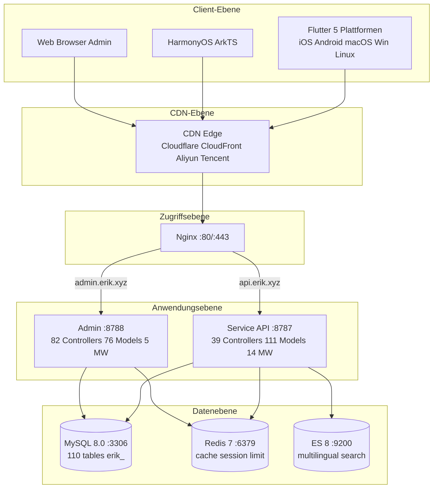
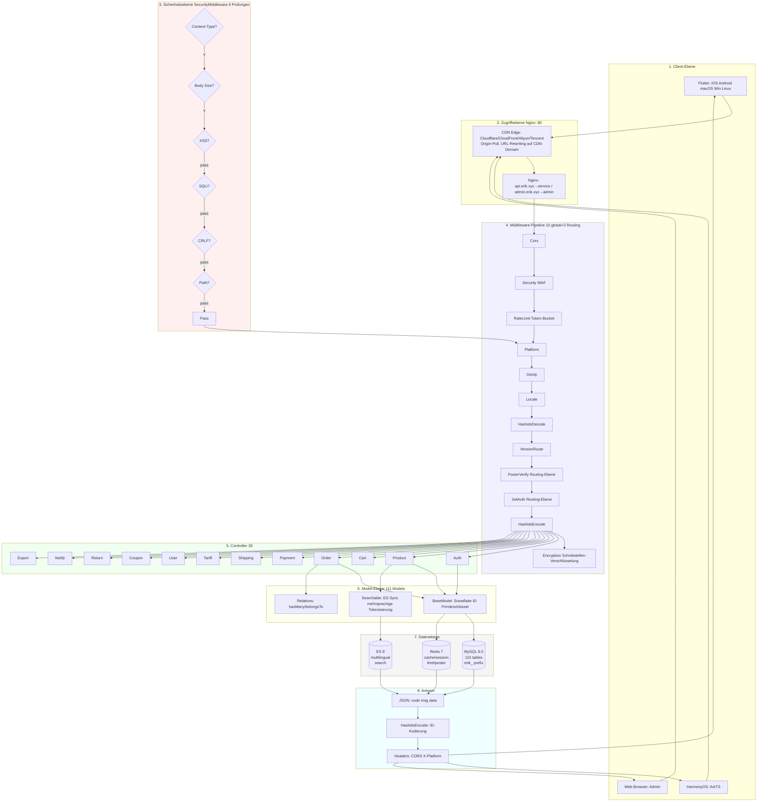
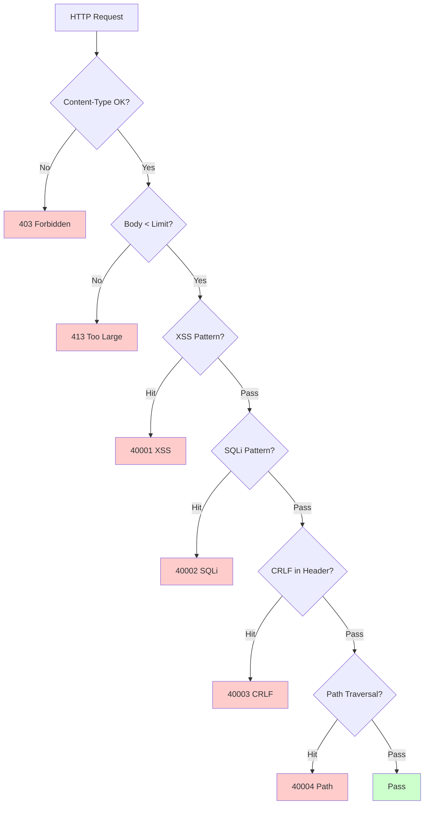
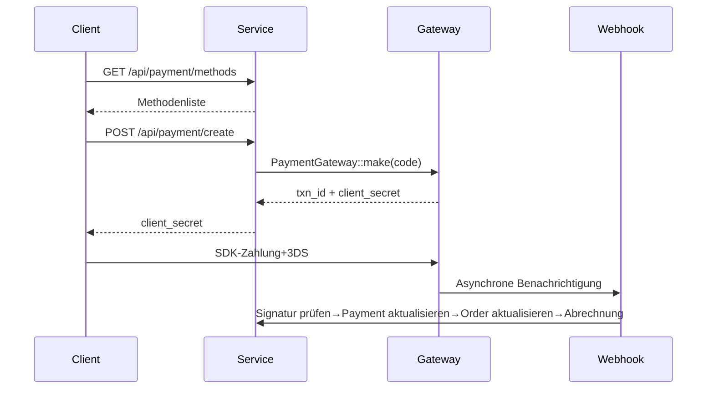
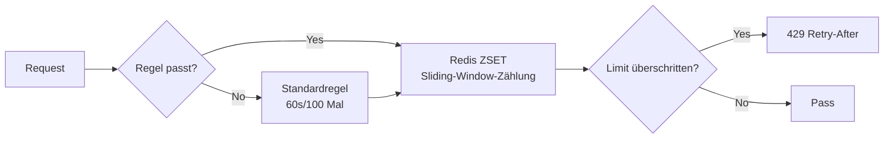

# Cross-Border-E-Commerce-Plattform — Architektur-Designdokument

> Dieses Dokument ist eine maschinelle Übersetzung der ursprünglichen chinesischen Dokumentation. Original: [中文原版](../../architecture-full.md).

Copyright (c) 2026 erik <erik@erik.xyz> — https://erik.xyz

---

## 1. Systemübersicht

### 1.1 Positionierung

Full-Stack-Cross-Border-E-Commerce-Plattform auf Basis des leistungsstarken webman-Frameworks, mit Unterstützung für B2C, B2B und Onboarding von Drittanbietern.

| Komponente | Technologie-Stack | Umfang |
|------|--------|------|
| Service API | PHP 8.3 / webman 2.1 / illuminate database | 39 Controller + 111 Modelle + 14 Middleware |
| Admin | webman-admin / LayUI / ECharts | 82 Controller + 76 Modelle + 5 Middleware |
| Flutter | Riverpod / GoRouter / Dio | 25 Dart-Dateien / 11 Seiten |
| HarmonyOS | ArkTS / ArkUI | 14 ETS-Dateien / 9 Seiten |
| Datenbank | MySQL 8.0 + Redis 7 + ES 8 | 117 Tabellen (110 `erik_` + 7 `wa_`) |

### 1.2 Kernkennzahlen

| Kennzahl | Wert |
|------|-----|
| API P99 | <200ms |
| Nebenläufigkeit | 10000+ (32 Worker im Arbeitsspeicher) |
| Tabellenzahl | 110 |
| Endpunkte | 73 |
| Middleware | 14 (service: 10 global + 2 Routing + AdminKey + StaticFile / admin: 4 global + 1 eingebaut) |
| Sprachen | zh_CN, zh_HK, en, ja, ko |
| Währungen | 19 unabhängig bepreiste |
| Zahlung | Stripe / PayPal / Klarna / Adyen |

---

## 2. Systemarchitektur-Diagramm



### 2.1 Vollständiges Design-Flussdiagramm



**Erläuterung des Flussdiagramms:**

| Ebene | Beschreibung |
|----|------|
| 1. Client-Ebene | Flutter 5 Plattformen + HarmonyOS + Web Admin, alle kommunizieren über HTTP/JSON |
| 2. Zugangsebene | CDN-Edge (Origin-Pull, `Cdn::url()`-URL-Rewriting auf `https://{CDN_DOMAIN}`) → Nginx leitet nach Domain: api→service, admin→admin |
| 3. Sicherheitsebene | SecurityMiddleware mit 31 Angriffserkennungstypen, bei Treffer Fehlercode/403 |
| 4. Middleware-Pipeline | 10 globale MW seriell + 2 Routing-MW (PosterVerify für sensible Operationen, JwtAuth für geschützte Schnittstellen) |
| 5. Controller-Ebene | 39 API-Controller nach Funktion gruppiert, verarbeiten die gesamte Geschäftslogik |
| 6. Modellebene | 111 Eloquent-Modelle, BaseModel liefert Snowflake-ID-Primärschlüssel, 45 Modelle nutzen SoftDelete |
| 7. Datenebene | MySQL (110 Tabellen, erik_-Präfix/snowflake-Primärschlüssel) + Redis (Cache/Session/Limiting/Poster) + ES (mehrsprachige Suche) |
| 8. Antwortrückgabe | Einheitliches JSON-Format → HashidsEncode kodiert IDs → Encryption verschlüsselt (X-Encrypt-Response) → an den Client |

### 2.2 Prozessmodell

```
webman Master (:8787)
  ├── HTTP Worker x32 (CPU×4, permanenter Speicher, DB-Verbindungspool)
  ├── Monitor Process (Dateiüberwachung + Speicherüberwachung)
  └── SnowflakeWorker (initialisiert die Snowflake-Singleton beim Start)
```

---

## 3. Middleware-Pipeline

### 3.1 Vollständige Service-API-Pipeline

```mermaid
graph LR
    A[HTTP Request] --> B[Cors]
    B --> C[Security<br/>Angriffserkennung]
    C --> D[Platform<br/>Quellenerkennung]
    D --> E[GeoIp<br/>Regionserkennung]
    E --> F[Locale<br/>Sprache]
    F --> G[HashidsDecode<br/>ID-Dekodierung]
    G --> H[VersionRoute<br/>Versions-Routing]
    H --> I{Sensible Operation?}
    I -->|Yes| J[PosterVerify<br/>Mensch-Maschine-Verifizierung]
    I -->|No| K{JWT-Schutz?}
    J --> K
    K -->|Yes| L[JwtAuth<br/>Token-Verifizierung]
    K -->|No| M[HashidsEncode<br/>ID-Kodierung]
    L --> M
    M --> N[Controller]
    N --> O[HTTP Response]
    style C fill:#fcc
    style J fill:#ffc
    style L fill:#cfc
```



### 3.2 Service-Middleware-Details

| # | Middleware | Typ | Funktion |
|---|--------|------|------|
| 1 | Cors | global | Access-Control-*-Antwort-Header, OPTIONS-Preflight gibt 200 zurück |
| 2 | SecurityMiddleware | global | XSS/SQL-Injection/CRLF/Pfad-Traversal/Content-Type/Body 10MB |
| 3 | RateLimitMiddleware | global | Token-Bucket-Limiting (Redis ZSET Sliding Window, 6 Endpunkt-Regeln) |
| 4 | PlatformMiddleware | global | X-Platform header + UA-Degradationserkennung für 8 Plattformen |
| 5 | GeoIpMiddleware | global | MaxMind GeoIP2-Erkennung von Region/Währung/Sprache für nicht angemeldete Benutzer |
| 6 | LocaleMiddleware | global | Accept-Language-Parsing, 5 Sprachen exakt abgleichen→Degradieren→Standard |
| 7 | HashidsDecode | global | `*_id`-Felder in URL/Body von hashid→snowflake-ID |
| 8 | VersionRoute | global | API-Version header→Controller-Namespace-Zuordnung (v1/v2) |
| 9 | PosterVerify | Routing | Registrierung/Bestellung/Zahlung, Redis-Token-Prüfung |
| 10 | JwtAuth | Routing | Bearer Token HS256-Prüfung + Ablauf + userId-Injektion |
| 11 | HashidsEncode | global | Rekursive Traversierung der Antwort-JSON, snowflake-ID→hashid |
| 12 | EncryptionMiddleware | Routing | AES-Ver-/Entschlüsselung der Schnittstelle (X-Encrypt-Response/X-Encrypted) |
| 13 | AdminKeyMiddleware | Routing | Schlüsselprüfung für interne Verwaltungsoperationen |
| 14 | StaticFile | global | Statischer Dateidienst von webman |

### 3.3 Admin-Pipeline

```
Anfrage → SecurityMiddleware → PlatformMiddleware → HashidsDecode
     → webman-admin AccessControl (eingebaute RBAC) → HashidsEncode → Controller
```

| # | Admin-Middleware | Funktion |
|---|------------|------|
| 1 | SecurityMiddleware | XSS/SQL-Injection/CRLF/Pfad-Traversal/Content-Type/20MB |
| 2 | PlatformMiddleware | X-Platform + UA 8-Plattform-Erkennung |
| 3 | HashidsDecode | Anfrage hashid→snowflake-ID |
| - | AccessControl (eingebaut) | Rollen-/Berechtigungsprüfung des Administrators |
| 4 | HashidsEncode | Antwort snowflake-ID→hashid |

---

## 4. Sicherheitsarchitektur

### 4.1 Angriffserkennungs-Pipeline (SecurityMiddleware)



### 4.2 SecurityMiddleware-Angriffserkennungsregeln im Detail (15 benutzerdefinierte Typen)

| # | Angriffstyp | Haupt-Erkennungsmethode | Service | Admin | Fehlercode |
|---|---------|------------|---------|-------|--------|
| 1 | XSS-Cross-Site-Scripting | 13 Regex-Regeln: script/iframe/on-Ereignisse/svg+on/style/expression/javascript:/embed/object/link/meta | ✅ | ✅ | 40001 |
| 2 | SQL-Injection | 13 Regex-Regeln: UNION SELECT/SELECT FROM WHERE/sleep/benchmark/pg_sleep/boolean/string/Kommentarzeichen/MySQL-Sonderkommentare/schema-Enumeration/load_file/into outfile/Stored Procedures/waitfor/delay | ✅ | ✅ | 40002 |
| 3 | CRLF-Header-Injection | `[\r\n]` in: Authorization/X-Platform/API-Version/X-Forwarded-For/Referer/Origin | ✅ | ✅ | 40003 |
| 4 | Pfad-Traversal | `../` + `%2e%2f`-Kodierung + `%252e%252f`-Doppelkodierung + Null Byte `\0` + `.env`/`.git`/`phpmyadmin`/`wp-admin`/`/etc/`/`/proc/`/`composer.json` | ✅ | ✅ | 40004 |
| 5 | Body-Größenlimit | Content-Length > 10MB (Service) / 20MB (Admin) | ✅ | ✅ | 40005 |
| 6 | Content-Type | nur JSON/form-data/form-urlencoded | ✅ | ✅ | 40006 |
| 7 | Datei-Upload-Prüfung | Blacklist-Erweiterungen (php/phtml/sh/exe/js/...) + Doppelerweiterungen + leere Erweiterung | ✅ | ✅ | 40009 |
| 8 | Sichere HTTP-Antwort-Header | nosniff/DENY/XSS-Protection/Referrer-Policy/Permissions-Policy/Cache-Control/Server ausblenden | ✅ | ✅ | — |
| 9 | Brute-Force-Schutz | Redis-Zähler: API 10×/60s, Admin 5×/300s | ✅ | ✅ | 40008 |
| 10 | XXE-Entity-Injection | `<!ENTITY SYSTEM>`, `<!DOCTYPE [` | ✅ | ✅ | 40010 |
| 11 | SSRF-Server-Fälschung | Intranet-IPs (127/10/172.16/192.168/0.0/169.254.169.254) + localhost + metadata.google.internal | ✅ | ✅ | 40011 |
| 12 | HTTP-Methodenprüfung | nur GET/POST/PUT/DELETE/PATCH/OPTIONS/HEAD | ✅ | ✅ | 40012 |
| 13 | Host-Header-Prüfung | Direktzugriff über nackte IPs abgelehnt | ✅ | — | 40013 |
| 14 | Sensible-Daten-Maskierung | Filtert password/token/secret aus Logs/Fehlerantworten | ✅ | ✅ | — |
| 15 | CORS-Whitelist | konfigurierbare Origin-Beschränkung | ⚠️ | ⚠️ | — |

### 4.3 Authentifizierungsablauf

```
Registrierung: email+password → PosterVerify (Mensch-Maschine-Prüfung) → bcrypt(password+salt)
     → Snowflake generiert ID → JWT zurückgeben

Anmeldung: email+password → password_verify(password+salt, bcrypt_hash)
     → last_login_at/ip/platform aktualisieren → JWT ausstellen

Anfrage: Authorization: Bearer <token>
     → JwtAuth → Jwt::decode → HS256-Prüfung + Ablauf → request->userId injizieren

Aktualisieren: POST /api/auth/refresh {refresh_token} → Jwt::decode → neues access_token
```

### 4.4 Datensicherheit (Drei-Schichten-Verschlüsselung)

| Ebene | Technologie | Paket | Felder |
|------|------|-----|------|
| Transportschicht | AES-256-CBC | erikwang2013/encryption | Sensible POST-Body-Felder |
| Datenbankebene | Encryptable-Trait | erikwang2013/encryptable (Maize) | email, mobile, name, phone, detail, tax_id |
| ID-Verschleierung | Hashids-Kodierung | erikwang2013/hashids | Alle snowflake-IDs der Schnittstellenebene |

### 4.5 Plattform-Herkunftsverfolgung

| Plattform | Erkennungsmethode | Header-Wert |
|------|---------|---------|
| iOS | Flutter `Platform.isIOS` + `TargetPlatform.iOS` | `ios` |
| iPadOS | Flutter `Platform.isIOS` + `!TargetPlatform.iOS` | `ipados` |
| macOS | Flutter `Platform.isMacOS` / UA `Macintosh` | `macos` |
| Windows | Flutter `Platform.isWindows` / UA `Windows` | `windows` |
| Linux | Flutter `Platform.isLinux` / UA `Linux` | `linux` |
| Android | Flutter `Platform.isAndroid` / UA `Android` | `android` |
| HarmonyOS | ArkTS hartcodiert / UA `HarmonyOS` | `harmonyos` |
| Web | UA ohne Treffer / Standardwert | `web` |

Erfassungstabellen: `erik_orders.platform`, `erik_payments.platform`, `erik_operation_logs.platform`, `erik_users.last_login_platform`, `erik_search_logs.platform`, `erik_chat_messages.platform`

---

## 5. Datenarchitektur

### 5.1 Primärschlüssel-Strategie

```
Snowflake 64bit: [1bit|42bit-Zeitstempel|5bitDC|5bitWID|12bit-Sequenz]
- Global eindeutig / trendmäßig aufsteigend / nicht autoincrement
- PHP $keyType='string' (Überlaufschutz)
- Service worker_id=1, Admin worker_id=2
- Erzeugung: Snowflake::nextId()
```

### 5.2 Modellvererbung

```
Illuminate\Database\Eloquent\Model
  └── app\model\BaseModel
        ├── $incrementing=false, $keyType='string', $guarded=[]
        ├── boot(): Snowflake::nextId()
        └── 110 Geschäftsmodelle
              ├── 45 verwenden SoftDeletes (entsprechen Tabellen mit deleted_at-Spalte)
              ├── einige verwenden Encryptable (sensible Felder: email/mobile/name usw.)
              ├── verwenden Searchable (Product→ES)
              └── hasMany/belongsTo-Beziehungen
```

### 5.3 Mehrsprachig/Mehrwährig

- **Übersetzung**: `erik_product_translations(product_id,locale)` eigene Tabelle, Abfrage nach locale
- **Preisgestaltung**: `erik_product_sku_prices(sku_id,currency_code)` unabhängige Preise je Währung

---

## 6. Zahlungsarchitektur



```
PaymentGatewayInterface
  ├── createPayment(data): array
  ├── capturePayment(txnId): array
  ├── refundPayment(txnId, amount): array
  └── verifyWebhook(payload, sig): bool
```

---

## 7. Hochverfügbarkeits-Architektur

### 7.1 Rate-Limiting-Strategie (RateLimitMiddleware)



| Endpunkt | Fenster | Limit | Beschreibung |
|------|------|------|------|
| /api/auth/login | 60s | 10× | Schutz vor Credential-Stuffing |
| /api/auth/register | 300s | 5× | Schutz vor Massenregistrierung |
| /api/payment | 60s | 5× | Schutz vor Kartenmissbrauch |
| /api/orders | 10s | 3× | Schutz vor Fake-Bestellungen |
| /api/search | 1s | 10× | Schutz vor Crawlern |
| Standard | 60s | 100× | Allgemeine API |

### 7.2 Redis-Verwendung

Redis dient für das Rate-Limiting-Token-Bucket, Mensch-Maschine-Verifizierungscodes und Session-Speicherung (Middleware-Ebene); Geschäftsdaten werden nicht auf Anwendungsebene gecacht, sondern direkt aus MySQL gelesen (Read/Write-Splitting + Verbindungspool). Statische Ressourcen (Bilder/Dokumente) werden an der CDN-Edge zwischengespeichert (Origin-Pull, `expires 7d` / `Cache-Control: immutable`).

### 7.4 Verbindungspool-Optimierung

| Ressource | Max. Verbindungen | Min. Verbindungen | Warte-Timeout | Leerlauf-Timeout | Heartbeat |
|------|---------|---------|---------|---------|------|
| MySQL | 50 | 10 | 2s | 60s | 45s |
| Redis | 30 | 5 | — | 60s | — |

### 7.5 Verarbeitung langsamer Operationen

| Operation | Umsetzung |
|------|------|
| Wechselkurs-Update | ExchangeRateCron (stündlich, externe API) |
| Feed-Synchronisierung | ProductFeedCron (alle 6 Stunden TSV erzeugen und protokollieren) |
| Empfehlungsberechnung | RecommendationCron (täglich, Kauf-Kookkurrenz) |
| Zahlungsabstimmung | PaymentReconcileCron (alle 6 Stunden, Stripe/PayPal) |
| Abrechnungsabwicklung | SettlementCron (täglich) |
| Logistik-Tracking | ShipmentTrackingCron (alle 30 Minuten, API-Konfiguration erforderlich) |
| Plattform-Bestellsynchronisierung | PlatformOrderSyncCron (alle 5 Minuten, API-Konfiguration erforderlich) |
| Retouren-Timeout | ReturnExpireCron (stündlich) |
| Preis-/Bestand-Benachrichtigungen | PriceAlertCron (alle 10 Minuten) |
| Compliance-Regel-Update | ComplianceCron (täglich, API-Konfiguration erforderlich) |

## 8. Bereitstellungsarchitektur

```
CDN-Ebene: https://{CDN_DOMAIN} → CNAME-Rückführung auf die Admin-Domain (Origin-Pull)
docker-compose.yml:
  nginx (alpine) :80 :443 — location /app/admin/upload/ → expires 7d, Cache-Control public, max-age=604800, immutable
  service (php:8.3) :8787 intern, 32 Worker
  admin (php:8.3) :8788 intern
  mysql (8.0) :3306 / redis (7) :6379 / es (8) :9200
Netzwerk: erik-net bridge | Daten-Volumes persistent
Volumes: admin_uploads:/app/plugin/admin/public/upload | service_public:/app/public/documents
Routing: api.erik.xyz→service | admin.erik.xyz→admin
```

---


## 8. Internationalisierung (i18n)

| Ebene | Umsetzung |
|------|------|
| Service | LocaleMiddleware + Übersetzungsdateien für 5 Sprachen (45 Keys/Sprache) |
| Admin | Übersetzungsdateien für 5 Sprachen |
| Flutter | AppLocalizations + Riverpod Provider |
| API | Automatische Injektion über Accept-Language-Header |

## 9. API-Dokumentation (hg/apidoc)

| Komponente | Beschreibung |
|------|------|
| Paket | hg/apidoc v5.3 |
| Konfiguration | config/plugin/hg/apidoc/app.php (6 Gruppen) |
| Annotationen | @Apidoc\Title/Desc/Method/Url/Param/Returned |
| Zugriff | http://localhost:8787/apidoc/ |

## 11. Tests

```bash
cd service && php vendor/bin/phpunit tests/
```

| Testklasse | Tests | Abdeckung |
|--------|-------|------|
| SecurityTest | 12 | XSS+SQLi+XXE+SSRF+Path |
| JwtTest | 4 | encode/decode/invalid |
| ApiResponseTest | 3 | success/fail/paginate |
| RedisFacadeTest | 3 | ping/set/get/redis() |
| **Total** | **22** | **45 Assertions PASS** |

---

## 12. Projektstatistik

| Dimension | Anzahl |
|------|------|
| PHP-Quelldateien | service:210 + admin:214 = 424 |
| Dart (Flutter) | 25 |
| ArkTS (HarmonyOS) | 14 |
| Datenbanktabellen | 110 |
| API-Endpunkte | 73 |
| Middleware | 14 |
| Utility-Klassen | 8 |
| Geplante Aufgaben | 12 |
| Konfigurationspunkte | 36+ |
| Tests | 22 Tests, 45 Assertions |
| Skills | 38 |
| Dokumente | 9 |
| **Gesamt** | **~700** |
