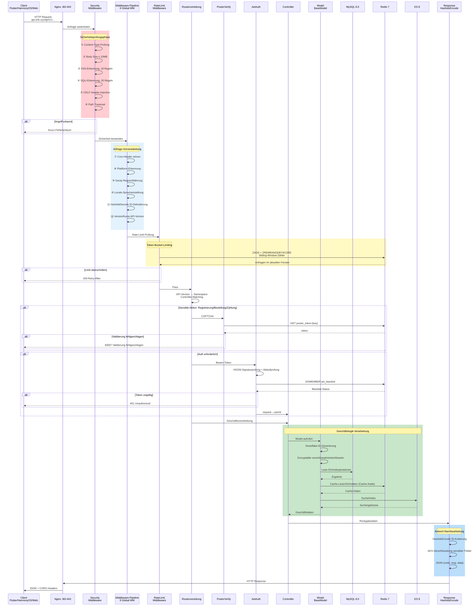

# Cross-Border-E-Commerce-Plattform — Diagrammsammlung

> Dieses Dokument ist eine maschinelle Übersetzung der ursprünglichen chinesischen Dokumentation. Original: [中文原版](../../diagrams.md).

Copyright (c) 2026 erik <erik@erik.xyz> — https://erik.xyz

---

## 1. Systemarchitektur

---

## 2. Fluss der Anfrageverarbeitung (Middleware-Pipeline)

---

## 3. Funktionsmodul-Übersicht

---

## 4. Anfrage-Lebenszyklus

---

## 5. Bestell-Lebenszyklus

---

## 6. Bereitstellungsarchitektur

---

## 7. Sicherheitsarchitektur

### Übersicht der Sicherheitsmaßnahmen

| Ebene | Verteidigungslinie | Technik/Paket | Abdeckung |
|------|------|---------|---------|
| Ebene 1 | Netzwerk-Boundary | Nginx SSL + Reverse-Proxy + Host-Validierung | Service + Admin |
| Ebene 2 | WAF-Angriffserkennung | 31 Erkennungsmodule von `erikwang2013/security-php` | XSS/SQLi/CRLF/Pfad-Traversal/XXE/SSRF/Datei-Upload/Methode/Host/Content-Type/Body usw. |
| Ebene 3 | Traffic-Steuerung + Abhängigkeits-Resilienz | RateLimitMiddleware + Brute-Force-Redis-Zähler + CircuitBreaker | Token-Bucket-Limiting (6 Endpunkte) + Schutz für Login/Registrierung + Zahlungs-/Social-Login-Circuit-Breaker (5 Fehler → 30s, halboffene Erholung) |
| Ebene 4 | Identitätsauthentifizierung | PosterVerify + JwtAuth HS256 | Mensch-Maschine-Verifizierung (Schieberegler/Puzzle/Klick) + Bearer Token + Dual-Token-Refresh |
| Ebene 5 | Datensicherheit | Hashids + AES-256-CBC + Encryptable | Drei-Schichten-Verschlüsselung: ID-Verschleierung/Übertragungsverschlüsselung/Datenbank-Feldverschlüsselung |
| Ebene 6 | Antwort-Sicherheit | HTTP-Sicherheitsheader + Maskierung sensibler Daten | nosniff/DENY/XSS-Protection/Referrer-Policy/Log-Maskierung |
| Kontinuierlich | Prüfung & Nachverfolgung | PlatformMiddleware + OperationLogs | Quellen-Tracking für 8 Plattformen + Aufzeichnung in 6 Tabellen + Betriebsprotokolle |

---

## 8. Mehrwährungs-Abwicklungsfluss

### Erläuterung der Mehrwährungsabwicklung

**Mehrwährungs-Preise:** Produkt-SKUs werden nach `currency_code` je Währung bepreist; bei der Bestellung wird die Zahlungswährung der Bestellung fixiert (USD / EUR / GBP / CNY usw.).

**Wechselkursservice:** Die Wechselkurstabelle `erik_exchange_rates` unterstützt manuelle Pflege sowie automatisches Abrufen über exchangerate-api, versioniert über die Gültigkeitszeit `effective_at`; für die Abrechnung wird eine Kurssnapshot zum Zahlungszeitpunkt verwendet.

**Belastung in Originalwährung:** Stripe / PayPal / Klarna / Adyen belasten in der Bestellwährung; nach Webhook-Signaturprüfung und Bestätigung des Geldeingangs werden Zahlungs- und Bestellstatus aktualisiert.

**Aufteilung und Abrechnung:** Nach erfolgreicher Zahlung werden automatisch `PlatformSettlements` erzeugt (Bestellsumme + Plattformprovision + Gateway-Gebühr, Buchung in Bestellwährung); Händlerabrechnung `MerchantSettlements` (Bestellbetrag → Provisionssatz → Abrechnungsbetrag), Lieferantenabrechnung `SupplierSettlements`, Auszahlung der Affiliate-Provision `AffiliatePayouts` — vier unabhängige Abrechnungslinien, Status 0 ausstehend / 1 abgerechnet.

**Wechselkurs-Gewinne/-Verluste:** `CurrencyExchangeGainsLosses` verfolgt die Differenz zwischen Einzahlungswährung und Abrechnungswährung, vergleicht den Kurs zum Zahlungszeitpunkt mit dem Kurs zum Abrechnungszeitpunkt; positiv = Wechselkursgewinn, negativ = Wechselkursverlust — unterstützt die mehrwährungsübergreifende Abstimmung und Prüfung im E-Commerce.

---

## Diagramm-Index

| Nr. | Diagrammname | Typ | Zweck |
|------|------|------|------|
| 1 | Systemarchitektur | Architekturdiagramm | Zeigt das Gesamtbild des Systems: Clients → Zugang → Anwendung → Daten → externe Dienste |
| 2 | Fluss der Anfrageverarbeitung | Flussdiagramm | Zeigt den vollständigen Pfad einer HTTP-Anfrage durch die 12-stufige Middleware-Pipeline (10 global + 2 Routing) |
| 3 | Funktionsmodul-Übersicht | Funktionsdiagramm | Zeigt die 17 Hauptfunktionsmodule und ihre Unterfunktionen |
| 4 | Anfrage-Lebenszyklus | Lebenszyklus | Zeigt die vollständige Sequenz von der Anfrage bis zur Antwort und die Interaktionen der einzelnen Phasen |
| 5 | Bestell-Lebenszyklus | Lebenszyklus | Zeigt alle Statusübergänge einer Bestellung vom Warenkorb bis zur Fertigstellung/Rückerstattung |
| 6 | Bereitstellungsarchitektur | Architekturdiagramm | Zeigt die Docker-Compose-Container-Orchestrierung, das Netzwerk, die CDN-Edge-Ebene (Origin-Pull) und die persistenten Datenvolumes (inkl. Upload-Volumes admin_uploads/service_public) |
| 7 | Sicherheitsarchitektur | Architekturdiagramm | Zeigt das 6-stufige Defense-in-Depth-System: Boundary → WAF → Traffic/Resilienz (Rate-Limiting + Circuit Breaker) → Auth → Daten → Antwort |
| 8 | Mehrwährungs-Abwicklungsfluss | Flussdiagramm | Zeigt die vollständige Kette: währungsbezogene Preisgestaltung → Zahlung → Aufteilung → Abrechnung → Wechselkurs-Gewinne/-Verluste |
