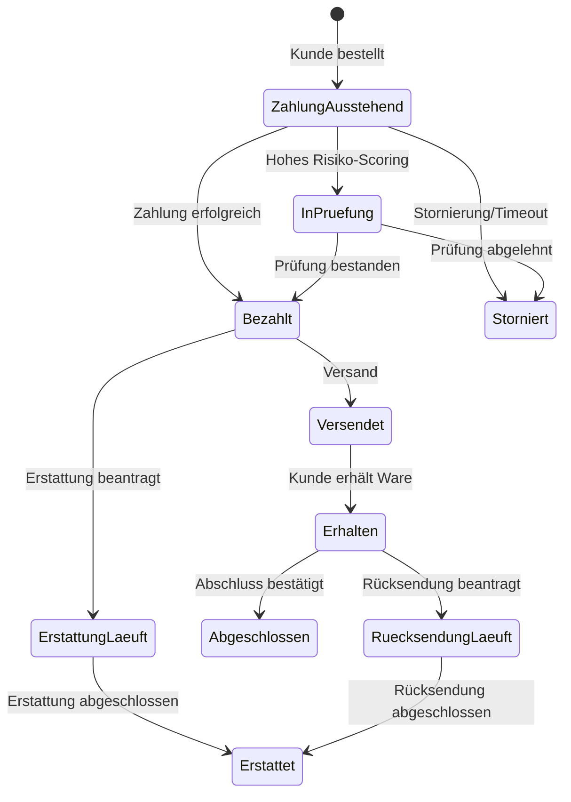
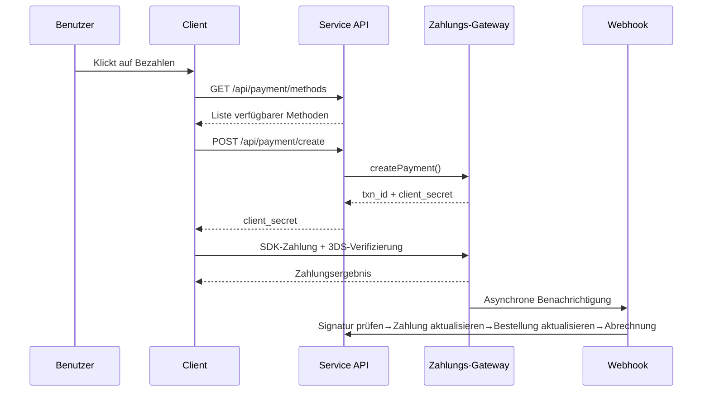
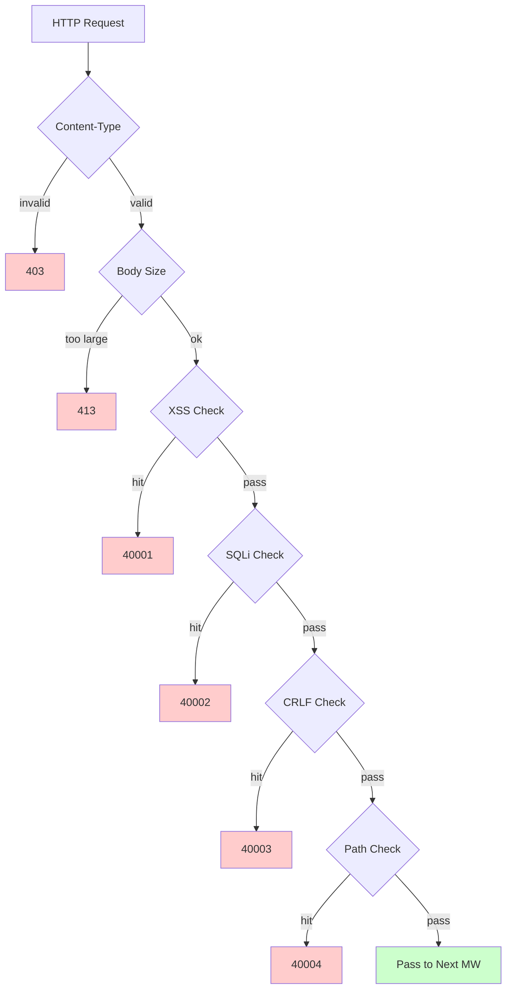

# Cross-Border-E-Commerce-Plattform — Funktionsdesigndokument

> Dieses Dokument ist eine maschinelle Übersetzung der ursprünglichen chinesischen Dokumentation. Original: [中文原版](../../features.md).

Copyright (c) 2026 erik <erik@erik.xyz> — https://erik.xyz

---


## Plattform-Tracking

### Erkennung von 8 Plattformen

| Plattform | Header | Flutter | Admin |
|------|--------|---------|-------|
| iOS | `ios` | Platform.isIOS + TargetPlatform.iOS | UA iPhone |
| iPadOS | `ipados` | Platform.isIOS + !TargetPlatform.iOS | UA iPad |
| macOS | `macos` | Platform.isMacOS | UA Macintosh |
| Windows | `windows` | Platform.isWindows | UA Windows |
| Linux | `linux` | Platform.isLinux | UA Linux |
| Android | `android` | Platform.isAndroid | UA Android |
| HarmonyOS | `harmonyos` | — | UA HarmonyOS |
| Web | `web` | kIsWeb | Standard |

### DB-Tracking-Felder

| Tabelle | Feld | Beschreibung |
|----|------|------|
| erik_orders | platform VARCHAR(16) | Bestellplattform |
| erik_payments | platform VARCHAR(16) | Zahlungsplattform |
| erik_operation_logs | platform VARCHAR(16) | Betriebsplattform |
| erik_users | last_login_platform VARCHAR(16) | Anmeldeplattform |
| erik_search_logs | platform VARCHAR(16) | Suchplattform |
| erik_chat_messages | platform VARCHAR(16) | Nachrichtenquelle |

## 1. Funktionsübersicht

### 1.0 Abdeckungsübersicht

| Dimension | Abgedeckte Inhalte | Tiefe |
|------|---------|------|
| **B2C-Einzelhandel** | Mehrsprachige Produkte, währungsbezogene Preisgestaltung, SKU, Warenkorb, Bestellung, Zahlung (Stripe/PayPal/Klarna), Rückerstattung, Retoure | Vollständig |
| **B2B-Großhandel** | Staffelpreise (MOQ), Unternehmenszertifizierung (Steuernummer/Gewerbeschein), Preisangebot | Vollständig |
| **Multi-Vendor-Onboarding** | Verkäuferprüfung, Produktprüfung, Umsatzbeteiligung und -aufteilung | Vollständig |
| **Cross-Border-Compliance** | HS-Code-Katalog (6-stellige Basiscodes), Zolltarifregeln (Zielland + HS → Steuersatz), VAT/IOSS, Compliance-Kennzeichnungen (FDA/CE/RoHS usw., 10 Kategorien) | Vollständig |
| **Internationale Logistik** | Logistik-Zonen-Fracht (Gewichtsstufen), DHL/UPS/FedEx/EMS, Überseelager (Versand + Retoure), HS-Deklaration (Batterie/Flüssigkeit-Kennzeichnung), Handelsrechnung PDF/Packliste | Vollständig |
| **Zahlung** | Stripe PaymentIntent+3DS, PayPal REST, Klarna BNPL, Adyen, Webhook-Signaturprüfung + Aufteilung | Stripe vollständig, übrige Platzhalter |
| **Marketing** | Gutscheine (Zonen + Neu-/Bestandskunden), Karussell (regionale Sichtbarkeit), Blitzverkauf (zeit-/mengenbegrenzt), Gruppenkauf (Teilnehmerzahl + Gültigkeit), Affiliate (Link + Provision + Auszahlung) | Vollständig |
| **Multi-Plattform** | Amazon/eBay/Shopee/Lazada/Temu-Produktlistings + Bestellaggregation, Multi-Shop-Verwaltung | Vollständig |
| **Lieferkette** | Lieferantenprofile + Bewertung, Einkaufsbestellungen (Prüfung → Versand → Wareneingang → Qualitätsprüfung), Qualitätsprüfung (Wareneingangs-/Warenausgangssperre / Optik / Funktion / Compliance-Kennzeichnung), Bestandsprotokoll (unveränderliches Hauptbuch: Wareneingang/Warenausgang/Umlagerung/Inventur) | Vollständig |
| **Risikomanagement & Compliance** | Regel-Engine (Bypass-Scoring: Adressprüfung/PLZ-Abgleich/3DS/Massenregistrierung/Anomaler Warenwert), KYC-Verifizierung, GDPR/CCPA-Datenanfragen, Cookie-Consent-Versionsverwaltung | Vollständig |
| **Sicherheitsschutz** | SecurityMiddleware kapselt 31 security-php-Erkennungsmodule: XSS (13 Regeln)/SQL-Injection (13 Regeln)/CRLF/Pfad-Traversal (Kodierung + Null-Byte)/Body-Größe/Content-Type/Datei-Upload/HTTP-Sicherheitsheader/Brute-Force (Redis-Zähler)/XXE/SSRF/Methode/Host/Maskierung sensibler Daten/CORS | Vollständig |
| **Hohe Nebenläufigkeit** | Token-Bucket-Limiting (Sliding-Window + 6 Endpunkt-Regeln), DB-Read/Write-Splitting (2 Lesereplikate + sticky), Verbindungspool (DB 50/10 + Redis 30/5), OPCache (128MB, Docker-Umgebung) | Vollständig |
| **Mitgliederwachstum** | Mitgliedsstufen + Berechtigungen, Punktregeln + Transaktionen, Geschenkkarten (Guthaben + Einlösung), Preis-/Warenverfügbarkeitsalarme, Favoriten, Produktvergleich, Verlauf, Abo-Kauf, AB-Tests (Traffic-Verteilung + Konfidenz) | Vollständig |
| **Content-Management** | Mehrsprachige CMS-Seiten (Landing/Blog), mehrsprachiges FAQ, mehrsprachige Wissensdatenbank, Größentabellen (Bekleidung/Schuhe + US/UK/EU/JP/CN-Umrechnung), E-Mail-Vorlagen (mehrsprachig), Produkt-Feeds (Google/Meta + geplante Synchronisierung) | Vollständig |
| **Kundenservice** | WebSocket-Echtzeit-IM (chat_sessions/chat_messages), mehrsprachige Wissensdatenbank | Tabellenstruktur vollständig, WS ausstehend |
| **Infrastruktur** | Snowflake-verteilte IDs (bigint, nicht autoinkrementierend), Hashids-Schnittstellen-ID-Verschleierung, JWT-Authentifizierung (HS256 + access/refresh Dual-Token-Refresh), AES-Verschlüsselung (Drei-Schichten-Verschlüsselung Schnittstelle + Datenbank), GeoIP-Regionserkennung (MaxMind), Poster-Mensch-Maschine-Verifizierung (Schieberegler/Puzzle/Klick) | Vollständig |
| **Multi-Endgeräte** | Flutter 5 Plattformen (iOS/Android/macOS/Windows/Linux/iPadOS) + HarmonyOS (ArkTS 9 Seiten) + Web-Admin (LayUI+ECharts) + API | Flutter 25 Dateien, HarmonyOS 14 Dateien, Admin 239 Dateien |
| **Plattform-Tracking** | 8-Plattform-Erkennung (iOS/iPadOS/macOS/Windows/Linux/Android/HarmonyOS/Web) + X-Platform-Header + Aufzeichnung in 6 Tabellen (orders/payments/operation_logs/users/search_logs/chat_messages) | Vollständig |
| **Tests** | 22 Tests / 45 Assertions — ALL PASS (SecurityTest 12: XSS+SQLi+XXE+SSRF+Path / JwtTest 4 / ApiResponseTest 3 / RedisFacadeTest 3) | Unit-Tests vollständig, Integrationstests ausstehend |

### 1.1 Modulmatrix

| Hauptmodul | Untermodul | Priorität | Status |
|---------|---------|--------|------|
| Benutzersystem | Registrierung/Anmeldung/Social-Login/KYC-Verifizierung/Adressen/Favoriten/Mitgliedschaft/Punkte/Geschenkkarten | P0-P2 | ✅ |
| Produktsystem | Kategorien/SKU/mehrsprachig/mehrwährig/Bilder/Attribute/Compliance/HS Code/ES-Suche/Feed | P0-P1 | ✅ |
| Transaktionssystem | Warenkorb/Bestellung/Zahlung (Stripe+PayPal+Klarna)/Rückerstattung/Retoure/Rechnung | P0 | ✅ |
| Logistiksystem | Internationale Logistikunternehmen/Zonen-Fracht/Überseelager/Versand (HS-Deklaration)/Transportversicherung | P0-P1 | ✅ |
| Zoll & Steuern | HS-Code-Katalog/Zolltarifregeln/VAT/IOSS/Compliance-Beschränkungen einzelner Länder | P0 | ✅ |
| Marketingsystem | Gutscheine/Karussell/Blitzverkauf/Gruppenkauf/Affiliate | P1-P2 | ✅ |
| Lieferkette | Lieferanten/Einkaufsbestellungen/Qualitätsprüfung/Bestandsprotokoll | P1 | ✅ |
| Risikomanagement & Compliance | Regel-Engine/GDPR/CCPA/Cookie-Consent/Plattform-Tracking | P1 | ✅ |
| Sicherheitsschutz | XSS/SQL-Injection/CRLF/Pfad-Traversal/Content-Type/Request-Body | P0 | ✅ |
| Multi-Plattform | Amazon/eBay/Shopee-Listings + Bestellaggregation/Multi-Vendor-Onboarding | P2 | ✅ |
| Content-Management | CMS/FAQ/Wissensdatenbank/E-Mail-Vorlagen/Benachrichtigungen/Größentabellen | P2 | ✅ |
| Wachstums-Tools | B2B-Großhandel/Abo-Kauf/AB-Tests | P2-P3 | ✅ |
| Kundenservice | WebSocket-Echtzeit-IM/Wissensdatenbank | P3 | ✅ |
| Infrastruktur | Snowflake-ID/JWT/Hashids/Encryption/Poster/API-Version/GeoIP | P0 | ✅ |

---

## 2. Kern-Geschäftsflussdiagramme

### 2.1 Bestell-Statusmaschine



### 2.2 Zahlungs-Sequenz



### 2.3 Sicherheits-Erkennungspipeline



---

## 3. Kern-Geschäftsprozesse

### 3.1 Benutzerregistrierung und -anmeldung

```
EMAIL-Registrierung: email+password → PosterVerify-Mensch-Maschine-Verifizierung → bcrypt(password+salt)
          → Snowflake generiert ID → Rückgabe JWT {access_token, expires_in}

Social-Login: Google/Apple/Facebook OAuth → id_token validieren
        → erik_user_social_accounts Bindung prüfen
        → Gebunden: Anmeldung / Nicht gebunden: Benutzer automatisch anlegen+verknüpfen → JWT zurückgeben

Anmeldung: email+password → password_verify(password+salt)
    → last_login_at/ip/platform aktualisieren → JWT ausstellen

Token-Refresh: refresh_token → Jwt::decode → neues access_token
```

### 3.2 Produkt-Browsing und Suche

```
Liste: GET /api/products
  → Filter: category_id/status/keyword/price_range
  → Sortierung: default/price_asc/price_desc/sales/newest
  → Mehrsprachig: ProductTranslations nach locale filtern
  → Mehrwährig: ProductSkuPrices nach currency_code abgleichen
  → Paginierung: 20 Einträge/Seite

ES-Suche: GET /api/search?keyword=xxx
  → Erikwang2013\WebmanScout\Searchable → ES-Mehrsprachen-Analysator
  → Aggregation: category/price/brand
  → Degradierung: MySQL LIKE, wenn ES nicht verfügbar ist

Details: GET /api/products/{hashid}
  → HashidsDecode-Middleware dekodiert → Eager Load
  → Mehrsprachig+mehrwährig+Compliance+HS Code+Größenumrechnung+inkl./exkl. Steuer+VAT
```

### 3.3 Warenkorb und Bestellung

```
Warenkorb: POST /api/cart {sku_id, quantity}
  → SKU existiert | online | ausreichender Bestand prüfen
  → Gleiche SKU: Menge addieren / Nicht vorhanden: anlegen

Bestellung: POST /api/orders {address_id, coupon_id, currency_code}
  → 1. Lieferadresse prüfen → 2. Ausgewählte Warenkorbpositionen abrufen → 3. Je Produkt prüfen (Bestand+Compliance)
  → 4. Preis berechnen (mehrwährig+Gutschein) → 5. Bestellnummer generieren
  → 6. Order+OrderItems anlegen → 7. Bestand abziehen → 8. OrderLog schreiben
  → 9. Risiko-Scoring (RiskEngine::score) → 10. Gekaufte Warenkorbpositionen entfernen

Stornieren: POST /api/orders/{id}/cancel
  → Status=0 (Ausstehende Zahlung) prüfen → Bestand wiederherstellen → status=5 (Storniert)
```

### 3.4 Zahlungsablauf

```
Verfügbare Methoden: GET /api/payment/methods?country=DE&currency=EUR
  → PaymentGatewayMethods (nach country+currency gefiltert)

Zahlung anlegen: POST /api/payment/create
  → PaymentGateway::make(gateway)→createPayment()
  → Stripe: PaymentIntent → client_secret → Frontend-SDK (+3DS)

Webhook: POST /webhook/payment/stripe
  → Signaturprüfung → payment_intent.succeeded:
     → Payment.status=Bezahlt → Order.status=Bezahlt
     → PlatformSettlement (Plattformprovision+Gateway-Gebühr+Lieferant+Affiliate)
```

### 3.5 Rückgabeablauf

```
Antrag: POST /api/returns {order_id, reason_id}
  → Rückgabeweg bestimmen: Lokales Lager (type=1)/Rücksendung ins Inland (type=2)/Nur Erstattung (type=3)

Prüfung: Admin-Prüfung → Genehmigt: ReturnLabel generieren / Abgelehnt: Grund eintragen

Rücksendung: Label herunterladen→zurücksenden→Logistikupdate→Lager-Wareneingang→status=Empfangen

Erstattung: status=Abgeschlossen → zugehörigen Refund verknüpfen → PaymentGateway::refund→Rückbuchung auf ursprünglichem Weg
```

### 3.6 Zollschätzung

```
GET /api/tariff/estimate?product_id=xxx&dest_country_id=xxx&declared_value=100

1. ProductHsCodes → HsCode
2. TariffRules(dest_country_id + hs_code_id) → duty_rate + duty_free_threshold
3. VatSettings(country_id) → vat_rate + vat_free_threshold
4. duty = value>=threshold ? value*duty_rate/100 : 0
   vat = (value+duty)>=threshold ? (value+duty)*vat_rate/100 : 0
5. return {duty_rate, vat_rate, estimated_duty, estimated_vat, estimated_total, hs_code, disclaimer}
```

---

## 4. Sicherheitsschutz (SecurityMiddleware kapselt 31 security-php-Erkennungsmodule)

### 4.1 Übersicht der Erkennungsregeln

| # | Angriffstyp | Hauptprüfverfahren | Fehlercode | Service | Admin |
|---|---------|------------|--------|---------|-------|
| 1 | XSS-Cross-Site-Scripting | 13 Regeln: script/iframe/on-Ereignisse/svg+on/style/expression/javascript:/embed/object/link/meta | 40001 | ✅ | ✅ |
| 2 | SQL-Injection | 13 Regeln: UNION SELECT/SELECT FROM WHERE/sleep/benchmark/pg_sleep/boolesch/stringbasiert/Kommentarzeichen/MySQL-Sonderkommentare/schema-Enumeration/load_file/into outfile/gespeicherte Prozeduren/waitfor/delay | 40002 | ✅ | ✅ |
| 3 | CRLF-Header-Injection | `[\r\n]` in: Authorization/X-Platform/API-Version/X-Forwarded-For/Referer/Origin | 40003 | ✅ | ✅ |
| 4 | Pfad-Traversal | `../` + `%2e%2f`-Kodierung + `%252e%252f`-Zweifachkodierung + Null-Byte `\0` + `.env`/`.git`/`phpmyadmin`/`wp-admin`/`/etc/`/`/proc/`/`composer.json` | 40004 | ✅ | ✅ |
| 5 | Request-Body-Begrenzung | Content-Length > 10MB (Service) / 20MB (Admin) | 40005 | ✅ | ✅ |
| 6 | Content-Type-Begrenzung | Nur JSON/form-data/form-urlencoded | 40006 | ✅ | ✅ |
| 7 | **Datei-Upload-Prüfung** | Blacklist-Erweiterungen (php/phtml/sh/exe/js/...)+Double-Extension-Angriff+leere Erweiterung | 40009 | ✅ | ✅ |
| 8 | **HTTP-Sicherheitsantwort-Header** | nosniff/DENY/XSS-Protection/Referrer-Policy/Permissions-Policy/Cache-Control/Server ausblenden | — | ✅ | ✅ |
| 9 | **Brute-Force-Schutz** | Redis-Zähler: API 10×/60s, Admin 5×/300s | 40008 | ✅ | ✅ |
| 10 | **XXE-Entity-Injection** | `<!ENTITY SYSTEM>`, `<!DOCTYPE [` | 40010 | ✅ | ✅ |
| 11 | **SSRF-Server-Side-Request-Forgery** | Interne IPs (127/10/172.16/192.168/0.0/169.254.169.254)+localhost+metadata.google.internal | 40011 | ✅ | ✅ |
| 12 | **HTTP-Methodenprüfung** | Nur GET/POST/PUT/DELETE/PATCH/OPTIONS/HEAD | 40012 | ✅ | ✅ |
| 13 | **Host-Header-Prüfung** | Direkten Zugriff über nackte IP ablehnen | 40013 | ✅ | — |
| 14 | **Maskierung sensibler Daten** | password/token/secret in Logs/Fehlerantworten filtern | — | ✅ | ✅ |
| 15 | **CORS-Whitelist** | Konfigurierbare Origin-Beschränkung | — | ⚠️ | ⚠️ |

### 4.2 Middleware-Pipeline

```
Service: Cors → Security → Platform → GeoIp → Locale → HashidsDecode
        → VersionRoute → (PosterVerify) → (JwtAuth) → HashidsEncode

Admin: Security → Platform → HashidsDecode → AccessControl → HashidsEncode
```

### 4.3 Quellen-Tracking der Plattformen

| Plattform | Header-Wert | Erkennungsmethode |
|------|---------|---------|
| iOS | `ios` | Flutter `Platform.isIOS` |
| iPadOS | `ipados` | Über Flutter `TargetPlatform.iOS` ermittelt |
| macOS | `macos` | Flutter `Platform.isMacOS` |
| Windows | `windows` | Flutter `Platform.isWindows` |
| Linux | `linux` | Flutter `Platform.isLinux` |
| Android | `android` | Flutter `Platform.isAndroid` |
| HarmonyOS | `harmonyos` | ArkTS hartkodiert |
| Web | `web` | UA-Degradierung / Standard |

---


## 5. Hohe Nebenläufigkeit und Leistung

### 5.1 Rate-Limit-Regeln

| Endpunkt | Algorithmus | Fenster | Limit |
|------|------|------|------|
| /api/auth/login | Sliding-Window | 60s | 10× |
| /api/auth/register | Sliding-Window | 300s | 5× |
| /api/payment | Sliding-Window | 60s | 5× |
| /api/orders | Sliding-Window | 10s | 3× |
| /api/search | Sliding-Window | 1s | 10× |
| Standard | Sliding-Window | 60s | 100× |

### 5.2 Redis-Verwendung

| Zweck | Implementierung |
|------|------|
| Rate-Limit-Token-Bucket | Redis-ZSET-Sliding-Window |
| Mensch-Maschine-Verifizierung | PosterVerify-Code-Status |
| Session-Speicherung | Redis-KV-Speicherung |

Geschäftsdaten werden nicht auf Anwendungsebene gecacht, sondern direkt aus MySQL gelesen (Read/Write-Splitting + Verbindungspool).

### 5.3 Verbindungspool

| Ressource | Maximum | Minimum | Timeout |
|------|------|------|------|
| MySQL | 50 | 10 | 2s |
| Redis | 30 | 5 | — |

## 6. Datenbeziehungsdiagramm

```
erik_users ──┬── addresses, social_accounts, wishlists, kyc
             ├── carts, orders → order_items → payments
             ├── reviews, coupons(through user_coupons)
             ├── notifications, subscriptions, point_logs
             ├── affiliate_links, chat_sessions, b2b_verifications
             └── privacy_requests

erik_products ──┬── translations(product_id, locale)
                ├── skus → sku_prices(sku_id, currency_code)
                ├── images, reviews, compliance → compliance_categories
                ├── hs_codes → hs_codes, recommendations
                ├── b2b_prices, platform_listings
                └── product_comparisons

erik_orders ──┬── order_items, order_logs
              ├── payments, refunds, return_orders → return_labels
              ├── order_documents, shipments
              ├── platform_settlements, risk_logs
              └── subscription_orders

erik_countries ──┬── vat_settings, tariff_rules(dest_country_id)
                 ├── country_compliance_rules
                 ├── shipping_zones(JSON countries)
                 └── warehouses(country_id)
```

---

## 7. API-Schnittstellen

Die vollständige Liste der API-Endpunkte (23 öffentliche Schnittstellen + 47 authentifizierte Schnittstellen + Webhook + Admin/Health) — siehe [API-Schnittstellendokument](api.md).

---

## 8. Testvalidierung

```bash
cd service && php vendor/bin/phpunit tests/
```

| Testklasse | Tests | Abdeckung |
|--------|-------|------|
| SecurityTest | 12 | XSS (3 Regeln)+SQLi (2 Regeln)+XXE (2 Regeln)+SSRF (1 Regel)+Path (2 Regeln)+Kreditkarten-Leck (1 Regel)+Normaler Durchlass (1 Regel) |
| JwtTest | 4 | encode-Dreiteiliges-JWT + decode-Roundtrip + ungültiges token→null + leeres token→null |
| ApiResponseTest | 3 | success (code=0) + fail (error code) + paginate (list+meta-Paginierung) |
| RedisFacadeTest | 3 | ping + set/get-Roundtrip + redis()-Hilfsfunktion (skip, wenn Redis nicht verfügbar) |
| **Gesamt** | **22** | **45 Assertions — ALL PASS** |
