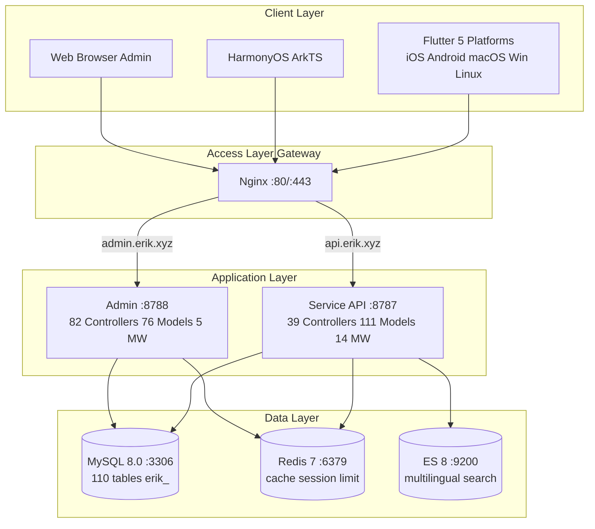
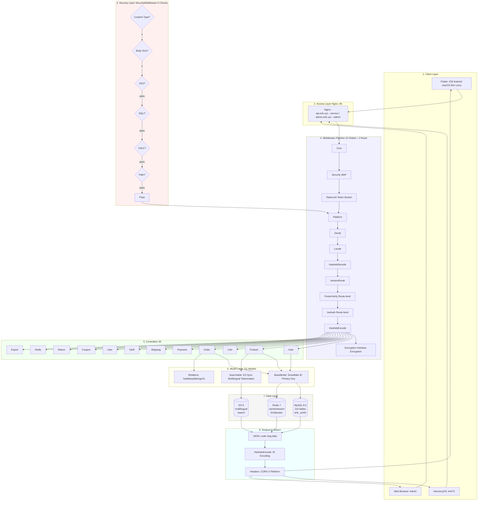
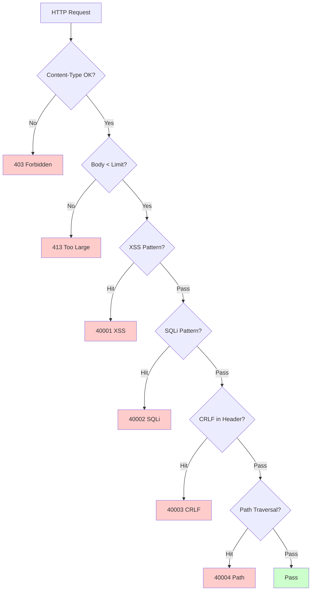
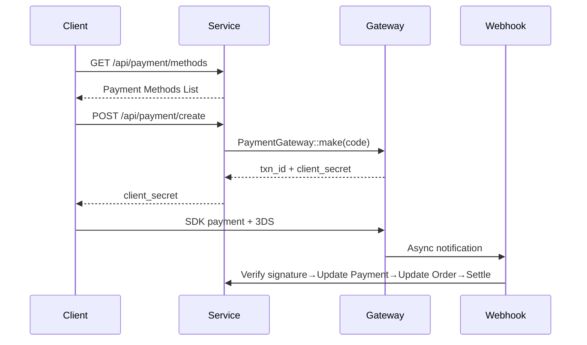
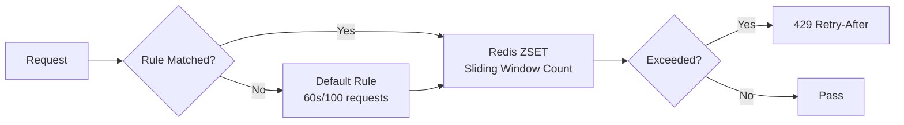

# Cross-Border E-Commerce Platform — Architecture Design Document

Copyright (c) 2026 erik <erik@erik.xyz> — https://erik.xyz

---

## 1. System Overview

### 1.1 Positioning

A full-stack cross-border e-commerce platform built on the high-performance webman framework, supporting B2C, B2B, and third-party seller onboarding.

| Component | Tech Stack | Scale |
|------|--------|------|
| Service API | PHP 8.3 / webman 2.1 / illuminate database | 39 controllers + 111 models + 14 middleware |
| Admin | webman-admin / LayUI / ECharts | 82 controllers + 76 models + 5 middleware |
| Flutter | Riverpod / GoRouter / Dio | 25 Dart files / 11 pages |
| HarmonyOS | ArkTS / ArkUI | 14 ETS files / 9 pages |
| Database | MySQL 8.0 + Redis 7 + ES 8 | 117 tables (110 `erik_` + 7 `wa_`) |

### 1.2 Core Metrics

| Metric | Value |
|------|-----|
| API P99 | <200ms |
| Concurrency | 10000+ (32 resident-memory workers) |
| Tables | 110 |
| Endpoints | 73 |
| Middleware | 14 (service: 10 global + 2 route + AdminKey + StaticFile / admin: 4 global + 1 built-in) |
| Languages | zh_CN, zh_HK, en, ja, ko |
| Currencies | 19 with independent pricing |
| Payments | Stripe / PayPal / Klarna / Adyen |

---

## 2. System Architecture Diagram



### 2.1 Full Design Flow Diagram



**Flow Description:**

| Layer | Description |
|----|------|
| 1. Client Layer | Flutter 5 platforms + HarmonyOS + Web Admin, all communicating over HTTP/JSON |
| 2. Access Layer | Nginx routes by domain: api→service, admin→admin |
| 3. Security Layer | SecurityMiddleware 31 attack detectors, returns error code/403 on hit |
| 4. Middleware Pipeline | 10 global middleware in series + 2 route-level middleware (PosterVerify for sensitive operations, JwtAuth for authenticated endpoints) |
| 5. Controller Layer | 39 API controllers grouped by function, handling all business logic |
| 6. Model Layer | 111 Eloquent models, BaseModel provides Snowflake ID primary keys, 45 models enable SoftDelete per table |
| 7. Data Layer | MySQL (110 tables erik_ prefix / snowflake primary keys) + Redis (cache/Session/rate limit/Poster) + ES (multilingual search) |
| 8. Response Return | Unified JSON format → HashidsEncode encodes IDs → Encryption encrypts (X-Encrypt-Response) → returned to client |

### 2.2 Process Model

```
webman Master (:8787)
  ├── HTTP Worker x32 (CPU×4, resident memory, DB connection pool)
  ├── Monitor Process (file monitoring + memory monitoring)
  └── SnowflakeWorker (initializes Snowflake singleton at startup)
```

---

## 3. Middleware Pipeline

### 3.1 Service API Full Pipeline

```mermaid
graph LR
    A[HTTP Request] --> B[Cors]
    B --> C[Security<br/>Attack Detection]
    C --> D[Platform<br/>Source Identification]
    D --> E[GeoIp<br/>Region Identification]
    E --> F[Locale<br/>Language]
    F --> G[HashidsDecode<br/>ID Decode]
    G --> H[VersionRoute<br/>Version Routing]
    H --> I{Sensitive Operation?}
    I -->|Yes| J[PosterVerify<br/>Human Verification]
    I -->|No| K{JWT Protected?}
    J --> K
    K -->|Yes| L[JwtAuth<br/>Token Validation]
    K -->|No| M[HashidsEncode<br/>ID Encode]
    L --> M
    M --> N[Controller]
    N --> O[HTTP Response]
    style C fill:#fcc
    style J fill:#ffc
    style L fill:#cfc
```



### 3.2 Service Middleware Details

| # | Middleware | Type | Function |
|---|--------|------|------|
| 1 | Cors | Global | Access-Control-* response headers, OPTIONS preflight returns 200 |
| 2 | SecurityMiddleware | Global | XSS/SQL injection/CRLF/path traversal/Content-Type/10MB request body |
| 3 | RateLimitMiddleware | Global | Token bucket rate limiting (Redis ZSET sliding window, 6 endpoint rules) |
| 4 | PlatformMiddleware | Global | X-Platform header + UA fallback identifies 8 platforms |
| 5 | GeoIpMiddleware | Global | MaxMind GeoIP2 region/currency/language detection for logged-out users |
| 6 | LocaleMiddleware | Global | Accept-Language parsing, 5-language exact match→fallback→default |
| 7 | HashidsDecode | Global | `*_id` fields in URL/Body hashid→snowflake ID |
| 8 | VersionRoute | Global | API-Version header→controller namespace (v1/v2) mapping |
| 9 | PosterVerify | Route | Redis-verified token for register/order/payment |
| 10 | JwtAuth | Route | Bearer Token HS256 signature verification + expiry + userId injection |
| 11 | HashidsEncode | Global | Recursively traverses response JSON, snowflake ID→hashid |
| 12 | EncryptionMiddleware | Route | Interface AES encryption/decryption (X-Encrypt-Response/X-Encrypted) |
| 13 | AdminKeyMiddleware | Route | Key validation for internal admin operations |
| 14 | StaticFile | Global | webman static asset serving |

### 3.3 Admin Pipeline

```
Request → SecurityMiddleware → PlatformMiddleware → HashidsDecode
     → webman-admin AccessControl (built-in RBAC) → HashidsEncode → Controller
```

| # | Admin Middleware | Function |
|---|------------|------|
| 1 | SecurityMiddleware | XSS/SQL injection/CRLF/path traversal/Content-Type/20MB |
| 2 | PlatformMiddleware | X-Platform + UA 8-platform identification |
| 3 | HashidsDecode | Request hashid→snowflake ID |
| - | AccessControl (built-in) | Admin role permission validation |
| 4 | HashidsEncode | Response snowflake ID→hashid |

---

## 4. Security Architecture

### 4.1 Attack Detection Pipeline (SecurityMiddleware)



### 4.2 SecurityMiddleware Attack Detection Rules (15 Custom Types)

| # | Attack Type | Primary Detection Method | Service | Admin | Error Code |
|---|---------|------------|---------|-------|--------|
| 1 | XSS cross-site scripting | 13 regexes: script/iframe/on-events/svg+on/style/expression/javascript:/embed/object/link/meta | ✅ | ✅ | 40001 |
| 2 | SQL injection | 13 regexes: UNION SELECT/SELECT FROM WHERE/sleep/benchmark/pg_sleep/boolean-based/string-based/comment chars/MySQL special comments/schema enumeration/load_file/into outfile/stored procedures/waitfor/delay | ✅ | ✅ | 40002 |
| 3 | CRLF header injection | `[\r\n]` in: Authorization/X-Platform/API-Version/X-Forwarded-For/Referer/Origin | ✅ | ✅ | 40003 |
| 4 | Path traversal | `../` + `%2e%2f` encoded + `%252e%252f` double-encoded + null byte `\0` + `.env`/`.git`/`phpmyadmin`/`wp-admin`/`/etc/`/`/proc/`/`composer.json` | ✅ | ✅ | 40004 |
| 5 | Request body limit | Content-Length > 10MB (Service) / 20MB (Admin) | ✅ | ✅ | 40005 |
| 6 | Content-Type | JSON/form-data/form-urlencoded only | ✅ | ✅ | 40006 |
| 7 | File upload validation | Blacklisted extensions (php/phtml/sh/exe/js/...) + double extensions + empty extensions | ✅ | ✅ | 40009 |
| 8 | HTTP security response headers | nosniff/DENY/XSS-Protection/Referrer-Policy/Permissions-Policy/Cache-Control/Server hiding | ✅ | ✅ | — |
| 9 | Brute force protection | Redis counters: API 10/60s, Admin 5/300s | ✅ | ✅ | 40008 |
| 10 | XXE entity injection | `<!ENTITY SYSTEM>`, `<!DOCTYPE [` | ✅ | ✅ | 40010 |
| 11 | SSRF server-side forgery | Internal IPs (127/10/172.16/192.168/0.0/169.254.169.254) + localhost + metadata.google.internal | ✅ | ✅ | 40011 |
| 12 | HTTP method validation | GET/POST/PUT/DELETE/PATCH/OPTIONS/HEAD only | ✅ | ✅ | 40012 |
| 13 | Host header validation | Rejects direct bare-IP access | ✅ | — | 40013 |
| 14 | Sensitive data masking | Logs/error responses filter password/token/secret | ✅ | ✅ | — |
| 15 | CORS whitelist | Configurable origin restrictions | ⚠️ | ⚠️ | — |

### 4.3 Authentication Flow

```
Register: email+password → PosterVerify (human verification) → bcrypt(password+salt)
     → Snowflake generates ID → return JWT

Login: email+password → password_verify(password+salt, bcrypt_hash)
     → update last_login_at/ip/platform → issue JWT

Request: Authorization: Bearer <token>
     → JwtAuth → Jwt::decode → HS256 signature verification + expiry → inject request->userId

Refresh: POST /api/auth/refresh {refresh_token} → Jwt::decode → new access_token
```

### 4.4 Data Security (Three-Layer Encryption)

| Layer | Technology | Package | Fields |
|------|------|-----|------|
| Transport layer | AES-256-CBC | erikwang2013/encryption | Sensitive POST body fields |
| Database layer | Encryptable trait | erikwang2013/encryptable (Maize) | email, mobile, name, phone, detail, tax_id |
| ID obfuscation | Hashids encoding | erikwang2013/hashids | All snowflake IDs at the interface layer |

### 4.5 Platform Source Tracking

| Platform | Identification Method | Header Value |
|------|---------|---------|
| iOS | Flutter `Platform.isIOS` + `TargetPlatform.iOS` | `ios` |
| iPadOS | Flutter `Platform.isIOS` + `!TargetPlatform.iOS` | `ipados` |
| macOS | Flutter `Platform.isMacOS` / UA `Macintosh` | `macos` |
| Windows | Flutter `Platform.isWindows` / UA `Windows` | `windows` |
| Linux | Flutter `Platform.isLinux` / UA `Linux` | `linux` |
| Android | Flutter `Platform.isAndroid` / UA `Android` | `android` |
| HarmonyOS | ArkTS hardcoded / UA `HarmonyOS` | `harmonyos` |
| Web | No UA match / default | `web` |

Recorded in: `erik_orders.platform`, `erik_payments.platform`, `erik_operation_logs.platform`, `erik_users.last_login_platform`, `erik_search_logs.platform`, `erik_chat_messages.platform`

---

## 5. Data Architecture

### 5.1 Primary Key Strategy

```
Snowflake 64bit: [1bit|42bit timestamp|5bitDC|5bitWID|12bit sequence]
- Globally unique / trend-increasing / non-auto-increment
- PHP $keyType='string' (prevents overflow)
- Service worker_id=1, Admin worker_id=2
- Generation: Snowflake::nextId()
```

### 5.2 Model Inheritance

```
Illuminate\Database\Eloquent\Model
  └── app\model\BaseModel
        ├── $incrementing=false, $keyType='string', $guarded=[]
        ├── boot(): Snowflake::nextId()
        └── 110 business models
              ├── 45 use SoftDeletes (tables with deleted_at column)
              ├── some use Encryptable (sensitive fields: email/mobile/name etc.)
              ├── use Searchable (Product→ES)
              └── hasMany/belongsTo relations
```

### 5.3 Multilingual / Multi-Currency

- **Translation**: `erik_product_translations(product_id,locale)` standalone table, queried by locale
- **Pricing**: `erik_product_sku_prices(sku_id,currency_code)` independent price per currency

---

## 6. Payment Architecture



```
PaymentGatewayInterface
  ├── createPayment(data): array
  ├── capturePayment(txnId): array
  ├── refundPayment(txnId, amount): array
  └── verifyWebhook(payload, sig): bool
```

---

## 7. High-Concurrency Architecture

### 7.1 Rate Limiting Strategy (RateLimitMiddleware)



| Endpoint | Window | Limit | Description |
|------|------|------|------|
| /api/auth/login | 60s | 10 | Credential stuffing protection |
| /api/auth/register | 300s | 5 | Mass registration protection |
| /api/payment | 60s | 5 | Card fraud protection |
| /api/orders | 10s | 3 | Fake order protection |
| /api/search | 1s | 10 | Crawler protection |
| Default | 60s | 100 | General API |

### 7.2 Redis Usage

Redis is used for rate limiting token buckets, human verification codes, and Session storage (middleware layer); business data is not cached at the application layer, it reads MySQL directly (read/write split + connection pool).

### 7.4 Connection Pool Optimization

| Resource | Max Connections | Min Connections | Wait Timeout | Idle Timeout | Heartbeat |
|------|---------|---------|---------|---------|------|
| MySQL | 50 | 10 | 2s | 60s | 45s |
| Redis | 30 | 5 | — | 60s | — |

### 7.5 Slow Operation Handling

| Operation | Implementation |
|------|------|
| Exchange rate updates | ExchangeRateCron (hourly, external API) |
| Feed sync | ProductFeedCron (generates TSV every 6 hours and logs) |
| Recommendation calculation | RecommendationCron (daily, purchase co-occurrence) |
| Payment reconciliation | PaymentReconcileCron (every 6 hours, Stripe/PayPal) |
| Settlement | SettlementCron (daily) |
| Shipment tracking | ShipmentTrackingCron (every 30 minutes, API config required) |
| Platform order sync | PlatformOrderSyncCron (every 5 minutes, API config required) |
| Return timeout | ReturnExpireCron (hourly) |
| Price drop / arrival notifications | PriceAlertCron (every 10 minutes) |
| Compliance rule updates | ComplianceCron (daily, API config required) |

## 8. Deployment Architecture

```
docker-compose.yml:
  nginx (alpine) :80 :443
  service (php:8.3) :8787 internal, 32 workers
  admin (php:8.3) :8788 internal
  mysql (8.0) :3306 / redis (7) :6379 / es (8) :9200
Network: erik-net bridge | Persistent data volumes
Routing: api.erik.xyz→service | admin.erik.xyz→admin
```

---


## 8. Internationalization (i18n)

| Layer | Implementation |
|------|------|
| Service | LocaleMiddleware + 5-language translation files (45 keys/language) |
| Admin | 5-language translation files |
| Flutter | AppLocalizations + Riverpod Provider |
| API | Accept-Language header auto-injection |

## 9. API Documentation (hg/apidoc)

| Component | Description |
|------|------|
| Package | hg/apidoc v5.3 |
| Config | config/plugin/hg/apidoc/app.php (6 groups) |
| Annotations | @Apidoc\Title/Desc/Method/Url/Param/Returned |
| Access | http://localhost:8787/apidoc/ |

## 11. Testing

```bash
cd service && php vendor/bin/phpunit tests/
```

| Test Class | Tests | Coverage |
|--------|-------|------|
| SecurityTest | 12 | XSS+SQLi+XXE+SSRF+Path |
| JwtTest | 4 | encode/decode/invalid |
| ApiResponseTest | 3 | success/fail/paginate |
| RedisFacadeTest | 3 | ping/set/get/redis() |
| **Total** | **22** | **45 assertions PASS** |

---

## 12. Project Statistics

| Dimension | Count |
|------|------|
| PHP source files | service:210 + admin:214 = 424 |
| Dart (Flutter) | 25 |
| ArkTS (HarmonyOS) | 14 |
| Database tables | 110 |
| API endpoints | 73 |
| Middleware | 14 |
| Utility classes | 8 |
| Scheduled tasks | 12 |
| Config items | 35+ |
| Tests | 22 tests, 45 assertions |
| Skills | 38 |
| Documents | 9 |
| **Total** | **~700** |
