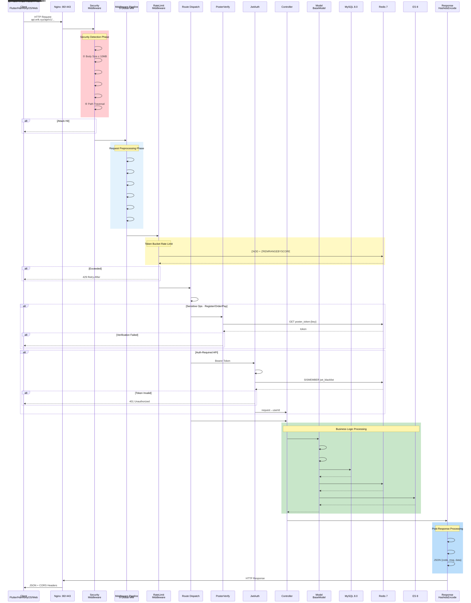

# Cross-Border E-Commerce Platform — Architecture Diagram Set

Copyright (c) 2026 erik <erik@erik.xyz> — https://erik.xyz

---

## 1. System Architecture Diagram

---

## 2. Request Processing Flow Diagram (Middleware Pipeline)

---

## 3. Feature Module Map

---

## 4. Request Lifecycle Diagram

---

## 5. Order Lifecycle Diagram

---

## 6. Deployment Architecture Diagram

---

## 7. Security Architecture Diagram

### Security Defense Overview

| Layer | Defense Line | Technology/Package | Coverage |
|------|------|---------|---------|
| Layer 1 | Network boundary | Nginx SSL + reverse proxy + Host validation | Service + Admin |
| Layer 2 | WAF attack detection | `erikwang2013/security-php` 31 detectors | XSS/SQLi/CRLF/path traversal/XXE/SSRF/file upload/method/Host/Content-Type/Body etc. |
| Layer 3 | Traffic control + dependency resilience | RateLimitMiddleware + brute force Redis counters + CircuitBreaker | Token bucket rate limiting (6 endpoints) + login/register anti-brute-force + payment/social-login circuit breaker (5 failures→30s, half-open recovery) |
| Layer 4 | Identity authentication | PosterVerify + JwtAuth HS256 | Human verification (slider/puzzle/click) + Bearer Token + dual-token refresh |
| Layer 5 | Data security | Hashids + AES-256-CBC + Encryptable | Three-layer encryption: ID obfuscation/transport encryption/database field encryption |
| Layer 6 | Response security | HTTP security headers + sensitive data masking | nosniff/DENY/XSS-Protection/Referrer-Policy/log masking |
| Ongoing | Audit trail | PlatformMiddleware + OperationLogs | 8-platform source tracking + recorded in 6 tables + operation logs |

---

## 8. Multi-Currency Settlement Flow Diagram

### Multi-Currency Settlement Notes

**Multi-currency pricing**: Product SKUs are priced per `currency_code`, and orders lock in the receiving currency at checkout (USD / EUR / GBP / CNY etc.).

**FX service**: The `erik_exchange_rates` rate table supports manual maintenance and automatic fetching via exchangerate-api, versioned by `effective_at` effective time; settlement uses the FX rate snapshot at the time of payment.

**Original-currency charging**: Stripe / PayPal / Klarna / Adyen charge in the order currency; webhook signature verification confirms receipt before updating payment and order status.

**Settlement allocation**: After successful payment, `PlatformSettlements` are generated automatically (order total + platform commission + payment gateway fee, booked in the order currency); merchant settlements `MerchantSettlements` (order amount → commission rate → settlement amount), supplier settlements `SupplierSettlements`, and affiliate commission payouts `AffiliatePayouts` are four independent settlement lines, status 0 pending settlement / 1 settled.

**FX gains/losses**: `CurrencyExchangeGainsLosses` tracks the difference between the receiving currency and the settlement currency, comparing the FX rate at payment time with the rate at settlement time; positive = FX gain, negative = FX loss, supporting multi-currency reconciliation and auditing for cross-border e-commerce.

---

## Diagram Index

| No. | Diagram | Type | Purpose |
|------|------|------|------|
| 1 | System Architecture Diagram | Architecture | Shows the full system: Client→Gateway→Application→Data→External Services |
| 2 | Request Processing Flow Diagram | Flow | Shows the complete path of an HTTP request through the 12-layer middleware pipeline (10 global + 2 route) |
| 3 | Feature Module Map | Feature | Shows 17 major feature modules and their sub-features |
| 4 | Request Lifecycle Diagram | Lifecycle | Shows the complete sequence from request to response and interactions at each stage |
| 5 | Order Lifecycle Diagram | Lifecycle | Shows all state transitions of an order from cart to completed/refunded |
| 6 | Deployment Architecture Diagram | Architecture | Shows Docker Compose container orchestration, network, and data volumes |
| 7 | Security Architecture Diagram | Architecture | Shows the 6-layer defense-in-depth system: boundary→WAF→traffic/resilience (rate limiting + circuit breaker)→auth→data→response |
| 8 | Multi-Currency Settlement Flow Diagram | Flow | Shows the complete chain: per-currency pricing→payment→settlement→settlement allocation→FX gains/losses |
