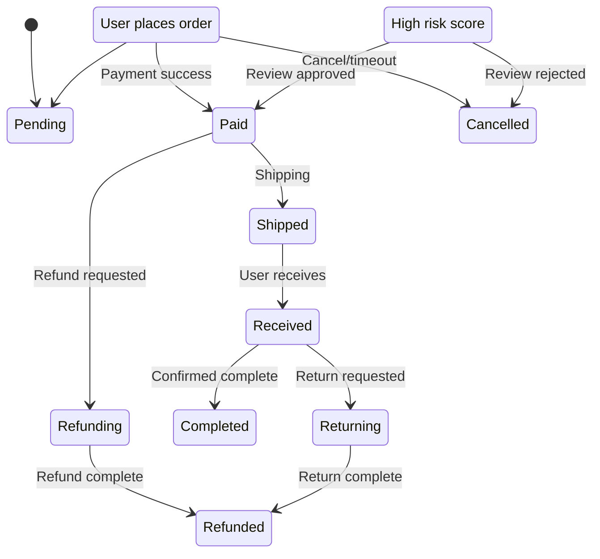
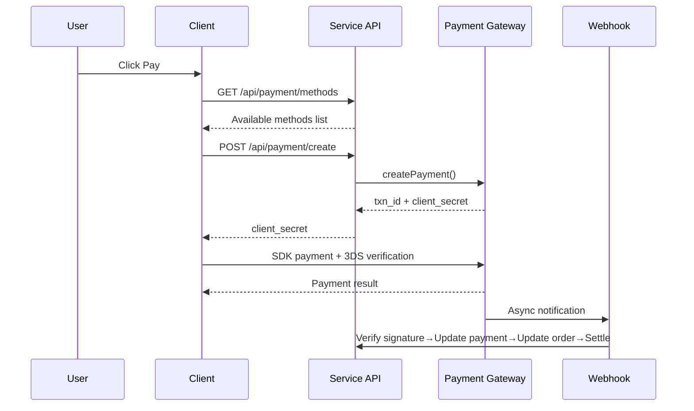
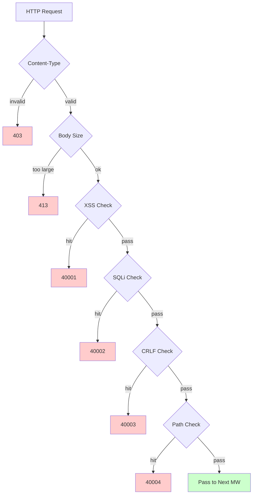

# Cross-Border E-Commerce Platform — Feature Design Document

Copyright (c) 2026 erik <erik@erik.xyz> — https://erik.xyz

---


## Platform Tracking

### 8-Platform Identification

| Platform | Header | Flutter | Admin |
|------|--------|---------|-------|
| iOS | `ios` | Platform.isIOS + TargetPlatform.iOS | UA iPhone |
| iPadOS | `ipados` | Platform.isIOS + !TargetPlatform.iOS | UA iPad |
| macOS | `macos` | Platform.isMacOS | UA Macintosh |
| Windows | `windows` | Platform.isWindows | UA Windows |
| Linux | `linux` | Platform.isLinux | UA Linux |
| Android | `android` | Platform.isAndroid | UA Android |
| HarmonyOS | `harmonyos` | — | UA HarmonyOS |
| Web | `web` | kIsWeb | Default |

### DB Tracking Fields

| Table | Field | Description |
|----|------|------|
| erik_orders | platform VARCHAR(16) | Order placement platform |
| erik_payments | platform VARCHAR(16) | Payment platform |
| erik_operation_logs | platform VARCHAR(16) | Operation platform |
| erik_users | last_login_platform VARCHAR(16) | Login platform |
| erik_search_logs | platform VARCHAR(16) | Search platform |
| erik_chat_messages | platform VARCHAR(16) | Message source |

## 1. Feature Overview

### 1.0 Coverage Overview

| Dimension | Coverage | Depth |
|------|---------|------|
| **B2C Retail** | Multilingual products, per-currency pricing, SKUs, cart, orders, payments (Stripe/PayPal/Klarna), refunds, returns | Complete |
| **B2B Wholesale** | Tiered pricing (MOQ), business verification (tax ID / business license), RFQ | Complete |
| **Multi-Merchant Onboarding** | Seller review, product review, commission splitting | Complete |
| **Cross-Border Compliance** | HS Code database (6-digit base code), tariff rules (destination country + HS → duty rate), VAT/IOSS, compliance labels (FDA/CE/RoHS etc., 10 categories) | Complete |
| **International Logistics** | Zone-based shipping rates (weight tiers), DHL/UPS/FedEx/EMS, overseas warehouses (shipping + returns), HS declaration (battery/liquid flags), commercial invoice PDF/packing list | Complete |
| **Payments** | Stripe PaymentIntent + 3DS, PayPal REST, Klarna BNPL, Adyen, webhook signature verification + settlement | Stripe complete, others placeholder |
| **Marketing** | Coupons (zone + new/existing customer limits), banners (region visibility), flash sales (time + quantity limited), group buys (group size + validity), affiliate (links + commissions + payouts) | Complete |
| **Multi-Platform** | Amazon/eBay/Shopee/Lazada/Temu listings + order aggregation, multi-store management | Complete |
| **Supply Chain** | Supplier profiles + ratings, purchase orders (review→ship→receive→QC), quality inspection (inbound/outbound gate + appearance/function/compliance label checks), inventory ledger (immutable: inbound/outbound/transfer/count) | Complete |
| **Risk & Compliance** | Rule engine (side-channel scoring: address validation/zip match/3DS/mass registration/abnormal value), KYC, GDPR/CCPA data requests, Cookie Consent versioning | Complete |
| **Security** | SecurityMiddleware wraps 31 detectors from security-php: XSS (13 regexes)/SQL injection (13 regexes)/CRLF/path traversal (encoding + null byte)/body size/Content-Type/file upload/HTTP security headers/brute force (Redis counters)/XXE/SSRF/method/Host/sensitive data masking/CORS | Complete |
| **High Concurrency** | Token bucket rate limiting (sliding window + 6 endpoint rules), circuit breaker (payments/social login, 5 failures → 30s open + half-open recovery), DB read/write split (2 read replicas + sticky), connection pools (DB 50/10 + Redis 30/5), OPCache (128MB, Docker environment) | Complete |
| **Membership Growth** | Membership levels + benefits, point rules + ledger, gift cards (balance + redemption), price drop/arrival alerts, wishlists, product comparison, browsing history, subscription orders, AB testing (traffic allocation + confidence) | Complete |
| **Content Management** | CMS multilingual pages (Landing/Blog), multilingual FAQ, multilingual knowledge base, size charts (apparel/footwear + US/UK/EU/JP/CN conversion), email templates (multilingual), product feeds (Google/Meta + scheduled sync) | Complete |
| **Customer Service** | WebSocket real-time IM (chat_sessions/chat_messages), multilingual knowledge base | Schema complete, WS pending |
| **Infrastructure** | Snowflake distributed IDs (bigint non-auto-increment), Hashids API ID obfuscation, JWT auth (HS256 + access/refresh dual-token refresh), AES encryption (interface + database three-layer encryption), GeoIP region detection (MaxMind), Poster human verification (slider/puzzle/click) | Complete |
| **Multi-Platform Clients** | Flutter 5 platforms (iOS/Android/macOS/Windows/Linux/iPadOS) + HarmonyOS (ArkTS 9 pages) + Web Admin (LayUI+ECharts) + API | Flutter 25 files, HarmonyOS 14 files, Admin 239 files |
| **Platform Tracking** | 8-platform identification (iOS/iPadOS/macOS/Windows/Linux/Android/HarmonyOS/Web) + X-Platform header + recorded in 6 tables (orders/payments/operation_logs/users/search_logs/chat_messages) | Complete |
| **Testing** | 22 tests / 45 assertions — ALL PASS (SecurityTest 12: XSS+SQLi+XXE+SSRF+Path / JwtTest 4 / ApiResponseTest 3 / RedisFacadeTest 3) | Unit tests complete, integration tests pending |

### 1.1 Module Matrix

| Top-Level Module | Sub-Modules | Priority | Status |
|---------|---------|--------|------|
| User System | Register/Login/Social login/KYC/Addresses/Wishlist/Membership/Points/Gift cards | P0-P2 | ✅ |
| Product System | Categories/SKU/Multilingual/Multi-currency/Images/Attributes/Compliance/HS Code/ES search/Feed | P0-P1 | ✅ |
| Transaction System | Cart/Orders/Payments (Stripe+PayPal+Klarna)/Refunds/Returns/Invoices | P0 | ✅ |
| Logistics System | International carriers/Zone-based shipping/Overseas warehouses/Shipping (HS declaration)/Shipping insurance | P0-P1 | ✅ |
| Customs & Tax | HS Code database/Tariff rules/VAT/IOSS/Country compliance restrictions | P0 | ✅ |
| Marketing System | Coupons/Banners/Flash sales/Group buys/Affiliate | P1-P2 | ✅ |
| Supply Chain | Suppliers/Purchase orders/Quality inspection/Inventory ledger | P1 | ✅ |
| Risk & Compliance | Rule engine/GDPR/CCPA/Cookie Consent/Platform tracking | P1 | ✅ |
| Security | XSS/SQL injection/CRLF/path traversal/Content-Type/request body | P0 | ✅ |
| Multi-Platform | Amazon/eBay/Shopee listings + order aggregation/Multi-merchant onboarding | P2 | ✅ |
| Content Management | CMS/FAQ/Knowledge base/Email templates/Notifications/Size charts | P2 | ✅ |
| Growth Tools | B2B wholesale/Subscription orders/AB testing | P2-P3 | ✅ |
| Customer Service | WebSocket real-time IM/Knowledge base | P3 | ✅ |
| Infrastructure | Snowflake ID/JWT/Hashids/Encryption/Poster/API versioning/GeoIP | P0 | ✅ |

---

## 2. Core Business Flow Diagrams

### 2.1 Order State Machine



### 2.2 Payment Sequence



### 2.3 Security Detection Pipeline



---

## 3. Core Business Flows

### 3.1 User Registration and Login

```
EMAIL registration: email+password → PosterVerify human verification → bcrypt(password+salt)
          → Snowflake generates ID → return JWT {access_token, expires_in}

Social login: Google/Apple/Facebook OAuth → verify id_token
        → check erik_user_social_accounts binding
        → Bound: login / Unbound: auto-create user + bind → return JWT

Login: email+password → password_verify(password+salt)
    → update last_login_at/ip/platform → issue JWT

Token refresh: refresh_token → Jwt::decode → new access_token
```

### 3.2 Product Browsing and Search

```
List: GET /api/products
  → Filters: category_id/status/keyword/price_range
  → Sort: default/price_asc/price_desc/sales/newest
  → Multilingual: ProductTranslations filtered by locale
  → Per-currency: ProductSkuPrices matched by currency_code
  → Pagination: 20 per page

ES search: GET /api/search?keyword=xxx
  → Erikwang2013\WebmanScout\Searchable → ES multilingual analyzers
  → Facets: category/price/brand
  → Fallback: MySQL LIKE when ES unavailable

Detail: GET /api/products/{hashid}
  → HashidsDecode middleware decodes → Eager Load
  → Multilingual + per-currency + compliance + HS Code + size conversion + incl./excl. tax + VAT
```

### 3.3 Cart and Order Placement

```
Cart: POST /api/cart {sku_id, quantity}
  → Validate SKU exists | listed | sufficient stock
  → Same SKU accumulates / creates if not present

Order: POST /api/orders {address_id, coupon_id, currency_code}
  → 1. Validate shipping address → 2. Get selected cart items → 3. Validate per product (stock + compliance)
  → 4. Calculate price (per-currency + coupon) → 5. Generate order number
  → 6. Create Order + OrderItems → 7. Deduct stock → 8. Write OrderLog
  → 9. Risk scoring (RiskEngine::score) → 10. Clear purchased cart items

Cancel: POST /api/orders/{id}/cancel
  → Validate status=0 (pending payment) → restore stock → status=5 (cancelled)
```

### 3.4 Payment Flow

```
Available methods: GET /api/payment/methods?country=DE&currency=EUR
  → PaymentGatewayMethods (filtered by country+currency)

Create payment: POST /api/payment/create
  → PaymentGateway::make(gateway)→createPayment()
  → Stripe: PaymentIntent → client_secret → frontend SDK (+3DS)

Webhook: POST /webhook/payment/stripe
  → Verify signature → payment_intent.succeeded:
     → Payment.status=paid → Order.status=paid
     → PlatformSettlement (platform commission + gateway fee + supplier + affiliate)
```

### 3.5 Return Flow

```
Request: POST /api/returns {order_id, reason_id}
  → Determine return channel: local warehouse (type=1) / return to China (type=2) / refund only (type=3)

Review: Admin review → approved: generate ReturnLabel / rejected: record reason

Send back: download label→send back→logistics update→warehouse receipt→status=received

Refund: status=completed → create associated Refund → PaymentGateway::refund→refund to original channel
```

### 3.6 Tariff Estimate

```
GET /api/tariff/estimate?product_id=xxx&dest_country_id=xxx&declared_value=100

1. ProductHsCodes → HsCode
2. TariffRules(dest_country_id + hs_code_id) → duty_rate + duty_free_threshold
3. VatSettings(country_id) → vat_rate + vat_free_threshold
4. duty = value>=threshold ? value*duty_rate/100 : 0
   vat = (value+duty)>=threshold ? (value+duty)*vat_rate/100 : 0
5. return {duty_rate, vat_rate, estimated_duty, estimated_vat, estimated_total, hs_code, disclaimer}
```

---

## 4. Security (SecurityMiddleware wraps 31 detectors from security-php)

### 4.1 Detection Rules Table

| # | Attack Type | Primary Detection Method | Error Code | Service | Admin |
|---|---------|------------|--------|---------|-------|
| 1 | XSS cross-site scripting | 13 regexes: script/iframe/on-events/svg+on/style/expression/javascript:/embed/object/link/meta | 40001 | ✅ | ✅ |
| 2 | SQL injection | 13 regexes: UNION SELECT/SELECT FROM WHERE/sleep/benchmark/pg_sleep/boolean-based/string-based/comment chars/MySQL special comments/schema enumeration/load_file/into outfile/stored procedures/waitfor/delay | 40002 | ✅ | ✅ |
| 3 | CRLF header injection | `[\r\n]` in: Authorization/X-Platform/API-Version/X-Forwarded-For/Referer/Origin | 40003 | ✅ | ✅ |
| 4 | Path traversal | `../` + `%2e%2f` encoded + `%252e%252f` double-encoded + null byte `\0` + `.env`/`.git`/`phpmyadmin`/`wp-admin`/`/etc/`/`/proc/`/`composer.json` | 40004 | ✅ | ✅ |
| 5 | Request body limit | Content-Length > 10MB (Service) / 20MB (Admin) | 40005 | ✅ | ✅ |
| 6 | Content-Type restriction | JSON/form-data/form-urlencoded only | 40006 | ✅ | ✅ |
| 7 | **File upload validation** | Blacklisted extensions (php/phtml/sh/exe/js/...) + double extension attacks + empty extensions | 40009 | ✅ | ✅ |
| 8 | **HTTP security response headers** | nosniff/DENY/XSS-Protection/Referrer-Policy/Permissions-Policy/Cache-Control/Server hiding | — | ✅ | ✅ |
| 9 | **Brute force protection** | Redis counters: API 10/60s, Admin 5/300s | 40008 | ✅ | ✅ |
| 10 | **XXE entity injection** | `<!ENTITY SYSTEM>`, `<!DOCTYPE [` | 40010 | ✅ | ✅ |
| 11 | **SSRF server-side forgery** | Internal IPs (127/10/172.16/192.168/0.0/169.254.169.254) + localhost + metadata.google.internal | 40011 | ✅ | ✅ |
| 12 | **HTTP method validation** | GET/POST/PUT/DELETE/PATCH/OPTIONS/HEAD only | 40012 | ✅ | ✅ |
| 13 | **Host header validation** | Rejects direct bare-IP access | 40013 | ✅ | — |
| 14 | **Sensitive data masking** | Logs/error responses filter password/token/secret | — | ✅ | ✅ |
| 15 | **CORS whitelist** | Configurable origin restrictions | — | ⚠️ | ⚠️ |

### 4.2 Middleware Pipeline

```
Service: Cors → Security → Platform → GeoIp → Locale → HashidsDecode
        → VersionRoute → (PosterVerify) → (JwtAuth) → HashidsEncode

Admin: Security → Platform → HashidsDecode → AccessControl → HashidsEncode
```

### 4.3 Platform Source Tracking

| Platform | Header Value | Identification Method |
|------|---------|---------|
| iOS | `ios` | Flutter `Platform.isIOS` |
| iPadOS | `ipados` | Flutter `TargetPlatform.iOS` detection |
| macOS | `macos` | Flutter `Platform.isMacOS` |
| Windows | `windows` | Flutter `Platform.isWindows` |
| Linux | `linux` | Flutter `Platform.isLinux` |
| Android | `android` | Flutter `Platform.isAndroid` |
| HarmonyOS | `harmonyos` | ArkTS hardcoded |
| Web | `web` | UA fallback / default |

---


## 5. High Concurrency and Performance

### 5.1 Rate Limiting Rules

| Endpoint | Algorithm | Window | Limit |
|------|------|------|------|
| /api/auth/login | Sliding window | 60s | 10 |
| /api/auth/register | Sliding window | 300s | 5 |
| /api/payment | Sliding window | 60s | 5 |
| /api/orders | Sliding window | 10s | 3 |
| /api/search | Sliding window | 1s | 10 |
| Default | Sliding window | 60s | 100 |

### 5.2 Redis Usage

| Usage | Implementation |
|------|------|
| Rate limiting token bucket | Redis ZSET sliding window |
| Human verification | PosterVerify verification code state |
| Session storage | Redis KV storage |

Business data is not cached at the application layer, it reads MySQL directly (read/write split + connection pool).

### 5.3 Connection Pools

| Resource | Max | Min | Timeout |
|------|------|------|------|
| MySQL | 50 | 10 | 2s |
| Redis | 30 | 5 | — |

## 6. Data Table Relationship Diagram

```
erik_users ──┬── addresses, social_accounts, wishlists, kyc
             ├── carts, orders → order_items → payments
             ├── reviews, coupons(through user_coupons)
             ├── notifications, subscriptions, point_logs
             ├── affiliate_links, chat_sessions, b2b_verifications
             └── privacy_requests

erik_products ──┬── translations(product_id, locale)
                ├── skus → sku_prices(sku_id, currency_code)
                ├── images, reviews, compliance → compliance_categories
                ├── hs_codes → hs_codes, recommendations
                ├── b2b_prices, platform_listings
                └── product_comparisons

erik_orders ──┬── order_items, order_logs
              ├── payments, refunds, return_orders → return_labels
              ├── order_documents, shipments
              ├── platform_settlements, risk_logs
              └── subscription_orders

erik_countries ──┬── vat_settings, tariff_rules(dest_country_id)
                 ├── country_compliance_rules
                 ├── shipping_zones(JSON countries)
                 └── warehouses(country_id)
```

---

## 7. API Endpoints

For the complete API endpoint list (23 public endpoints + 47 authenticated endpoints + Webhooks + Admin/Health), see [API Documentation](api.md).

---

## 8. Test Verification

```bash
cd service && php vendor/bin/phpunit tests/
```

| Test Class | Tests | Coverage |
|--------|-------|------|
| SecurityTest | 12 | XSS (3) + SQLi (2) + XXE (2) + SSRF (1) + Path (2) + credit card leakage (1) + normal pass (1) |
| JwtTest | 4 | encode three-part JWT + decode round-trip + invalid token→null + empty token→null |
| ApiResponseTest | 3 | success (code=0) + fail (error code) + paginate (list+meta pagination) |
| RedisFacadeTest | 3 | ping + set/get round-trip + redis() helper function (skipped when Redis unavailable) |
| **Total** | **22** | **45 assertions — ALL PASS** |
