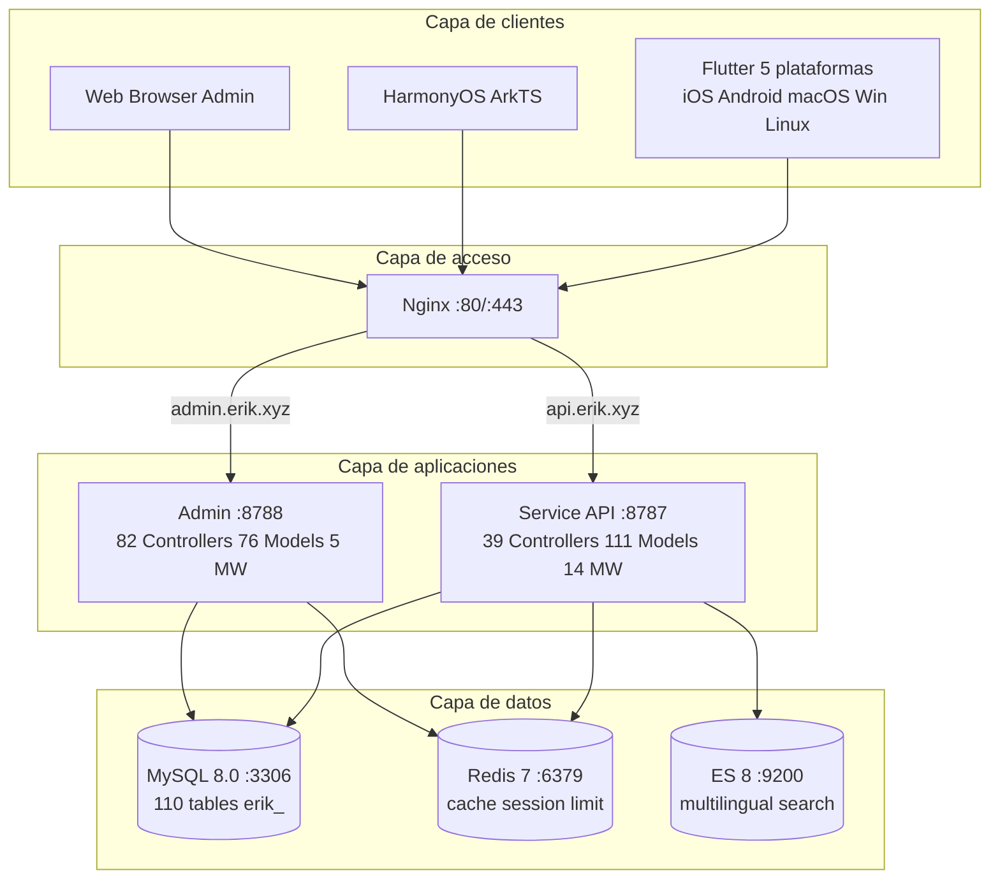
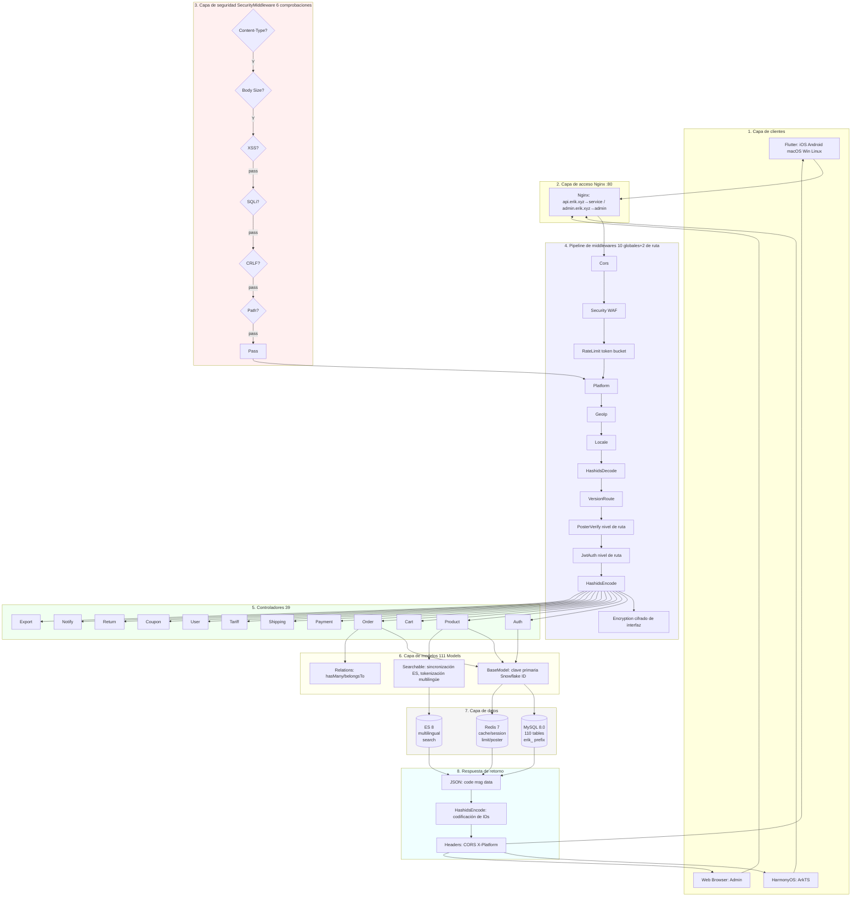
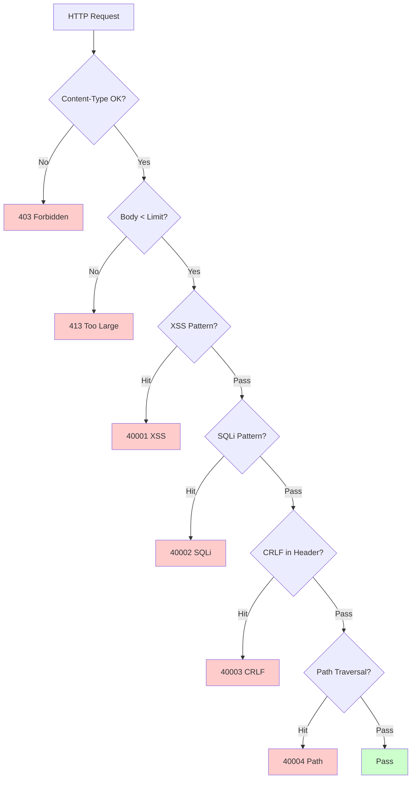
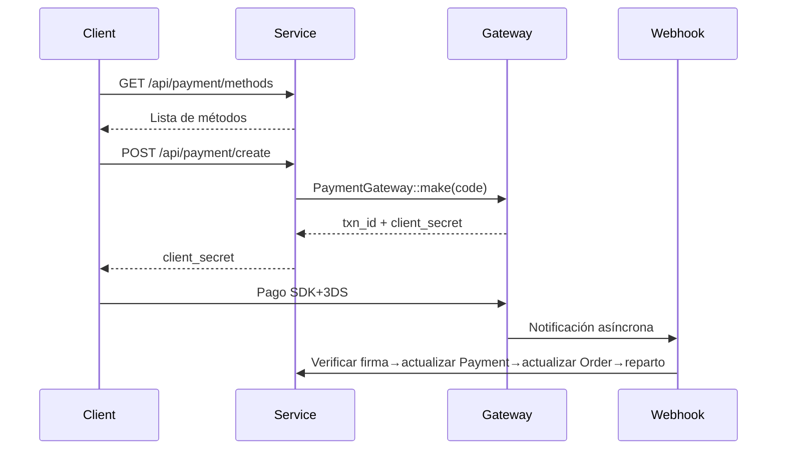
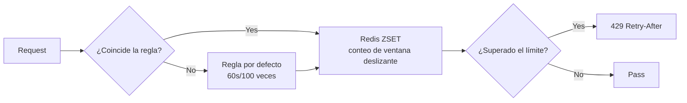

# Plataforma de comercio electrónico transfronterizo — Documento de diseño de arquitectura

Copyright (c) 2026 erik <erik@erik.xyz> — https://erik.xyz

---

## 1. Resumen del sistema

### 1.1 Posicionamiento

Plataforma de comercio electrónico transfronterizo full-stack basada en el framework de alto rendimiento webman, compatible con B2C, B2B e incorporación de vendedores de terceros.

| Componente | Stack técnico | Escala |
|------|--------|------|
| Service API | PHP 8.3 / webman 2.1 / illuminate database | 39 controladores + 111 modelos + 14 middlewares |
| Admin | webman-admin / LayUI / ECharts | 82 controladores + 76 modelos + 5 middlewares |
| Flutter | Riverpod / GoRouter / Dio | 25 archivos Dart / 11 páginas |
| HarmonyOS | ArkTS / ArkUI | 14 archivos ETS / 9 páginas |
| Base de datos | MySQL 8.0 + Redis 7 + ES 8 | 117 tablas (110 `erik_` + 7 `wa_`) |

### 1.2 Indicadores clave

| Indicador | Valor |
|------|-----|
| API P99 | <200ms |
| Concurrencia | 10000+ (32 workers en memoria residente) |
| Tablas | 110 |
| Endpoints | 73 |
| Middlewares | 14 (service: 10 globales + 2 de ruta + AdminKey + StaticFile / admin: 4 globales + 1 integrado) |
| Idiomas | zh_CN, zh_HK, en, ja, ko |
| Monedas | 19 con precios independientes |
| Pagos | Stripe / PayPal / Klarna / Adyen |

---

## 2. Diagrama de arquitectura del sistema



### 2.1 Diagrama de flujo de diseño completo



**Explicación del diagrama de flujo:**

| Capa | Descripción |
|----|------|
| 1. Capa de cliente | Flutter 5 plataformas + HarmonyOS + Web Admin, todas comunican vía HTTP/JSON |
| 2. Capa de acceso | Nginx distribuye por dominio: api→service, admin→admin |
| 3. Capa de seguridad | SecurityMiddleware con 31 detectores de ataques, al detectar devuelve código de error/403 |
| 4. Pipeline de middlewares | 10 MW globales en serie + 2 MW de nivel de ruta (PosterVerify para operaciones sensibles, JwtAuth para interfaces autenticadas) |
| 5. Capa de controladores | 39 controladores API agrupados por función, procesan toda la lógica de negocio |
| 6. Capa de modelos | 111 modelos Eloquent, BaseModel proporciona la clave primaria Snowflake ID, 45 modelos habilitan SoftDelete por tabla |
| 7. Capa de datos | MySQL (110 tablas prefijo erik_/clave primaria snowflake) + Redis (caché/Session/limitación/Poster) + ES (búsqueda multilingüe) |
| 8. Respuesta de retorno | Formato JSON unificado → HashidsEncode codifica IDs → Encryption cifra (X-Encrypt-Response) → retorno al cliente |

### 2.2 Modelo de procesos

```
webman Master (:8787)
  ├── HTTP Worker x32 (CPU×4, memoria residente, pool de conexiones DB)
  ├── Monitor Process (monitoreo de archivos+monitoreo de memoria)
  └── SnowflakeWorker (inicializa el singleton Snowflake al arrancar)
```

---

## 3. Pipeline de middlewares

### 3.1 Pipeline completo de Service API

```mermaid
graph LR
    A[HTTP Request] --> B[Cors]
    B --> C[Security<br/>detección de ataques]
    C --> D[Platform<br/>reconocimiento de origen]
    D --> E[GeoIp<br/>reconocimiento de región]
    E --> F[Locale<br/>idioma]
    F --> G[HashidsDecode<br/>decodificación de IDs]
    G --> H[VersionRoute<br/>enrutado por versión]
    H --> I{¿Operación sensible?}
    I -->|Yes| J[PosterVerify<br/>verificación humano-máquina]
    I -->|No| K{¿Protección JWT?}
    J --> K
    K -->|Yes| L[JwtAuth<br/>verificación de Token]
    K -->|No| M[HashidsEncode<br/>codificación de IDs]
    L --> M
    M --> N[Controller]
    N --> O[HTTP Response]
    style C fill:#fcc
    style J fill:#ffc
    style L fill:#cfc
```



### 3.2 Detalle de middlewares de Service

| # | Middleware | Tipo | Función |
|---|--------|------|------|
| 1 | Cors | Global | Cabeceras de respuesta Access-Control-*, preflight OPTIONS devuelve 200 |
| 2 | SecurityMiddleware | Global | XSS/inyección SQL/CRLF/recorrido de rutas/Content-Type/cuerpo de solicitud 10MB |
| 3 | RateLimitMiddleware | Global | Limitación de velocidad con token bucket (Redis ZSET ventana deslizante, reglas para 6 endpoints) |
| 4 | PlatformMiddleware | Global | Header X-Platform + identificación de 8 plataformas con degradación por UA |
| 5 | GeoIpMiddleware | Global | MaxMind GeoIP2, identificación de región/moneda/idioma para usuarios no autenticados |
| 6 | LocaleMiddleware | Global | Análisis de Accept-Language, coincidencia exacta de 5 idiomas → degradación → predeterminado |
| 7 | HashidsDecode | Global | Campos `*_id` en URL/Body, hashid→snowflake ID |
| 8 | VersionRoute | Global | Header API-Version→mapeo a espacio de nombres de controlador (v1/v2) |
| 9 | PosterVerify | Ruta | Registro/pedido/pago, verificación de token en Redis |
| 10 | JwtAuth | Ruta | Bearer Token HS256 verificación de firma + expiración + inyección de userId |
| 11 | HashidsEncode | Global | Recorrido recursivo del JSON de respuesta, snowflake ID→hashid |
| 12 | EncryptionMiddleware | Ruta | Cifrado/descifrado AES de interfaces (X-Encrypt-Response/X-Encrypted) |
| 13 | AdminKeyMiddleware | Ruta | Verificación de clave para operaciones de administración interna |
| 14 | StaticFile | Global | Servicio de recursos estáticos de webman |

### 3.3 Pipeline de Admin

```
Petición → SecurityMiddleware → PlatformMiddleware → HashidsDecode
     → webman-admin AccessControl (RBAC integrado) → HashidsEncode → Controlador
```

| # | Middleware de Admin | Función |
|---|------------|------|
| 1 | SecurityMiddleware | XSS/inyección SQL/CRLF/recorrido de rutas/Content-Type/20MB |
| 2 | PlatformMiddleware | X-Platform + UA identificación de 8 plataformas |
| 3 | HashidsDecode | Solicitudes hashid→snowflake ID |
| - | AccessControl (integrado) | Verificación de permisos por rol de administrador |
| 4 | HashidsEncode | Respuestas snowflake ID→hashid |

---

## 4. Arquitectura de seguridad

### 4.1 Pipeline de detección de ataques (SecurityMiddleware)



### 4.2 Detalle de reglas de detección de SecurityMiddleware (15 tipos personalizados)

| # | Tipo de ataque | Método principal de detección | Service | Admin | Código de error |
|---|---------|------------|---------|-------|--------|
| 1 | XSS scripting entre sitios | 13 regex: script/iframe/eventos on/svg+on/style/expression/javascript:/embed/object/link/meta | ✅ | ✅ | 40001 |
| 2 | Inyección SQL | 13 regex: UNION SELECT/SELECT FROM WHERE/sleep/benchmark/pg_sleep/tipo booleano/tipo cadena/comentarios/comentarios especiales MySQL/enumeración de schema/load_file/into outfile/procedimientos almacenados/waitfor/delay | ✅ | ✅ | 40002 |
| 3 | Inyección de cabecera CRLF | `[\r\n]` en: Authorization/X-Platform/API-Version/X-Forwarded-For/Referer/Origin | ✅ | ✅ | 40003 |
| 4 | Recorrido de rutas | `../` + codificación `%2e%2f` + doble codificación `%252e%252f` + byte nulo `\0` + `.env`/`.git`/`phpmyadmin`/`wp-admin`/`/etc/`/`/proc/`/`composer.json` | ✅ | ✅ | 40004 |
| 5 | Límite de cuerpo de solicitud | Content-Length > 10MB (Service) / 20MB (Admin) | ✅ | ✅ | 40005 |
| 6 | Content-Type | Solo JSON/form-data/form-urlencoded | ✅ | ✅ | 40006 |
| 7 | Validación de subida de archivos | Extensiones en lista negra (php/phtml/sh/exe/js/...) + doble extensión + extensión vacía | ✅ | ✅ | 40009 |
| 8 | Cabeceras de seguridad HTTP | nosniff/DENY/XSS-Protection/Referrer-Policy/Permissions-Policy/Cache-Control/ocultación de Server | ✅ | ✅ | — |
| 9 | Protección contra fuerza bruta | Contador Redis: API 10 veces/60s, Admin 5 veces/300s | ✅ | ✅ | 40008 |
| 10 | Inyección de entidades XXE | `<!ENTITY SYSTEM>`, `<!DOCTYPE [` | ✅ | ✅ | 40010 |
| 11 | SSRF falsificación de servidor | IP de intranet (127/10/172.16/192.168/0.0/169.254.169.254) + localhost + metadata.google.internal | ✅ | ✅ | 40011 |
| 12 | Validación de método HTTP | Solo GET/POST/PUT/DELETE/PATCH/OPTIONS/HEAD | ✅ | ✅ | 40012 |
| 13 | Validación de cabecera Host | Rechaza conexión directa con IP desnuda | ✅ | — | 40013 |
| 14 | Enmascaramiento de datos sensibles | Los registros/respuestas de error filtran password/token/secret | ✅ | ✅ | — |
| 15 | Lista blanca CORS | Límite de origin configurable | ⚠️ | ⚠️ | — |

### 4.3 Flujo de autenticación

```
Registro: email+password → PosterVerify (verificación humano-máquina) → bcrypt(password+salt)
     → Snowflake genera ID → devuelve JWT

Inicio de sesión: email+password → password_verify(password+salt, bcrypt_hash)
     → actualizar last_login_at/ip/platform → emite JWT

Petición: Authorization: Bearer <token>
     → JwtAuth → Jwt::decode → verificar firma HS256+expiración → inyectar request->userId

Refresco: POST /api/auth/refresh {refresh_token} → Jwt::decode → nuevo access_token
```

### 4.4 Seguridad de datos (cifrado en tres capas)

| Capa | Tecnología | Paquete | Campos |
|------|------|-----|------|
| Capa de transporte | AES-256-CBC | erikwang2013/encryption | Campos sensibles del body POST |
| Capa de base de datos | Trait Encryptable | erikwang2013/encryptable (Maize) | email, mobile, name, phone, detail, tax_id |
| Ofuscación de ID | Codificación Hashids | erikwang2013/hashids | Todos los snowflake ID a nivel de interfaz |

### 4.5 Seguimiento de origen de plataforma

| Plataforma | Método de identificación | Valor de Header |
|------|---------|---------|
| iOS | Flutter `Platform.isIOS` + `TargetPlatform.iOS` | `ios` |
| iPadOS | Flutter `Platform.isIOS` + `!TargetPlatform.iOS` | `ipados` |
| macOS | Flutter `Platform.isMacOS` / UA `Macintosh` | `macos` |
| Windows | Flutter `Platform.isWindows` / UA `Windows` | `windows` |
| Linux | Flutter `Platform.isLinux` / UA `Linux` | `linux` |
| Android | Flutter `Platform.isAndroid` / UA `Android` | `android` |
| HarmonyOS | ArkTS hardcodeado / UA `HarmonyOS` | `harmonyos` |
| Web | UA sin coincidencia / valor por defecto | `web` |

Tablas de registro: `erik_orders.platform`, `erik_payments.platform`, `erik_operation_logs.platform`, `erik_users.last_login_platform`, `erik_search_logs.platform`, `erik_chat_messages.platform`

---

## 5. Arquitectura de datos

### 5.1 Estrategia de clave primaria

```
Snowflake 64bit: [1bit|42bit timestamp|5bitDC|5bitWID|12bit secuencia]
- Globalmente único / creciente en tendencia / no autoincremental
- PHP $keyType='string' (previene desbordamiento)
- Service worker_id=1, Admin worker_id=2
- Generación: Snowflake::nextId()
```

### 5.2 Herencia de modelos

```
Illuminate\Database\Eloquent\Model
  └── app\model\BaseModel
        ├── $incrementing=false, $keyType='string', $guarded=[]
        ├── boot(): Snowflake::nextId()
        └── 110 modelos de negocio
              ├── 45 usan SoftDeletes (tablas correspondientes con columna deleted_at)
              ├── algunos usan Encryptable (campos sensibles: email/mobile/name, etc.)
              ├── use Searchable (Product→ES)
              └── relaciones hasMany/belongsTo
```

### 5.3 Multilingüe/multimoneda

- **Traducción**: `erik_product_translations(product_id,locale)` tabla independiente, consulta por locale
- **Precio**: `erik_product_sku_prices(sku_id,currency_code)` precio independiente por moneda

---

## 6. Arquitectura de pagos



```
PaymentGatewayInterface
  ├── createPayment(data): array
  ├── capturePayment(txnId): array
  ├── refundPayment(txnId, amount): array
  └── verifyWebhook(payload, sig): bool
```

---

## 7. Arquitectura de alta concurrencia

### 7.1 Estrategia de limitación de velocidad (RateLimitMiddleware)



| Endpoint | Ventana | Límite | Descripción |
|------|------|------|------|
| /api/auth/login | 60s | 10 veces | Prevención de relleno de credenciales |
| /api/auth/register | 300s | 5 veces | Prevención de registro masivo |
| /api/payment | 60s | 5 veces | Prevención de uso fraudulento de tarjetas |
| /api/orders | 10s | 3 veces | Prevención de pedidos falsos |
| /api/search | 1s | 10 veces | Prevención de crawlers |
| Por defecto | 60s | 100 veces | API general |

### 7.2 Usos de Redis

Redis se usa para el token bucket de limitación, los códigos de verificación humano-máquina y el almacenamiento de Session (capa de middlewares); los datos de negocio no tienen caché a nivel de aplicación, se leen directamente de MySQL (separación lectura/escritura + pool de conexiones).

### 7.4 Optimización de pool de conexiones

| Recurso | Conexión máx. | Conexión mín. | Tiempo de espera | Tiempo de inactividad | Heartbeat |
|------|---------|---------|---------|---------|------|
| MySQL | 50 | 10 | 2s | 60s | 45s |
| Redis | 30 | 5 | — | 60s | — |

### 7.5 Tratamiento de operaciones lentas

| Operación | Implementación |
|------|------|
| Actualización de tipos de cambio | ExchangeRateCron (cada hora, API externa) |
| Sincronización de Feed | ProductFeedCron (genera TSV cada 6 horas y registra logs) |
| Cálculo de recomendaciones | RecommendationCron (diario, co-ocurrencia de compras) |
| Conciliación de pagos | PaymentReconcileCron (cada 6 horas, Stripe/PayPal) |
| Liquidación de repartos | SettlementCron (diario) |
| Seguimiento logístico | ShipmentTrackingCron (cada 30 minutos, requiere configuración de API) |
| Sincronización de pedidos de plataformas | PlatformOrderSyncCron (cada 5 minutos, requiere configuración de API) |
| Expiración de devoluciones | ReturnExpireCron (cada hora) |
| Notificaciones de bajada de precio/llegada | PriceAlertCron (cada 10 minutos) |
| Actualización de reglas de cumplimiento | ComplianceCron (diario, requiere configuración de API) |

## 8. Arquitectura de despliegue

```
docker-compose.yml:
  nginx (alpine) :80 :443
  service (php:8.3) :8787 internal, 32 workers
  admin (php:8.3) :8788 internal
  mysql (8.0) :3306 / redis (7) :6379 / es (8) :9200
Red: erik-net bridge | volúmenes de datos persistentes
Rutas: api.erik.xyz→service | admin.erik.xyz→admin
```

---


## 8. Internacionalización (i18n)

| Capa | Implementación |
|------|------|
| Service | LocaleMiddleware + archivos de traducción de 5 idiomas (45 claves/idioma) |
| Admin | Archivos de traducción de 5 idiomas |
| Flutter | AppLocalizations + Provider de Riverpod |
| API | Inyección automática vía header Accept-Language |

## 9. Documentación de API (hg/apidoc)

| Componente | Descripción |
|------|------|
| Paquete | hg/apidoc v5.3 |
| Configuración | config/plugin/hg/apidoc/app.php (6 grupos) |
| Anotaciones | @Apidoc\Title/Desc/Method/Url/Param/Returned |
| Acceso | http://localhost:8787/apidoc/ |

## 11. Pruebas

```bash
cd service && php vendor/bin/phpunit tests/
```

| Clase de prueba | Tests | Cobertura |
|--------|-------|------|
| SecurityTest | 12 | XSS+SQLi+XXE+SSRF+Path |
| JwtTest | 4 | encode/decode/invalid |
| ApiResponseTest | 3 | success/fail/paginate |
| RedisFacadeTest | 3 | ping/set/get/redis() |
| **Total** | **22** | **45 assertions PASS** |

---

## 12. Estadísticas del proyecto

| Dimensión | Cantidad |
|------|------|
| Archivos fuente PHP | service:210 + admin:214 = 424 |
| Dart (Flutter) | 25 |
| ArkTS (HarmonyOS) | 14 |
| Tablas de base de datos | 110 |
| Endpoints API | 73 |
| Middlewares | 14 |
| Clases de utilidades | 8 |
| Tareas programadas | 12 |
| Elementos de configuración | 35+ |
| Pruebas | 22 tests, 45 assertions |
| Skills | 38 |
| Documentos | 9 |
| **Total** | **~700** |
