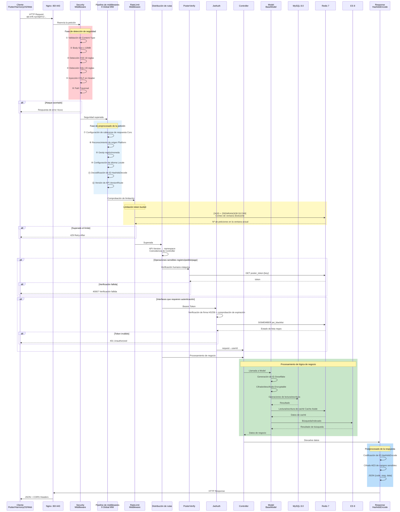

# Plataforma de comercio electrónico transfronterizo — Colección de diagramas de arquitectura

Copyright (c) 2026 erik <erik@erik.xyz> — https://erik.xyz

---

## 1. Diagrama de arquitectura del sistema

---

## 2. Diagrama de flujo de procesamiento de solicitudes (pipeline de middlewares)

---

## 3. Mapa general de módulos funcionales

---

## 4. Diagrama del ciclo de vida de las solicitudes

---

## 5. Diagrama del ciclo de vida de los pedidos

---

## 6. Diagrama de arquitectura de despliegue

---

## 7. Diagrama de arquitectura de seguridad

### Resumen de protección de seguridad

| Capa | Línea de defensa | Tecnología/paquete | Alcance |
|------|------|---------|---------|
| Primera capa | Límite de red | Nginx SSL + proxy inverso + validación de Host | Service + Admin |
| Segunda capa | Detección de ataques WAF | `erikwang2013/security-php` 31 detectores | XSS/SQLi/CRLF/recorrido de rutas/XXE/SSRF/subida de archivos/métodos/Host/Content-Type/Body, etc. |
| Tercera capa | Control de tráfico + resiliencia de dependencias | RateLimitMiddleware + contador Redis anti-fuerza bruta + CircuitBreaker | Limitación token bucket (6 endpoints) + protección de inicio de sesión/registro + disyuntor de pagos/inicio de sesión social (5 fallos→30s, recuperación semiabierta) |
| Cuarta capa | Autenticación de identidad | PosterVerify + JwtAuth HS256 | Verificación humano-máquina (deslizador/puzzle/clic) + Bearer Token + doble token de refresco |
| Quinta capa | Seguridad de datos | Hashids + AES-256-CBC + Encryptable | Cifrado en tres capas: ofuscación de ID/cifrado de transporte/cifrado de campos de BD |
| Sexta capa | Seguridad de respuesta | Cabeceras de seguridad HTTP + enmascaramiento de datos sensibles | nosniff/DENY/XSS-Protection/Referrer-Policy/enmascaramiento en logs |
| Continua | Trazabilidad de auditoría | PlatformMiddleware + OperationLogs | Seguimiento de origen de 8 plataformas + registro en 6 tablas + logs de operaciones |

---

## 8. Diagrama de flujo de liquidación multimoneda

### Explicación de la liquidación multimoneda

**Precio multimoneda**: los SKU de los productos se fijan por moneda según `currency_code`; al realizar el pedido, el pedido fija la moneda de cobro (USD / EUR / GBP / CNY, etc.).

**Servicio de tipos de cambio**: la tabla de tipos de cambio `erik_exchange_rates` admite mantenimiento manual y obtención automática vía exchangerate-api, versionada por fecha de entrada en vigor `effective_at`; en la liquidación se toma la instantánea del tipo de cambio en el momento del pago.

**Cobro en moneda original**: Stripe / PayPal / Klarna / Adyen cobran en la moneda del pedido; tras verificar la firma del Webhook y confirmar la recepción, se actualizan los estados del pago y del pedido.

**Liquidación por reparto**: tras el pago exitoso se generan automáticamente los repartos de plataforma `PlatformSettlements` (total del pedido + comisión de la plataforma + comisión de la pasarela de pago, contabilizados en la moneda del pedido); la liquidación del vendedor `MerchantSettlements` (importe del pedido → tasa de comisión → importe liquidado), la liquidación del proveedor `SupplierSettlements` y el retiro de comisiones de afiliados `AffiliatePayouts` forman cuatro líneas de liquidación independientes, con estado 0 pendiente de liquidar / 1 liquidado.

**Pérdidas y ganancias por tipo de cambio**: `CurrencyExchangeGainsLosses` rastrea la diferencia entre la moneda de cobro y la moneda de liquidación, comparando el tipo de cambio al pagar con el de la liquidación; positivo = ganancia cambiaria, negativo = pérdida cambiaria, lo que sustenta la conciliación y auditoría multimoneda del comercio transfronterizo.

---

## Índice de diagramas

| Nº | Nombre del diagrama | Tipo | Uso |
|------|------|------|------|
| 1 | Diagrama de arquitectura del sistema | Diagrama de arquitectura | Muestra la visión general del sistema: cliente→acceso→aplicación→datos→servicios externos |
| 2 | Diagrama de flujo de procesamiento de solicitudes | Diagrama de flujo | Muestra la ruta completa de una solicitud HTTP a través del pipeline de 12 middlewares (10 globales + 2 de ruta) |
| 3 | Mapa general de módulos funcionales | Diagrama de funciones | Muestra los 17 grandes módulos funcionales y sus funciones detalladas |
| 4 | Diagrama del ciclo de vida de las solicitudes | Ciclo de vida | Muestra la secuencia completa desde la solicitud hasta la respuesta y las interacciones de cada fase |
| 5 | Diagrama del ciclo de vida de los pedidos | Ciclo de vida | Muestra todas las transiciones de estado del pedido, desde el carrito hasta la finalización/reembolso |
| 6 | Diagrama de arquitectura de despliegue | Diagrama de arquitectura | Muestra la orquestación de contenedores Docker Compose, la red y los volúmenes de datos |
| 7 | Diagrama de arquitectura de seguridad | Diagrama de arquitectura | Muestra el sistema de defensa en profundidad de 6 capas: límite→WAF→tráfico/resiliencia (limitación + disyuntor)→autenticación→datos→respuesta |
| 8 | Diagrama de flujo de liquidación multimoneda | Diagrama de flujo | Muestra la cadena completa: precio por moneda→pago→reparto→liquidación→pérdidas y ganancias cambiarias |
