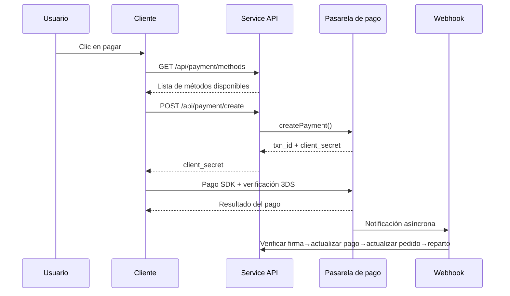
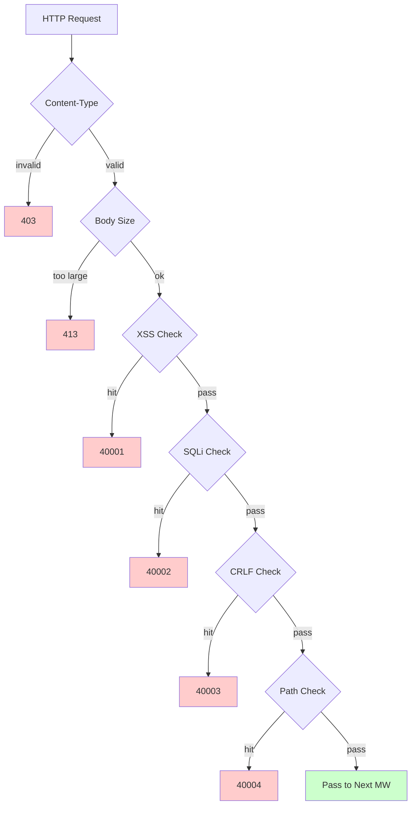

# Plataforma de comercio electrónico transfronterizo — Documento de diseño de funciones

Copyright (c) 2026 erik <erik@erik.xyz> — https://erik.xyz

---


## Seguimiento de plataforma

### Identificación de 8 plataformas

| Plataforma | Header | Flutter | Admin |
|------|--------|---------|-------|
| iOS | `ios` | Platform.isIOS + TargetPlatform.iOS | UA iPhone |
| iPadOS | `ipados` | Platform.isIOS + !TargetPlatform.iOS | UA iPad |
| macOS | `macos` | Platform.isMacOS | UA Macintosh |
| Windows | `windows` | Platform.isWindows | UA Windows |
| Linux | `linux` | Platform.isLinux | UA Linux |
| Android | `android` | Platform.isAndroid | UA Android |
| HarmonyOS | `harmonyos` | — | UA HarmonyOS |
| Web | `web` | kIsWeb | Por defecto |

### Campos de seguimiento en BD

| Tabla | Campo | Descripción |
|----|------|------|
| erik_orders | platform VARCHAR(16) | Plataforma de pedido |
| erik_payments | platform VARCHAR(16) | Plataforma de pago |
| erik_operation_logs | platform VARCHAR(16) | Plataforma de operación |
| erik_users | last_login_platform VARCHAR(16) | Plataforma de inicio de sesión |
| erik_search_logs | platform VARCHAR(16) | Plataforma de búsqueda |
| erik_chat_messages | platform VARCHAR(16) | Origen del mensaje |

## 1. Resumen de funciones

### 1.0 Resumen de cobertura

| Dimensión | Contenido cubierto | Profundidad |
|------|---------|------|
| **Retail B2C** | Productos multilingües, precios por moneda, SKU, carrito, pedidos, pagos (Stripe/PayPal/Klarna), reembolsos, devoluciones | Completo |
| **Mayoreo B2B** | Precios escalonados (MOQ), verificación empresarial (NIF/registro mercantil), solicitudes de cotización | Completo |
| **Incorporación multimercado** | Revisión de vendedores, revisión de productos, reparto y liquidación | Completo |
| **Cumplimiento transfronterizo** | Biblioteca de códigos HS Code (código base de 6 dígitos), reglas arancelarias (país de destino + HS→tasa), VAT/IOSS, etiquetas de cumplimiento (FDA/CE/RoHS y otras 10 categorías) | Completo |
| **Logística internacional** | Fletes por zonas logísticas (escalones de peso), DHL/UPS/FedEx/EMS, almacenes en el extranjero (envío + devolución), declaración HS (marcado de baterías/líquidos), factura comercial PDF/lista de embalaje | Completo |
| **Pagos** | Stripe PaymentIntent+3DS, PayPal REST, Klarna BNPL, Adyen, verificación de firma de Webhook + reparto | Stripe completo, resto placeholder |
| **Marketing** | Cupones (por zona + limitados a nuevos/antiguos clientes), banners (visibilidad por región), ventas flash (con límite de tiempo y cantidad), compras grupales (nº de participantes + validez), distribución (enlace + comisión + retiro) | Completo |
| **Multiplataforma** | Publicación de productos y agregación de pedidos en Amazon/eBay/Shopee/Lazada/Temu, gestión de múltiples tiendas | Completo |
| **Cadena de suministro** | Archivo de proveedores + evaluación, órdenes de compra (revisión→envío→recepción→inspección), inspección de calidad (entrada/salida de almacén, apariencia/funcionalidad/etiquetas de cumplimiento), registro de inventario (libro mayor inmutable: entrada/salida/transferencia/inventario) | Completo |
| **Gestión de riesgos y cumplimiento** | Motor de reglas (puntuación paralela: validación de dirección/coincidencia de código postal/3DS/registro masivo/anomalías de valor de mercancías), KYC con verificación de identidad, solicitudes de datos GDPR/CCPA, gestión de versiones de consentimiento de cookies | Completo |
| **Protección de seguridad** | SecurityMiddleware encapsula los 31 detectores de security-php: XSS (13 reglas)/inyección SQL (13 reglas)/CRLF/recorrido de rutas (codificación + byte nulo)/tamaño de Body/Content-Type/subida de archivos/cabeceras de seguridad HTTP/fuerza bruta (contador Redis)/XXE/SSRF/métodos/Host/enmascaramiento de datos sensibles/CORS | Completo |
| **Alta concurrencia** | Limitación con token bucket (ventana deslizante + reglas para 6 endpoints), separación lectura/escritura de BD (2 réplicas de lectura + sticky), pool de conexiones (BD 50/10 + Redis 30/5), OPCache (128MB, entorno Docker) | Completo |
| **Crecimiento de miembros** | Niveles de membresía + beneficios, reglas de puntos + registro, tarjetas de regalo (saldo + canje), alertas de bajada de precio/llegada, favoritos, comparación de productos, historial de navegación, compras por suscripción, pruebas A/B (asignación de tráfico + confianza) | Completo |
| **Gestión de contenido** | Páginas CMS multilingües (Landing/Blog), FAQ multilingüe, base de conocimientos multilingüe, tablas de tallas (ropa/calzado + conversión US/UK/EU/JP/CN), plantillas de correo (multilingües), feeds de productos (Google/Meta + sincronización programada) | Completo |
| **Atención al cliente** | IM en tiempo real por WebSocket (chat_sessions/chat_messages), base de conocimientos multilingüe | Estructura de tablas completa, WS pendiente de implementar |
| **Infraestructura** | ID distribuido Snowflake (bigint no autoincremental), ofuscación de IDs de interfaz Hashids, autenticación JWT (HS256 + doble token de refresco access/refresh), cifrado/descifrado AES (cifrado en tres capas: interfaz + base de datos), identificación de región GeoIP (MaxMind), verificación humano-máquina Poster (deslizador/puzzle/clic) | Completo |
| **Cobertura multi-dispositivo** | Flutter 5 plataformas (iOS/Android/macOS/Windows/Linux/iPadOS) + HarmonyOS (ArkTS 9 páginas) + Web Admin (LayUI+ECharts) + API | Flutter 25 archivos, HarmonyOS 14 archivos, Admin 239 archivos |
| **Seguimiento de plataforma** | Identificación de 8 plataformas (iOS/iPadOS/macOS/Windows/Linux/Android/HarmonyOS/Web) + header X-Platform + registro en 6 tablas (orders/payments/operation_logs/users/search_logs/chat_messages) | Completo |
| **Pruebas** | 22 tests / 45 assertions — ALL PASS (SecurityTest 12: XSS+SQLi+XXE+SSRF+Path / JwtTest 4 / ApiResponseTest 3 / RedisFacadeTest 3) | Pruebas unitarias completas, pruebas de integración pendientes |

### 1.1 Matriz de módulos

| Módulo de nivel 1 | Módulo de nivel 2 | Prioridad | Estado |
|---------|---------|--------|------|
| Sistema de usuarios | Registro/inicio de sesión/inicio de sesión social/KYC con verificación de identidad/direcciones/favoritos/membresía/puntos/tarjetas de regalo | P0-P2 | ✅ |
| Sistema de productos | Categorías/SKU/multilingüe/multimoneda/imágenes/atributos/cumplimiento/HS Code/búsqueda ES/Feed | P0-P1 | ✅ |
| Sistema de transacciones | Carrito/pedidos/pagos (Stripe+PayPal+Klarna)/reembolsos/devoluciones/facturas | P0 | ✅ |
| Sistema logístico | Operadores logísticos internacionales/fletes por zona/almacenes en el extranjero/envíos (declaración HS)/seguro de envío | P0-P1 | ✅ |
| Aduanas e impuestos | Biblioteca HS Code/reglas arancelarias/VAT/IOSS/restricciones de cumplimiento por país | P0 | ✅ |
| Sistema de marketing | Cupones/banners/ventas flash/compras grupales/distribución | P1-P2 | ✅ |
| Cadena de suministro | Proveedores/órdenes de compra/inspección de calidad/registro de inventario | P1 | ✅ |
| Riesgo y cumplimiento | Motor de reglas/GDPR/CCPA/consentimiento de cookies/seguimiento de plataforma | P1 | ✅ |
| Protección de seguridad | XSS/inyección SQL/CRLF/recorrido de rutas/Content-Type/cuerpo de solicitud | P0 | ✅ |
| Multiplataforma | Publicación en Amazon/eBay/Shopee + agregación de pedidos/incorporación de múltiples vendedores | P2 | ✅ |
| Gestión de contenido | CMS/FAQ/base de conocimientos/plantillas de correo/notificaciones/tablas de tallas | P2 | ✅ |
| Herramientas de crecimiento | Mayorista B2B/compras por suscripción/pruebas A/B | P2-P3 | ✅ |
| Atención al cliente | IM en tiempo real por WebSocket/base de conocimientos | P3 | ✅ |
| Infraestructura | Snowflake ID/JWT/Hashids/Encryption/Poster/versiones de API/GeoIP | P0 | ✅ |

---

## 2. Diagramas de flujo de negocio principales

### 2.1 Máquina de estados de pedidos

```mermaid
stateDiagram-v2
    [*] --> "Pendiente de pago": El usuario realiza el pedido
    "Pendiente de pago" --> "Pagado": Pago exitoso
    "Pendiente de pago" --> "Cancelado": Cancelado/tiempo agotado
    "Pendiente de pago" --> "En revisión": Puntuación de riesgo alta
    "Pagado" --> "Enviado": Envío
    "Pagado" --> "Reembolso en curso": Solicitud de reembolso
    "Enviado" --> "Recibido": El usuario recibe el pedido
    "Recibido" --> "Completado": Confirmación de finalización
    "Recibido" --> "Devolución en curso": Solicitud de devolución
    "Reembolso en curso" --> "Reembolsado": Reembolso completado
    "Devolución en curso" --> "Reembolsado": Devolución completada
    "En revisión" --> "Pagado": Revisión aprobada
    "En revisión" --> "Cancelado": Revisión rechazada
```

### 2.2 Secuencia de pago



### 2.3 Pipeline de detección de seguridad



---

## 3. Procesos de negocio principales

### 3.1 Registro e inicio de sesión de usuarios

```
Registro por email: email+password → verificación humano-máquina PosterVerify → bcrypt(password+salt)
                   → Snowflake genera ID → devuelve JWT {access_token, expires_in}

Inicio de sesión social: Google/Apple/Facebook OAuth → verificación de id_token
        → comprobar vinculación en erik_user_social_accounts
        → vinculado: inicio de sesión / no vinculado: crear usuario automáticamente + vincular → devuelve JWT

Inicio de sesión: email+password → password_verify(password+salt)
    → actualizar last_login_at/ip/platform → emite JWT

Renovación de token: refresh_token → Jwt::decode → nuevo access_token
```

### 3.2 Navegación y búsqueda de productos

```
Lista: GET /api/products
  → Filtros: category_id/status/keyword/price_range
  → Ordenación: default/price_asc/price_desc/sales/newest
  → Multilingüe: ProductTranslations filtrado por locale
  → Multimoneda: ProductSkuPrices según currency_code
  → Paginación: 20 por página

Búsqueda ES: GET /api/search?keyword=xxx
  → Erikwang2013\WebmanScout\Searchable → analizador multilingüe ES
  → Agregaciones: category/price/brand
  → Degradación: MySQL LIKE si ES no está disponible

Detalle: GET /api/products/{hashid}
  → Decodificación por middleware HashidsDecode → Eager Load
  → Multilingüe+multimoneda+conformidad+HS Code+conversión de tallas+con/sin impuestos+VAT
```

### 3.3 Carrito y realización de pedidos

```
Carrito: POST /api/cart {sku_id, quantity}
  → Validar que el SKU existe|está publicado|stock suficiente
  → Acumular si el mismo SKU / crear si no existe

Realizar pedido: POST /api/orders {address_id, coupon_id, currency_code}
  → 1.Validar dirección de entrega → 2.Obtener la selección del carrito → 3.Validar cada producto (stock+conformidad)
  → 4.Calcular precio (multimoneda+cupón) → 5.Generar número de pedido
  → 6.Crear Order+OrderItems → 7.Reducir stock → 8.Escribir OrderLog
  → 9.Puntuación de riesgo (RiskEngine::score) → 10.Vaciar el carrito comprado

Cancelación: POST /api/orders/{id}/cancel
  → Validar status=0 (pendiente de pago) → restaurar stock → status=5 (cancelado)
```

### 3.4 Proceso de pago

```
Métodos disponibles: GET /api/payment/methods?country=DE&currency=EUR
  → PaymentGatewayMethods (filtrado por country+currency)

Crear pago: POST /api/payment/create
  → PaymentGateway::make(gateway)→createPayment()
  → Stripe: PaymentIntent → client_secret → SDK frontend (+3DS)

Webhook: POST /webhook/payment/stripe
  → Verificar firma → payment_intent.succeeded:
     → Payment.status=Pagado → Order.status=Pagado
     → PlatformSettlement (comisión de plataforma+tarifa de pasarela+proveedor+distribución)
```

### 3.5 Proceso de devolución

```
Solicitud: POST /api/returns {order_id, reason_id}
  → Determinar el canal de devolución: almacén local (type=1)/devolver al país (type=2)/solo reembolso (type=3)

Revisión: Revisión de Admin → aprobado: generar ReturnLabel / rechazado: escribir motivo

Envío de vuelta: descargar etiqueta→enviar→actualización logística→recepción en almacén→status=Recibido

Reembolso: status=Completado → Refund asociado → PaymentGateway::refund→devolución al método original
```

### 3.6 Estimación de aranceles

```
GET /api/tariff/estimate?product_id=xxx&dest_country_id=xxx&declared_value=100

1. ProductHsCodes → HsCode
2. TariffRules(dest_country_id + hs_code_id) → duty_rate + duty_free_threshold
3. VatSettings(country_id) → vat_rate + vat_free_threshold
4. duty = value>=threshold ? value*duty_rate/100 : 0
   vat = (value+duty)>=threshold ? (value+duty)*vat_rate/100 : 0
5. return {duty_rate, vat_rate, estimated_duty, estimated_vat, estimated_total, hs_code, disclaimer}
```

---

## 4. Protección de seguridad (SecurityMiddleware encapsula los 31 detectores de security-php)

### 4.1 Tabla general de reglas de detección

| # | Tipo de ataque | Método principal de detección | Código de error | Service | Admin |
|---|---------|------------|--------|---------|-------|
| 1 | XSS scripting entre sitios | 13 regex: script/iframe/eventos on/svg+on/style/expression/javascript:/embed/object/link/meta | 40001 | ✅ | ✅ |
| 2 | Inyección SQL | 13 regex: UNION SELECT/SELECT FROM WHERE/sleep/benchmark/pg_sleep/tipo booleano/tipo cadena/comentarios/comentarios especiales MySQL/enumeración de schema/load_file/into outfile/procedimientos almacenados/waitfor/delay | 40002 | ✅ | ✅ |
| 3 | Inyección de cabecera CRLF | `[\r\n]` en: Authorization/X-Platform/API-Version/X-Forwarded-For/Referer/Origin | 40003 | ✅ | ✅ |
| 4 | Recorrido de rutas | `../` + codificación `%2e%2f` + doble codificación `%252e%252f` + byte nulo `\0` + `.env`/`.git`/`phpmyadmin`/`wp-admin`/`/etc/`/`/proc/`/`composer.json` | 40004 | ✅ | ✅ |
| 5 | Límite de cuerpo de solicitud | Content-Length > 10MB (Service) / 20MB (Admin) | 40005 | ✅ | ✅ |
| 6 | Límite de Content-Type | Solo JSON/form-data/form-urlencoded | 40006 | ✅ | ✅ |
| 7 | **Validación de subida de archivos** | Extensiones en lista negra (php/phtml/sh/exe/js/...) + ataque de doble extensión + extensión vacía | 40009 | ✅ | ✅ |
| 8 | **Cabeceras de seguridad HTTP** | nosniff/DENY/XSS-Protection/Referrer-Policy/Permissions-Policy/Cache-Control/ocultación de Server | — | ✅ | ✅ |
| 9 | **Protección contra fuerza bruta** | Contador Redis: API 10 veces/60s, Admin 5 veces/300s | 40008 | ✅ | ✅ |
| 10 | **Inyección de entidades XXE** | `<!ENTITY SYSTEM>`, `<!DOCTYPE [` | 40010 | ✅ | ✅ |
| 11 | **SSRF falsificación de servidor** | IP de intranet (127/10/172.16/192.168/0.0/169.254.169.254) + localhost + metadata.google.internal | 40011 | ✅ | ✅ |
| 12 | **Validación de método HTTP** | Solo GET/POST/PUT/DELETE/PATCH/OPTIONS/HEAD | 40012 | ✅ | ✅ |
| 13 | **Validación de cabecera Host** | Rechaza acceso directo con IP desnuda | 40013 | ✅ | — |
| 14 | **Enmascaramiento de datos sensibles** | Los logs/respuestas de error filtran password/token/secret | — | ✅ | ✅ |
| 15 | **Lista blanca CORS** | Límite de origin configurable | — | ⚠️ | ⚠️ |

### 4.2 Pipeline de middlewares

```
Service: Cors → Security → Platform → GeoIp → Locale → HashidsDecode
        → VersionRoute → (PosterVerify) → (JwtAuth) → HashidsEncode

Admin: Security → Platform → HashidsDecode → AccessControl → HashidsEncode
```

### 4.3 Seguimiento de origen de plataforma

| Plataforma | Valor de Header | Método de identificación |
|------|---------|---------|
| iOS | `ios` | Flutter `Platform.isIOS` |
| iPadOS | `ipados` | Determinado por Flutter `TargetPlatform.iOS` |
| macOS | `macos` | Flutter `Platform.isMacOS` |
| Windows | `windows` | Flutter `Platform.isWindows` |
| Linux | `linux` | Flutter `Platform.isLinux` |
| Android | `android` | Flutter `Platform.isAndroid` |
| HarmonyOS | `harmonyos` | ArkTS hardcodeado |
| Web | `web` | Degradación por UA / por defecto |

---


## 5. Alta concurrencia y rendimiento

### 5.1 Reglas de limitación

| Endpoint | Algoritmo | Ventana | Límite |
|------|------|------|------|
| /api/auth/login | Ventana deslizante | 60s | 10 veces |
| /api/auth/register | Ventana deslizante | 300s | 5 veces |
| /api/payment | Ventana deslizante | 60s | 5 veces |
| /api/orders | Ventana deslizante | 10s | 3 veces |
| /api/search | Ventana deslizante | 1s | 10 veces |
| Por defecto | Ventana deslizante | 60s | 100 veces |

### 5.2 Usos de Redis

| Uso | Implementación |
|------|------|
| Token bucket de limitación | Redis ZSET ventana deslizante |
| Verificación humano-máquina | Estado de códigos de verificación PosterVerify |
| Almacenamiento de Session | Almacenamiento KV de Redis |

Los datos de negocio no tienen caché a nivel de aplicación, se leen directamente de MySQL (separación lectura/escritura + pool de conexiones).

### 5.3 Pool de conexiones

| Recurso | Máximo | Mínimo | Timeout |
|------|------|------|------|
| MySQL | 50 | 10 | 2s |
| Redis | 30 | 5 | — |

## 6. Diagrama de relaciones de tablas

```
erik_users ──┬── addresses, social_accounts, wishlists, kyc
             ├── carts, orders → order_items → payments
             ├── reviews, coupons(through user_coupons)
             ├── notifications, subscriptions, point_logs
             ├── affiliate_links, chat_sessions, b2b_verifications
             └── privacy_requests

erik_products ──┬── translations(product_id, locale)
                ├── skus → sku_prices(sku_id, currency_code)
                ├── images, reviews, compliance → compliance_categories
                ├── hs_codes → hs_codes, recommendations
                ├── b2b_prices, platform_listings
                └── product_comparisons

erik_orders ──┬── order_items, order_logs
              ├── payments, refunds, return_orders → return_labels
              ├── order_documents, shipments
              ├── platform_settlements, risk_logs
              └── subscription_orders

erik_countries ──┬── vat_settings, tariff_rules(dest_country_id)
                 ├── country_compliance_rules
                 ├── shipping_zones(JSON countries)
                 └── warehouses(country_id)
```

---

## 7. Interfaces API

La lista completa de endpoints de API (23 interfaces públicas + 47 interfaces autenticadas + Webhook + Admin/Health), ver [Documento de interfaz API](api.md).

---

## 8. Verificación de pruebas

```bash
cd service && php vendor/bin/phpunit tests/
```

| Clase de prueba | Tests | Cobertura |
|--------|-------|------|
| SecurityTest | 12 | XSS (3 reglas) + SQLi (2 reglas) + XXE (2 reglas) + SSRF (1 regla) + Path (2 reglas) + fuga de tarjetas de crédito (1 regla) + paso normal (1 regla) |
| JwtTest | 4 | encode JWT de tres partes + ida y vuelta de decode + token inválido→null + token vacío→null |
| ApiResponseTest | 3 | success (code=0) + fail (código de error) + paginate (list + meta de paginación) |
| RedisFacadeTest | 3 | ping + ida y vuelta de set/get + función auxiliar redis() (skip si Redis no está disponible) |
| **Total** | **22** | **45 assertions — ALL PASS** |
