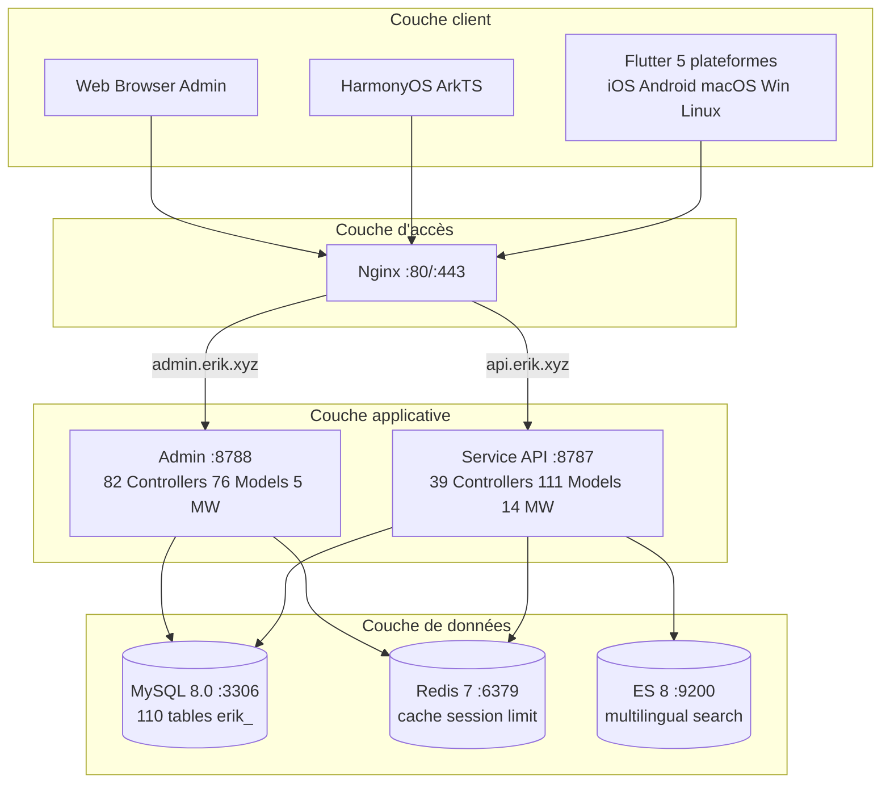
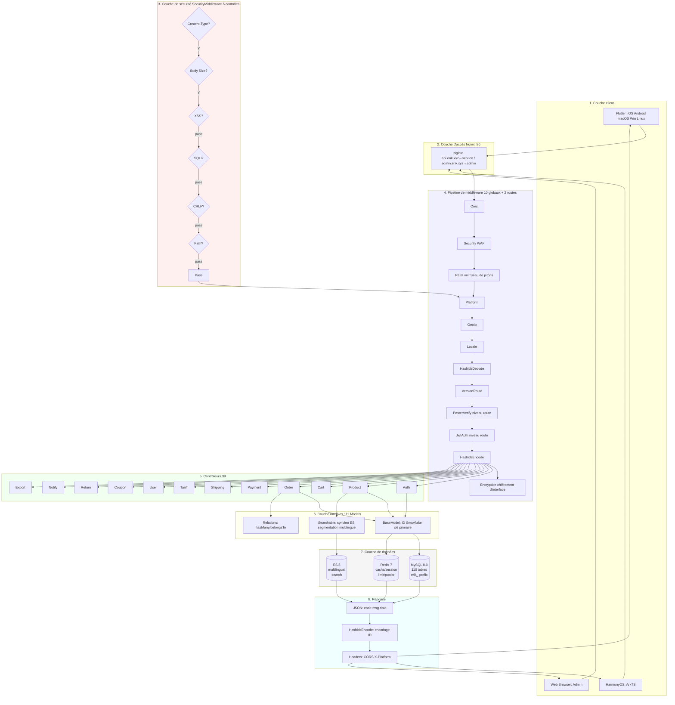
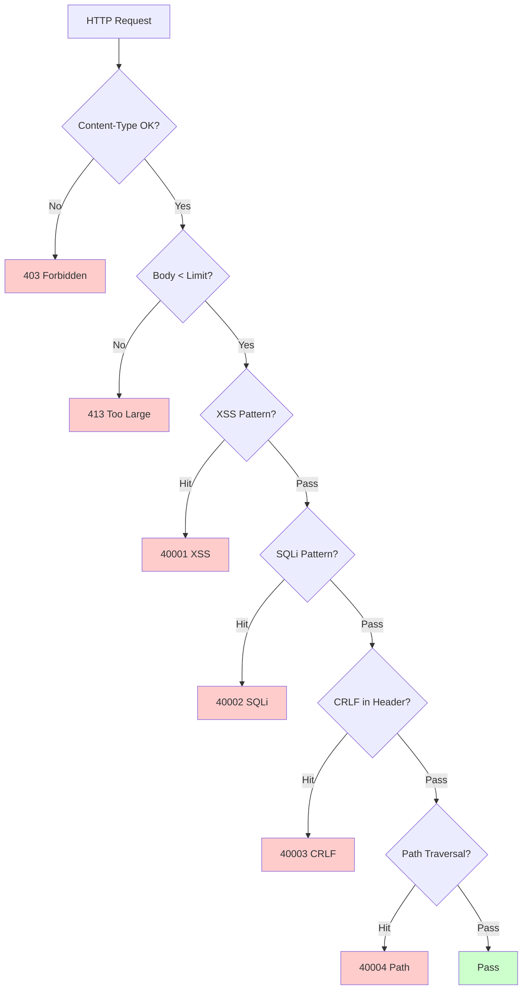
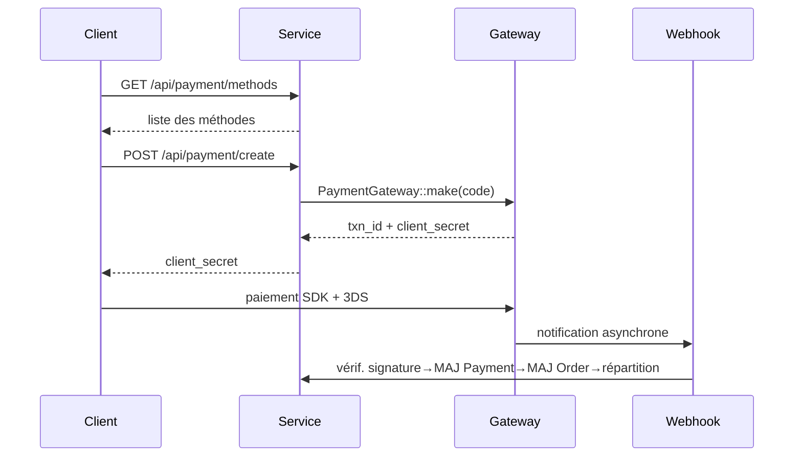
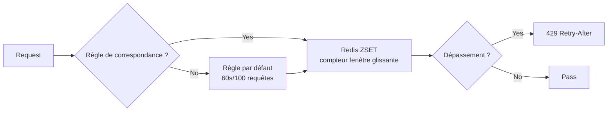

# Plateforme de commerce électronique transfrontalier — Document de conception d'architecture

Copyright (c) 2026 erik <erik@erik.xyz> — https://erik.xyz

---

## 1. Vue d'ensemble du système

### 1.1 Positionnement

Plateforme de commerce électronique transfrontalier full-stack basée sur le framework haute performance webman, prenant en charge B2C, B2B et l'hébergement de vendeurs tiers.

| Composant | Pile technique | Taille |
|------|--------|------|
| Service API | PHP 8.3 / webman 2.1 / illuminate database | 39 contrôleurs + 111 modèles + 14 middlewares |
| Admin | webman-admin / LayUI / ECharts | 82 contrôleurs + 76 modèles + 5 middlewares |
| Flutter | Riverpod / GoRouter / Dio | 25 fichiers Dart / 11 pages |
| HarmonyOS | ArkTS / ArkUI | 14 fichiers ETS / 9 pages |
| Base de données | MySQL 8.0 + Redis 7 + ES 8 | 117 tables (110 `erik_` + 7 `wa_`) |

### 1.2 Indicateurs clés

| Indicateur | Valeur |
|------|-----|
| API P99 | <200ms |
| Concurrence | 10000+ (32 workers en mémoire résidente) |
| Nombre de tables | 110 |
| Endpoints | 73 |
| Middlewares | 14 (service : 10 globaux + 2 de routage + AdminKey + StaticFile / admin : 4 globaux + 1 intégré) |
| Langues | zh_CN, zh_HK, en, ja, ko |
| Devises | 19 devises à tarification indépendante |
| Paiement | Stripe / PayPal / Klarna / Adyen |

---

## 2. Diagramme d'architecture système



### 2.1 Diagramme de flux de conception complet



**Explication du diagramme de flux :**

| Couche | Description |
|----|------|
| 1. Couche client | Flutter 5 plateformes + HarmonyOS + Web Admin, tous communiquent via HTTP/JSON |
| 2. Couche d'accès | Nginx répartit par nom de domaine : api→service, admin→admin |
| 3. Couche de sécurité | SecurityMiddleware, 31 types de détecteurs d'attaques, renvoie un code d'erreur/403 en cas de détection |
| 4. Pipeline de middlewares | 10 middlewares globaux traités en série + 2 middlewares de routage (PosterVerify pour les opérations sensibles, JwtAuth pour les interfaces authentifiées) |
| 5. Couche contrôleurs | 39 contrôleurs API regroupés par fonction, gèrent toute la logique métier |
| 6. Couche modèles | 111 modèles Eloquent, BaseModel fournit la clé primaire Snowflake ID, 45 modèles activent SoftDelete selon la table |
| 7. Couche de données | MySQL (110 tables préfixe erik_ / clé primaire snowflake) + Redis (cache/Session/limitation/Poster) + ES (recherche multilingue) |
| 8. Retour de réponse | Format JSON unifié → HashidsEncode encode les ID → Encryption chiffre (X-Encrypt-Response) → retour au client |

### 2.2 Modèle de processus

```
webman Master (:8787)
  ├── HTTP Worker x32 (CPU×4, mémoire résidente, pool de connexions DB)
  ├── Monitor Process (surveillance des fichiers + de la mémoire)
  └── SnowflakeWorker (initialise le singleton Snowflake au démarrage)
```

---

## 3. Pipeline de middlewares

### 3.1 Pipeline complet du Service API

```mermaid
graph LR
    A[HTTP Request] --> B[Cors]
    B --> C[Security<br/>détection d'attaque]
    C --> D[Platform<br/>identification de la source]
    D --> E[GeoIp<br/>identification de la région]
    E --> F[Locale<br/>langue]
    F --> G[HashidsDecode<br/>décodage ID]
    G --> H[VersionRoute<br/>routage de version]
    H --> I{Opération sensible ?}
    I -->|Yes| J[PosterVerify<br/>vérification homme-machine]
    I -->|No| K{Protection JWT ?}
    J --> K
    K -->|Yes| L[JwtAuth<br/>vérification du jeton]
    K -->|No| M[HashidsEncode<br/>encodage ID]
    L --> M
    M --> N[Controller]
    N --> O[HTTP Response]
    style C fill:#fcc
    style J fill:#ffc
    style L fill:#cfc
```



### 3.2 Détails des middlewares Service

| # | Middleware | Type | Fonction |
|---|--------|------|------|
| 1 | Cors | Global | En-têtes de réponse Access-Control-*, pré-vol OPTIONS renvoie 200 |
| 2 | SecurityMiddleware | Global | XSS/Injection SQL/CRLF/traversée de chemin/Content-Type/corps de requête 10 Mo |
| 3 | RateLimitMiddleware | Global | Limitation par seau à jetons (fenêtre glissante Redis ZSET, règles sur 6 endpoints) |
| 4 | PlatformMiddleware | Global | En-tête X-Platform + identification par repli UA de 8 plateformes |
| 5 | GeoIpMiddleware | Global | MaxMind GeoIP2, identification région/devise/langue pour les utilisateurs non connectés |
| 6 | LocaleMiddleware | Global | Analyse Accept-Language, correspondance exacte 5 langues → repli → défaut |
| 7 | HashidsDecode | Global | Champs `*_id` dans URL/Corps : hashid → snowflake ID |
| 8 | VersionRoute | Global | En-tête API-Version → mapping vers l'espace de noms du contrôleur (v1/v2) |
| 9 | PosterVerify | Routage | Vérification du token Redis pour inscription/commande/paiement |
| 10 | JwtAuth | Routage | Bearer Token HS256, vérification de signature + expiration + injection userId |
| 11 | HashidsEncode | Global | Parcours récursif du JSON de réponse, snowflake ID → hashid |
| 12 | EncryptionMiddleware | Routage | Chiffrement/déchiffrement AES des interfaces (X-Encrypt-Response/X-Encrypted) |
| 13 | AdminKeyMiddleware | Routage | Vérification de la clé pour les opérations d'administration internes |
| 14 | StaticFile | Global | Service de ressources statiques webman |

### 3.3 Pipeline Admin

```
Requête → SecurityMiddleware → PlatformMiddleware → HashidsDecode
     → webman-admin AccessControl (RBAC intégré) → HashidsEncode → Contrôleur
```

| # | Middleware Admin | Fonction |
|---|------------|------|
| 1 | SecurityMiddleware | XSS/Injection SQL/CRLF/traversée de chemin/Content-Type/20 Mo |
| 2 | PlatformMiddleware | X-Platform + identification UA de 8 plateformes |
| 3 | HashidsDecode | Requête hashid → snowflake ID |
| - | AccessControl (intégré) | Vérification des permissions par rôle administrateur |
| 4 | HashidsEncode | Réponse snowflake ID → hashid |

---

## 4. Architecture de sécurité

### 4.1 Pipeline de détection d'attaques (SecurityMiddleware)



### 4.2 Détails des règles de détection d'attaques SecurityMiddleware (15 types personnalisés)

| # | Type d'attaque | Méthode de détection principale | Service | Admin | Code d'erreur |
|---|---------|------------|---------|-------|--------|
| 1 | XSS (scripting intersite) | 13 regex : script/iframe/événements on/svg+on/style/expression/javascript:/embed/object/link/meta | ✅ | ✅ | 40001 |
| 2 | Injection SQL | 13 regex : UNION SELECT/SELECT FROM WHERE/sleep/benchmark/pg_sleep/type booléen/type chaîne/commentaires/commentaires spéciaux MySQL/énumération de schéma/load_file/into outfile/procédures stockées/waitfor/delay | ✅ | ✅ | 40002 |
| 3 | Injection CRLF dans les en-têtes | `[\r\n]` dans : Authorization/X-Platform/API-Version/X-Forwarded-For/Referer/Origin | ✅ | ✅ | 40003 |
| 4 | Traversée de chemin | `../` + encodage `%2e%2f` + encodage double `%252e%252f` + octet nul `\0` + `.env`/`.git`/`phpmyadmin`/`wp-admin`/`/etc/`/`/proc/`/`composer.json` | ✅ | ✅ | 40004 |
| 5 | Limite du corps de requête | Content-Length > 10 Mo (Service) / 20 Mo (Admin) | ✅ | ✅ | 40005 |
| 6 | Content-Type | Uniquement JSON/form-data/form-urlencoded | ✅ | ✅ | 40006 |
| 7 | Validation du téléversement de fichiers | Extensions en liste noire (php/phtml/sh/exe/js/...) + double extension + extension vide | ✅ | ✅ | 40009 |
| 8 | En-têtes de réponse HTTP sécurisés | nosniff/DENY/XSS-Protection/Referrer-Policy/Permissions-Policy/Cache-Control/masquage Server | ✅ | ✅ | — |
| 9 | Protection contre la force brute | Compteurs Redis : API 10 fois/60 s, Admin 5 fois/300 s | ✅ | ✅ | 40008 |
| 10 | Injection d'entités XXE | `<!ENTITY SYSTEM>`, `<!DOCTYPE [` | ✅ | ✅ | 40010 |
| 11 | SSRF (falsification de requête côté serveur) | IP internes (127/10/172.16/192.168/0.0/169.254.169.254) + localhost + metadata.google.internal | ✅ | ✅ | 40011 |
| 12 | Validation des méthodes HTTP | Uniquement GET/POST/PUT/DELETE/PATCH/OPTIONS/HEAD | ✅ | ✅ | 40012 |
| 13 | Validation de l'en-tête Host | Refus de la connexion directe par IP nue | ✅ | — | 40013 |
| 14 | Masquage des données sensibles | Filtrage de password/token/secret dans les journaux/réponses d'erreur | ✅ | ✅ | — |
| 15 | Liste blanche CORS | Restriction d'origine configurable | ⚠️ | ⚠️ | — |

### 4.3 Flux d'authentification

```
Inscription : email+password → PosterVerify (vérification homme-machine) → bcrypt(password+salt)
     → génération Snowflake ID → retour JWT

Connexion : email+password → password_verify(password+salt, bcrypt_hash)
     → mise à jour last_login_at/ip/platform → émission JWT

Requête : Authorization: Bearer <token>
     → JwtAuth → Jwt::decode → vérification signature HS256 + expiration → injection request->userId

Rafraîchissement : POST /api/auth/refresh {refresh_token} → Jwt::decode → nouveau access_token
```

### 4.4 Sécurité des données (chiffrement à trois couches)

| Couche | Technologie | Paquet | Champs |
|------|------|-----|------|
| Couche transport | AES-256-CBC | erikwang2013/encryption | Champs sensibles du corps POST |
| Couche base de données | Trait Encryptable | erikwang2013/encryptable (Maize) | email, mobile, name, phone, detail, tax_id |
| Obscurcissement d'ID | Encodage Hashids | erikwang2013/hashids | Tous les snowflake ID au niveau interface |

### 4.5 Suivi de la source de plateforme

| Plateforme | Méthode d'identification | Valeur d'en-tête |
|------|---------|---------|
| iOS | Flutter `Platform.isIOS` + `TargetPlatform.iOS` | `ios` |
| iPadOS | Flutter `Platform.isIOS` + `!TargetPlatform.iOS` | `ipados` |
| macOS | Flutter `Platform.isMacOS` / UA `Macintosh` | `macos` |
| Windows | Flutter `Platform.isWindows` / UA `Windows` | `windows` |
| Linux | Flutter `Platform.isLinux` / UA `Linux` | `linux` |
| Android | Flutter `Platform.isAndroid` / UA `Android` | `android` |
| HarmonyOS | Codé en dur ArkTS / UA `HarmonyOS` | `harmonyos` |
| Web | Aucune correspondance UA / valeur par défaut | `web` |

Tables d'enregistrement : `erik_orders.platform`, `erik_payments.platform`, `erik_operation_logs.platform`, `erik_users.last_login_platform`, `erik_search_logs.platform`, `erik_chat_messages.platform`

---

## 5. Architecture des données

### 5.1 Stratégie de clé primaire

```
Snowflake 64 bits : [1bit|42bit horodatage|5bit DC|5bit WID|12bit séquence]
- Unique globalement / tendance croissante / non auto-incrémentée
- PHP $keyType='string' (anti-débordement)
- Service worker_id=1, Admin worker_id=2
- Génération : Snowflake::nextId()
```

### 5.2 Héritage des modèles

```
Illuminate\Database\Eloquent\Model
  └── app\model\BaseModel
        ├── $incrementing=false, $keyType='string', $guarded=[]
        ├── boot(): Snowflake::nextId()
        └── 110 modèles métier
              ├── 45 utilisent SoftDeletes (correspond aux tables avec colonne deleted_at)
              ├── certains utilisent Encryptable (champs sensibles : email/mobile/name etc.)
              ├── utilisent Searchable (Product→ES)
              └── associations hasMany/belongsTo
```

### 5.3 Multilingue / multidevise

- **Traductions** : `erik_product_translations(product_id,locale)` table indépendante, requête par locale
- **Tarification** : `erik_product_sku_prices(sku_id,currency_code)` prix indépendants par devise

---

## 6. Architecture de paiement



```
PaymentGatewayInterface
  ├── createPayment(data): array
  ├── capturePayment(txnId): array
  ├── refundPayment(txnId, amount): array
  └── verifyWebhook(payload, sig): bool
```

---

## 7. Architecture haute concurrence

### 7.1 Stratégie de limitation (RateLimitMiddleware)



| Endpoint | Fenêtre | Limite | Description |
|------|------|------|------|
| /api/auth/login | 60 s | 10 fois | Anti-énumération de mots de passe |
| /api/auth/register | 300 s | 5 fois | Anti-inscription en masse |
| /api/payment | 60 s | 5 fois | Anti-fraude de paiement |
| /api/orders | 10 s | 3 fois | Anti-commandes frauduleuses |
| /api/search | 1 s | 10 fois | Anti-crawlers |
| Défaut | 60 s | 100 fois | API générale |

### 7.2 Usages de Redis

Redis est utilisé pour la limitation par seau à jetons, les codes de vérification homme-machine et le stockage des sessions (couche middleware) ; les données métier ne font pas de cache applicatif, elles sont lues directement dans MySQL (séparation lecture/écriture + pool de connexions).

### 7.4 Optimisation du pool de connexions

| Ressource | Connexions max | Connexions min | Délai d'attente | Délai d'inactivité | Heartbeat |
|------|---------|---------|---------|---------|------|
| MySQL | 50 | 10 | 2 s | 60 s | 45 s |
| Redis | 30 | 5 | — | 60 s | — |

### 7.5 Traitement des opérations lentes

| Opération | Implémentation |
|------|------|
| Mise à jour des taux de change | ExchangeRateCron (toutes les heures, API externe) |
| Synchronisation des flux | ProductFeedCron (génère TSV toutes les 6 heures et journalise) |
| Calcul des recommandations | RecommendationCron (quotidien, co-occurrence d'achats) |
| Rapprochement des paiements | PaymentReconcileCron (toutes les 6 heures, Stripe/PayPal) |
| Règlement de répartition | SettlementCron (quotidien) |
| Suivi des trajets logistiques | ShipmentTrackingCron (toutes les 30 minutes, API à configurer) |
| Synchronisation des commandes plateforme | PlatformOrderSyncCron (toutes les 5 minutes, API à configurer) |
| Expiration des retours | ReturnExpireCron (toutes les heures) |
| Notifications baisse de prix/arrivée | PriceAlertCron (toutes les 10 minutes) |
| Mise à jour des règles de conformité | ComplianceCron (quotidien, API à configurer) |

## 8. Architecture de déploiement

```
docker-compose.yml:
  nginx (alpine) :80 :443
  service (php:8.3) :8787 interne, 32 workers
  admin (php:8.3) :8788 interne
  mysql (8.0) :3306 / redis (7) :6379 / es (8) :9200
Réseau : erik-net bridge | volumes de données persistants
Routage : api.erik.xyz→service | admin.erik.xyz→admin
```

---


## 8. Internationalisation (i18n)

| Couche | Implémentation |
|------|------|
| Service | LocaleMiddleware + fichiers de traduction 5 langues (45 clés/langue) |
| Admin | Fichiers de traduction 5 langues |
| Flutter | AppLocalizations + Riverpod Provider |
| API | Injection automatique de l'en-tête Accept-Language |

## 9. Documentation API (hg/apidoc)

| Composant | Description |
|------|------|
| Paquet | hg/apidoc v5.3 |
| Configuration | config/plugin/hg/apidoc/app.php (6 groupes) |
| Annotations | @Apidoc\Title/Desc/Method/Url/Param/Returned |
| Accès | http://localhost:8787/apidoc/ |

## 11. Tests

```bash
cd service && php vendor/bin/phpunit tests/
```

| Classe de test | Tests | Couverture |
|--------|-------|------|
| SecurityTest | 12 | XSS+SQLi+XXE+SSRF+Path |
| JwtTest | 4 | encode/decode/invalid |
| ApiResponseTest | 3 | success/fail/paginate |
| RedisFacadeTest | 3 | ping/set/get/redis() |
| **Total** | **22** | **45 assertions PASS** |

---

## 12. Statistiques du projet

| Dimension | Nombre |
|------|------|
| Fichiers sources PHP | service:210 + admin:214 = 424 |
| Dart (Flutter) | 25 |
| ArkTS (HarmonyOS) | 14 |
| Tables de base de données | 110 |
| Endpoints API | 73 |
| Middlewares | 14 |
| Classes utilitaires | 8 |
| Tâches planifiées | 12 |
| Éléments de configuration | 35+ |
| Tests | 22 tests, 45 assertions |
| Skills | 38 |
| Documentation | 9 |
| **Total** | **~700** |
