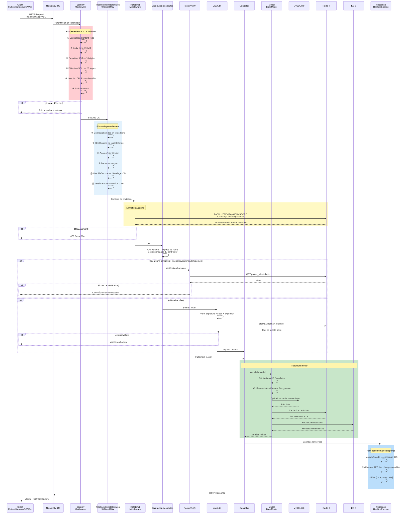

# Plateforme de commerce électronique transfrontalier — Collection de diagrammes d'architecture

Copyright (c) 2026 erik <erik@erik.xyz> — https://erik.xyz

---

## I. Diagramme d'architecture système

---

## II. Diagramme de flux de traitement des requêtes (pipeline de middlewares)

---

## III. Vue d'ensemble des modules fonctionnels

---

## IV. Diagramme de cycle de vie des requêtes

---

## V. Diagramme de cycle de vie des commandes

---

## VI. Diagramme d'architecture de déploiement

---

## VII. Diagramme d'architecture de sécurité

### Vue d'ensemble de la protection de sécurité

| Niveau | Ligne de défense | Technologie/paquet | Couverture |
|------|------|---------|---------|
| Première couche | Frontière réseau | Nginx SSL + reverse proxy + validation Host | Service + Admin |
| Deuxième couche | Détection d'attaques WAF | 31 détecteurs `erikwang2013/security-php` | XSS/SQLi/CRLF/traversée de chemin/XXE/SSRF/téléversement de fichiers/méthodes/Host/Content-Type/Body etc. |
| Troisième couche | Contrôle du trafic + résilience des dépendances | RateLimitMiddleware + compteurs Redis anti-force brute + CircuitBreaker | Limitation par seau à jetons (6 endpoints) + anti-explosion connexion/inscription + disjoncteur paiements/connexion sociale (5 échecs→30s, rétablissement semi-ouvert) |
| Quatrième couche | Authentification | PosterVerify + JwtAuth HS256 | Vérification homme-machine (curseur/puzzle/clic) + Bearer Token + double jeton avec rafraîchissement |
| Cinquième couche | Sécurité des données | Hashids + AES-256-CBC + Encryptable | Chiffrement à trois couches : obscurcissement d'ID/chiffrement de transport/chiffrement des champs en base de données |
| Sixième couche | Sécurité des réponses | En-têtes de sécurité HTTP + masquage des données sensibles | nosniff/DENY/XSS-Protection/Referrer-Policy/masquage des journaux |
| Continu | Traçabilité d'audit | PlatformMiddleware + OperationLogs | Suivi de 8 sources de plateforme + enregistrement dans 6 tables + journaux d'opérations |

---

## VIII. Diagramme de flux de règlement multidevise

### Explication du règlement multidevise

**Tarification multidevise** : les SKU produits sont tarifés par devise selon `currency_code` ; à la commande, la devise de paiement est verrouillée (USD / EUR / GBP / CNY etc.).

**Service de taux de change** : la table des taux `erik_exchange_rates` prend en charge la maintenance manuelle et la récupération automatique via exchangerate-api, versionnée par date d'effet `effective_at` ; le règlement utilise un instantané du taux au moment du paiement.

**Débit en devise d'origine** : Stripe / PayPal / Klarna / Adyen débite en devise de la commande ; le statut du paiement et de la commande est mis à jour après vérification de la signature du Webhook.

**Règlement de répartition** : après paiement réussi, `PlatformSettlements` est automatiquement généré (montant total de la commande + commission de la plateforme + frais de passerelle de paiement, comptabilisés dans la devise de la commande) ; le règlement des vendeurs `MerchantSettlements` (montant de la commande → taux de commission → montant du règlement), le règlement des fournisseurs `SupplierSettlements` et le retrait des commissions d'affiliation `AffiliatePayouts` sont quatre lignes de règlement indépendantes, statut 0 en attente de règlement / 1 réglé.

**Gains et pertes de change** : `CurrencyExchangeGainsLosses` suit l'écart entre la devise de paiement et la devise de règlement, en comparant le taux au moment du paiement et le taux au moment du règlement ; positif = gain de change, négatif = perte de change, pour le rapprochement et l'audit multidevise du commerce transfrontalier.

---

## Index des diagrammes

| N° | Nom du diagramme | Type | Usage |
|------|------|------|------|
| I | Diagramme d'architecture système | Diagramme d'architecture | Vue d'ensemble du système : clients → accès → application → données → services externes |
| II | Diagramme de flux de traitement des requêtes | Diagramme de flux | Chemin complet des requêtes HTTP à travers le pipeline de 12 middlewares (10 globaux + 2 de routage) |
| III | Vue d'ensemble des modules fonctionnels | Diagramme fonctionnel | Les 17 grands modules fonctionnels et leurs points fonctionnels détaillés |
| IV | Diagramme de cycle de vie des requêtes | Cycle de vie | Séquence complète de la requête à la réponse et les interactions de chaque phase |
| V | Diagramme de cycle de vie des commandes | Cycle de vie | Toutes les transitions d'état des commandes, du panier à la réalisation/au remboursement |
| VI | Diagramme d'architecture de déploiement | Diagramme d'architecture | Orchestration des conteneurs Docker Compose, réseau, couche CDN périphérique (origin-pull) et volumes de données persistants (dont volumes de téléversement admin_uploads/service_public) |
| VII | Diagramme d'architecture de sécurité | Diagramme d'architecture | Système de défense en profondeur sur 6 couches : frontière → WAF → trafic/résilience (limitation + disjoncteur) → authentification → données → réponses |
| VIII | Diagramme de flux de règlement multidevise | Diagramme de flux | Chaîne complète : tarification par devise → paiement → répartition → règlement → gains et pertes de change |
