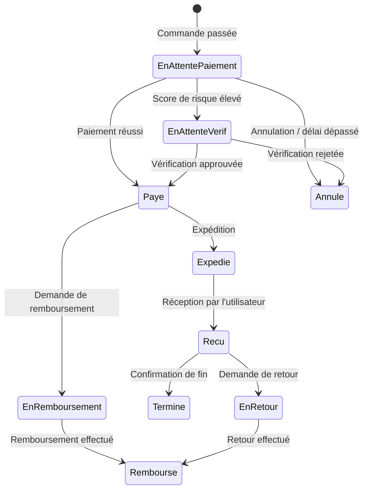
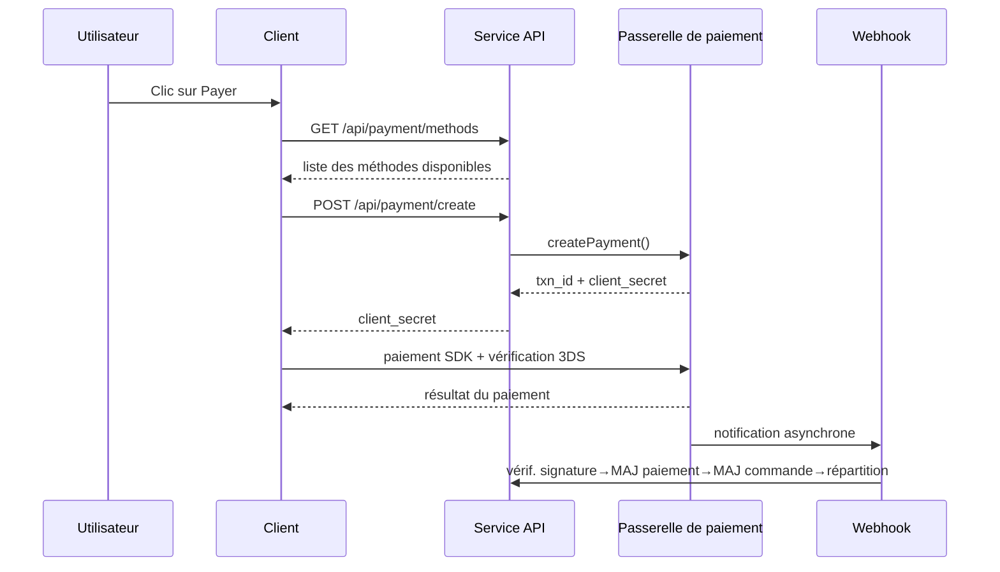
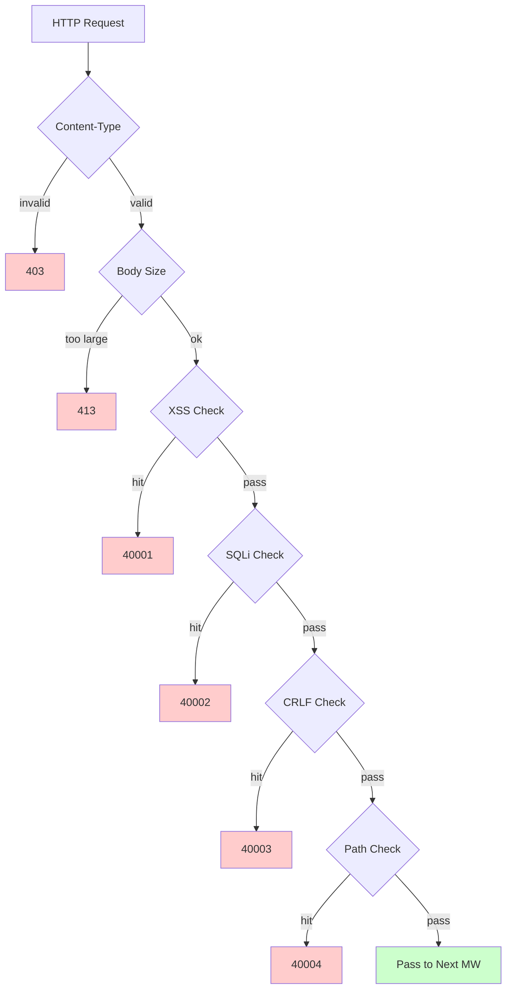

# Plateforme de commerce électronique transfrontalier — Document de conception fonctionnelle

Copyright (c) 2026 erik <erik@erik.xyz> — https://erik.xyz

---


## Suivi de plateforme

### Identification des 8 plateformes

| Plateforme | Header | Flutter | Admin |
|------|--------|---------|-------|
| iOS | `ios` | Platform.isIOS + TargetPlatform.iOS | UA iPhone |
| iPadOS | `ipados` | Platform.isIOS + !TargetPlatform.iOS | UA iPad |
| macOS | `macos` | Platform.isMacOS | UA Macintosh |
| Windows | `windows` | Platform.isWindows | UA Windows |
| Linux | `linux` | Platform.isLinux | UA Linux |
| Android | `android` | Platform.isAndroid | UA Android |
| HarmonyOS | `harmonyos` | — | UA HarmonyOS |
| Web | `web` | kIsWeb | Par défaut |

### Champs de suivi en base de données

| Table | Champ | Description |
|----|------|------|
| erik_orders | platform VARCHAR(16) | Plateforme de commande |
| erik_payments | platform VARCHAR(16) | Plateforme de paiement |
| erik_operation_logs | platform VARCHAR(16) | Plateforme d'opération |
| erik_users | last_login_platform VARCHAR(16) | Plateforme de connexion |
| erik_search_logs | platform VARCHAR(16) | Plateforme de recherche |
| erik_chat_messages | platform VARCHAR(16) | Source du message |

## 1. Vue d'ensemble des fonctionnalités

### 1.0 Aperçu de la couverture

| Dimension | Contenu couvert | Profondeur |
|------|---------|------|
| **Vente au détail B2C** | Produits multilingues, tarification par devise, SKU, panier, commandes, paiement (Stripe/PayPal/Klarna), remboursements, retours | Complète |
| **Vente en gros B2B** | Tarification par paliers (MOQ), certification d'entreprise (tax ID/licence commerciale), demande de devis | Complète |
| **Hébergement multi-marchands** | Vérification des vendeurs, vérification des produits, commission et règlement | Complète |
| **Conformité transfrontalière** | Base de codes HS Code (code de base 6 chiffres), règles tarifaires (pays de destination + HS → taux), VAT/IOSS, étiquettes de conformité (FDA/CE/REACH etc., 10 types) | Complète |
| **Logistique internationale** | Frais d'expédition par zone (paliers de poids), DHL/UPS/FedEx/EMS, entrepôts à l'étranger (expédition + retour), déclaration HS (identifiants batterie/liquide), facture commerciale PDF/bordereau de colisage | Complète |
| **Paiement** | Stripe PaymentIntent+3DS, PayPal REST, Klarna BNPL, Adyen, vérification de signature Webhook + règlement | Stripe complet, autres en placeholder |
| **Marketing** | Coupons (par zone + restriction nouveaux/anciens clients), bannières carrousel (visibilité par région), ventes flash (limitées en temps et quantité), achats groupés (nombre de participants + validité), distribution (liens + commissions + retraits) | Complète |
| **Multiplateforme** | Publication Amazon/eBay/Shopee/Lazada/Temu + agrégation des commandes, gestion multi-boutiques | Complète |
| **Chaîne d'approvisionnement** | Dossiers fournisseurs + évaluation, bons de commande d'achat (vérification → expédition → réception → contrôle qualité), contrôle qualité (contrôle à l'entrée + à la sortie/apparence/fonction/étiquettes de conformité), journal de stock (grand livre immuable : entrée/sortie/transfert/inventaire) | Complète |
| **Gestion des risques et conformité** | Moteur de règles (score en parallèle : validation d'adresse/correspondance de code postal/3DS/inscription en masse/valorisation anormale), vérification d'identité KYC, demandes de données GDPR/CCPA, gestion des versions du consentement Cookie | Complète |
| **Protection de sécurité** | SecurityMiddleware encapsule les 31 détecteurs de security-php : XSS (13 regex)/injection SQL (13 regex)/CRLF/traversée de chemin (encodage + octet nul)/taille du corps/Content-Type/téléversement de fichiers/en-têtes HTTP sécurisés/force brute (compteurs Redis)/XXE/SSRF/méthodes/Host/masquage des données sensibles/CORS | Complète |
| **Haute concurrence** | Limitation par seau à jetons (fenêtre glissante + règles sur 6 endpoints), séparation lecture/écriture DB (2 réplicas de lecture + sticky), pool de connexions (DB 50/10 + Redis 30/5), OPCache (128 Mo, environnement Docker) | Complète |
| **Croissance des membres** | Niveaux de membre + avantages, règles de points + journal, cartes cadeaux (solde + échange), alertes baisse de prix/arrivée, favoris, comparaison de produits, historique de navigation, abonnements récurrents, tests AB (répartition du trafic + niveau de confiance) | Complète |
| **Gestion de contenu** | Pages CMS multilingues (Landing/Blog), FAQ multilingue, base de connaissances multilingue, tableaux de tailles (vêtements/chaussures + conversion US/UK/EU/JP/CN), modèles d'e-mails (multilingues), flux produits (Google/Meta + synchronisation planifiée) | Complète |
| **Service client** | IM temps réel WebSocket (chat_sessions/chat_messages), base de connaissances multilingue | Structure de tables complète, WS à implémenter |
| **Infrastructure** | ID distribués Snowflake (bigint non auto-incrémenté), obscurcissement des ID d'interface Hashids, authentification JWT (HS256 + double jeton access/refresh avec rafraîchissement), chiffrement/déchiffrement AES (interface + base de données, trois couches), identification de région GeoIP (MaxMind), vérification homme-machine Poster (curseur/puzzle/clic) | Complète |
| **Couverture multi-appareils** | Flutter 5 plateformes (iOS/Android/macOS/Windows/Linux/iPadOS) + HarmonyOS (ArkTS 9 pages) + Web Admin (LayUI+ECharts) + API | Flutter 25 fichiers, HarmonyOS 14 fichiers, Admin 239 fichiers |
| **Suivi de plateforme** | Identification des 8 plateformes (iOS/iPadOS/macOS/Windows/Linux/Android/HarmonyOS/Web) + en-tête X-Platform + enregistrement dans 6 tables (orders/payments/operation_logs/users/search_logs/chat_messages) | Complète |
| **Tests** | 22 tests / 45 assertions — ALL PASS (SecurityTest 12 : XSS+SQLi+XXE+SSRF+Path / JwtTest 4 / ApiResponseTest 3 / RedisFacadeTest 3) | Tests unitaires complets, tests d'intégration à compléter |

### 1.1 Matrice des modules

| Module de niveau 1 | Module de niveau 2 | Priorité | Statut |
|---------|---------|--------|------|
| Système utilisateur | Inscription/connexion/connexion sociale/KYC/Adresses/Favoris/Membres/Points/Cartes cadeaux | P0-P2 | ✅ |
| Système produits | Catégories/SKU/Multilingue/Multidevise/Images/Attributs/Conformité/HS Code/Recherche ES/Flux | P0-P1 | ✅ |
| Système de transactions | Panier/Commandes/Paiement (Stripe+PayPal+Klarna)/Remboursements/Retours/Factures | P0 | ✅ |
| Système logistique | Transporteurs internationaux/Frais par zone/Entrepôts à l'étranger/Expédition (déclaration HS)/Assurance logistique | P0-P1 | ✅ |
| Douanes et fiscalité | Base de codes HS Code/Règles tarifaires/VAT/IOSS/Restrictions de conformité par pays | P0 | ✅ |
| Système marketing | Coupons/Bannières carrousel/Ventes flash/Achats groupés/Distribution | P1-P2 | ✅ |
| Chaîne d'approvisionnement | Fournisseurs/Bons de commande d'achat/Contrôle qualité/Journal de stock | P1 | ✅ |
| Gestion des risques et conformité | Moteur de règles/GDPR/CCPA/Consentement Cookie/Suivi de plateforme | P1 | ✅ |
| Protection de sécurité | XSS/Injection SQL/CRLF/Traversée de chemin/Content-Type/Corps de requête | P0 | ✅ |
| Multiplateforme | Publication Amazon/eBay/Shopee + agrégation des commandes/Hébergement multi-marchands | P2 | ✅ |
| Gestion de contenu | CMS/FAQ/Base de connaissances/Modèles d'e-mails/Notifications/Tableaux de tailles | P2 | ✅ |
| Outils de croissance | Vente en gros B2B/Abonnements récurrents/Tests AB | P2-P3 | ✅ |
| Service client | IM temps réel WebSocket/Base de connaissances | P3 | ✅ |
| Infrastructure | Snowflake ID/JWT/Hashids/Encryption/Poster/Version d'API/GeoIP | P0 | ✅ |

---

## 2. Diagrammes de flux métier principaux

### 2.1 Machine à états des commandes



### 2.2 Séquence de paiement



### 2.3 Pipeline de détection de sécurité



---

## 3. Processus métier principaux

### 3.1 Inscription et connexion des utilisateurs

```
Inscription EMAIL : email+password → vérification homme-machine PosterVerify → bcrypt(password+salt)
          → génération Snowflake ID → retour JWT {access_token, expires_in}

Connexion sociale : OAuth Google/Apple/Facebook → vérification id_token
        → consultation du lien dans erik_user_social_accounts
        → déjà lié : connexion / non lié : création automatique du compte + liaison → retour JWT

Connexion : email+password → password_verify(password+salt)
    → mise à jour last_login_at/ip/platform → émission JWT

Rafraîchissement du token : refresh_token → Jwt::decode → nouveau access_token
```

### 3.2 Navigation produits et recherche

```
Liste : GET /api/products
  → filtres : category_id/status/keyword/price_range
  → tri : default/price_asc/price_desc/sales/newest
  → multilingue : ProductTranslations filtrées par locale
  → multidevise : ProductSkuPrices correspondance par currency_code
  → pagination : 20 entrées/page

Recherche ES : GET /api/search?keyword=xxx
  → Erikwang2013\WebmanScout\Searchable → analyseur multilingue ES
  → agrégations : category/price/brand
  → repli : LIKE MySQL si ES indisponible

Détail : GET /api/products/{hashid}
  → décodage par le middleware HashidsDecode → Eager Load
  → multilingue + multidevise + conformité + HS Code + conversion des tailles + TTC/HT + VAT
```

### 3.3 Panier et commande

```
Panier : POST /api/cart {sku_id, quantity}
  → vérification du SKU (existe|en vente|stock suffisant)
  → cumul si même SKU / création si inexistant

Commande : POST /api/orders {address_id, coupon_id, currency_code}
  → 1. validation de l'adresse de livraison → 2. récupération des articles sélectionnés du panier → 3. validation article par article (stock + conformité)
  → 4. calcul du prix (multidevise + coupons) → 5. génération du numéro de commande
  → 6. création Order + OrderItems → 7. décrément du stock → 8. écriture OrderLog
  → 9. score de risque (RiskEngine::score) → 10. suppression du panier acheté

Annulation : POST /api/orders/{id}/cancel
  → validation du statut = 0 (en attente de paiement) → restauration du stock → status=5 (annulée)
```

### 3.4 Processus de paiement

```
Méthodes disponibles : GET /api/payment/methods?country=DE&currency=EUR
  → PaymentGatewayMethods (filtre par country+currency)

Création du paiement : POST /api/payment/create
  → PaymentGateway::make(gateway)→createPayment()
  → Stripe : PaymentIntent → client_secret → SDK frontal (+3DS)

Webhook : POST /webhook/payment/stripe
  → vérification de la signature → payment_intent.succeeded :
     → Payment.status=payé → Order.status=payée
     → PlatformSettlement (commission plateforme + frais de passerelle + fournisseurs + distribution)
```

### 3.5 Processus de retour

```
Demande : POST /api/returns {order_id, reason_id}
  → détermination du canal de retour : entrepôt local (type=1)/retour vers la Chine (type=2)/remboursement seul (type=3)

Vérification : vérification Admin → validé : génération ReturnLabel / rejeté : enregistrement du motif

Renvoi : téléchargement du bordereau → renvoi → mise à jour logistique → réception en entrepôt → status=réçu

Remboursement : status=terminé → Refund associé → PaymentGateway::refund → retour au moyen de paiement d'origine
```

### 3.6 Estimation des droits de douane

```
GET /api/tariff/estimate?product_id=xxx&dest_country_id=xxx&declared_value=100

1. ProductHsCodes → HsCode
2. TariffRules(dest_country_id + hs_code_id) → duty_rate + duty_free_threshold
3. VatSettings(country_id) → vat_rate + vat_free_threshold
4. duty = value>=threshold ? value*duty_rate/100 : 0
   vat = (value+duty)>=threshold ? (value+duty)*vat_rate/100 : 0
5. retour {duty_rate, vat_rate, estimated_duty, estimated_vat, estimated_total, hs_code, disclaimer}
```

---

## 4. Protection de sécurité (SecurityMiddleware encapsule les 31 détecteurs de security-php)

### 4.1 Tableau général des règles de détection

| # | Type d'attaque | Méthode de détection principale | Code d'erreur | Service | Admin |
|---|---------|------------|--------|---------|-------|
| 1 | XSS (scripting intersite) | 13 regex : script/iframe/événements on/svg+on/style/expression/javascript:/embed/object/link/meta | 40001 | ✅ | ✅ |
| 2 | Injection SQL | 13 regex : UNION SELECT/SELECT FROM WHERE/sleep/benchmark/pg_sleep/type booléen/type chaîne/commentaires/commentaires spéciaux MySQL/énumération de schéma/load_file/into outfile/procédures stockées/waitfor/delay | 40002 | ✅ | ✅ |
| 3 | Injection CRLF dans les en-têtes | `[\r\n]` dans : Authorization/X-Platform/API-Version/X-Forwarded-For/Referer/Origin | 40003 | ✅ | ✅ |
| 4 | Traversée de chemin | `../` + encodage `%2e%2f` + encodage double `%252e%252f` + octet nul `\0` + `.env`/`.git`/`phpmyadmin`/`wp-admin`/`/etc/`/`/proc/`/`composer.json` | 40004 | ✅ | ✅ |
| 5 | Limite du corps de requête | Content-Length > 10 Mo (Service) / 20 Mo (Admin) | 40005 | ✅ | ✅ |
| 6 | Restriction Content-Type | Uniquement JSON/form-data/form-urlencoded | 40006 | ✅ | ✅ |
| 7 | **Validation du téléversement de fichiers** | Extensions en liste noire (php/phtml/sh/exe/js/...) + attaque par double extension + extension vide | 40009 | ✅ | ✅ |
| 8 | **En-têtes de réponse HTTP sécurisés** | nosniff/DENY/XSS-Protection/Referrer-Policy/Permissions-Policy/Cache-Control/masquage Server | — | ✅ | ✅ |
| 9 | **Protection contre la force brute** | Compteurs Redis : API 10 fois/60 s, Admin 5 fois/300 s | 40008 | ✅ | ✅ |
| 10 | **Injection d'entités XXE** | `<!ENTITY SYSTEM>`, `<!DOCTYPE [` | 40010 | ✅ | ✅ |
| 11 | **SSRF (falsification de requête côté serveur)** | IP internes (127/10/172.16/192.168/0.0/169.254.169.254) + localhost + metadata.google.internal | 40011 | ✅ | ✅ |
| 12 | **Validation des méthodes HTTP** | Uniquement GET/POST/PUT/DELETE/PATCH/OPTIONS/HEAD | 40012 | ✅ | ✅ |
| 13 | **Validation de l'en-tête Host** | Refus de l'accès direct par IP nue | 40013 | ✅ | — |
| 14 | **Masquage des données sensibles** | Filtrage de password/token/secret dans les journaux/réponses d'erreur | — | ✅ | ✅ |
| 15 | **Liste blanche CORS** | Restriction d'origine configurable | — | ⚠️ | ⚠️ |

### 4.2 Pipeline de middlewares

```
Service : Cors → Security → Platform → GeoIp → Locale → HashidsDecode
        → VersionRoute → (PosterVerify) → (JwtAuth) → HashidsEncode

Admin : Security → Platform → HashidsDecode → AccessControl → HashidsEncode
```

### 4.3 Suivi de la source de plateforme

| Plateforme | Valeur d'en-tête | Méthode d'identification |
|------|---------|---------|
| iOS | `ios` | Flutter `Platform.isIOS` |
| iPadOS | `ipados` | Détermination par Flutter `TargetPlatform.iOS` |
| macOS | `macos` | Flutter `Platform.isMacOS` |
| Windows | `windows` | Flutter `Platform.isWindows` |
| Linux | `linux` | Flutter `Platform.isLinux` |
| Android | `android` | Flutter `Platform.isAndroid` |
| HarmonyOS | `harmonyos` | Codé en dur ArkTS |
| Web | `web` | Repli UA / défaut |

---


## 5. Haute concurrence et performance

### 5.1 Règles de limitation

| Endpoint | Algorithme | Fenêtre | Limite |
|------|------|------|------|
| /api/auth/login | Fenêtre glissante | 60 s | 10 fois |
| /api/auth/register | Fenêtre glissante | 300 s | 5 fois |
| /api/payment | Fenêtre glissante | 60 s | 5 fois |
| /api/orders | Fenêtre glissante | 10 s | 3 fois |
| /api/search | Fenêtre glissante | 1 s | 10 fois |
| Défaut | Fenêtre glissante | 60 s | 100 fois |

### 5.2 Usages de Redis

| Usage | Implémentation |
|------|------|
| Limitation par seau à jetons | Fenêtre glissante Redis ZSET |
| Vérification homme-machine | État des codes de vérification PosterVerify |
| Stockage des sessions | Stockage KV Redis |

Les données métier ne font pas de cache applicatif, elles sont lues directement dans MySQL (séparation lecture/écriture + pool de connexions).

### 5.3 Pool de connexions

| Ressource | Max | Min | Délai d'attente |
|------|------|------|------|
| MySQL | 50 | 10 | 2 s |
| Redis | 30 | 5 | — |

## 6. Diagramme des relations entre tables

```
erik_users ──┬── addresses, social_accounts, wishlists, kyc
             ├── carts, orders → order_items → payments
             ├── reviews, coupons(through user_coupons)
             ├── notifications, subscriptions, point_logs
             ├── affiliate_links, chat_sessions, b2b_verifications
             └── privacy_requests

erik_products ──┬── translations(product_id, locale)
                ├── skus → sku_prices(sku_id, currency_code)
                ├── images, reviews, compliance → compliance_categories
                ├── hs_codes → hs_codes, recommendations
                ├── b2b_prices, platform_listings
                └── product_comparisons

erik_orders ──┬── order_items, order_logs
              ├── payments, refunds, return_orders → return_labels
              ├── order_documents, shipments
              ├── platform_settlements, risk_logs
              └── subscription_orders

erik_countries ──┬── vat_settings, tariff_rules(dest_country_id)
                 ├── country_compliance_rules
                 ├── shipping_zones(JSON countries)
                 └── warehouses(country_id)
```

---

## 7. Interfaces API

La liste complète des endpoints API (23 interfaces publiques + 47 interfaces authentifiées + Webhook + Admin/Health) est détaillée dans [Documentation des interfaces API](api.md).

---

## 8. Vérification des tests

```bash
cd service && php vendor/bin/phpunit tests/
```

| Classe de test | Tests | Couverture |
|--------|-------|------|
| SecurityTest | 12 | XSS (3) + SQLi (2) + XXE (2) + SSRF (1) + Path (2) + fuite de carte bancaire (1) + laisser passer normal (1) |
| JwtTest | 4 | JWT en trois segments encode + aller-retour decode + token invalide→null + token vide→null |
| ApiResponseTest | 3 | success (code=0) + fail (code d'erreur) + paginate (liste + métadonnées de pagination) |
| RedisFacadeTest | 3 | ping + aller-retour set/get + fonction d'aide redis() (skip si Redis indisponible) |
| **Total** | **22** | **45 assertions — ALL PASS** |
