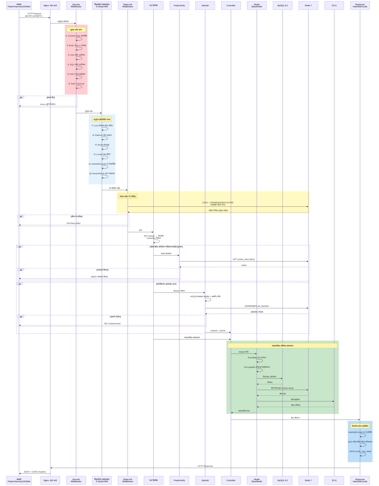

> यह दस्तावेज़ मूल चीनी दस्तावेज़ का मशीनी अनुवाद है। मूल देखें: [中文原版](../../../README.md).

# Erik Shop — क्रॉस-बॉर्डर ई-कॉमर्स प्लेटफ़ॉर्म पूर्ण संस्करण (Full)

Copyright (c) 2026 erik <erik@erik.xyz> — https://erik.xyz

## संस्करण

> सरलीकृत संस्करण (MIT ओपन-सोर्स): `lite` | मानक संस्करण (व्यावसायिक): `standard` | पूर्ण संस्करण (व्यावसायिक): `full`
>
> व्यावसायिक लाइसेंस संपर्क: **erik@erik.xyz** | संस्करण तुलना: [VERSIONS.md](VERSIONS.md)

## भाषा / Languages

| भाषा | लिंक |
|------|------|
| चीनी | [README.md](../../../README.md) |
| अंग्रेज़ी | [docs/i18n/en/README.md](../en/README.md) |
| कोरियाई | [docs/i18n/ko/README.md](../ko/README.md) |
| रूसी | [docs/i18n/ru/README.md](../ru/README.md) |
| जर्मन | [docs/i18n/de/README.md](../de/README.md) |
| फ़्रेंच | [docs/i18n/fr/README.md](../fr/README.md) |
| स्पेनिश | [docs/i18n/es/README.md](../es/README.md) |
| पुर्तगाली | [docs/i18n/pt/README.md](../pt/README.md) |
| हिन्दी | [docs/i18n/hi/README.md](../hi/README.md) |
| अरबी | [docs/i18n/ar/README.md](../ar/README.md) |
| बांग्ला | [docs/i18n/bn/README.md](../bn/README.md) |
| इंडोनेशियाई | [docs/i18n/id/README.md](../id/README.md) |
| जापानी | [docs/i18n/ja/README.md](../ja/README.md) |

## परियोजना परिचय

webman फुल-स्टैक पर आधारित क्रॉस-बॉर्डर ई-कॉमर्स प्लेटफ़ॉर्म, जो B2C/B2B परिदृश्यों और तृतीय-पक्ष विक्रेता ऑनबोर्डिंग को कवर करता है।

### तकनीकी आर्किटेक्चर

| परत | तकनीक | निर्देशिका |
|------|------|------|
| व्यावसायिक API | webman + illuminate/database + erikwang2013/* | `service/` |
| प्रशासन पैनल | webman-admin + LayUI + ECharts | `admin/` |
| क्लाइंट | Flutter (iOS/Android/macOS/Windows/Linux) | `apps/flutter/` |
| हार्मनी क्लाइंट | ArkTS + ArkUI (HarmonyOS NEXT) | `apps/harmonyos/` |

### तकनीकी स्टैक

**सर्वर:** PHP 8.3+, webman 2.1, MySQL 8.0, Redis 7, Elasticsearch 8
**कोर पैकेज:** snowflake-php, hashids, jwt-webman, encryption, encryptable, poster-php, webman-scout, season
**भुगतान:** Stripe, PayPal (पूर्ण); Klarna, Adyen (प्लेसहोल्डर, `PaymentGateway::make` कार्यान्वित नहीं, देखें [PLAN.md](PLAN.md))
**क्लाइंट:** Flutter 3.x (Riverpod + GoRouter + Dio), HarmonyOS API 12+ (ArkTS + ArkUI)

## आर्किटेक्चर आरेख संग्रह

> पूर्ण आरेख संग्रह और बड़ी छवियाँ देखें: [diagrams.md](diagrams.md)

### सिस्टम आर्किटेक्चर आरेख


### अनुरोध प्रसंस्करण फ़्लो आरेख


### कार्यात्मक मॉड्यूल मानचित्र आरेख


### अनुरोध जीवनचक्र आरेख



> अधिक विवरण के लिए [पूर्ण आर्किटेक्चर आरेख संग्रह](diagrams.md) देखें (ऑर्डर जीवनचक्र, तैनाती आर्किटेक्चर, सुरक्षा आर्किटेक्चर, बहु-मुद्रा सेटलमेंट आदि सहित 8 आरेख)

### सुरक्षा आर्किटेक्चर आरेख



### बहु-मुद्रा सेटलमेंट फ़्लो आरेख


### बहु-मुद्रा सेटलमेंट विवरण

**बहु-मुद्रा मूल्य निर्धारण**: उत्पाद SKU का मूल्य `currency_code` के अनुसार मुद्रा-वार निर्धारित होता है, ऑर्डर के समय भुगतान मुद्रा (USD / EUR / GBP / CNY आदि) लॉक होती है।

**विनिमय दर सेवा**: `erik_exchange_rates` दर तालिका manual रखरखाव और exchangerate-api स्वचालित फ़ेच दोनों का समर्थन करती है, `effective_at` प्रभावी समय के अनुसार संस्करण-आधारित प्रबंधन, सेटलमेंट के समय भुगतान क्षण की दर स्नैपशॉट ली जाती है।

**मूल मुद्रा में कटौती**: Stripe / PayPal ऑर्डर मुद्रा में मूल मुद्रा कटौती करते हैं (Klarna/Adyen प्लेसहोल्डर हैं, कनेक्ट नहीं), Webhook हस्ताक्षर सत्यापन के बाद धनराशि प्राप्ति की पुष्टि कर भुगतान और ऑर्डर स्थिति अपडेट होती है।

**विभाजन सेटलमेंट**: भुगतान सफल होने पर स्वचालित रूप से `PlatformSettlements` प्लेटफ़ॉर्म विभाजन उत्पन्न होता है (ऑर्डर कुल + प्लेटफ़ॉर्म कमीशन + भुगतान गेटवे शुल्क, ऑर्डर मुद्रा में हिसाब); विक्रेता सेटलमेंट `MerchantSettlements` (ऑर्डर राशि → कमीशन दर → सेटलमेंट राशि), आपूर्तिकर्ता सेटलमेंट `SupplierSettlements`, वितरण कमीशन निकासी `AffiliatePayouts` — चारों रेखाएँ स्वतंत्र रूप से सेटल होती हैं, स्थिति 0 लंबित सेटलमेंट / 1 सेटल हो गया।

**विनिमय लाभ/हानि**: `CurrencyExchangeGainsLosses` प्राप्ति मुद्रा और सेटलमेंट मुद्रा के अंतर को ट्रैक करती है, भुगतान समय की दर और सेटलमेंट समय की दर की तुलना करती है, धनात्मक = विनिमय लाभ, ऋणात्मक = विनिमय हानि, जो क्रॉस-बॉर्डर ई-कॉमर्स बहु-मुद्रा मिलान और ऑडिट का समर्थन करती है।

## त्वरित आरंभ

### विधि 1: Web एक-क्लिक इंस्टॉलेशन (अनुशंसित)

```bash
# 1. admin निर्भरताएँ स्थापित करें
cd admin && composer install

# 2. प्रशासन पैनल प्रारंभ करें
php start.php start -d

# 3. ब्राउज़र में इंस्टॉलेशन विज़ार्ड खोलें
# http://127.0.0.1:8788/app/admin/install/step1
# डेटाबेस जानकारी भरें → व्यवस्थापक खाता सेट करें → पूर्ण

# 4. निर्भरताएँ स्थापित करें और API प्रारंभ करें
cd ../service && composer install && php start.php start -d
```

> इंस्टॉलेशन विज़ार्ड स्वचालित रूप से पूरा करता है: डेटाबेस बनाना → 117 तालिकाएँ आयात → service/.env और admin/.env उत्पन्न (यादृच्छिक कुंजियों सहित) → व्यवस्थापक बनाना → सेवा रीलोड

### विधि 2: कमांड लाइन मैनुअल इंस्टॉलेशन

विवरण के लिए देखें [INSTALL.md](../../INSTALL.md)

### Docker तैनाती

```bash
# पर्यावरण चर कॉन्फ़िगर करें
cp .env.example .env  # या DB_PASS / JWT_SECRET आदि चर सेट करें

# एक क्लिक में सभी सेवाएँ प्रारंभ करें
docker-compose up -d
# nginx:80 → service:8787 + admin:8788
# MySQL:3306, Redis:6379, ES:9200
```

विवरण के लिए देखें [तैनाती दस्तावेज़](deployment.md)

## परियोजना संरचना

```
shop-php/
  install.sql       # एक-क्लिक इंस्टॉल SQL (117 तालिकाएँ), Web इंस्टॉलेशन विज़ार्ड द्वारा स्वतः आयात
  service/          PHP बिज़नेस API (webman)        — 39 कंट्रोलर + 111 मॉडल + 14 मिडलवेयर
  admin/            प्रशासन पैनल (webman-admin)      — 82 कंट्रोलर + 76 मॉडल + ECharts डैशबोर्ड + Web इंस्टॉलेशन विज़ार्ड
  apps/flutter/     Flutter क्लाइंट              — 11 पेज + 5 भाषाएँ + PC अनुकूली
  apps/harmonyos/   HarmonyOS क्लाइंट                  — 9 पेज + ArkTS
  docker/           Docker तैनाती                  — Nginx + PHP + MySQL + Redis + ES
  docs/             डिज़ाइन दस्तावेज़
```

## कार्यक्षमता कवरेज

| आयाम | कवर सामग्री |
|------|---------|
| **B2C खुदरा** | बहुभाषी उत्पाद, मुद्रा-वार मूल्य निर्धारण, SKU, कार्ट, ऑर्डर, भुगतान, रिफंड, रिटर्न |
| **B2B थोक** | सीढ़ीदार मूल्य (MOQ), उद्यम सत्यापन (कर संख्या/व्यवसाय लाइसेंस), मूल्य पूछताछ |
| **बहु-विक्रेता ऑनबोर्डिंग** | विक्रेता समीक्षा, उत्पाद समीक्षा, कमीशन विभाजन |
| **क्रॉस-बॉर्डर अनुपालन** | HS Code एन्कोडिंग लाइब्रेरी, सीमा शुल्क नियम, VAT/IOSS, देश-वार अनुपालन लेबल (FDA/CE/RoHS) |
| **अंतर्राष्ट्रीय लॉजिस्टिक्स** | लॉजिस्टिक्स ज़ोन शिपिंग शुल्क, विदेशी गोदाम (शिपिंग + रिटर्न गोदाम), वाणिज्यिक चालान/पैकिंग सूची, HS घोषणा (योजनाधीन) |
| **भुगतान** | Stripe/PayPal (पूर्ण), Klarna/Adyen (प्लेसहोल्डर), BNPL अभी खरीदें बाद में भुगतान करें (प्लेसहोल्डर), 3DS सत्यापन |
| **मार्केटिंग** | कूपन (ज़ोन + नए/पुराने ग्राहक), कैरोसेल (क्षेत्र-दृश्यता), फ्लैश सेल, ग्रुप बाय, वितरण (लिंक + कमीशन + निकासी) |
| **बहु-प्लेटफ़ॉर्म** | Amazon/eBay/Shopee/Lazada/Temu उत्पाद लिस्टिंग + ऑर्डर एकत्रीकरण |
| **आपूर्ति श्रृंखला** | आपूर्तिकर्ता रेटिंग, खरीद→गुणवत्ता जाँच→स्टॉक प्रवेश, स्टॉक लेज़र (अपरिवर्तनीय बहीखाता), स्थानांतरण |
| **जोखिम प्रबंधन अनुपालन** | नियम इंजन (साइड-बाय स्कोरिंग), KYC नाम सत्यापन, GDPR/CCPA डेटा अनुरोध, Cookie Consent |
| **सुरक्षा सुरक्षा** | 31 प्रकार की हमला पहचान (XSS/SQL इंजेक्शन/XXE/SSRF/CRLF/पाथ ट्रैवर्सल/फ़ाइल अपलोड/ब्रूट फ़ोर्स/HTTP विधि/Host/CORS आदि) |
| **उच्च समवर्ती** | टोकन बकेट रेट लिमिट, सर्किट ब्रेकर (पेमेंट/सोशल लॉगिन), DB रीड/राइट स्प्लिटिंग, कनेक्शन पूल अनुकूलन |
| **सदस्य विकास** | पॉइंट नियम, सदस्यता स्तर लाभ, गिफ्ट कार्ड, मूल्य कम होने की सूचना, सदस्यता चक्र खरीद, AB परीक्षण |
| **सामग्री प्रबंधन** | CMS बहुभाषी पृष्ठ, FAQ, ज्ञानकोष, साइज़ चार्ट, ईमेल टेम्पलेट, उत्पाद Feed सिंक |
| **ग्राहक सेवा** | WebSocket रीयल-टाइम IM, ज्ञानकोष (तालिका संरचना बनी हुई है) |
| **बुनियादी ढाँचा** | Snowflake वितरित ID, Hashids इंटरफ़ेस अस्पष्टीकरण, JWT प्रमाणीकरण, AES एन्क्रिप्शन, GeoIP क्षेत्र पहचान |
| **बहु-प्लेटफ़ॉर्म कवरेज** | Flutter (iOS/Android/macOS/Windows/Linux/iPadOS) + HarmonyOS (ArkTS) + Web Admin |
| **प्लेटफ़ॉर्म ट्रैकिंग** | 8 प्लेटफ़ॉर्म स्रोत पहचान (iOS/iPadOS/macOS/Windows/Linux/Android/HarmonyOS/Web) + DB रिकॉर्ड |
| **परीक्षण** | 22 tests / 45 assertions — ALL PASS (Security+Jwt+ApiResponse+Redis) |

## कोर डिज़ाइन

- **Snowflake प्राथमिक कुंजी**: सभी 117 तालिकाएँ `erikwang2013/snowflake-php` द्वारा जनित bigint ID का उपयोग करती हैं
- **Hashids इंटरफ़ेस**: मिडलवेयर स्वचालित रूप से एन्कोड/डिकोड करता है, कंट्रोलर अनजान रहते हैं
- **Encryptable एन्क्रिप्शन**: email/mobile/address जैसे संवेदनशील फ़ील्ड डेटाबेस-स्तरीय एन्क्रिप्टेड
- **JWT प्रमाणीकरण**: HS256 + access/refresh दोहरे टोकन स्वचालित रिफ्रेश
- **API संस्करण**: `API-Version` हेडर रूटिंग, URL में नहीं
- **Poster सत्यापन**: संवेदनशील कार्यों (रजिस्ट्रेशन/ऑर्डर/भुगतान) पर यादृच्छिक मानव-सत्यापन

## दस्तावेज़

| दस्तावेज़ | विवरण |
|------|------|
| [README-EN.md](../../README-EN.md) | English documentation |
| [INSTALL.md](../../INSTALL.md) | इंस्टॉलेशन गाइड (Web एक-क्लिक इंस्टॉलेशन + मैनुअल इंस्टॉलेशन) |
| [AUDIT-REPORT.md](../../AUDIT-REPORT.md) | इंस्टॉलेशन सिस्टम समीक्षा रिपोर्ट |
| [परियोजना योजना](PLAN.md) | टीम द्वारा उत्पादित चरणबद्ध परियोजना योजना (4-चरण रोडमैप + प्रमुख जोखिम + Quick Wins) |
| [टीम अनुसंधान विवरण](PLAN-RESEARCH.md) | 7 क्षेत्रों की वर्तमान स्थिति अनुसंधान: कार्यान्वित / अंतर / जोखिम / सुझाव |
| [कार्यक्षमता डिज़ाइन दस्तावेज़](features.md) | पूर्ण कार्यक्षमता मैट्रिक्स, व्यावसायिक प्रक्रियाएँ, स्टेट मशीन |
| [आर्किटेक्चर आरेख संग्रह](diagrams.md) | आर्किटेक्चर आरेख, फ़्लो चार्ट, कार्यात्मक आरेख, जीवनचक्र आरेख, तैनाती आरेख, बहु-मुद्रा सेटलमेंट आरेख (8 Mermaid आरेख) |
| [आर्किटेक्चर डिज़ाइन दस्तावेज़](architecture-full.md) | सिस्टम आर्किटेक्चर आरेख, मिडलवेयर पाइपलाइन, डेटा आर्किटेक्चर, सुरक्षा आर्किटेक्चर, भुगतान आर्किटेक्चर |
| [डिज़ाइन दस्तावेज़](design.md) | डेटाबेस तालिका डिज़ाइन, API मानक, सुरक्षा योजना, अंतर्राष्ट्रीयकरण |
| [आर्किटेक्चर दस्तावेज़](architecture.md) | निर्देशिका संरचना, मॉडल विरासत श्रृंखला, प्रमुख पैकेज |
| [API इंटरफ़ेस दस्तावेज़](api.md) | 71 API एंडपॉइंट (स्थैतिक दस्तावेज़) |
| [hg/apidoc इंटरफ़ेस दस्तावेज़](http://localhost:8787/apidoc/) | hg/apidoc स्वचालित जनन (6 समूह: प्रमाणीकरण/उत्पाद/लेनदेन/लॉजिस्टिक्स सीमा शुल्क/उपयोगकर्ता मार्केटिंग/संचालन) |
| [तैनाती दस्तावेज़](deployment.md) | Docker/मैनुअल तैनाती, पर्यावरण चर, संचालन कमांड |

## ओपन-सोर्स आसान नहीं, समर्थन का स्वागत है

| वीचैट | अलीपे |
|:---:|:---:|
|  |  |

### वैश्विक बैंक ट्रांसफ़र (ZA Bank)

**प्राप्तकर्ता जानकारी**

- प्राप्तकर्ता का नाम: WANG KEXUN
- प्राप्तकर्ता खाता संख्या: 881015918251

**प्राप्तकर्ता बैंक**

- SWIFT Code: AABLHKHHXXX
- बैंक का नाम: ZA Bank Limited
- बैंक कोड: 387
- बैंक का पता: Core F, Cyberport 3, 100 Cyberport Road, Hong Kong

**क्रॉस-बॉर्डर रेमिटेंस संवाददाता बैंक (यदि आवश्यक हो)**

> यह क्रॉस-बॉर्डर रेमिटेंस संवाददाता बैंक (मध्यस्थ बैंक) की जानकारी है, प्राप्तकर्ता बैंक की नहीं। कृपया अपने रेमिटिंग बैंक से पूछें कि क्या यह प्रदान करना आवश्यक है।

- **हांगकांग डॉलर, CNY और USD जमा करने हेतु** (संवाददाता बैंक Citibank):
  - बैंक का नाम: Citibank N.A. Hong Kong
  - SWIFT Code: CITIHKHXXXX
  - बैंक कोड: 006
  - शाखा का नाम: Hong Kong Branch
  - शाखा कोड: 391
  - बैंक का पता: Citibank Tower, Citibank Plaza, 3 Garden Road, Central, Hong Kong
- **अन्य मुद्राएँ जमा करने हेतु** (संवाददाता बैंक BNY Mellon):
  - बैंक का नाम: THE BANK OF NEW YORK MELLON
  - SWIFT Code: IRVTUS3NXXX
  - बैंक का पता: THE BANK OF NEW YORK MELLON, 240 GREENWICH STREET, NEW YORK, United States

---

## परीक्षण

```bash
make test             # अनुशंसित तरीका
cd service && php vendor/bin/phpunit tests/   # मूल कमांड
# 22 tests, 45 assertions — ALL PASS

# निर्भरता सुरक्षा ऑडिट (ज्ञात 1 निम्न-जोखिम CVE: CVE-2025-45769 firebase/php-jwt <7.0.0,
# jwt-webman ^6.0 बाधा के कारण अपग्रेड असंभव, HS256 सममित हस्ताक्षर उपयोग प्रभावित नहीं)
composer audit
```

## विकास उपकरण

```bash
make help             # सभी कमांड देखें
make lint             # PHP सिंटैक्स जाँच
make check            # phpstan स्थैतिक विश्लेषण
make fix              # php-cs-fixer कोड फ़ॉर्मेटिंग
```

CI/CD: `.github/workflows/ci.yml` — PHP 8.3/8.4 मैट्रिक्स परीक्षण

## License

Copyright (c) 2026 erik <erik@erik.xyz> — https://erik.xyz
