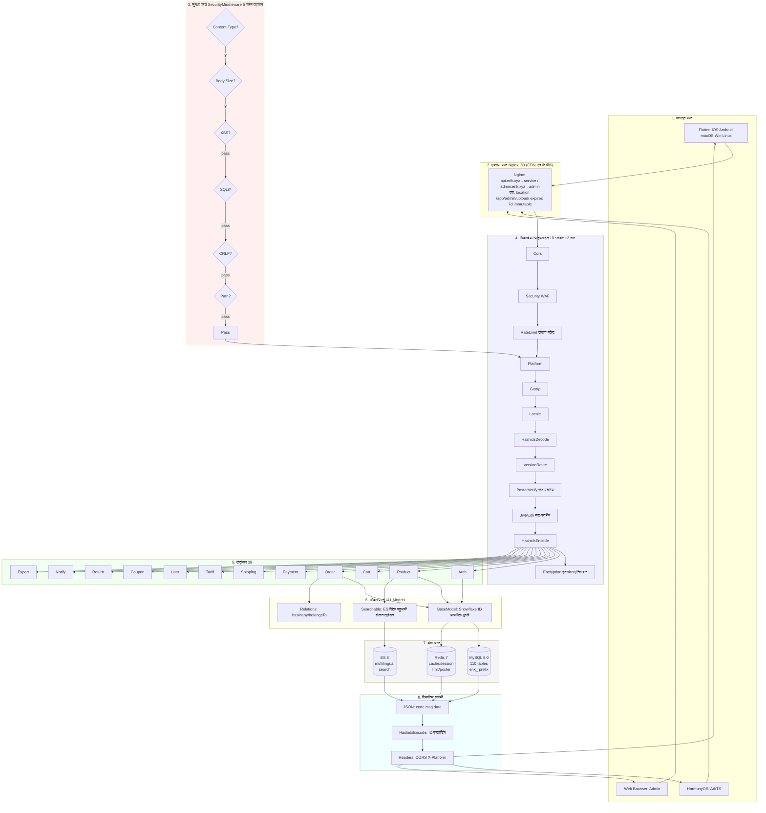
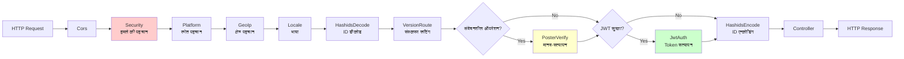
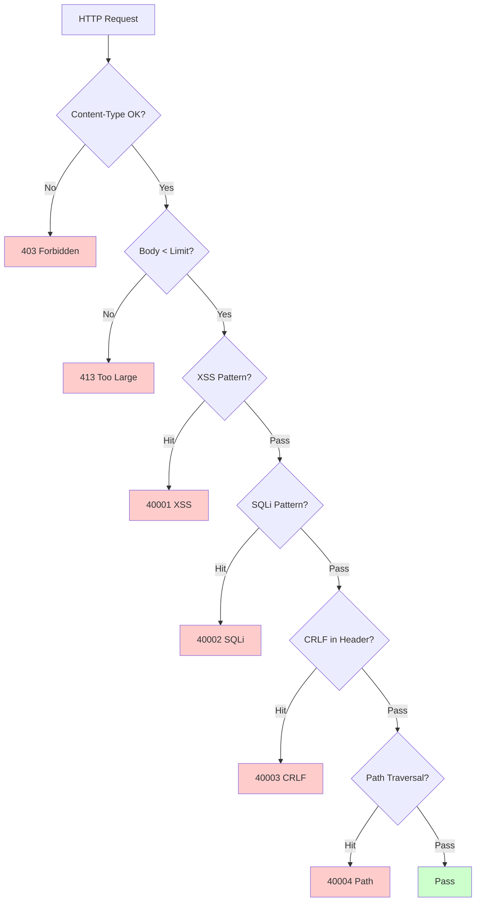
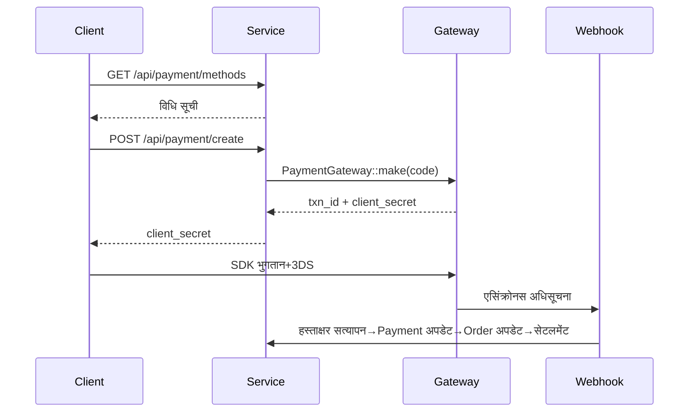
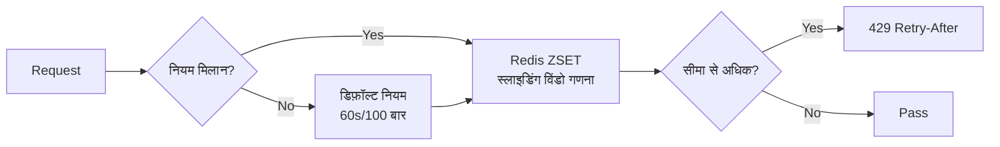

# क्रॉस-बॉर्डर ई-कॉमर्स प्लेटफ़ॉर्म — आर्किटेक्चर डिज़ाइन दस्तावेज़

Copyright (c) 2026 erik <erik@erik.xyz> — https://erik.xyz

---

## 1. सिस्टम अवलोकन

### 1.1 स्थिति

webman उच्च-प्रदर्शन फ्रेमवर्क पर आधारित फुल-स्टैक क्रॉस-बॉर्डर ई-कॉमर्स प्लेटफ़ॉर्म, B2C, B2B और तृतीय-पक्ष विक्रेता ऑनबोर्डिंग का समर्थन करता है।

| घटक | तकनीकी स्टैक | आकार |
|------|--------|------|
| Service API | PHP 8.3 / webman 2.1 / illuminate database | 39 कंट्रोलर + 111 मॉडल + 14 मिडलवेयर |
| Admin | webman-admin / LayUI / ECharts | 82 कंट्रोलर + 76 मॉडल + 5 मिडलवेयर |
| Flutter | Riverpod / GoRouter / Dio | 25 Dart फ़ाइलें / 11 पृष्ठ |
| HarmonyOS | ArkTS / ArkUI | 14 ETS फ़ाइलें / 9 पृष्ठ |
| डेटाबेस | MySQL 8.0 + Redis 7 + ES 8 | 117 टेबल (110 `erik_` + 7 `wa_`) |

### 1.2 मुख्य मीट्रिक्स

| मीट्रिक | मान |
|------|-----|
| API P99 | <200ms |
| समवर्ती | 10000+ (32 worker रेसिडेंट मेमोरी) |
| टेबल संख्या | 110 |
| एंडपॉइंट | 73 |
| मिडलवेयर | 14 (service:10 ग्लोबल + 2 रूट + AdminKey + StaticFile / admin:4 ग्लोबल + 1 अंतर्निहित) |
| भाषाएँ | zh_CN, zh_HK, en, ja, ko |
| मुद्राएँ | 19 प्रकार का स्वतंत्र मूल्य निर्धारण |
| भुगतान | Stripe / PayPal / Klarna / Adyen |

---

## 2. सिस्टम आर्किटेक्चर आरेख

```mermaid
graph TD
    subgraph Clients[क्लाइंट परत]
        F[Flutter 5 प्लेटफ़ॉर्म<br/>iOS Android macOS Win Linux]
        H[HarmonyOS ArkTS]
        W[Web Browser Admin]
    end
    E1[CDN Edge<br/>Cloudflare / CloudFront / Aliyun / Tencent<br/>https://{CDN_DOMAIN}{path}]
    subgraph Gateway[एक्सेस परत]
        N[Nginx :80/:443<br/>location /app/admin/upload/<br/>expires 7d immutable]
    end
    subgraph Apps[एप्लिकेशन परत]
        S[Service API :8787<br/>39 Controllers 111 Models 14 MW]
        A[Admin :8788<br/>82 Controllers 76 Models 5 MW]
    end
    subgraph Data[डेटा परत]
        M[(MySQL 8.0 :3306<br/>110 tables erik_)]
        R[(Redis 7 :6379<br/>cache session limit)]
        E[(ES 8 :9200<br/>multilingual search)]
    end
    F & H & W --> E1
    E1 -->|CNAME| N
    N -->|api.erik.xyz| S
    N -->|admin.erik.xyz| A
    S --> M
    S --> R
    S --> E
    A --> M
    A --> R
```

### 2.1 पूर्ण डिज़ाइन प्रवाह आरेख



**प्रवाह आरेख विवरण:**

| परत | विवरण |
|----|------|
| 1. क्लाइंट परत | Flutter 5 प्लेटफ़ॉर्म + HarmonyOS + Web Admin, सभी HTTP/JSON से संवाद करते हैं |
| 2. एक्सेस परत | CDN एज (Cloudflare/CloudFront/Aliyun/Tencent, CNAME admin डोमेन पर) के पीछे Nginx डोमेन के अनुसार विभाजन करता है: api→service, admin→admin; `/app/admin/upload/` 7 दिन immutable कैश होता है |
| 3. सुरक्षा परत | SecurityMiddleware 31 प्रकार के हमले डिटेक्टर, हिट होने पर त्रुटि कोड/403 लौटाता है |
| 4. मिडलवेयर पाइपलाइन | 10 ग्लोबल MW क्रमिक प्रसंस्करण + 2 रूट-स्तरीय MW (PosterVerify संवेदनशील ऑपरेशन, JwtAuth प्रमाणीकरण इंटरफ़ेस) |
| 5. कंट्रोलर परत | 39 API कंट्रोलर कार्यक्षमता के अनुसार समूहित, सभी व्यावसायिक तर्क संसाधित करते हैं |
| 6. मॉडल परत | 111 Eloquent मॉडल, BaseModel Snowflake ID प्राथमिक कुंजी प्रदान करता है, 45 मॉडल टेबल के अनुसार SoftDelete सक्षम करते हैं |
| 7. डेटा परत | MySQL (110 टेबल erik_ उपसर्ग/स्नोफ्लेक प्राथमिक कुंजी) + Redis (कैश/Session/रेट लिमिट/Poster) + ES (बहुभाषी खोज) |
| 8. रिस्पॉन्स वापसी | JSON समान फ़ॉर्मेट → HashidsEncode ID एन्कोडिंग → Encryption एन्क्रिप्शन (X-Encrypt-Response) → क्लाइंट को वापस |

### 2.2 प्रक्रिया मॉडल

```
webman Master (:8787)
  ├── HTTP Worker x32 (CPU×4, रेसिडेंट मेमोरी, DB कनेक्शन पूल)
  ├── Monitor Process (फ़ाइल निगरानी + मेमोरी निगरानी)
  └── SnowflakeWorker (स्टार्टअप पर Snowflake सिंगलटन आरंभीकरण)
```

---

## 3. मिडलवेयर पाइपलाइन

### 3.1 Service API पूर्ण पाइपलाइन



### 3.2 Service मिडलवेयर विवरण

| # | मिडलवेयर | प्रकार | कार्यक्षमता |
|---|--------|------|------|
| 1 | Cors | ग्लोबल | Access-Control-* रिस्पॉन्स हेडर, OPTIONS प्रीफ़्लाइट 200 लौटाता है |
| 2 | SecurityMiddleware | ग्लोबल | XSS/SQL इंजेक्शन/CRLF/पाथ ट्रैवर्सल/Content-Type/अनुरोध बॉडी 10MB |
| 3 | RateLimitMiddleware | ग्लोबल | टोकन बकेट रेट लिमिट (Redis ZSET स्लाइडिंग विंडो, 6 एंडपॉइंट नियम) |
| 4 | PlatformMiddleware | ग्लोबल | X-Platform header + UA फ़ॉलबैक से 8 प्लेटफ़ॉर्म पहचान |
| 5 | GeoIpMiddleware | ग्लोबल | MaxMind GeoIP2 अनलॉग्ड उपयोगकर्ता क्षेत्र/मुद्रा/भाषा पहचान |
| 6 | LocaleMiddleware | ग्लोबल | Accept-Language पार्सिंग, 5 भाषा सटीक मिलान→फ़ॉलबैक→डिफ़ॉल्ट |
| 7 | HashidsDecode | ग्लोबल | URL/Body में `*_id` फ़ील्ड hashid→snowflake ID |
| 8 | VersionRoute | ग्लोबल | API-Version header→कंट्रोलर नेमस्पेस (v1/v2) मैपिंग |
| 9 | PosterVerify | रूट | पंजीकरण/ऑर्डर/भुगतान Redis token सत्यापन |
| 10 | JwtAuth | रूट | Bearer Token HS256 हस्ताक्षर सत्यापन + समाप्ति + userId इंजेक्शन |
| 11 | HashidsEncode | ग्लोबल | रिस्पॉन्स JSON पुनरावर्ती ट्रैवर्सल, snowflake ID→hashid |
| 12 | EncryptionMiddleware | रूट | इंटरफ़ेस AES एन्क्रिप्शन/डिक्रिप्शन (X-Encrypt-Response/X-Encrypted) |
| 13 | AdminKeyMiddleware | रूट | आंतरिक प्रशासन ऑपरेशन कुंजी सत्यापन |
| 14 | StaticFile | ग्लोबल | webman स्टैटिक संसाधन सेवा |

### 3.3 Admin पाइपलाइन

```
अनुरोध → SecurityMiddleware → PlatformMiddleware → HashidsDecode
     → webman-admin AccessControl(अंतर्निहित RBAC) → HashidsEncode → कंट्रोलर
```

| # | Admin मिडलवेयर | कार्यक्षमता |
|---|------------|------|
| 1 | SecurityMiddleware | XSS/SQL इंजेक्शन/CRLF/पाथ ट्रैवर्सल/Content-Type/20MB |
| 2 | PlatformMiddleware | X-Platform + UA 8 प्लेटफ़ॉर्म पहचान |
| 3 | HashidsDecode | अनुरोध hashid→snowflake ID |
| - | AccessControl (अंतर्निहित) | व्यवस्थापक भूमिका अनुमति सत्यापन |
| 4 | HashidsEncode | रिस्पॉन्स snowflake ID→hashid |

---

## 4. सुरक्षा आर्किटेक्चर

### 4.1 हमले की पहचान पाइपलाइन (SecurityMiddleware)



### 4.2 SecurityMiddleware हमले की पहचान नियम विवरण (15 प्रकार कस्टम)

| # | हमला प्रकार | मुख्य पहचान विधि | Service | Admin | त्रुटि कोड |
|---|---------|------------|---------|-------|--------|
| 1 | XSS क्रॉस-साइट स्क्रिप्टिंग | 13 रेगेक्स: script/iframe/on इवेंट/svg+on/style/expression/javascript:/embed/object/link/meta | ✅ | ✅ | 40001 |
| 2 | SQL इंजेक्शन | 13 रेगेक्स: UNION SELECT/SELECT FROM WHERE/sleep/benchmark/pg_sleep/बूलियन/स्ट्रिंग/कमेंट चिह्न/MySQL विशेष कमेंट/schema एन्यूमरेशन/load_file/into outfile/स्टोर्ड प्रोसीजर/waitfor/delay | ✅ | ✅ | 40002 |
| 3 | CRLF हेडर इंजेक्शन | `[\r\n]` में: Authorization/X-Platform/API-Version/X-Forwarded-For/Referer/Origin | ✅ | ✅ | 40003 |
| 4 | पाथ ट्रैवर्सल | `../` + `%2e%2f` एन्कोडेड + `%252e%252f` दोहरी-परत एन्कोडेड + null byte `\0` + `.env`/`.git`/`phpmyadmin`/`wp-admin`/`/etc/`/`/proc/`/`composer.json` | ✅ | ✅ | 40004 |
| 5 | अनुरोध बॉडी सीमा | Content-Length > 10MB (Service) / 20MB (Admin) | ✅ | ✅ | 40005 |
| 6 | Content-Type | केवल JSON/form-data/form-urlencoded | ✅ | ✅ | 40006 |
| 7 | फ़ाइल अपलोड सत्यापन | ब्लैकलिस्ट एक्सटेंशन (php/phtml/sh/exe/js/...) + डबल एक्सटेंशन + खाली एक्सटेंशन | ✅ | ✅ | 40009 |
| 8 | HTTP सुरक्षित रिस्पॉन्स हेडर | nosniff/DENY/XSS-Protection/Referrer-Policy/Permissions-Policy/Cache-Control/Server छिपाना | ✅ | ✅ | — |
| 9 | ब्रूट फ़ोर्स सुरक्षा | Redis काउंटर: API 10 बार/60s, Admin 5 बार/300s | ✅ | ✅ | 40008 |
| 10 | XXE एंटिटी इंजेक्शन | `<!ENTITY SYSTEM>`, `<!DOCTYPE [` | ✅ | ✅ | 40010 |
| 11 | SSRF सर्वर फ़ोर्जरी | इंट्रानेट IP (127/10/172.16/192.168/0.0/169.254.169.254) + localhost + metadata.google.internal | ✅ | ✅ | 40011 |
| 12 | HTTP विधि सत्यापन | केवल GET/POST/PUT/DELETE/PATCH/OPTIONS/HEAD | ✅ | ✅ | 40012 |
| 13 | Host हेडर सत्यापन | नंगे IP सीधे कनेक्शन अस्वीकार | ✅ | — | 40013 |
| 14 | संवेदनशील डेटा मास्किंग | लॉग/त्रुटि रिस्पॉन्स में password/token/secret फ़िल्टर | ✅ | ✅ | — |
| 15 | CORS व्हाइटलिस्ट | कॉन्फ़िगर करने योग्य origin सीमा | ⚠️ | ⚠️ | — |

### 4.3 प्रमाणीकरण प्रवाह

```
पंजीकरण: email+password → PosterVerify(मानव-सत्यापन) → bcrypt(password+salt)
     → Snowflake ID उत्पन्न → JWT लौटाएँ

लॉगिन: email+password → password_verify(password+salt, bcrypt_hash)
     → last_login_at/ip/platform अपडेट → JWT जारी करें

अनुरोध: Authorization: Bearer <token>
     → JwtAuth → Jwt::decode → HS256 हस्ताक्षर सत्यापन + समाप्ति → request->userId इंजेक्शन

रिफ़्रेश: POST /api/auth/refresh {refresh_token} → Jwt::decode → नया access_token
```

### 4.4 डेटा सुरक्षा (तीन-परत एन्क्रिप्शन)

| परत | तकनीक | पैकेज | फ़ील्ड |
|------|------|-----|------|
| ट्रांसमिशन परत | AES-256-CBC | erikwang2013/encryption | POST body संवेदनशील फ़ील्ड |
| डेटाबेस परत | Encryptable trait | erikwang2013/encryptable (Maize) | email, mobile, name, phone, detail, tax_id |
| ID अस्पष्टीकरण | Hashids एन्कोडिंग | erikwang2013/hashids | इंटरफ़ेस परत के सभी snowflake ID |

### 4.5 प्लेटफ़ॉर्म स्रोत ट्रैकिंग

| प्लेटफ़ॉर्म | पहचान विधि | Header मान |
|------|---------|---------|
| iOS | Flutter `Platform.isIOS` + `TargetPlatform.iOS` | `ios` |
| iPadOS | Flutter `Platform.isIOS` + `!TargetPlatform.iOS` | `ipados` |
| macOS | Flutter `Platform.isMacOS` / UA `Macintosh` | `macos` |
| Windows | Flutter `Platform.isWindows` / UA `Windows` | `windows` |
| Linux | Flutter `Platform.isLinux` / UA `Linux` | `linux` |
| Android | Flutter `Platform.isAndroid` / UA `Android` | `android` |
| HarmonyOS | ArkTS हार्डकोडेड / UA `HarmonyOS` | `harmonyos` |
| Web | UA कोई मिलान नहीं / डिफ़ॉल्ट | `web` |

रिकॉर्ड टेबल: `erik_orders.platform`, `erik_payments.platform`, `erik_operation_logs.platform`, `erik_users.last_login_platform`, `erik_search_logs.platform`, `erik_chat_messages.platform`

---

## 5. डेटा आर्किटेक्चर

### 5.1 प्राथमिक कुंजी रणनीति

```
Snowflake 64bit: [1bit|42bit टाइमस्टैम्प|5bitDC|5bitWID|12bit अनुक्रम]
- ग्लोबल रूप से अद्वितीय / प्रवृत्ति-वर्धक / गैर-ऑटोइन्क्रीमेंट
- PHP $keyType='string' (ओवरफ्लो सुरक्षा)
- Service worker_id=1, Admin worker_id=2
- उत्पादन: Snowflake::nextId()
```

### 5.2 मॉडल इनहेरिटेंस

```
Illuminate\Database\Eloquent\Model
  └── app\model\BaseModel
        ├── $incrementing=false, $keyType='string', $guarded=[]
        ├── boot(): Snowflake::nextId()
        └── 110 व्यावसायिक मॉडल
              ├── 45 use SoftDeletes (deleted_at कॉलम वाली टेबलों के लिए)
              ├── कुछ use Encryptable (संवेदनशील फ़ील्ड: email/mobile/name आदि)
              ├── use Searchable (Product→ES)
              └── hasMany/belongsTo संबंध
```

### 5.3 बहुभाषी/बहु-मुद्रा

- **अनुवाद**: `erik_product_translations(product_id,locale)` स्वतंत्र टेबल, locale के अनुसार क्वेरी
- **मूल्य निर्धारण**: `erik_product_sku_prices(sku_id,currency_code)` मुद्रा-वार स्वतंत्र मूल्य

---

## 6. भुगतान आर्किटेक्चर



```
PaymentGatewayInterface
  ├── createPayment(data): array
  ├── capturePayment(txnId): array
  ├── refundPayment(txnId, amount): array
  └── verifyWebhook(payload, sig): bool
```

---

## 7. उच्च समवर्ती आर्किटेक्चर

### 7.1 रेट लिमिट रणनीति (RateLimitMiddleware)



| एंडपॉइंट | विंडो | सीमा | विवरण |
|------|------|------|------|
| /api/auth/login | 60s | 10 बार | क्रेडेंशियल स्टफिंग सुरक्षा |
| /api/auth/register | 300s | 5 बार | बल्क पंजीकरण सुरक्षा |
| /api/payment | 60s | 5 बार | कार्ड फ़्रॉड सुरक्षा |
| /api/orders | 10s | 3 बार | ऑर्डर स्पैम सुरक्षा |
| /api/search | 1s | 10 बार | क्रॉलर सुरक्षा |
| डिफ़ॉल्ट | 60s | 100 बार | सामान्य API |

### 7.2 Redis उपयोग

Redis का उपयोग रेट लिमिट टोकन बकेट, मानव-सत्यापन कोड और Session स्टोरेज के लिए किया जाता है (मिडलवेयर परत); व्यावसायिक डेटा एप्लिकेशन-स्तरीय कैश नहीं किया जाता, सीधे MySQL से पढ़ा जाता है (रीड/राइट स्प्लिटिंग + कनेक्शन पूल)। हालाँकि स्टैटिक फ़ाइलें (प्रोडक्ट/बैनर चित्र) CDN एज पर कैश होती हैं (7 दिन immutable), और प्रोडक्ट या बैनर बदलने/हटाने पर कैश स्वतः purge होता है।

### 7.4 कनेक्शन पूल अनुकूलन

| संसाधन | अधिकतम कनेक्शन | न्यूनतम कनेक्शन | प्रतीक्षा टाइमआउट | निष्क्रिय टाइमआउट | हार्टबीट |
|------|---------|---------|---------|---------|------|
| MySQL | 50 | 10 | 2s | 60s | 45s |
| Redis | 30 | 5 | — | 60s | — |

### 7.5 धीमे ऑपरेशन हैंडलिंग

| ऑपरेशन | कार्यान्वयन |
|------|------|
| विनिमय दर अपडेट | ExchangeRateCron (हर घंटे, बाहरी API) |
| Feed सिंक | ProductFeedCron (हर 6 घंटे में TSV उत्पन्न करता है और लॉग करता है) |
| अनुशंसा गणना | RecommendationCron (दैनिक, खरीद सह-घटना) |
| भुगतान मिलान | PaymentReconcileCron (हर 6 घंटे, Stripe/PayPal) |
| सेटलमेंट लेखा | SettlementCron (दैनिक) |
| लॉजिस्टिक्स ट्रैकिंग | ShipmentTrackingCron (हर 30 मिनट, API कॉन्फ़िगरेशन आवश्यक) |
| प्लेटफ़ॉर्म ऑर्डर सिंक | PlatformOrderSyncCron (हर 5 मिनट, API कॉन्फ़िगरेशन आवश्यक) |
| रिटर्न टाइमआउट | ReturnExpireCron (हर घंटे) |
| मूल्य कमी/स्टॉक अधिसूचना | PriceAlertCron (हर 10 मिनट) |
| अनुपालन नियम अपडेट | ComplianceCron (दैनिक, API कॉन्फ़िगरेशन आवश्यक) |

## 8. तैनाती आर्किटेक्चर

```
docker-compose.yml:
  nginx (alpine) :80 :443
  service (php:8.3) :8787 internal, 32 workers
  admin (php:8.3) :8788 internal
  mysql (8.0) :3306 / redis (7) :6379 / es (8) :9200
CDN एज: Cloudflare/CloudFront/Aliyun/Tencent (CNAME admin डोमेन पर) + nginx /app/admin/upload/ expires 7d immutable
अपलोड वॉल्यूम: admin_uploads:/app/plugin/admin/public/upload | service_public:/app/public/documents
नेटवर्क: erik-net bridge | डेटा वॉल्यूम स्थायित्व | रूटिंग: api.erik.xyz→service | admin.erik.xyz→admin
```

---


## 8. अंतर्राष्ट्रीयकरण (i18n)

| परत | कार्यान्वयन |
|------|------|
| Service | LocaleMiddleware + 5 भाषा अनुवाद फ़ाइलें (45 key/भाषा) |
| Admin | 5 भाषा अनुवाद फ़ाइलें |
| Flutter | AppLocalizations + Riverpod Provider |
| API | Accept-Language header स्वचालित इंजेक्शन |

## 9. API दस्तावेज़ (hg/apidoc)

| घटक | विवरण |
|------|------|
| पैकेज | hg/apidoc v5.3 |
| कॉन्फ़िग | config/plugin/hg/apidoc/app.php (6 समूह) |
| एनोटेशन | @Apidoc\Title/Desc/Method/Url/Param/Returned |
| एक्सेस | http://localhost:8787/apidoc/ |

## 11. टेस्ट

```bash
cd service && php vendor/bin/phpunit tests/
```

| टेस्ट क्लास | Tests | कवरेज |
|--------|-------|------|
| SecurityTest | 12 | XSS+SQLi+XXE+SSRF+Path |
| JwtTest | 4 | encode/decode/invalid |
| ApiResponseTest | 3 | success/fail/paginate |
| RedisFacadeTest | 3 | ping/set/get/redis() |
| **कुल** | **22** | **45 assertions PASS** |

---

## 12. प्रोजेक्ट सांख्यिकी

| आयाम | मात्रा |
|------|------|
| PHP स्रोत फ़ाइलें | service:210 + admin:214 = 424 |
| Dart (Flutter) | 25 |
| ArkTS (HarmonyOS) | 14 |
| डेटाबेस टेबल | 110 |
| API एंडपॉइंट | 73 |
| मिडलवेयर | 14 |
| टूल क्लास | 8 |
| शेड्यूल्ड कार्य | 12 |
| कॉन्फ़िग आइटम | 36+ |
| टेस्ट | 22 टेस्ट, 45 असर्शन |
| Skills | 38 |
| दस्तावेज़ | 9 |
| **कुल** | **~700** |
