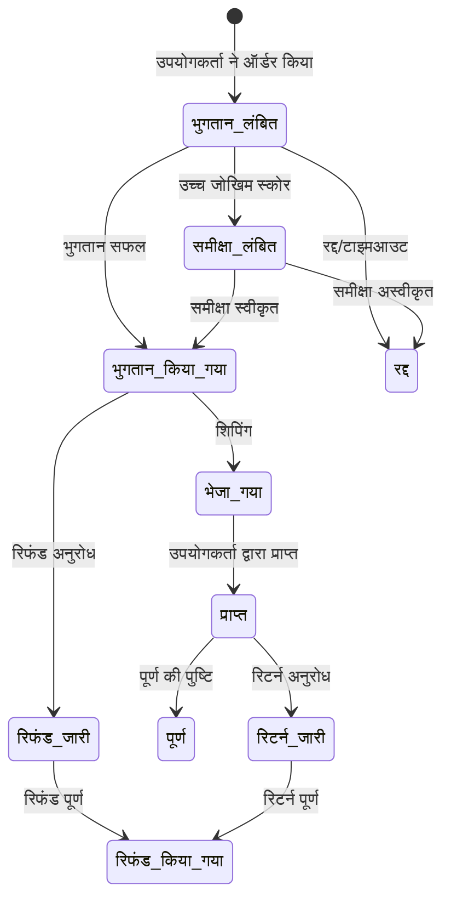
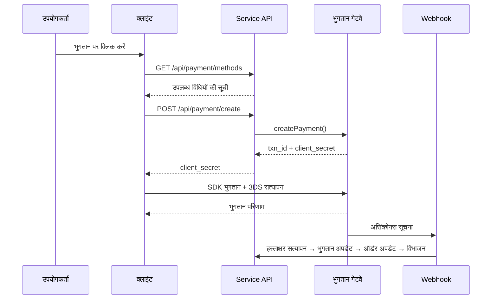
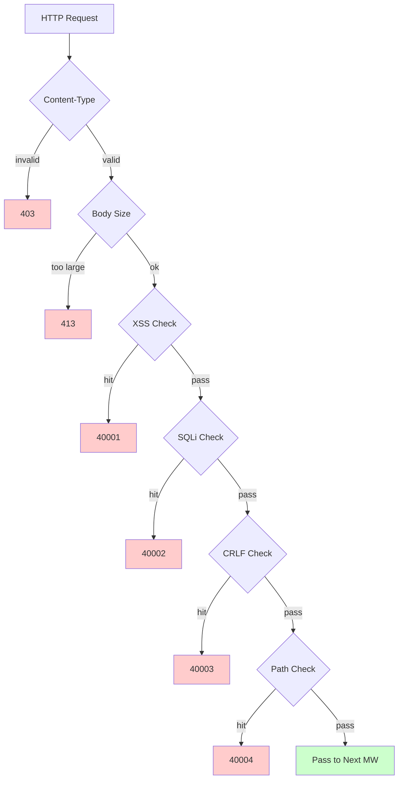

# क्रॉस-बॉर्डर ई-कॉमर्स प्लेटफ़ॉर्म — कार्यक्षमता डिज़ाइन दस्तावेज़

Copyright (c) 2026 erik <erik@erik.xyz> — https://erik.xyz

---


## प्लेटफ़ॉर्म ट्रैकिंग

### 8 प्लेटफ़ॉर्म पहचान

| प्लेटफ़ॉर्म | Header | Flutter | Admin |
|------|--------|---------|-------|
| iOS | `ios` | Platform.isIOS + TargetPlatform.iOS | UA iPhone |
| iPadOS | `ipados` | Platform.isIOS + !TargetPlatform.iOS | UA iPad |
| macOS | `macos` | Platform.isMacOS | UA Macintosh |
| Windows | `windows` | Platform.isWindows | UA Windows |
| Linux | `linux` | Platform.isLinux | UA Linux |
| Android | `android` | Platform.isAndroid | UA Android |
| HarmonyOS | `harmonyos` | — | UA HarmonyOS |
| Web | `web` | kIsWeb | डिफ़ॉल्ट |

### DB ट्रैकिंग फ़ील्ड

| तालिका | फ़ील्ड | विवरण |
|----|------|------|
| erik_orders | platform VARCHAR(16) | ऑर्डर प्लेटफ़ॉर्म |
| erik_payments | platform VARCHAR(16) | भुगतान प्लेटफ़ॉर्म |
| erik_operation_logs | platform VARCHAR(16) | संचालन प्लेटफ़ॉर्म |
| erik_users | last_login_platform VARCHAR(16) | लॉगिन प्लेटफ़ॉर्म |
| erik_search_logs | platform VARCHAR(16) | खोज प्लेटफ़ॉर्म |
| erik_chat_messages | platform VARCHAR(16) | संदेश स्रोत |

## 1. कार्यक्षमता अवलोकन

### 1.0 कवरेज अवलोकन

| आयाम | कवर सामग्री | गहराई |
|------|---------|------|
| **B2C खुदरा** | बहुभाषी उत्पाद, मुद्रा-वार मूल्य निर्धारण, SKU, कार्ट, ऑर्डर, भुगतान (Stripe/PayPal/Klarna), रिफंड, रिटर्न | पूर्ण |
| **B2B थोक** | सीढ़ीदार मूल्य (MOQ), उद्यम सत्यापन (कर संख्या/व्यवसाय लाइसेंस), मूल्य पूछताछ | पूर्ण |
| **बहु-विक्रेता ऑनबोर्डिंग** | विक्रेता समीक्षा, उत्पाद समीक्षा, कमीशन विभाजन | पूर्ण |
| **क्रॉस-बॉर्डर अनुपालन** | HS Code एन्कोडिंग लाइब्रेरी (6-अंकीय आधार कोड), सीमा शुल्क नियम (गंतव्य देश + HS → कर दर), VAT/IOSS, अनुपालन लेबल (FDA/CE/RoHS आदि 10 प्रकार) | पूर्ण |
| **अंतर्राष्ट्रीय लॉजिस्टिक्स** | लॉजिस्टिक्स ज़ोन शिपिंग शुल्क (वज़न सीढ़ी), DHL/UPS/FedEx/EMS, विदेशी गोदाम (शिपिंग + रिटर्न), HS घोषणा (बैटरी/तरल मार्किंग), वाणिज्यिक चालान PDF/पैकिंग सूची | पूर्ण |
| **भुगतान** | Stripe PaymentIntent+3DS, PayPal REST, Klarna BNPL, Adyen, Webhook हस्ताक्षर सत्यापन + विभाजन | Stripe पूर्ण, अन्य प्लेसहोल्डर |
| **मार्केटिंग** | कूपन (ज़ोन + नए/पुराने ग्राहक सीमा), कैरोसेल (क्षेत्र-दृश्यता), फ्लैश सेल (समय-सीमित/मात्रा-सीमित), ग्रुप बाय (सदस्य संख्या + वैधता अवधि), वितरण (लिंक + कमीशन + निकासी) | पूर्ण |
| **बहु-प्लेटफ़ॉर्म** | Amazon/eBay/Shopee/Lazada/Temu उत्पाद लिस्टिंग + ऑर्डर एकत्रीकरण, बहु-स्टोर प्रबंधन | पूर्ण |
| **आपूर्ति श्रृंखला** | आपूर्तिकर्ता प्रोफ़ाइल + रेटिंग, खरीद ऑर्डर (समीक्षा→शिपिंग→प्राप्ति→गुणवत्ता जाँच), गुणवत्ता जाँच (इनबाउंड + आउटबाउंड गेट/उपस्थिति/कार्य/अनुपालन लेबल जाँच), स्टॉक लेज़र (अपरिवर्तनीय बहीखाता: इनबाउंड/आउटबाउंड/स्थानांतरण/गिनती) | पूर्ण |
| **जोखिम प्रबंधन अनुपालन** | नियम इंजन (साइड-बाय स्कोरिंग: पता सत्यापन/पिन कोड मिलान/3DS/बैच रजिस्ट्रेशन/मूल्य असामान्यता), KYC नाम सत्यापन, GDPR/CCPA डेटा अनुरोध, Cookie Consent संस्करण प्रबंधन | पूर्ण |
| **सुरक्षा सुरक्षा** | SecurityMiddleware — security-php के 31 डिटेक्टरों का आवरण: XSS (13 नियम)/SQL इंजेक्शन (13 नियम)/CRLF/पाथ ट्रैवर्सल (एन्कोडिंग + null byte)/Body आकार/Content-Type/फ़ाइल अपलोड/HTTP सुरक्षा हेडर/ब्रूट फ़ोर्स (Redis काउंटर)/XXE/SSRF/विधि/Host/संवेदनशील डेटा मास्किंग/CORS | पूर्ण |
| **उच्च समवर्ती** | टोकन बकेट रेट लिमिट (स्लाइडिंग विंडो + 6 एंडपॉइंट नियम), DB रीड/राइट स्प्लिटिंग (2 रीड रेप्लिका + sticky), कनेक्शन पूल (DB 50/10 + Redis 30/5), OPCache (128MB, Docker वातावरण) | पूर्ण |
| **सदस्य विकास** | सदस्यता स्तर + लाभ, पॉइंट नियम + लेज़र, गिफ्ट कार्ड (शेष + रिडीम), मूल्य कम होने/स्टॉक आगमन सूचना, पसंदीदा, उत्पाद तुलना, ब्राउज़िंग इतिहास, सदस्यता चक्र खरीद, AB परीक्षण (ट्रैफ़िक आवंटन + विश्वास स्तर) | पूर्ण |
| **सामग्री प्रबंधन** | CMS बहुभाषी पृष्ठ (Landing/Blog), FAQ बहुभाषी, ज्ञानकोष बहुभाषी, साइज़ चार्ट (कपड़े/जूते + US/UK/EU/JP/CN रूपांतरण), ईमेल टेम्पलेट (बहुभाषी), उत्पाद Feed (Google/Meta + निर्धारित सिंक) | पूर्ण |
| **ग्राहक सेवा** | WebSocket रीयल-टाइम IM (chat_sessions/chat_messages), ज्ञानकोष बहुभाषी | तालिका संरचना पूर्ण, WS कार्यान्वयन लंबित |
| **बुनियादी ढाँचा** | Snowflake वितरित ID (bigint गैर-ऑटोइंक्रीमेंट), Hashids इंटरफ़ेस ID अस्पष्टीकरण, JWT प्रमाणीकरण (HS256 + access/refresh दोहरा टोकन रिफ्रेश), AES एन्क्रिप्शन/डिक्रिप्शन (इंटरफ़ेस + डेटाबेस तीन-परत एन्क्रिप्शन), GeoIP क्षेत्र पहचान (MaxMind), Poster मानव-सत्यापन (स्लाइडर/पहेली/क्लिक) | पूर्ण |
| **बहु-प्लेटफ़ॉर्म कवरेज** | Flutter 5 प्लेटफ़ॉर्म (iOS/Android/macOS/Windows/Linux/iPadOS) + HarmonyOS (ArkTS 9 पृष्ठ) + Web Admin (LayUI+ECharts) + API | Flutter 25 फ़ाइलें, HarmonyOS 14 फ़ाइलें, Admin 239 फ़ाइलें |
| **प्लेटफ़ॉर्म ट्रैकिंग** | 8 प्लेटफ़ॉर्म पहचान (iOS/iPadOS/macOS/Windows/Linux/Android/HarmonyOS/Web) + X-Platform header + 6 तालिका रिकॉर्ड (orders/payments/operation_logs/users/search_logs/chat_messages) | पूर्ण |
| **परीक्षण** | 22 tests / 45 assertions — ALL PASS (SecurityTest 12: XSS+SQLi+XXE+SSRF+Path / JwtTest 4 / ApiResponseTest 3 / RedisFacadeTest 3) | यूनिट टेस्ट पूर्ण, इंटीग्रेशन टेस्ट लंबित |

### 1.1 मॉड्यूल मैट्रिक्स

| प्राथमिक मॉड्यूल | द्वितीयक मॉड्यूल | प्राथमिकता | स्थिति |
|---------|---------|--------|------|
| उपयोगकर्ता सिस्टम | रजिस्ट्रेशन/लॉगिन/सोशल लॉगिन/KYC नाम सत्यापन/पता/पसंदीदा/सदस्यता/पॉइंट/गिफ्ट कार्ड | P0-P2 | ✅ |
| उत्पाद सिस्टम | श्रेणी/SKU/बहुभाषी/बहु-मुद्रा/चित्र/विशेषताएँ/अनुपालन/HS Code/ES खोज/Feed | P0-P1 | ✅ |
| लेनदेन सिस्टम | कार्ट/ऑर्डर/भुगतान (Stripe+PayPal+Klarna)/रिफंड/रिटर्न/चालान | P0 | ✅ |
| लॉजिस्टिक्स सिस्टम | अंतर्राष्ट्रीय वाहक/ज़ोन शिपिंग शुल्क/विदेशी गोदाम/शिपिंग (HS घोषणा)/लॉजिस्टिक्स बीमा | P0-P1 | ✅ |
| सीमा शुल्क कर | HS Code लाइब्रेरी/सीमा शुल्क नियम/VAT/IOSS/देश-वार अनुपालन प्रतिबंध | P0 | ✅ |
| मार्केटिंग सिस्टम | कूपन/कैरोसेल/फ्लैश सेल/ग्रुप बाय/वितरण | P1-P2 | ✅ |
| आपूर्ति श्रृंखला | आपूर्तिकर्ता/खरीद ऑर्डर/गुणवत्ता जाँच/स्टॉक लेज़र | P1 | ✅ |
| जोखिम प्रबंधन अनुपालन | नियम इंजन/GDPR/CCPA/Cookie Consent/प्लेटफ़ॉर्म ट्रैकिंग | P1 | ✅ |
| सुरक्षा सुरक्षा | XSS/SQL इंजेक्शन/CRLF/पाथ ट्रैवर्सल/Content-Type/अनुरोध Body | P0 | ✅ |
| बहु-प्लेटफ़ॉर्म | Amazon/eBay/Shopee लिस्टिंग + ऑर्डर एकत्रीकरण/बहु-विक्रेता ऑनबोर्डिंग | P2 | ✅ |
| सामग्री प्रबंधन | CMS/FAQ/ज्ञानकोष/ईमेल टेम्पलेट/सूचना/साइज़ चार्ट | P2 | ✅ |
| विकास उपकरण | B2B थोक/सदस्यता चक्र खरीद/AB परीक्षण | P2-P3 | ✅ |
| ग्राहक सेवा | WebSocket रीयल-टाइम IM/ज्ञानकोष | P3 | ✅ |
| बुनियादी ढाँचा | Snowflake ID/JWT/Hashids/Encryption/Poster/API संस्करण/GeoIP | P0 | ✅ |

---

## 2. कोर व्यावसायिक प्रक्रिया फ़्लोचार्ट

### 2.1 ऑर्डर स्टेट मशीन



### 2.2 भुगतान सीक्वेंस



### 2.3 सुरक्षा जाँच पाइपलाइन



---

## 3. कोर व्यावसायिक प्रक्रियाएँ

### 3.1 उपयोगकर्ता रजिस्ट्रेशन और लॉगिन

```
EMAIL पंजीकरण: email+password → PosterVerify मानव-सत्यापन → bcrypt(password+salt)
          → Snowflake से ID जनरेट → JWT लौटाएँ {access_token, expires_in}

सोशल लॉगिन: Google/Apple/Facebook OAuth → id_token सत्यापित करें
        → erik_user_social_accounts में बाइंडिंग जाँचें
        → बाइंडेड: लॉगिन / अनबाइंडेड: स्वतः उपयोगकर्ता बनाएँ+बाइंड करें → JWT लौटाएँ

लॉगिन: email+password → password_verify(password+salt)
    → last_login_at/ip/platform अपडेट करें → JWT जारी करें

Token रिफ्रेश: refresh_token → Jwt::decode → नया access_token
```

### 3.2 उत्पाद ब्राउज़िंग और खोज

```
सूची: GET /api/products
  → फ़िल्टर: category_id/status/keyword/price_range
  → क्रमबद्ध: default/price_asc/price_desc/sales/newest
  → बहुभाषी: ProductTranslations के अनुसार locale फ़िल्टर
  → मुद्रा-वार: ProductSkuPrices के अनुसार currency_code मिलान
  → पृष्ठांकन: 20 प्रति पृष्ठ

ES खोज: GET /api/search?keyword=xxx
  → Erikwang2013\WebmanScout\Searchable → ES बहुभाषी विश्लेषक
  → एग्रीगेशन: category/price/brand
  → फ़ॉलबैक: ES अनुपलब्ध होने पर MySQL LIKE

विवरण: GET /api/products/{hashid}
  → HashidsDecode मिडलवेयर डिकोड → Eager Load
  → बहुभाषी+मुद्रा-वार+अनुपालन+HS Code+आकार रूपांतरण+कर सहित/रहित+VAT
```

### 3.3 कार्ट और ऑर्डर प्लेसमेंट

```
कार्ट: POST /api/cart {sku_id, quantity}
  → SKU की जाँच करें: मौजूद है|सूचीबद्ध|स्टॉक पर्याप्त
  → समान SKU में जोड़ें / मौजूद नहीं तो बनाएँ

ऑर्डर करें: POST /api/orders {address_id, coupon_id, currency_code}
  → 1. डिलीवरी पता जाँचें → 2. कार्ट चयन प्राप्त करें → 3. प्रति-उत्पाद जाँच (स्टॉक+अनुपालन)
  → 4. मूल्य गणना (मुद्रा-वार+कूपन) → 5. ऑर्डर नंबर जनरेट करें
  → 6. Order+OrderItems बनाएँ → 7. स्टॉक घटाएँ → 8. OrderLog लिखें
  → 9. जोखिम स्कोर (RiskEngine::score) → 10. खरीदा गया कार्ट साफ़ करें

रद्द करें: POST /api/orders/{id}/cancel
  → स्थिति जाँचें=0 (भुगतान लंबित) → स्टॉक पुनर्स्थापित करें → status=5 (रद्द)
```

### 3.4 भुगतान प्रक्रिया

```
उपलब्ध तरीके: GET /api/payment/methods?country=DE&currency=EUR
  → PaymentGatewayMethods (country+currency के अनुसार फ़िल्टर)

भुगतान बनाएँ: POST /api/payment/create
  → PaymentGateway::make(gateway)→createPayment()
  → Stripe: PaymentIntent → client_secret → फ्रंटएंड SDK (+3DS)

Webhook: POST /webhook/payment/stripe
  → हस्ताक्षर सत्यापित करें → payment_intent.succeeded:
     → Payment.status=भुगतान हुआ → Order.status=भुगतान हुआ
     → PlatformSettlement (प्लेटफ़ॉर्म कमीशन+गेटवे शुल्क+आपूर्तिकर्ता+वितरण)
```

### 3.5 रिटर्न प्रक्रिया

```
आवेदन: POST /api/returns {order_id, reason_id}
  → रिटर्न चैनल निर्धारित करें: स्थानीय गोदाम (type=1)/देश में वापसी (type=2)/केवल रिफंड (type=3)

समीक्षा: Admin समीक्षा → स्वीकृत: ReturnLabel जनरेट करें / अस्वीकृत: कारण लिखें

वापस भेजें: शिपिंग लेबल डाउनलोड→वापस भेजें→लॉजिस्टिक्स अपडेट→गोदाम द्वारा प्राप्त→status=प्राप्त

रिफंड: status=पूर्ण → Refund लिंक करें → PaymentGateway::refund→मूल माध्यम से वापसी
```

### 3.6 सीमा शुल्क अनुमान

```
GET /api/tariff/estimate?product_id=xxx&dest_country_id=xxx&declared_value=100

1. ProductHsCodes → HsCode
2. TariffRules(dest_country_id + hs_code_id) → duty_rate + duty_free_threshold
3. VatSettings(country_id) → vat_rate + vat_free_threshold
4. duty = value>=threshold ? value*duty_rate/100 : 0
   vat = (value+duty)>=threshold ? (value+duty)*vat_rate/100 : 0
5. return {duty_rate, vat_rate, estimated_duty, estimated_vat, estimated_total, hs_code, disclaimer}
```

---

## 4. सुरक्षा सुरक्षा (SecurityMiddleware — security-php के 31 डिटेक्टरों का आवरण)

### 4.1 जाँच नियम कुल तालिका

| # | हमला प्रकार | मुख्य जाँच विधि | त्रुटि कोड | Service | Admin |
|---|---------|------------|--------|---------|-------|
| 1 | XSS क्रॉस-साइट स्क्रिप्टिंग | 13 रेगुलर एक्सप्रेशन: script/iframe/on इवेंट/svg+on/style/expression/javascript:/embed/object/link/meta | 40001 | ✅ | ✅ |
| 2 | SQL इंजेक्शन | 13 रेगुलर एक्सप्रेशन: UNION SELECT/SELECT FROM WHERE/sleep/benchmark/pg_sleep/बूलियन प्रकार/स्ट्रिंग प्रकार/कमेंट वर्ण/MySQL विशेष कमेंट/schema एन्यूमरेशन/load_file/into outfile/स्टोर्ड प्रोसीजर/waitfor/delay | 40002 | ✅ | ✅ |
| 3 | CRLF Header इंजेक्शन | `[\r\n]` in: Authorization/X-Platform/API-Version/X-Forwarded-For/Referer/Origin | 40003 | ✅ | ✅ |
| 4 | पाथ ट्रैवर्सल | `../` + `%2e%2f` एन्कोडिंग + `%252e%252f` दो-परत एन्कोडिंग + null byte `\0` + `.env`/`.git`/`phpmyadmin`/`wp-admin`/`/etc/`/`/proc/`/`composer.json` | 40004 | ✅ | ✅ |
| 5 | अनुरोध Body सीमा | Content-Length > 10MB (Service) / 20MB (Admin) | 40005 | ✅ | ✅ |
| 6 | Content-Type सीमा | केवल JSON/form-data/form-urlencoded | 40006 | ✅ | ✅ |
| 7 | **फ़ाइल अपलोड सत्यापन** | ब्लैकलिस्ट एक्सटेंशन (php/phtml/sh/exe/js/...) + दोहरा एक्सटेंशन हमला + खाली एक्सटेंशन | 40009 | ✅ | ✅ |
| 8 | **HTTP सुरक्षा प्रतिक्रिया हेडर** | nosniff/DENY/XSS-Protection/Referrer-Policy/Permissions-Policy/Cache-Control/Server छिपाना | — | ✅ | ✅ |
| 9 | **ब्रूट फ़ोर्स सुरक्षा** | Redis काउंटर: API 10 बार/60s, Admin 5 बार/300s | 40008 | ✅ | ✅ |
| 10 | **XXE एंटिटी इंजेक्शन** | `<!ENTITY SYSTEM>`, `<!DOCTYPE [` | 40010 | ✅ | ✅ |
| 11 | **SSRF सर्वर-साइड फ़ोर्जरी** | इंट्रानेट IP (127/10/172.16/192.168/0.0/169.254.169.254) + localhost + metadata.google.internal | 40011 | ✅ | ✅ |
| 12 | **HTTP विधि सत्यापन** | केवल GET/POST/PUT/DELETE/PATCH/OPTIONS/HEAD | 40012 | ✅ | ✅ |
| 13 | **Host हेडर सत्यापन** | नंगे IP सीधे एक्सेस अस्वीकार | 40013 | ✅ | — |
| 14 | **संवेदनशील डेटा मास्किंग** | लॉग/त्रुटि प्रतिक्रिया में password/token/secret फ़िल्टर | — | ✅ | ✅ |
| 15 | **CORS श्वेतसूची** | कॉन्फ़िगर करने योग्य origin प्रतिबंध | — | ⚠️ | ⚠️ |

### 4.2 मिडलवेयर पाइपलाइन

```
Service: Cors → Security → Platform → GeoIp → Locale → HashidsDecode
        → VersionRoute → (PosterVerify) → (JwtAuth) → HashidsEncode

Admin: Security → Platform → HashidsDecode → AccessControl → HashidsEncode
```

### 4.3 प्लेटफ़ॉर्म स्रोत ट्रैकिंग

| प्लेटफ़ॉर्म | Header मान | पहचान विधि |
|------|---------|---------|
| iOS | `ios` | Flutter `Platform.isIOS` |
| iPadOS | `ipados` | Flutter `TargetPlatform.iOS` निर्धारण |
| macOS | `macos` | Flutter `Platform.isMacOS` |
| Windows | `windows` | Flutter `Platform.isWindows` |
| Linux | `linux` | Flutter `Platform.isLinux` |
| Android | `android` | Flutter `Platform.isAndroid` |
| HarmonyOS | `harmonyos` | ArkTS हार्डकोडेड |
| Web | `web` | UA डिग्रेडेशन / डिफ़ॉल्ट |

---


## 5. उच्च समवर्ती और प्रदर्शन

### 5.1 रेट लिमिट नियम

| एंडपॉइंट | एल्गोरिदम | विंडो | सीमा |
|------|------|------|------|
| /api/auth/login | स्लाइडिंग विंडो | 60s | 10 बार |
| /api/auth/register | स्लाइडिंग विंडो | 300s | 5 बार |
| /api/payment | स्लाइडिंग विंडो | 60s | 5 बार |
| /api/orders | स्लाइडिंग विंडो | 10s | 3 बार |
| /api/search | स्लाइडिंग विंडो | 1s | 10 बार |
| डिफ़ॉल्ट | स्लाइडिंग विंडो | 60s | 100 बार |

### 5.2 Redis उपयोग

| उपयोग | कार्यान्वयन |
|------|------|
| रेट लिमिट टोकन बकेट | Redis ZSET स्लाइडिंग विंडो |
| मानव-सत्यापन | PosterVerify सत्यापन कोड स्थिति |
| Session स्टोरेज | Redis KV स्टोरेज |

व्यावसायिक डेटा पर एप्लिकेशन-लेयर कैश नहीं किया जाता, सीधे MySQL से पढ़ा जाता है (रीड/राइट स्प्लिटिंग + कनेक्शन पूल)।

### 5.3 कनेक्शन पूल

| संसाधन | अधिकतम | न्यूनतम | टाइमआउट |
|------|------|------|------|
| MySQL | 50 | 10 | 2s |
| Redis | 30 | 5 | — |

## 6. डेटा तालिका संबंध आरेख

```
erik_users ──┬── addresses, social_accounts, wishlists, kyc
             ├── carts, orders → order_items → payments
             ├── reviews, coupons(through user_coupons)
             ├── notifications, subscriptions, point_logs
             ├── affiliate_links, chat_sessions, b2b_verifications
             └── privacy_requests

erik_products ──┬── translations(product_id, locale)
                ├── skus → sku_prices(sku_id, currency_code)
                ├── images, reviews, compliance → compliance_categories
                ├── hs_codes → hs_codes, recommendations
                ├── b2b_prices, platform_listings
                └── product_comparisons

erik_orders ──┬── order_items, order_logs
              ├── payments, refunds, return_orders → return_labels
              ├── order_documents, shipments
              ├── platform_settlements, risk_logs
              └── subscription_orders

erik_countries ──┬── vat_settings, tariff_rules(dest_country_id)
                 ├── country_compliance_rules
                 ├── shipping_zones(JSON countries)
                 └── warehouses(country_id)
```

---

## 7. API इंटरफ़ेस

पूर्ण API एंडपॉइंट सूची (सार्वजनिक इंटरफ़ेस 23 + प्रमाणित इंटरफ़ेस 47 + Webhook + Admin/Health), विवरण के लिए देखें [API इंटरफ़ेस दस्तावेज़](api.md)।

---

## 8. परीक्षण सत्यापन

```bash
cd service && php vendor/bin/phpunit tests/
```

| परीक्षण क्लास | Tests | कवरेज |
|--------|-------|------|
| SecurityTest | 12 | XSS (3 नियम) + SQLi (2 नियम) + XXE (2 नियम) + SSRF (1 नियम) + Path (2 नियम) + क्रेडिट कार्ड लीक (1 नियम) + सामान्य पास (1 नियम) |
| JwtTest | 4 | encode तीन-खंड JWT + decode राउंड-ट्रिप + अमान्य token → null + खाली token → null |
| ApiResponseTest | 3 | success (code=0) + fail (error code) + paginate (list+meta पेजिनेशन) |
| RedisFacadeTest | 3 | ping + set/get राउंड-ट्रिप + redis() हेल्पर फ़ंक्शन (Redis अनुपलब्ध होने पर skip) |
| **कुल** | **22** | **45 assertions — ALL PASS** |
