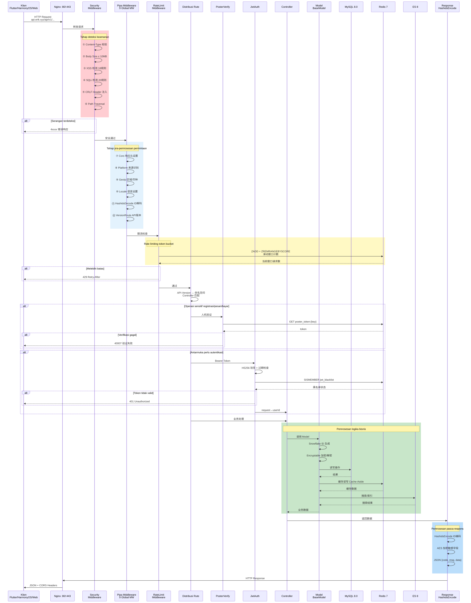

> Dokumen ini adalah terjemahan mesin dari dokumentasi asli berbahasa Tionghoa. Asli: [中文原版](../../../README.md).

# Erik Shop — Platform E-Commerce Lintas Batas, Versi Lengkap (Full)

Copyright (c) 2026 erik <erik@erik.xyz> — https://erik.xyz

## Versi

> Versi Ringkas (open source MIT): `lite` | Versi Standar (komersial): `standard` | Versi Lengkap (komersial): `full`
>
> Kontak lisensi komersial: **erik@erik.xyz** | Perbandingan versi: [VERSIONS.md](VERSIONS.md)

## Bahasa / Languages

| Bahasa | Tautan |
|------|------|
| Tionghoa | [README.md](README.md) |
| Inggris | [docs/i18n/en/README.md](../en/README.md) |
| Korea | [docs/i18n/ko/README.md](../ko/README.md) |
| Rusia | [docs/i18n/ru/README.md](../ru/README.md) |
| Jerman | [docs/i18n/de/README.md](../de/README.md) |
| Prancis | [docs/i18n/fr/README.md](../fr/README.md) |
| Spanyol | [docs/i18n/es/README.md](../es/README.md) |
| Portugis | [docs/i18n/pt/README.md](../pt/README.md) |
| Hindi | [docs/i18n/hi/README.md](../hi/README.md) |
| Arab | [docs/i18n/ar/README.md](../ar/README.md) |
| Bengali | [docs/i18n/bn/README.md](../bn/README.md) |
| Indonesia | [docs/i18n/id/README.md](../id/README.md) |
| Jepang | [docs/i18n/ja/README.md](../ja/README.md) |

## Pengenalan Proyek

Platform e-commerce lintas batas full-stack yang dibangun di atas ekosistem webman, mencakup skenario B2C/B2B dan onboarding penjual pihak ketiga.

### Arsitektur Teknologi

| Lapisan | Teknologi | Direktori |
|------|------|------|
| API Bisnis | webman + illuminate/database + erikwang2013/* | `service/` |
| Panel Admin | webman-admin + LayUI + ECharts | `admin/` |
| Klien | Flutter (iOS/Android/macOS/Windows/Linux) | `apps/flutter/` |
| Klien HarmonyOS | ArkTS + ArkUI (HarmonyOS NEXT) | `apps/harmonyos/` |

### Tumpukan Teknologi

**Server:** PHP 8.3+, webman 2.1, MySQL 8.0, Redis 7, Elasticsearch 8
**Paket Inti:** snowflake-php, hashids, jwt-webman, encryption, encryptable, poster-php, webman-scout, season
**Pembayaran:** Stripe, PayPal (lengkap); Klarna, Adyen (placeholder, `PaymentGateway::make` belum diimplementasikan, lihat docs/PLAN.md)
**Klien:** Flutter 3.x (Riverpod + GoRouter + Dio), HarmonyOS API 12+ (ArkTS + ArkUI)

## Koleksi Diagram Arsitektur

> Koleksi lengkap dan tampilan besar: [diagrams.md](diagrams.md)

### Diagram Arsitektur Sistem


### Diagram Alir Pemrosesan Permintaan


### Peta Modul Fitur


### Diagram Siklus Hidup Permintaan



> Detail lebih lanjut lihat [Koleksi Diagram Arsitektur Lengkap](diagrams.md) (8 diagram: siklus hidup pesanan, arsitektur deployment, arsitektur keamanan, settlement multi-mata uang, dll.)

### Diagram Arsitektur Keamanan



### Diagram Alir Settlement Multi-Mata Uang


### Penjelasan Settlement Multi-Mata Uang

**Penetapan harga multi-mata uang**: SKU produk diberi harga per mata uang berdasarkan `currency_code`; saat pemesanan, mata uang pembayaran dikunci (USD / EUR / GBP / CNY, dll.).

**Layanan nilai tukar**: Tabel nilai tukar `erik_exchange_rates` mendukung pemeliharaan manual dan penarikan otomatis dari exchangerate-api, dikelola versi berdasarkan waktu efektif `effective_at`; pada settlement diambil snapshot nilai tukar pada saat pembayaran.

**Pemotongan mata uang asli**: Stripe / PayPal memotong pembayaran dalam mata uang asli pesanan (Klarna/Adyen adalah placeholder, belum terhubung); setelah verifikasi tanda tangan Webhook mengonfirmasi dana masuk, status pembayaran dan pesanan diperbarui.

**Pembagian dana settlement**: Setelah pembayaran berhasil, `PlatformSettlements` dibuat otomatis (total pesanan + komisi platform + biaya gateway pembayaran, dicatat dalam mata uang pesanan); settlement penjual `MerchantSettlements` (jumlah pesanan → rasio komisi → jumlah settlement), settlement pemasok `SupplierSettlements`, penarikan komisi afiliasi `AffiliatePayouts` — empat jalur settlement independen, status 0 menunggu settlement / 1 sudah di-settle.

**Laba/rugi kurs**: `CurrencyExchangeGainsLosses` melacak perbedaan antara mata uang pembayaran dan mata uang settlement, membandingkan nilai tukar saat pembayaran dengan nilai tukar saat settlement; positif = laba kurs, negatif = rugi kurs, mendukung rekonsiliasi dan audit multi-mata uang e-commerce lintas batas.

## Mulai Cepat

### Cara 1: Instalasi Web Sekali Klik (Direkomendasikan)

```bash
# 1. Instal dependensi admin
cd admin && composer install

# 2. Mulai panel admin
php start.php start -d

# 3. Buka wizard instalasi di browser
# http://127.0.0.1:8788/app/admin/install/step1
# Isi informasi database → atur akun admin → selesai

# 4. Instal dependensi dan mulai API
cd ../service && composer install && php start.php start -d
```

> Wizard instalasi menyelesaikan otomatis: buat database → impor 117 tabel → buat service/.env dan admin/.env (dengan kunci acak) → buat admin → muat ulang layanan

### Cara 2: Instalasi Manual Baris Perintah

Lihat [INSTALL.md](../../INSTALL.md)

### Deployment Docker

```bash
# Konfigurasi variabel lingkungan
cp .env.example .env  # atau atur variabel seperti DB_PASS / JWT_SECRET

# Mulai semua layanan sekali klik
docker-compose up -d
# nginx:80 → service:8787 + admin:8788
# MySQL:3306, Redis:6379, ES:9200
```

Lihat [Dokumen Deployment](deployment.md)

## Struktur Proyek

```
shop-php/
  install.sql       # SQL instalasi sekali klik (117 tabel), diimpor otomatis oleh wizard instalasi web
  service/          API bisnis PHP (webman)        — 39 controller + 111 model + 14 middleware
  admin/            Panel admin (webman-admin)      — 82 controller + 76 model + dasbor ECharts + wizard instalasi web
  apps/flutter/     Klien Flutter              — 11 halaman + 5 bahasa + adaptif PC
  apps/harmonyos/   Klien HarmonyOS                  — 9 halaman + ArkTS
  docker/           Deployment Docker                  — Nginx + PHP + MySQL + Redis + ES
  docs/             Dokumen desain
```

## Cakupan Fitur

| Dimensi | Cakupan |
|------|---------|
| **Ritel B2C** | Produk multi-bahasa, penetapan harga per mata uang, SKU, keranjang, pesanan, pembayaran, refund, retur |
| **Grosir B2B** | Penetapan harga bertingkat (MOQ), sertifikasi perusahaan (NPWP/izin usaha), permintaan penawaran |
| **Onboarding multi-penjual** | Persetujuan penjual, persetujuan produk, pembagian komisi |
| **Kepatuhan lintas batas** | Pustaka kode HS Code, aturan bea masuk, VAT/IOSS, label kepatuhan berbagai negara (FDA/CE/RoHS) |
| **Logistik internasional** | Ongkir per zona logistik, gudang luar negeri (gudang pengiriman + gudang retur), faktur komersial/packing list, deklarasi HS (dalam perencanaan) |
| **Pembayaran** | Stripe/PayPal (lengkap), Klarna/Adyen (placeholder), BNPL beli-sekarang-bayar-nanti (placeholder), verifikasi 3DS |
| **Pemasaran** | Kupon (per zona + pelanggan baru/lama), banner karusel (terlihat per wilayah), flash sale, beli grup, afiliasi (tautan + komisi + penarikan) |
| **Multi-platform** | Listing produk + agregasi pesanan Amazon/eBay/Shopee/Lazada/Temu |
| **Rantai pasok** | Rating pemasok, pembelian→inspeksi kualitas→penerimaan stok, riwayat stok (buku besar tidak dapat diubah), transfer |
| **Manajemen risiko & kepatuhan** | Mesin aturan (penilaian side-channel), verifikasi identitas KYC, permintaan data GDPR/CCPA, Cookie Consent |
| **Perlindungan keamanan** | Deteksi 31 jenis serangan (XSS/Injeksi SQL/XXE/SSRF/CRLF/path traversal/unggah file/brute force/metode HTTP/Host/CORS, dll.) |
| **Konkurensi tinggi** | Rate limiting token bucket, circuit breaker (pembayaran/login sosial), pemisahan baca/tulis DB, optimasi kumpulan koneksi |
| **CDN** | Origin-Pull multi-provider (Cloudflare/CloudFront/Aliyun/Tencent), `Cdn::url()` rewrite ke `https://{CDN_DOMAIN}{path}`, halaman manajemen CDN admin (Config/Purge/Logs), auto-purge fail-open, cache edge 7d immutable |
| **Pertumbuhan anggota** | Aturan poin, hak-hak level keanggotaan, kartu hadiah, pengingat penurunan harga, pembelian berlangganan, uji AB |
| **Manajemen konten** | Halaman CMS multi-bahasa, FAQ, basis pengetahuan, tabel konversi ukuran, template email, sinkronisasi Feed produk |
| **Layanan pelanggan** | IM real-time WebSocket, basis pengetahuan (struktur tabel sudah dibuat) |
| **Infrastruktur** | ID terdistribusi Snowflake, obfuscation antarmuka Hashids, autentikasi JWT, enkripsi AES, identifikasi wilayah GeoIP |
| **Cakupan multi-klien** | Flutter (iOS/Android/macOS/Windows/Linux/iPadOS) + HarmonyOS (ArkTS) + Web Admin |
| **Pelacakan platform** | Identifikasi sumber 8 platform (iOS/iPadOS/macOS/Windows/Linux/Android/HarmonyOS/Web) + pencatatan DB |
| **Pengujian** | 22 tests / 45 assertions — ALL PASS (Security+Jwt+ApiResponse+Redis) |

## Desain Inti

- **Primary key Snowflake**: 117 tabel semuanya menggunakan ID bigint yang dihasilkan oleh `erikwang2013/snowflake-php`
- **Antarmuka Hashids**: middleware mengodekan/dekode secara otomatis, controller tidak perlu tahu
- **Enkripsi Encryptable**: enkripsi tingkat basis data untuk field sensitif seperti email/mobile/address
- **Autentikasi JWT**: HS256 + token ganda access/refresh dengan penyegaran otomatis
- **Versi API**: perutean `API-Version` header, tidak di URL
- **Verifikasi Poster**: verifikasi manusia acak untuk operasi sensitif (pendaftaran/pemesanan/pembayaran)

## Dokumentasi

| Dokumen | Keterangan |
|------|------|
| [README-EN.md](../../README-EN.md) | English documentation |
| [INSTALL.md](../../INSTALL.md) | Panduan instalasi (instalasi Web sekali klik + instalasi manual) |
| [AUDIT-REPORT.md](../../AUDIT-REPORT.md) | Laporan audit sistem instalasi |
| [Perencanaan Proyek](PLAN.md) | Perencanaan proyek bertahap yang dihasilkan tim (roadmap 4 tahap + risiko kunci + Quick Wins) |
| [Rincian Riset Tim](PLAN-RESEARCH.md) | Riset status 7 bidang: sudah diimplementasikan / kesenjangan / risiko / saran |
| [Dokumen Desain Fitur](features.md) | Matriks fitur lengkap, alur bisnis, mesin status |
| [Koleksi Diagram Arsitektur](diagrams.md) | Diagram arsitektur, diagram alir, diagram fitur, diagram siklus hidup, diagram deployment, diagram settlement multi-mata uang (8 diagram Mermaid) |
| [Dokumen Desain Arsitektur](architecture-full.md) | Diagram arsitektur sistem, pipeline middleware, arsitektur data, arsitektur keamanan, arsitektur pembayaran |
| [Dokumen Desain](design.md) | Desain tabel basis data, spesifikasi API, skema keamanan, internasionalisasi |
| [Dokumen Arsitektur](architecture.md) | Struktur direktori, rantai pewarisan model, paket kunci |
| [Dokumen API](api.md) | 71 endpoint API (dokumentasi statis) |
| [Dokumen antarmuka hg/apidoc](http://localhost:8787/apidoc/) | Dihasilkan otomatis oleh hg/apidoc (6 grup: autentikasi/produk/transaksi/logistik bea cukai/pemasaran pengguna/operasi) |
| [Dokumen Deployment](deployment.md) | Deployment Docker/manual, variabel lingkungan (termasuk CDN), perintah operasional |


## Open Source itu tidak mudah, dukungan Anda sangat dihargai

| WeChat | Alipay |
|:---:|:---:|
|  |  |

### Transfer Bank Global (ZA Bank)

**Informasi Penerima**

- Nama penerima: WANG KEXUN
- Nomor akun penerima: 881015918251

**Bank Penerima**

- SWIFT Code: AABLHKHHXXX
- Nama bank: ZA Bank Limited
- Kode bank: 387
- Alamat bank: Core F, Cyberport 3, 100 Cyberport Road, Hong Kong

**Bank koresponden transfer lintas batas (jika diperlukan)**

> Ini adalah informasi bank koresponden (bank perantara) transfer lintas batas, bukan bank penerima. Silakan tanyakan ke bank pengirim apakah informasi ini diperlukan.

- **Transfer masuk Dolar Hong Kong, RMB, dan Dolar AS** (bank koresponden Citibank):
  - Nama bank: Citibank N.A. Hong Kong
  - SWIFT Code: CITIHKHXXXX
  - Kode bank: 006
  - Nama cabang: Hong Kong Branch
  - Kode cabang: 391
  - Alamat bank: Citibank Tower, Citibank Plaza, 3 Garden Road, Central, Hong Kong
- **Transfer masuk mata uang lainnya** (bank koresponden BNY Mellon):
  - Nama bank: THE BANK OF NEW YORK MELLON
  - SWIFT Code: IRVTUS3NXXX
  - Alamat bank: THE BANK OF NEW YORK MELLON, 240 GREENWICH STREET, NEW YORK, United States

### Donasi Kripto (Crypto Donation)

Jika proyek ini membantu Anda, silakan pindai kode QR untuk berdonasi, terima kasih!

| <br>**BNB Smart Chain (BEP20)**<br>`0x355d429f97511897ccb4e271ec888205f9ab6629` | <br>**Tron (TRC20)**<br>`TEdDHWLajt1XvqtPDWmQctdrJaC3pzZZzz` |
| <br>**Ethereum (ERC20)**<br>`0x355d429f97511897ccb4e271ec888205f9ab6629` | <br>**Aptos**<br>`0x836e3780edfc3f7b2372b39e2a1a3a5d7adfaccd96c726f21cfde1b50dd68030` |
| <br>**Plasma**<br>`0x355d429f97511897ccb4e271ec888205f9ab6629` | <br>**Polygon POS**<br>`0x355d429f97511897ccb4e271ec888205f9ab6629` |
| <br>**Solana**<br>`2hfhboHdmdrYsY25XfQSsEWxq5ip4EQsR7f4AzSRMUyr` | <br>**The Open Network (TON)**<br>`UQB9kFQohzmXUir9QSSZq01iwl9aQZIDdBpNmDklljRtCoGK` |
| <br>**Arbitrum One**<br>`0x355d429f97511897ccb4e271ec888205f9ab6629` | <br>**AVAX C-Chain**<br>`0x355d429f97511897ccb4e271ec888205f9ab6629` |

---


## Pengujian

```bash
make test             # Cara yang direkomendasikan
cd service && php vendor/bin/phpunit tests/   # Perintah asli
# 22 tests, 45 assertions — ALL PASS

# Audit keamanan dependensi (diketahui 1 CVE tingkat rendah: CVE-2025-45769 firebase/php-jwt <7.0.0,
# terikat jwt-webman ^6.0 tidak dapat diupgrade, penggunaan tanda tangan simetris HS256 tidak terpengaruh)
composer audit
```

## Alat Pengembangan

```bash
make help             # Lihat semua perintah
make lint             # Pemeriksaan sintaks PHP
make check            # Analisis statis phpstan
make fix              # Pemformatan kode php-cs-fixer
```

CI/CD: `.github/workflows/ci.yml` — pengujian matriks PHP 8.3/8.4

## Lisensi

Copyright (c) 2026 erik <erik@erik.xyz> — https://erik.xyz
