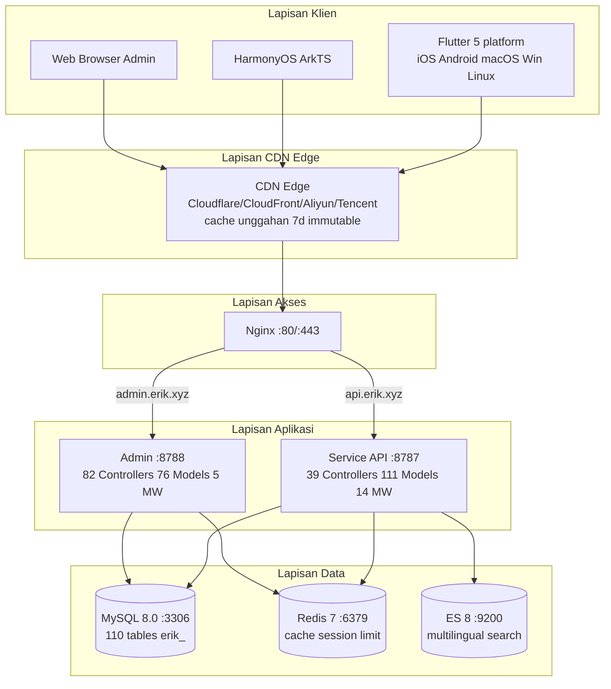
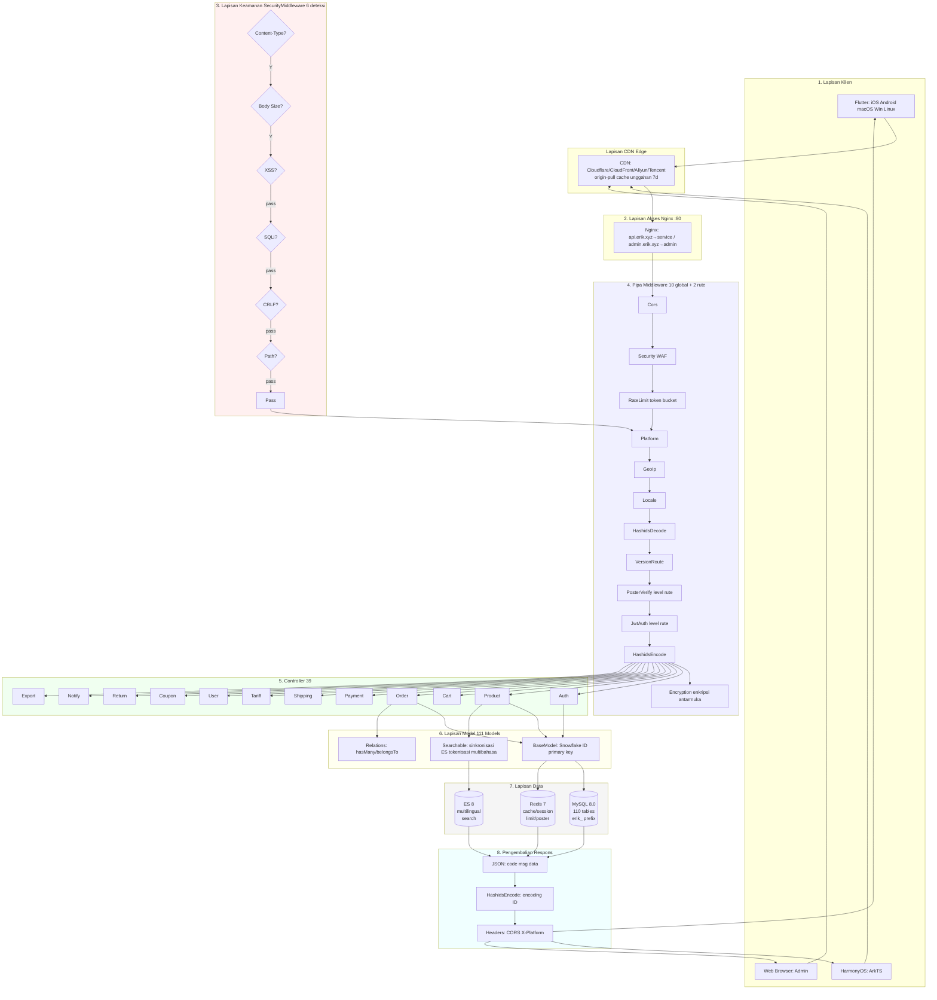
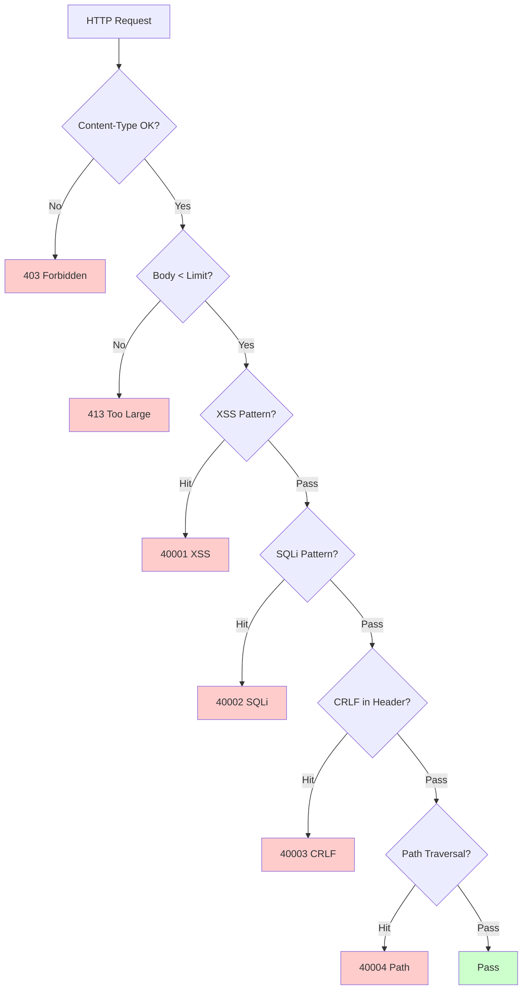
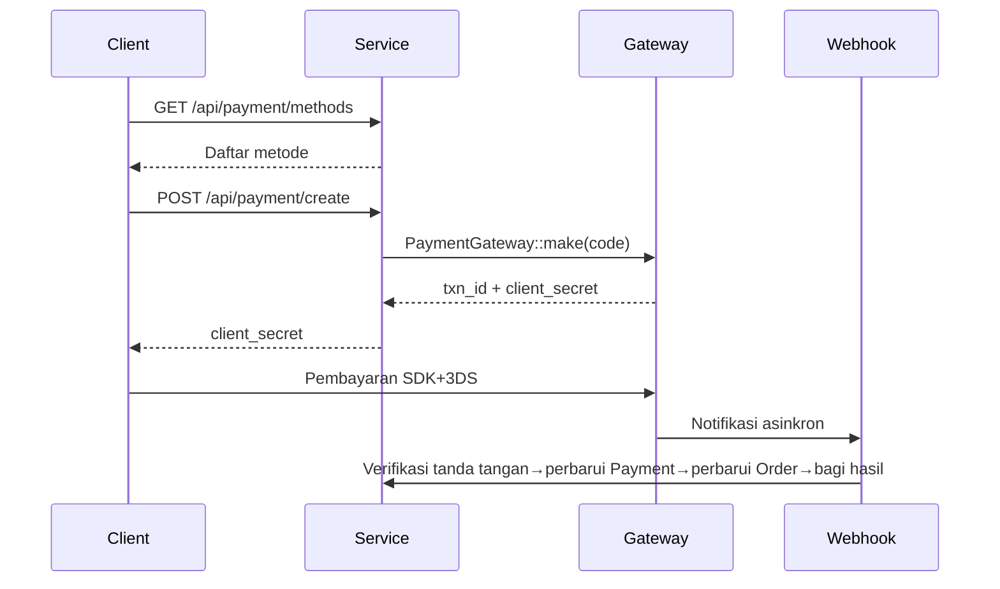
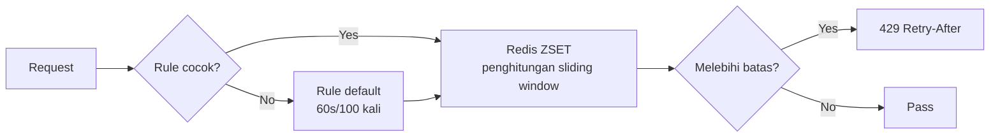

# Platform E-Commerce Lintas Batas — Dokumen Desain Arsitektur

Copyright (c) 2026 erik <erik@erik.xyz> — https://erik.xyz

---

## 1. Ringkasan Sistem

### 1.1 Posisi

Platform e-commerce lintas batas full-stack yang dibangun di atas framework webman berkinerja tinggi, mendukung B2C, B2B, dan onboarding penjual pihak ketiga.

| Komponen | Tumpukan Teknologi | Skala |
|------|--------|------|
| Service API | PHP 8.3 / webman 2.1 / illuminate database | 39 controller + 111 model + 14 middleware |
| Admin | webman-admin / LayUI / ECharts | 82 controller + 76 model + 5 middleware |
| Flutter | Riverpod / GoRouter / Dio | 25 file Dart / 11 halaman |
| HarmonyOS | ArkTS / ArkUI | 14 file ETS / 9 halaman |
| Database | MySQL 8.0 + Redis 7 + ES 8 | 117 tabel (110 `erik_` + 7 `wa_`) |

### 1.2 Indikator Inti

| Indikator | Nilai |
|------|-----|
| API P99 | <200ms |
| Konkurensi | 10000+ (32 worker memori tetap) |
| Jumlah Tabel | 110 |
| Endpoint | 73 |
| Middleware | 14 (service:10 global+2 rute+AdminKey+StaticFile / admin:4 global+1 bawaan) |
| Bahasa | zh_CN, zh_HK, en, ja, ko |
| Mata Uang | 19 jenis penetapan harga independen |
| Pembayaran | Stripe / PayPal / Klarna / Adyen |

---

## 2. Diagram Arsitektur Sistem



### 2.1 Diagram Alir Desain Lengkap



**Penjelasan diagram alir:**

| Lapisan | Penjelasan |
|----|------|
| 1. Lapisan klien | Flutter 5 platform + HarmonyOS + Web Admin, semuanya berkomunikasi melalui HTTP/JSON |
| 2. Lapisan akses | CDN edge (origin-pull, cache sumber daya statis) → Nginx memilah berdasarkan domain: api→service, admin→admin |
| 3. Lapisan keamanan | SecurityMiddleware 31 jenis detektor serangan, jika terdeteksi langsung mengembalikan kode error/403 |
| 4. Pipa middleware | 10 MW global diproses serial + 2 MW tingkat rute (PosterVerify operasi sensitif, JwtAuth antarmuka autentikasi) |
| 5. Lapisan controller | 39 controller API dikelompokkan berdasarkan fungsi, menangani seluruh logika bisnis |
| 6. Lapisan model | 111 model Eloquent, BaseModel menyediakan primary key Snowflake ID, 45 model mengaktifkan SoftDelete per tabel |
| 7. Lapisan data | MySQL (110 tabel prefix erik_/primary key snowflake) + Redis (cache/Session/rate limiting/Poster) + ES (pencarian multibahasa) |
| 8. Pengembalian respons | Format JSON seragam → HashidsEncode mengodekan ID → Encryption mengenkripsi (X-Encrypt-Response) → kembali ke klien |

### 2.2 Model Proses

```
webman Master (:8787)
  ├── HTTP Worker x32 (CPU×4, memori tetap, kumpulan koneksi DB)
  ├── Monitor Process (pemantauan file + pemantauan memori)
  └── SnowflakeWorker (menginisialisasi singleton Snowflake saat startup)
```

---

## 3. Pipa Middleware

### 3.1 Pipa Lengkap Service API

```mermaid
graph LR
    A[HTTP Request] --> B[Cors]
    B --> C[Security<br/>deteksi serangan]
    C --> D[Platform<br/>identifikasi sumber]
    D --> E[GeoIp<br/>identifikasi wilayah]
    E --> F[Locale<br/>bahasa]
    F --> G[HashidsDecode<br/>dekode ID]
    G --> H[VersionRoute<br/>rute versi]
    H --> I{Operasi sensitif?}
    I -->|Yes| J[PosterVerify<br/>verifikasi manusia]
    I -->|No| K{Proteksi JWT?}
    J --> K
    K -->|Yes| L[JwtAuth<br/>verifikasi Token]
    K -->|No| M[HashidsEncode<br/>encoding ID]
    L --> M
    M --> N[Controller]
    N --> O[HTTP Response]
    style C fill:#fcc
    style J fill:#ffc
    style L fill:#cfc
```



### 3.2 Detail Middleware Service

| # | Middleware | Tipe | Fungsi |
|---|--------|------|------|
| 1 | Cors | Global | Header respons Access-Control-*, preflight OPTIONS mengembalikan 200 |
| 2 | SecurityMiddleware | Global | XSS/Injeksi SQL/CRLF/Path Traversal/Content-Type/badan permintaan 10MB |
| 3 | RateLimitMiddleware | Global | Rate limiting token bucket (Redis ZSET jendela geser, 6 aturan endpoint) |
| 4 | PlatformMiddleware | Global | Header X-Platform + degradasi UA untuk mengenali 8 platform |
| 5 | GeoIpMiddleware | Global | MaxMind GeoIP2 pengenalan wilayah/mata uang/bahasa pengguna yang belum login |
| 6 | LocaleMiddleware | Global | Parsing Accept-Language, pencocokan presisi 5 bahasa→degradasi→default |
| 7 | HashidsDecode | Global | Field `*_id` di URL/Body hashid→snowflake ID |
| 8 | VersionRoute | Global | Header API-Version→pemetaan namespace controller (v1/v2) |
| 9 | PosterVerify | Rute | Verifikasi token Redis untuk registrasi/order/pembayaran |
| 10 | JwtAuth | Rute | Verifikasi tanda tangan HS256 Bearer Token + kedaluwarsa + injeksi userId |
| 11 | HashidsEncode | Global | Traversal rekursif JSON respons, snowflake ID→hashid |
| 12 | EncryptionMiddleware | Rute | Enkripsi/dekripsi AES antarmuka (X-Encrypt-Response/X-Encrypted) |
| 13 | AdminKeyMiddleware | Rute | Verifikasi kunci operasi manajemen internal |
| 14 | StaticFile | Global | Layanan sumber daya statis webman |

### 3.3 Pipa Admin

```
Permintaan → SecurityMiddleware → PlatformMiddleware → HashidsDecode
     → webman-admin AccessControl(RBAC bawaan) → HashidsEncode → Controller
```

| # | Middleware Admin | Fungsi |
|---|------------|------|
| 1 | SecurityMiddleware | XSS/Injeksi SQL/CRLF/Path Traversal/Content-Type/20MB |
| 2 | PlatformMiddleware | Pengenalan 8 platform X-Platform + UA |
| 3 | HashidsDecode | Permintaan hashid→snowflake ID |
| - | AccessControl (bawaan) | Verifikasi izin peran admin |
| 4 | HashidsEncode | Respons snowflake ID→hashid |

---

## 4. Arsitektur Keamanan

### 4.1 Pipa Deteksi Serangan (SecurityMiddleware)



### 4.2 Detail Aturan Deteksi Serangan SecurityMiddleware (15 jenis kustom)

| # | Jenis Serangan | Cara Deteksi Utama | Service | Admin | Kode Error |
|---|---------|------------|---------|-------|--------|
| 1 | XSS skrip lintas situs | 13 regex: script/iframe/event on/svg+on/style/expression/javascript:/embed/object/link/meta | ✅ | ✅ | 40001 |
| 2 | Injeksi SQL | 13 regex: UNION SELECT/SELECT FROM WHERE/sleep/benchmark/pg_sleep/tipe boolean/tipe string/karakter komentar/komentar khusus MySQL/enumerasi schema/load_file/into outfile/prosedur tersimpan/waitfor/delay | ✅ | ✅ | 40002 |
| 3 | Injeksi header CRLF | `[\r\n]` di: Authorization/X-Platform/API-Version/X-Forwarded-For/Referer/Origin | ✅ | ✅ | 40003 |
| 4 | Path Traversal | `../` + pengodean `%2e%2f` + pengodean dua lapis `%252e%252f` + null byte `\0` + `.env`/`.git`/`phpmyadmin`/`wp-admin`/`/etc/`/`/proc/`/`composer.json` | ✅ | ✅ | 40004 |
| 5 | Batasan badan permintaan | Content-Length > 10MB (Service) / 20MB (Admin) | ✅ | ✅ | 40005 |
| 6 | Content-Type | Hanya JSON/form-data/form-urlencoded | ✅ | ✅ | 40006 |
| 7 | Validasi unggahan file | Ekstensi daftar hitam (php/phtml/sh/exe/js/...) + ekstensi ganda + ekstensi kosong | ✅ | ✅ | 40009 |
| 8 | Header respons keamanan HTTP | nosniff/DENY/XSS-Protection/Referrer-Policy/Permissions-Policy/Cache-Control/penyembunyian Server | ✅ | ✅ | — |
| 9 | Perlindungan brute force | Penghitung Redis: API 10 kali/60s, Admin 5 kali/300s | ✅ | ✅ | 40008 |
| 10 | Injeksi entitas XXE | `<!ENTITY SYSTEM>`, `<!DOCTYPE [` | ✅ | ✅ | 40010 |
| 11 | SSRF pemalsuan server | IP intranet (127/10/172.16/192.168/0.0/169.254.169.254) + localhost + metadata.google.internal | ✅ | ✅ | 40011 |
| 12 | Validasi metode HTTP | Hanya GET/POST/PUT/DELETE/PATCH/OPTIONS/HEAD | ✅ | ✅ | 40012 |
| 13 | Validasi header Host | Menolak koneksi langsung IP telanjang | ✅ | — | 40013 |
| 14 | Penghilangan data sensitif | Log/respons error memfilter password/token/secret | ✅ | ✅ | — |
| 15 | Daftar putih CORS | Batasan origin yang dapat dikonfigurasi | ⚠️ | ⚠️ | — |

### 4.3 Alur Autentikasi

```
Registrasi: email+password → PosterVerify (verifikasi manusia) → bcrypt(password+salt)
     → Snowflake membuat ID → mengembalikan JWT

Login: email+password → password_verify(password+salt, bcrypt_hash)
     → memperbarui last_login_at/ip/platform → menerbitkan JWT

Permintaan: Authorization: Bearer <token>
     → JwtAuth → Jwt::decode → verifikasi tanda tangan HS256 + kedaluwarsa → injeksi request->userId

Refresh: POST /api/auth/refresh {refresh_token} → Jwt::decode → access_token baru
```

### 4.4 Keamanan Data (Enkripsi Tiga Lapis)

| Lapisan | Teknologi | Paket | Field |
|------|------|-----|------|
| Lapisan transportasi | AES-256-CBC | erikwang2013/encryption | Field sensitif body POST |
| Lapisan database | Trait Encryptable | erikwang2013/encryptable (Maize) | email, mobile, name, phone, detail, tax_id |
| Obfuscation ID | Pengodean Hashids | erikwang2013/hashids | Semua snowflake ID di lapisan antarmuka |

### 4.5 Pelacakan Sumber Platform

| Platform | Cara Pengenalan | Nilai Header |
|------|---------|---------|
| iOS | Flutter `Platform.isIOS` + `TargetPlatform.iOS` | `ios` |
| iPadOS | Flutter `Platform.isIOS` + `!TargetPlatform.iOS` | `ipados` |
| macOS | Flutter `Platform.isMacOS` / UA `Macintosh` | `macos` |
| Windows | Flutter `Platform.isWindows` / UA `Windows` | `windows` |
| Linux | Flutter `Platform.isLinux` / UA `Linux` | `linux` |
| Android | Flutter `Platform.isAndroid` / UA `Android` | `android` |
| HarmonyOS | ArkTS hardcoded / UA `HarmonyOS` | `harmonyos` |
| Web | UA tidak cocok / nilai default | `web` |

Tabel pencatatan: `erik_orders.platform`, `erik_payments.platform`, `erik_operation_logs.platform`, `erik_users.last_login_platform`, `erik_search_logs.platform`, `erik_chat_messages.platform`

---

## 5. Arsitektur Data

### 5.1 Strategi Primary Key

```
Snowflake 64bit: [1bit|42bit timestamp|5bitDC|5bitWID|12bit urutan]
- Unik global / meningkat secara tren / bukan auto-increment
- PHP $keyType='string' (mencegah overflow)
- Service worker_id=1, Admin worker_id=2
- Pembuatan: Snowflake::nextId()
```

### 5.2 Pewarisan Model

```
Illuminate\Database\Eloquent\Model
  └── app\model\BaseModel
        ├── $incrementing=false, $keyType='string', $guarded=[]
        ├── boot(): Snowflake::nextId()
        └── 110 model bisnis
              ├── 45 menggunakan SoftDeletes (sesuai tabel dengan kolom deleted_at)
              ├── sebagian menggunakan Encryptable (field sensitif: email/mobile/name, dll.)
              ├── menggunakan Searchable (Product→ES)
              └── relasi hasMany/belongsTo
```

### 5.3 Multibahasa/Multi-Mata Uang

- **Terjemahan**: `erik_product_translations(product_id,locale)` tabel terpisah, kueri berdasarkan locale
- **Penetapan harga**: `erik_product_sku_prices(sku_id,currency_code)` harga independen per mata uang

---

## 6. Arsitektur Pembayaran



```
PaymentGatewayInterface
  ├── createPayment(data): array
  ├── capturePayment(txnId): array
  ├── refundPayment(txnId, amount): array
  └── verifyWebhook(payload, sig): bool
```

---

## 7. Arsitektur Konkurensi Tinggi

### 7.1 Strategi Rate Limiting (RateLimitMiddleware)



| Endpoint | Jendela | Batas | Penjelasan |
|------|------|------|------|
| /api/auth/login | 60s | 10 kali | Mencegah serangan credential stuffing |
| /api/auth/register | 300s | 5 kali | Mencegah registrasi massal |
| /api/payment | 60s | 5 kali | Mencegah pembayaran curang |
| /api/orders | 10s | 3 kali | Mencegah spam order |
| /api/search | 1s | 10 kali | Mencegah crawler |
| Default | 60s | 100 kali | API umum |

### 7.2 Penggunaan Redis

Redis digunakan untuk rate limiting token bucket, kode verifikasi manusia, dan penyimpanan Session (lapisan middleware); data bisnis tidak melakukan cache lapisan aplikasi, langsung membaca MySQL (pemisahan baca/tulis + kumpulan koneksi). Aset statis (unggahan produk/banner/dokumen) di-cache di edge CDN + nginx (`location /app/admin/upload/`, `expires 7d; Cache-Control public, max-age=604800, immutable`).

### 7.4 Optimasi Kumpulan Koneksi

| Sumber Daya | Koneksi Maks | Koneksi Min | Timeout Tunggu | Timeout Idle | Heartbeat |
|------|---------|---------|---------|---------|------|
| MySQL | 50 | 10 | 2s | 60s | 45s |
| Redis | 30 | 5 | — | 60s | — |

### 7.5 Penanganan Operasi Lambat

| Operasi | Implementasi |
|------|------|
| Pembaruan nilai tukar | ExchangeRateCron (setiap jam, API eksternal) |
| Sinkronisasi Feed | ProductFeedCron (membuat TSV setiap 6 jam dan mencatat log) |
| Perhitungan rekomendasi | RecommendationCron (harian, co-occurrence pembelian) |
| Rekonsiliasi pembayaran | PaymentReconcileCron (setiap 6 jam, Stripe/PayPal) |
| Settlement pembagian dana | SettlementCron (harian) |
| Lacak logistik | ShipmentTrackingCron (setiap 30 menit, perlu konfigurasi API) |
| Sinkronisasi order platform | PlatformOrderSyncCron (setiap 5 menit, perlu konfigurasi API) |
| Timeout retur | ReturnExpireCron (setiap jam) |
| Notifikasi penurunan harga/kedatangan | PriceAlertCron (setiap 10 menit) |
| Pembaruan aturan kepatuhan | ComplianceCron (harian, perlu konfigurasi API) |

## 8. Arsitektur Deployment

```
docker-compose.yml:
  nginx (alpine) :80 :443
  service (php:8.3) :8787 internal, 32 workers
  admin (php:8.3) :8788 internal
  mysql (8.0) :3306 / redis (7) :6379 / es (8) :9200
Jaringan: erik-net bridge | Persistensi volume data
Volume unggahan: admin_uploads:/app/plugin/admin/public/upload | service_public:/app/public/documents
CDN: origin-pull — Cdn::url() → https://{CDN_DOMAIN}{path} | cache edge nginx 7d immutable
Routing: api.erik.xyz→service | admin.erik.xyz→admin
```

---


## 8. Internasionalisasi (i18n)

| Lapisan | Implementasi |
|------|------|
| Service | LocaleMiddleware + 5 file terjemahan bahasa (45 key/bahasa) |
| Admin | 5 file terjemahan bahasa |
| Flutter | AppLocalizations + Riverpod Provider |
| API | Injeksi otomatis header Accept-Language |

## 9. Dokumentasi API (hg/apidoc)

| Komponen | Penjelasan |
|------|------|
| Paket | hg/apidoc v5.3 |
| Konfigurasi | config/plugin/hg/apidoc/app.php (6 grup) |
| Anotasi | @Apidoc\Title/Desc/Method/Url/Param/Returned |
| Akses | http://localhost:8787/apidoc/ |

## 11. Pengujian

```bash
cd service && php vendor/bin/phpunit tests/
```

| Kelas Pengujian | Tests | Cakupan |
|--------|-------|------|
| SecurityTest | 12 | XSS+SQLi+XXE+SSRF+Path |
| JwtTest | 4 | encode/decode/invalid |
| ApiResponseTest | 3 | success/fail/paginate |
| RedisFacadeTest | 3 | ping/set/get/redis() |
| **Total** | **22** | **45 assertions PASS** |

---

## 12. Statistik Proyek

| Dimensi | Jumlah |
|------|------|
| File sumber PHP | service:210 + admin:214 = 424 |
| Dart (Flutter) | 25 |
| ArkTS (HarmonyOS) | 14 |
| Tabel database | 110 |
| Endpoint API | 73 |
| Middleware | 14 |
| Kelas utilitas | 8 |
| Tugas terjadwal | 12 |
| Item konfigurasi | 36+ |
| Pengujian | 22 tests, 45 assertions |
| Skills | 38 |
| Dokumentasi | 9 |
| **Total** | **~700** |
