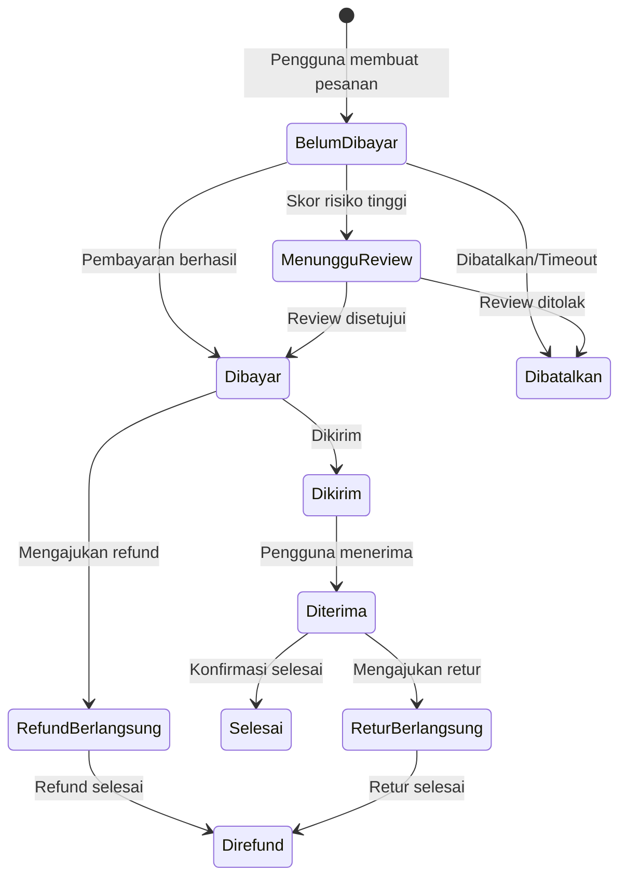
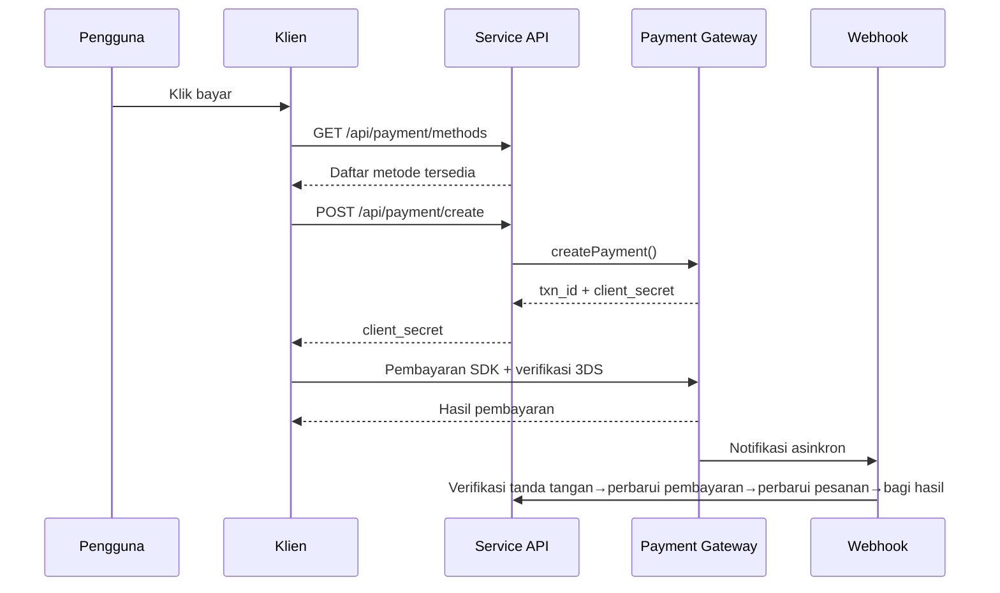
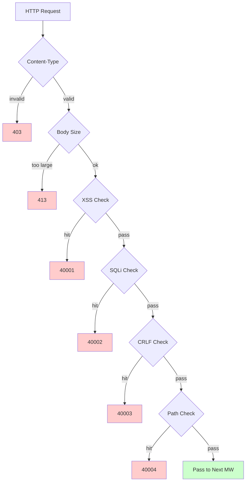

# Platform E-Commerce Lintas Batas — Dokumen Desain Fitur

Copyright (c) 2026 erik <erik@erik.xyz> — https://erik.xyz

---


## Pelacakan Platform

### Pengenalan 8 Platform

| Platform | Header | Flutter | Admin |
|------|--------|---------|-------|
| iOS | `ios` | Platform.isIOS + TargetPlatform.iOS | UA iPhone |
| iPadOS | `ipados` | Platform.isIOS + !TargetPlatform.iOS | UA iPad |
| macOS | `macos` | Platform.isMacOS | UA Macintosh |
| Windows | `windows` | Platform.isWindows | UA Windows |
| Linux | `linux` | Platform.isLinux | UA Linux |
| Android | `android` | Platform.isAndroid | UA Android |
| HarmonyOS | `harmonyos` | — | UA HarmonyOS |
| Web | `web` | kIsWeb | Default |

### Field Pelacakan DB

| Tabel | Field | Penjelasan |
|----|------|------|
| erik_orders | platform VARCHAR(16) | Platform saat order |
| erik_payments | platform VARCHAR(16) | Platform pembayaran |
| erik_operation_logs | platform VARCHAR(16) | Platform operasi |
| erik_users | last_login_platform VARCHAR(16) | Platform login |
| erik_search_logs | platform VARCHAR(16) | Platform pencarian |
| erik_chat_messages | platform VARCHAR(16) | Sumber pesan |

## 1. Ringkasan Fitur

### 1.0 Ringkasan Cakupan

| Dimensi | Cakupan | Kedalaman |
|------|---------|------|
| **Ritel B2C** | Produk multibahasa, penetapan harga per mata uang, SKU, keranjang, pesanan, pembayaran (Stripe/PayPal/Klarna), refund, retur | Lengkap |
| **Grosir B2B** | Penetapan harga bertingkat (MOQ), sertifikasi perusahaan (NPWP/izin usaha), permintaan penawaran | Lengkap |
| **Onboarding multi-penjual** | Persetujuan penjual, persetujuan produk, pembagian komisi | Lengkap |
| **Kepatuhan lintas batas** | Pustaka kode HS Code (kode dasar 6 digit), aturan bea masuk (negara tujuan + HS→tarif), VAT/IOSS, label kepatuhan (FDA/CE/RoHS, dll. 10 jenis) | Lengkap |
| **Logistik internasional** | Ongkir per zona logistik (tingkatan berat), DHL/UPS/FedEx/EMS, gudang luar negeri (kirim + retur), deklarasi HS (penanda baterai/cairan), faktur komersial PDF/daftar pengepakan | Lengkap |
| **Pembayaran** | Stripe PaymentIntent+3DS, PayPal REST, Klarna BNPL, Adyen, verifikasi tanda tangan Webhook + pembagian dana | Stripe lengkap, lainnya placeholder |
| **Pemasaran** | Kupon (per zona + batasan pelanggan baru/lama), banner karusel (terlihat per wilayah), flash sale (terbatas waktu/kuantitas), beli grup (jumlah peserta + masa berlaku), afiliasi (tautan + komisi + penarikan) | Lengkap |
| **Multi-platform** | Listing produk + agregasi order Amazon/eBay/Shopee/Lazada/Temu, manajemen multi-toko | Lengkap |
| **Rantai pasok** | Profil + rating pemasok, purchase order (persetujuan→pengiriman→penerimaan→pemeriksaan kualitas), pemeriksaan kualitas (pintu masuk/keluar gudang + penampilan/fungsi/pemeriksaan label kepatuhan), riwayat stok (buku besar tidak dapat diubah: masuk/keluar/transfer/stok opname) | Lengkap |
| **Manajemen risiko & kepatuhan** | Mesin aturan (penilaian side-channel: validasi alamat/pencocokan kode pos/3DS/registrasi massal/anomali nilai barang), verifikasi identitas KYC, permintaan data GDPR/CCPA, manajemen versi Cookie Consent | Lengkap |
| **Perlindungan keamanan** | SecurityMiddleware membungkus 31 detektor security-php: XSS (13 aturan)/Injeksi SQL (13 aturan)/CRLF/Path traversal (pengodean + null byte)/ukuran Body/Content-Type/unggah file/header keamanan HTTP/brute force (penghitung Redis)/XXE/SSRF/metode/Host/penghilangan data sensitif/CORS | Lengkap |
| **Konkurensi tinggi** | Rate limiting token bucket (jendela geser + 6 aturan endpoint), circuit breaker (pembayaran/login sosial, 5 kegagalan→30s terbuka + pemulihan half-open), pemisahan baca/tulis DB (2 replika baca + sticky), kumpulan koneksi (DB 50/10 + Redis 30/5), OPCache (128MB, lingkungan Docker) | Lengkap |
| **Pertumbuhan anggota** | Level + hak keanggotaan, aturan poin + riwayat, kartu hadiah (saldo + penukaran), pengingat penurunan harga/kedatangan, favorit, perbandingan produk, riwayat penjelajahan, pembelian berlangganan, pengujian AB (alokasi lalu lintas + tingkat kepercayaan) | Lengkap |
| **Manajemen konten** | Halaman CMS multibahasa (Landing/Blog), FAQ multibahasa, basis pengetahuan multibahasa, tabel konversi ukuran (pakaian/sepatu + konversi US/UK/EU/JP/CN), template email (multibahasa), Feed produk (Google/Meta + sinkronisasi terjadwal) | Lengkap |
| **Layanan pelanggan** | IM real-time WebSocket (chat_sessions/chat_messages), basis pengetahuan multibahasa | Struktur tabel lengkap, WS belum diimplementasikan |
| **Infrastruktur** | ID terdistribusi Snowflake (bigint non-auto-increment), obfuscation ID antarmuka Hashids, autentikasi JWT (HS256 + refresh token ganda access/refresh), enkripsi/dekripsi AES (enkripsi tiga lapis antarmuka + database), identifikasi wilayah GeoIP (MaxMind), verifikasi manusia Poster (slider/teka-teki/klik) | Lengkap |
| **Cakupan multi-klien** | Flutter 5 platform (iOS/Android/macOS/Windows/Linux/iPadOS) + HarmonyOS (ArkTS 9 halaman) + Web Admin (LayUI+ECharts) + API | Flutter 25 file, HarmonyOS 14 file, Admin 239 file |
| **Pelacakan platform** | Pengenalan 8 platform (iOS/iPadOS/macOS/Windows/Linux/Android/HarmonyOS/Web) + header X-Platform + pencatatan 6 tabel (orders/payments/operation_logs/users/search_logs/chat_messages) | Lengkap |
| **Pengujian** | 22 tests / 45 assertions — ALL PASS (SecurityTest 12: XSS+SQLi+XXE+SSRF+Path / JwtTest 4 / ApiResponseTest 3 / RedisFacadeTest 3) | Pengujian unit lengkap, pengujian integrasi menyusul |

### 1.1 Matriks Modul

| Modul Level 1 | Modul Level 2 | Prioritas | Status |
|---------|---------|--------|------|
| Sistem pengguna | Registrasi/login/login sosial/KYC/alamat/favorit/anggota/poin/kartu hadiah | P0-P2 | ✅ |
| Sistem produk | Kategori/SKU/multibahasa/multi-mata uang/gambar/atribut/kepatuhan/HS Code/pencarian ES/Feed | P0-P1 | ✅ |
| Sistem transaksi | Keranjang/pesanan/pembayaran (Stripe+PayPal+Klarna)/refund/retur/faktur | P0 | ✅ |
| Sistem logistik | Perusahaan logistik internasional/ongkir per zona/gudang luar negeri/pengiriman (deklarasi HS)/asuransi logistik | P0-P1 | ✅ |
| Bea cukai & pajak | Pustaka HS Code/aturan bea masuk/VAT/IOSS/pembatasan kepatuhan berbagai negara | P0 | ✅ |
| Sistem pemasaran | Kupon/banner karusel/flash sale/beli grup/afiliasi | P1-P2 | ✅ |
| Rantai pasok | Pemasok/purchase order/pemeriksaan kualitas/riwayat stok | P1 | ✅ |
| Risiko & kepatuhan | Mesin aturan/GDPR/CCPA/Cookie Consent/pelacakan platform | P1 | ✅ |
| Perlindungan keamanan | XSS/Injeksi SQL/CRLF/Path traversal/Content-Type/badan permintaan | P0 | ✅ |
| Multi-platform | Listing Amazon/eBay/Shopee + agregasi order/onboarding multi-penjual | P2 | ✅ |
| Manajemen konten | CMS/FAQ/basis pengetahuan/template email/notifikasi/tabel ukuran | P2 | ✅ |
| Alat pertumbuhan | Grosir B2B/pembelian berlangganan/pengujian AB | P2-P3 | ✅ |
| Layanan pelanggan | IM real-time WebSocket/basis pengetahuan | P3 | ✅ |
| Infrastruktur | Snowflake ID/JWT/Hashids/Encryption/Poster/versi API/GeoIP | P0 | ✅ |

---

## 2. Diagram Alir Bisnis Inti

### 2.1 Mesin Status Pesanan



### 2.2 Urutan Waktu Pembayaran



### 2.3 Pipa Deteksi Keamanan



---

## 3. Alur Bisnis Inti

### 3.1 Registrasi dan Login Pengguna

```
Registrasi EMAIL: email+password → verifikasi manusia PosterVerify → bcrypt(password+salt)
          → Snowflake membuat ID → mengembalikan JWT {access_token, expires_in}

Login sosial: Google/Apple/Facebook OAuth → verifikasi id_token
        → cek binding erik_user_social_accounts
        → sudah terikat: login / belum terikat: buat pengguna otomatis + ikat → mengembalikan JWT

Login: email+password → password_verify(password+salt)
    → perbarui last_login_at/ip/platform → terbitkan JWT

Refresh token: refresh_token → Jwt::decode → access_token baru
```

### 3.2 Penjelajahan dan Pencarian Produk

```
Daftar: GET /api/products
  → filter: category_id/status/keyword/price_range
  → urutan: default/price_asc/price_desc/sales/newest
  → multibahasa: ProductTranslations difilter berdasarkan locale
  → per mata uang: ProductSkuPrices dicocokkan berdasarkan currency_code
  → paginasi: 20 item/halaman

Pencarian ES: GET /api/search?keyword=xxx
  → Erikwang2013\WebmanScout\Searchable → penganalisis multibahasa ES
  → agregasi: category/price/brand
  → degradasi: MySQL LIKE saat ES tidak tersedia

Detail: GET /api/products/{hashid}
  → middleware HashidsDecode mendekode → Eager Load
  → multibahasa + per mata uang + kepatuhan + HS Code + konversi ukuran + termasuk/tidak termasuk pajak + VAT
```

### 3.3 Keranjang dan Pemesanan

```
Keranjang: POST /api/cart {sku_id, quantity}
  → validasi SKU ada|sedang dijual|stok cukup
  → akumulasi SKU yang sama / buat jika tidak ada

Pemesanan: POST /api/orders {address_id, coupon_id, currency_code}
  → 1.validasi alamat pengiriman → 2.ambil item terpilih di keranjang → 3.validasi per produk (stok + kepatuhan)
  → 4.hitung harga (per mata uang + kupon) → 5.buat nomor pesanan
  → 6.buat Order+OrderItems → 7.kurangi stok → 8.tulis OrderLog
  → 9.penilaian risiko (RiskEngine::score) → 10.hapus keranjang yang sudah dibeli

Batal: POST /api/orders/{id}/cancel
  → validasi status=0 (menunggu pembayaran) → pulihkan stok → status=5 (dibatalkan)
```

### 3.4 Alur Pembayaran

```
Cara yang tersedia: GET /api/payment/methods?country=DE&currency=EUR
  → PaymentGatewayMethods (difilter berdasarkan country+currency)

Buat pembayaran: POST /api/payment/create
  → PaymentGateway::make(gateway)→createPayment()
  → Stripe: PaymentIntent → client_secret → SDK frontend (+3DS)

Webhook: POST /webhook/payment/stripe
  → verifikasi tanda tangan → payment_intent.succeeded:
     → Payment.status=dibayar → Order.status=dibayar
     → PlatformSettlement (komisi platform + biaya gateway + pemasok + afiliasi)
```

### 3.5 Alur Retur

```
Ajukan: POST /api/returns {order_id, reason_id}
  → tentukan jalur retur: gudang lokal (type=1)/dikirim kembali ke dalam negeri (type=2)/hanya refund (type=3)

Persetujuan: Persetujuan Admin → disetujui: buat ReturnLabel / ditolak: tulis alasan

Kirim kembali: unduh label→kirim kembali→pembaruan logistik→penerimaan gudang→status=diterima

Refund: status=selesai → Refund terkait → PaymentGateway::refund→pengembalian jalur semula
```

### 3.6 Estimasi Bea Masuk

```
GET /api/tariff/estimate?product_id=xxx&dest_country_id=xxx&declared_value=100

1. ProductHsCodes → HsCode
2. TariffRules(dest_country_id + hs_code_id) → duty_rate + duty_free_threshold
3. VatSettings(country_id) → vat_rate + vat_free_threshold
4. duty = value>=threshold ? value*duty_rate/100 : 0
   vat = (value+duty)>=threshold ? (value+duty)*vat_rate/100 : 0
5. return {duty_rate, vat_rate, estimated_duty, estimated_vat, estimated_total, hs_code, disclaimer}
```

---

## 4. Perlindungan Keamanan (SecurityMiddleware membungkus 31 detektor security-php)

### 4.1 Tabel Lengkap Aturan Deteksi

| # | Jenis Serangan | Cara Deteksi Utama | Kode Error | Service | Admin |
|---|---------|------------|--------|---------|-------|
| 1 | XSS skrip lintas situs | 13 regex: script/iframe/event on/svg+on/style/expression/javascript:/embed/object/link/meta | 40001 | ✅ | ✅ |
| 2 | Injeksi SQL | 13 regex: UNION SELECT/SELECT FROM WHERE/sleep/benchmark/pg_sleep/tipe boolean/tipe string/karakter komentar/komentar khusus MySQL/enumerasi schema/load_file/into outfile/prosedur tersimpan/waitfor/delay | 40002 | ✅ | ✅ |
| 3 | Injeksi header CRLF | `[\r\n]` di: Authorization/X-Platform/API-Version/X-Forwarded-For/Referer/Origin | 40003 | ✅ | ✅ |
| 4 | Path traversal | `../` + pengodean `%2e%2f` + pengodean dua lapis `%252e%252f` + null byte `\0` + `.env`/`.git`/`phpmyadmin`/`wp-admin`/`/etc/`/`/proc/`/`composer.json` | 40004 | ✅ | ✅ |
| 5 | Batasan badan permintaan | Content-Length > 10MB (Service) / 20MB (Admin) | 40005 | ✅ | ✅ |
| 6 | Batasan Content-Type | Hanya JSON/form-data/form-urlencoded | 40006 | ✅ | ✅ |
| 7 | **Validasi unggahan file** | Ekstensi daftar hitam (php/phtml/sh/exe/js/...) + serangan ekstensi ganda + ekstensi kosong | 40009 | ✅ | ✅ |
| 8 | **Header respons keamanan HTTP** | nosniff/DENY/XSS-Protection/Referrer-Policy/Permissions-Policy/Cache-Control/penyembunyian Server | — | ✅ | ✅ |
| 9 | **Perlindungan brute force** | Penghitung Redis: API 10 kali/60s, Admin 5 kali/300s | 40008 | ✅ | ✅ |
| 10 | **Injeksi entitas XXE** | `<!ENTITY SYSTEM>`, `<!DOCTYPE [` | 40010 | ✅ | ✅ |
| 11 | **SSRF pemalsuan server** | IP intranet (127/10/172.16/192.168/0.0/169.254.169.254) + localhost + metadata.google.internal | 40011 | ✅ | ✅ |
| 12 | **Validasi metode HTTP** | Hanya GET/POST/PUT/DELETE/PATCH/OPTIONS/HEAD | 40012 | ✅ | ✅ |
| 13 | **Validasi header Host** | Menolak akses langsung IP telanjang | 40013 | ✅ | — |
| 14 | **Penghilangan data sensitif** | Log/respons error memfilter password/token/secret | — | ✅ | ✅ |
| 15 | **Daftar putih CORS** | Batasan origin yang dapat dikonfigurasi | — | ⚠️ | ⚠️ |

### 4.2 Pipa Middleware

```
Service: Cors → Security → Platform → GeoIp → Locale → HashidsDecode
        → VersionRoute → (PosterVerify) → (JwtAuth) → HashidsEncode

Admin: Security → Platform → HashidsDecode → AccessControl → HashidsEncode
```

### 4.3 Pelacakan Sumber Platform

| Platform | Nilai Header | Cara Pengenalan |
|------|---------|---------|
| iOS | `ios` | Flutter `Platform.isIOS` |
| iPadOS | `ipados` | Penentuan Flutter `TargetPlatform.iOS` |
| macOS | `macos` | Flutter `Platform.isMacOS` |
| Windows | `windows` | Flutter `Platform.isWindows` |
| Linux | `linux` | Flutter `Platform.isLinux` |
| Android | `android` | Flutter `Platform.isAndroid` |
| HarmonyOS | `harmonyos` | Hardcoded ArkTS |
| Web | `web` | Degradasi UA / default |

---


## 5. Konkurensi Tinggi dan Performa

### 5.1 Aturan Rate Limiting

| Endpoint | Algoritma | Jendela | Batas |
|------|------|------|------|
| /api/auth/login | Jendela geser | 60s | 10 kali |
| /api/auth/register | Jendela geser | 300s | 5 kali |
| /api/payment | Jendela geser | 60s | 5 kali |
| /api/orders | Jendela geser | 10s | 3 kali |
| /api/search | Jendela geser | 1s | 10 kali |
| Default | Jendela geser | 60s | 100 kali |

### 5.2 Penggunaan Redis

| Kegunaan | Implementasi |
|------|------|
| Rate limiting token bucket | Redis ZSET jendela geser |
| Verifikasi manusia | Status kode verifikasi PosterVerify |
| Penyimpanan Session | Penyimpanan KV Redis |

Data bisnis tidak melakukan cache lapisan aplikasi, langsung membaca MySQL (pemisahan baca/tulis + kumpulan koneksi).

### 5.3 Kumpulan Koneksi

| Sumber Daya | Maks | Min | Timeout |
|------|------|------|------|
| MySQL | 50 | 10 | 2s |
| Redis | 30 | 5 | — |

## 6. Diagram Relasi Tabel Data

```
erik_users ──┬── addresses, social_accounts, wishlists, kyc
             ├── carts, orders → order_items → payments
             ├── reviews, coupons(through user_coupons)
             ├── notifications, subscriptions, point_logs
             ├── affiliate_links, chat_sessions, b2b_verifications
             └── privacy_requests

erik_products ──┬── translations(product_id, locale)
                ├── skus → sku_prices(sku_id, currency_code)
                ├── images, reviews, compliance → compliance_categories
                ├── hs_codes → hs_codes, recommendations
                ├── b2b_prices, platform_listings
                └── product_comparisons

erik_orders ──┬── order_items, order_logs
              ├── payments, refunds, return_orders → return_labels
              ├── order_documents, shipments
              ├── platform_settlements, risk_logs
              └── subscription_orders

erik_countries ──┬── vat_settings, tariff_rules(dest_country_id)
                 ├── country_compliance_rules
                 ├── shipping_zones(JSON countries)
                 └── warehouses(country_id)
```

---

## 7. Antarmuka API

Daftar lengkap endpoint API (23 antarmuka publik + 47 antarmuka autentikasi + Webhook + Admin/Health), lihat [Dokumen API](api.md).

---

## 8. Verifikasi Pengujian

```bash
cd service && php vendor/bin/phpunit tests/
```

| Kelas Pengujian | Tests | Cakupan |
|--------|-------|------|
| SecurityTest | 12 | XSS (3 kasus)+SQLi (2 kasus)+XXE (2 kasus)+SSRF (1 kasus)+Path (2 kasus)+kebocoran kartu kredit (1 kasus)+pass normal (1 kasus) |
| JwtTest | 4 | encode JWT tiga bagian + round-trip decode + token tidak valid→null + token kosong→null |
| ApiResponseTest | 3 | success (code=0) + fail (kode error) + paginate (paginasi list+meta) |
| RedisFacadeTest | 3 | ping + round-trip set/get + fungsi bantu redis() (skip saat Redis tidak tersedia) |
| **Total** | **22** | **45 assertions — ALL PASS** |
