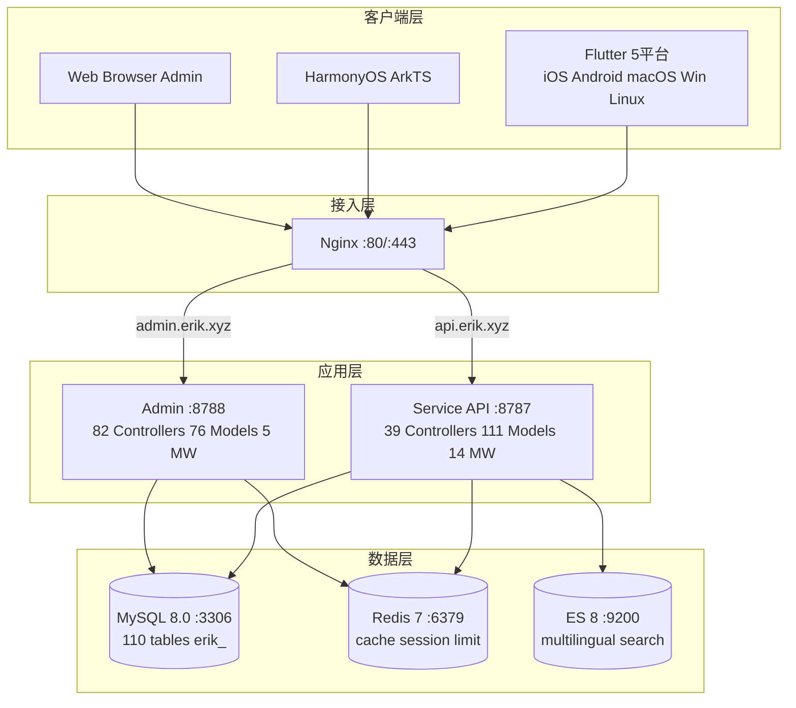
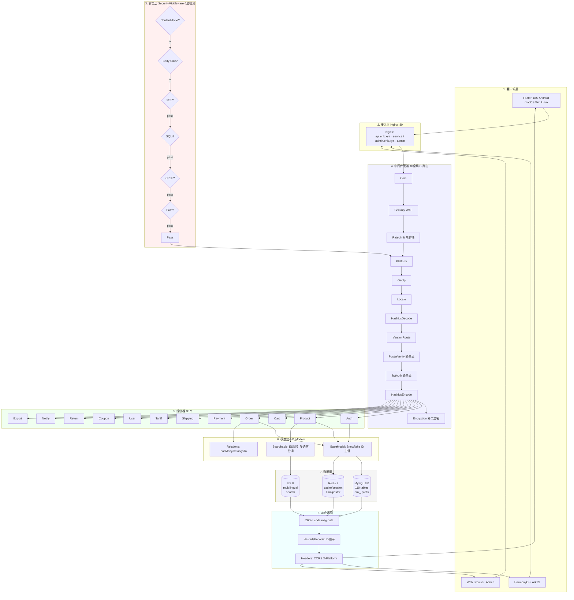
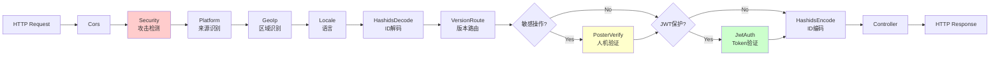
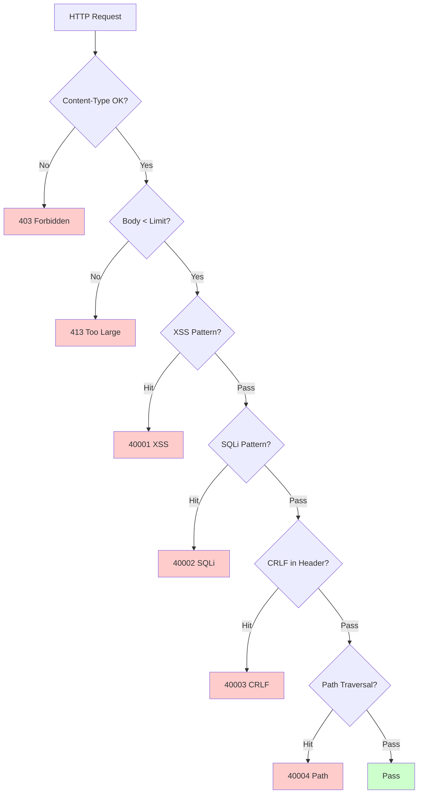
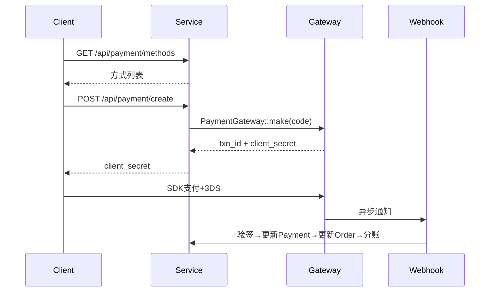
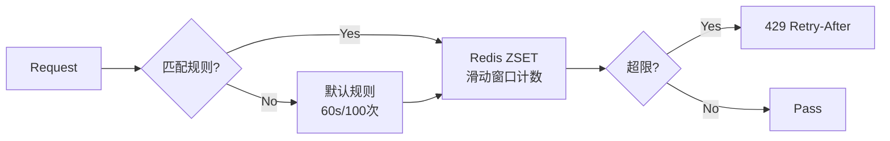

# 越境ECプラットフォーム — アーキテクチャ設計ドキュメント

Copyright (c) 2026 erik <erik@erik.xyz> — https://erik.xyz

---

## 1. システム概要

### 1.1 位置づけ

webman 高性能フレームワークをベースにしたフルスタック越境ECプラットフォーム。B2C、B2B、第三者セラーの出店に対応。

| コンポーネント | 技術スタック | 規模 |
|------|--------|------|
| Service API | PHP 8.3 / webman 2.1 / illuminate database | 39コントローラー + 111モデル + 14ミドルウェア |
| Admin | webman-admin / LayUI / ECharts | 82コントローラー + 76モデル + 5ミドルウェア |
| Flutter | Riverpod / GoRouter / Dio | 25 Dartファイル / 11ページ |
| HarmonyOS | ArkTS / ArkUI | 14 ETSファイル / 9ページ |
| データベース | MySQL 8.0 + Redis 7 + ES 8 | 117テーブル (110 `erik_` + 7 `wa_`) |

### 1.2 コア指標

| 指標 | 値 |
|------|-----|
| API P99 | <200ms |
| 並行処理 | 10000+ (32 worker常駐メモリ) |
| テーブル数 | 110 |
| エンドポイント | 73 |
| ミドルウェア | 14 (service:10グローバル+2ルート+AdminKey+StaticFile / admin:4グローバル+1組み込み) |
| 言語 | zh_CN, zh_HK, en, ja, ko |
| 通貨 | 19種類の独立価格設定 |
| 決済 | Stripe / PayPal / Klarna / Adyen |

---

## 2. システムアーキテクチャ図



### 2.1 完全な設計フローチャート



**フローチャートの説明:**

| 層 | 説明 |
|----|------|
| 1.クライアント層 | Flutter 5プラットフォーム + HarmonyOS + Web Admin、すべて HTTP/JSON で通信 |
| 2.アクセス層 | Nginx がドメインごとに振り分け: api→service, admin→admin |
| 3.安全層 | SecurityMiddleware 31類の攻撃検出器、ヒットするとエラーコード/403 を返す |
| 4.ミドルウェアパイプライン | 10個のグローバルMWを直列処理 + 2個のルート級MW(PosterVerify敏感操作, JwtAuth認証インターフェース) |
| 5.コントローラー層 | 39個のAPIコントローラーが機能ごとにグループ化、全業務ロジックを処理 |
| 6.モデル層 | 111個のEloquentモデル、BaseModelがSnowflake ID主キーを提供、45モデルがテーブルに応じてSoftDeleteを有効化 |
| 7.データ層 | MySQL(110テーブル erik_プレフィックス/snowflake主キー) + Redis(キャッシュ/Session/限流/Poster) + ES(多言語検索) |
| 8.レスポンス返却 | JSON統一フォーマット → HashidsEncodeでIDをエンコード → Encryptionで暗号化(X-Encrypt-Response) → クライアントへ返却 |

### 2.2 プロセスモデル

```
webman Master (:8787)
  ├── HTTP Worker x32 (CPU×4, 常駐メモリ, DBコネクションプール)
  ├── Monitor Process (ファイル監視+メモリ監視)
  └── SnowflakeWorker (起動時にSnowflakeシングルトンを初期化)
```

---

## 3. ミドルウェアパイプライン

### 3.1 Service API 完全パイプライン



### 3.2 Service ミドルウェア詳細

| # | ミドルウェア | タイプ | 機能 |
|---|--------|------|------|
| 1 | Cors | グローバル | Access-Control-* レスポンスヘッダー、OPTIONSプリフライトで200を返す |
| 2 | SecurityMiddleware | グローバル | XSS/SQL注入/CRLF/パストラバーサル/Content-Type/リクエストボディ10MB |
| 3 | RateLimitMiddleware | グローバル | トークンバケット限流(Redis ZSETスライディングウィンドウ、6エンドポイントルール) |
| 4 | PlatformMiddleware | グローバル | X-Platform header + UA降格で8プラットフォームを識別 |
| 5 | GeoIpMiddleware | グローバル | MaxMind GeoIP2 未ログインユーザーの地域/通貨/言語識別 |
| 6 | LocaleMiddleware | グローバル | Accept-Language解析、5言語の完全一致→降格→デフォルト |
| 7 | HashidsDecode | グローバル | URL/Body内の `*_id` フィールドを hashid→snowflake ID に変換 |
| 8 | VersionRoute | グローバル | API-Version header→コントローラーの名前空間(v1/v2)マッピング |
| 9 | PosterVerify | ルート | 登録/注文/決済時に Redis で token を検証 |
| 10 | JwtAuth | ルート | Bearer Token HS256署名検証+期限+userId注入 |
| 11 | HashidsEncode | グローバル | レスポンスJSONを再帰的に走査、snowflake ID→hashid |
| 12 | EncryptionMiddleware | ルート | インターフェースAES暗号化・復号(X-Encrypt-Response/X-Encrypted) |
| 13 | AdminKeyMiddleware | ルート | 内部管理操作のキー検証 |
| 14 | StaticFile | グローバル | webman 静的リソースサービス |

### 3.3 Admin パイプライン

```
请求 → SecurityMiddleware → PlatformMiddleware → HashidsDecode
     → webman-admin AccessControl(内置RBAC) → HashidsEncode → 控制器
```

| # | Adminミドルウェア | 機能 |
|---|------------|------|
| 1 | SecurityMiddleware | XSS/SQL注入/CRLF/パストラバーサル/Content-Type/20MB |
| 2 | PlatformMiddleware | X-Platform + UA 8プラットフォーム識別 |
| 3 | HashidsDecode | リクエストの hashid→snowflake ID |
| - | AccessControl(組み込み) | 管理者ロールの権限検証 |
| 4 | HashidsEncode | レスポンスの snowflake ID→hashid |

---

## 4. セキュリティアーキテクチャ

### 4.1 攻撃検出パイプライン (SecurityMiddleware)



### 4.2 SecurityMiddleware 攻撃検出ルール詳細 (15種類のカスタム)

| # | 攻撃タイプ | 主な検出方法 | Service | Admin | エラーコード |
|---|---------|------------|---------|-------|--------|
| 1 | XSSクロスサイトスクリプティング | 13条の正規表現: script/iframe/onイベント/svg+on/style/expression/javascript:/embed/object/link/meta | ✅ | ✅ | 40001 |
| 2 | SQL注入 | 13条の正規表現: UNION SELECT/SELECT FROM WHERE/sleep/benchmark/pg_sleep/ブール型/文字列型/コメント文字/MySQL特殊コメント/schema列挙/load_file/into outfile/ストアドプロシージャ/waitfor/delay | ✅ | ✅ | 40002 |
| 3 | CRLF Header注入 | `[\r\n]` in: Authorization/X-Platform/API-Version/X-Forwarded-For/Referer/Origin | ✅ | ✅ | 40003 |
| 4 | パストラバーサル | `../` + `%2e%2f`エンコード + `%252e%252f`二重エンコード + null byte `\0` + `.env`/`.git`/`phpmyadmin`/`wp-admin`/`/etc/`/`/proc/`/`composer.json` | ✅ | ✅ | 40004 |
| 5 | リクエストボディ制限 | Content-Length > 10MB(Service) / 20MB(Admin) | ✅ | ✅ | 40005 |
| 6 | Content-Type | JSON/form-data/form-urlencoded のみ | ✅ | ✅ | 40006 |
| 7 | ファイルアップロード検証 | ブラックリスト拡張子(php/phtml/sh/exe/js/...)+二重拡張子+空拡張子 | ✅ | ✅ | 40009 |
| 8 | HTTPセキュリティレスポンスヘッダー | nosniff/DENY/XSS-Protection/Referrer-Policy/Permissions-Policy/Cache-Control/Server非表示 | ✅ | ✅ | — |
| 9 | ブルートフォース防護 | Redisカウンター: API 10回/60s, Admin 5回/300s | ✅ | ✅ | 40008 |
| 10 | XXEエンティティ注入 | `<!ENTITY SYSTEM>`, `<!DOCTYPE [` | ✅ | ✅ | 40010 |
| 11 | SSRFサーバー偽造 | 内部IP(127/10/172.16/192.168/0.0/169.254.169.254)+localhost+metadata.google.internal | ✅ | ✅ | 40011 |
| 12 | HTTPメソッド検証 | GET/POST/PUT/DELETE/PATCH/OPTIONS/HEAD のみ | ✅ | ✅ | 40012 |
| 13 | Hostヘッダー検証 | 素のIP直結を拒否 | ✅ | — | 40013 |
| 14 | 機密データのマスキング | ログ/エラーレスポンスから password/token/secret をフィルタリング | ✅ | ✅ | — |
| 15 | CORSホワイトリスト | 設定可能な origin 制限 | ⚠️ | ⚠️ | — |

### 4.3 認証フロー

```
注册: email+password → PosterVerify(人机验证) → bcrypt(password+salt)
     → Snowflake生成ID → 返回 JWT

登录: email+password → password_verify(password+salt, bcrypt_hash)
     → 更新last_login_at/ip/platform → 签发JWT

请求: Authorization: Bearer <token>
     → JwtAuth → Jwt::decode → 验签HS256+过期 → 注入request->userId

刷新: POST /api/auth/refresh {refresh_token} → Jwt::decode → 新access_token
```

### 4.4 データセキュリティ (3層の暗号化)

| レイヤー | 技術 | パッケージ | フィールド |
|------|------|-----|------|
| 転送層 | AES-256-CBC | erikwang2013/encryption | POST bodyの機密フィールド |
| データベース層 | Encryptable trait | erikwang2013/encryptable (Maize) | email, mobile, name, phone, detail, tax_id |
| ID難読化 | Hashidsエンコード | erikwang2013/hashids | インターフェース層の全snowflake ID |

### 4.5 プラットフォーム出所追跡

| プラットフォーム | 識別方法 | Header値 |
|------|---------|---------|
| iOS | Flutter `Platform.isIOS` + `TargetPlatform.iOS` | `ios` |
| iPadOS | Flutter `Platform.isIOS` + `!TargetPlatform.iOS` | `ipados` |
| macOS | Flutter `Platform.isMacOS` / UA `Macintosh` | `macos` |
| Windows | Flutter `Platform.isWindows` / UA `Windows` | `windows` |
| Linux | Flutter `Platform.isLinux` / UA `Linux` | `linux` |
| Android | Flutter `Platform.isAndroid` / UA `Android` | `android` |
| HarmonyOS | ArkTSハードコード / UA `HarmonyOS` | `harmonyos` |
| Web | UAマッチなし / デフォルト値 | `web` |

記録テーブル: `erik_orders.platform`, `erik_payments.platform`, `erik_operation_logs.platform`, `erik_users.last_login_platform`, `erik_search_logs.platform`, `erik_chat_messages.platform`

---

## 5. データアーキテクチャ

### 5.1 主キー戦略

```
Snowflake 64bit: [1bit|42bit时间戳|5bitDC|5bitWID|12bit序号]
- 全局唯一 / 趋势递增 / 非自增
- PHP $keyType='string' (防溢出)
- Service worker_id=1, Admin worker_id=2
- 生成: Snowflake::nextId()
```

### 5.2 モデル継承

```
Illuminate\Database\Eloquent\Model
  └── app\model\BaseModel
        ├── $incrementing=false, $keyType='string', $guarded=[]
        ├── boot(): Snowflake::nextId()
        └── 110业务模型
              ├── 45个 use SoftDeletes (对应有 deleted_at 列的表)
              ├── 部分 use Encryptable (敏感字段: email/mobile/name等)
              ├── use Searchable (Product→ES)
              └── hasMany/belongsTo 关联
```

### 5.3 多言語/多通貨

- **翻訳**: `erik_product_translations(product_id,locale)` 独立テーブル、localeでクエリ
- **価格設定**: `erik_product_sku_prices(sku_id,currency_code)` 通貨ごとの独立価格

---

## 6. 決済アーキテクチャ



```
PaymentGatewayInterface
  ├── createPayment(data): array
  ├── capturePayment(txnId): array
  ├── refundPayment(txnId, amount): array
  └── verifyWebhook(payload, sig): bool
```

---

## 7. 高並行アーキテクチャ

### 7.1 限流戦略 (RateLimitMiddleware)



| エンドポイント | ウィンドウ | 制限 | 説明 |
|------|------|------|------|
| /api/auth/login | 60s | 10回 | パスワードリスト攻撃対策 |
| /api/auth/register | 300s | 5回 | 大量登録対策 |
| /api/payment | 60s | 5回 | 不正利用対策 |
| /api/orders | 10s | 3回 | サクラ注文対策 |
| /api/search | 1s | 10回 | クローラー対策 |
| デフォルト | 60s | 100回 | 汎用API |

### 7.2 Redis の用途

Redis は限流トークンバケット、人機認証コードと Session の保存に使用（ミドルウェア層）；業務データはアプリケーション層のキャッシュをせず、直接 MySQL を読み取る（読み書き分離 + コネクションプール）。

### 7.4 コネクションプール最適化

| リソース | 最大接続 | 最小接続 | 待機タイムアウト | アイドルタイムアウト | ハートビート |
|------|---------|---------|---------|---------|------|
| MySQL | 50 | 10 | 2s | 60s | 45s |
| Redis | 30 | 5 | — | 60s | — |

### 7.5 低速操作の処理

| 操作 | 実装 |
|------|------|
| 為替レート更新 | ExchangeRateCron（毎時、外部 API） |
| Feed 同期 | ProductFeedCron（6時間ごとにTSVを生成しログを記録） |
| レコメンド計算 | RecommendationCron（毎日、購入共起） |
| 決済対照 | PaymentReconcileCron（6時間ごと、Stripe/PayPal） |
| 按分決済 | SettlementCron（毎日） |
| 物流追跡 | ShipmentTrackingCron（30分ごと、APIの設定が必要） |
| プラットフォーム注文同期 | PlatformOrderSyncCron（5分ごと、APIの設定が必要） |
| 返品タイムアウト | ReturnExpireCron（毎時） |
| 値下げ/入荷通知 | PriceAlertCron（10分ごと） |
| コンプライアンスルール更新 | ComplianceCron（毎日、APIの設定が必要） |

## 8. デプロイアーキテクチャ

```
docker-compose.yml:
  nginx (alpine) :80 :443
  service (php:8.3) :8787 internal, 32 workers
  admin (php:8.3) :8788 internal
  mysql (8.0) :3306 / redis (7) :6379 / es (8) :9200
网络: erik-net bridge | 数据卷持久化
路由: api.erik.xyz→service | admin.erik.xyz→admin
```

---


## 8. 国際化 (i18n)

| レイヤー | 実装 |
|------|------|
| Service | LocaleMiddleware + 5言語翻訳ファイル(45 key/言語) |
| Admin | 5言語翻訳ファイル |
| Flutter | AppLocalizations + Riverpod Provider |
| API | Accept-Language header 自動注入 |

## 9. APIドキュメント (hg/apidoc)

| コンポーネント | 説明 |
|------|------|
| パッケージ | hg/apidoc v5.3 |
| 設定 | config/plugin/hg/apidoc/app.php (6グループ) |
| アノテーション | @Apidoc\Title/Desc/Method/Url/Param/Returned |
| アクセス | http://localhost:8787/apidoc/ |

## 11. テスト

```bash
cd service && php vendor/bin/phpunit tests/
```

| テストクラス | Tests | カバー範囲 |
|--------|-------|------|
| SecurityTest | 12 | XSS+SQLi+XXE+SSRF+Path |
| JwtTest | 4 | encode/decode/invalid |
| ApiResponseTest | 3 | success/fail/paginate |
| RedisFacadeTest | 3 | ping/set/get/redis() |
| **合計** | **22** | **45 assertions PASS** |

---

## 12. プロジェクト統計

| ディメンション | 数量 |
|------|------|
| PHPソースファイル | service:210 + admin:214 = 424 |
| Dart (Flutter) | 25 |
| ArkTS (HarmonyOS) | 14 |
| データベーステーブル | 110 |
| APIエンドポイント | 73 |
| ミドルウェア | 14 |
| ユーティリティクラス | 8 |
| 定時タスク | 12 |
| 設定項目 | 35+ |
| テスト | 22 tests, 45 assertions |
| Skills | 38 |
| ドキュメント | 9 |
| **合計** | **~700** |
