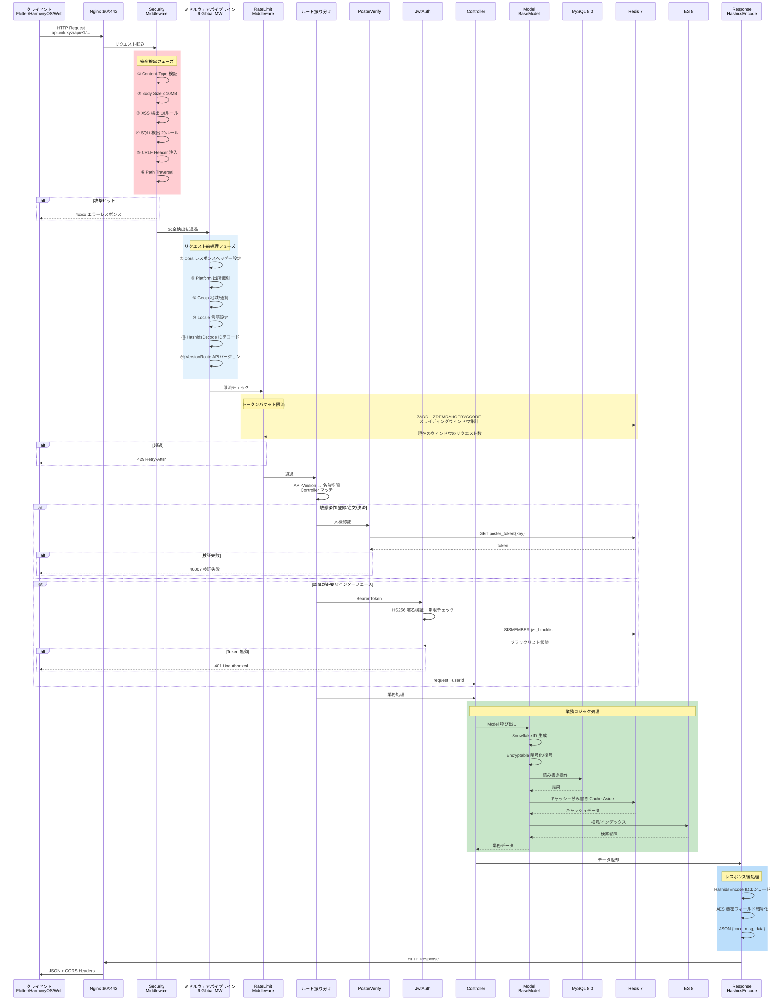

# 越境ECプラットフォーム — アーキテクチャ図集

Copyright (c) 2026 erik <erik@erik.xyz> — https://erik.xyz

---

## 一、システムアーキテクチャ図

---

## 二、リクエスト処理フロー図（ミドルウェアパイプライン）

---

## 三、機能モジュール全景図

---

## 四、リクエストライフサイクル図

---

## 五、注文ライフサイクル図

---

## 六、デプロイアーキテクチャ図

---

## 七、セキュリティアーキテクチャ図

### セキュリティ防護の総覧

| レイヤー | 防衛線 | 技術/パッケージ | 適用範囲 |
|------|------|---------|---------|
| 第1層 | ネットワーク境界 | Nginx SSL + リバースプロキシ + Host検証 | Service + Admin |
| 第2層 | WAF攻撃検知 | `erikwang2013/security-php` 31検出器 | XSS/SQLi/CRLF/パストラバーサル/XXE/SSRF/ファイルアップロード/メソッド/Host/Content-Type/Body など |
| 第3層 | トラフィック制御 | RateLimitMiddleware + ブルートフォース Redis カウンター | トークンバケット限流(6エンドポイント) + ログイン/登録の防爆 |
| 第4層 | 身元認証 | PosterVerify + JwtAuth HS256 | 人機認証(スライダー/パズル/クリック) + Bearer Token + デュアルトークン更新 |
| 第5層 | データセキュリティ | Hashids + AES-256-CBC + Encryptable | 三層暗号化: ID難読化/転送暗号化/DBフィールド暗号化 |
| 第6層 | レスポンスセキュリティ | HTTPセキュリティヘッダー + 機密マスキング | nosniff/DENY/XSS-Protection/Referrer-Policy/ログマスキング |
| 継続 | 監査と追跡 | PlatformMiddleware + OperationLogs | 8プラットフォーム出所追跡 + 6テーブル記録 + 操作ログ |

---

## 八、多通貨決済フロー図

### 多通貨決済の説明

**多通貨価格設定**：商品 SKU は `currency_code` ごとに通貨別で価格設定し、注文時に受取通貨（USD / EUR / GBP / CNY など）を確定します。

**為替レートサービス**：`erik_exchange_rates` レートテーブルは manual での手動メンテナンスと exchangerate-api の自動取得に対応し、`effective_at` の有効日時でバージョン管理、決済時は支払い時点のレートスナップショットを使用します。

**元通貨での引き落とし**：Stripe / PayPal / Klarna / Adyen は注文通貨で元通貨引き落とし、Webhook の署名検証で入金を確認後、支払いと注文のステータスを更新します。

**按分決済**：支払い成功後に `PlatformSettlements` プラットフォーム按分を自動生成（注文総額 + プラットフォーム手数料 + 決済ゲートウェイ手数料、注文通貨で記帳）；セラー決済 `MerchantSettlements`（注文金額 → 抽成率 → 決済金額）、サプライヤー決済 `SupplierSettlements`、販売代理店コミッション引き出し `AffiliatePayouts` の 4 系統を独立して決済し、ステータスは 0 未決済 / 1 決済済み。

**為替差損益**：`CurrencyExchangeGainsLosses` で受取通貨と決済通貨の差を追跡し、支払い時レートと決済時レートを比較、正の値 = 為替益、負の値 = 為替損となり、越境ECの多通貨照合と監査を支えます。

---

## 図例インデックス

| 番号 | 図名 | タイプ | 用途 |
|------|------|------|------|
| 一 | システムアーキテクチャ図 | アーキテクチャ図 | システム全体像を表示：クライアント→接入→アプリ→データ→外部サービス |
| 二 | リクエスト処理フロー図 | フロー図 | HTTP リクエストが 12 段のミドルウェアパイプライン(10グローバル+2ルート)を経由する完全経路を表示 |
| 三 | 機能モジュール全景図 | 機能図 | 17 の大機能モジュールとその細分化機能ポイントを表示 |
| 四 | リクエストライフサイクル図 | ライフサイクル | リクエストからレスポンスまでの完全シーケンスと各段階のインタラクションを表示 |
| 五 | 注文ライフサイクル図 | ライフサイクル | 注文がカートから完了/返金に至るすべての状態遷移を表示 |
| 六 | デプロイアーキテクチャ図 | アーキテクチャ図 | Docker Compose のコンテナオーケストレーション、ネットワーク、データボリュームを表示 |
| 七 | セキュリティアーキテクチャ図 | アーキテクチャ図 | 6 層の多層防御体系を表示：境界→WAF→トラフィック→認証→データ→レスポンス |
| 八 | 多通貨決済フロー図 | フロー図 | 通貨別価格設定→支払い→按分→決済→為替差損益の完全チェーンを表示 |
