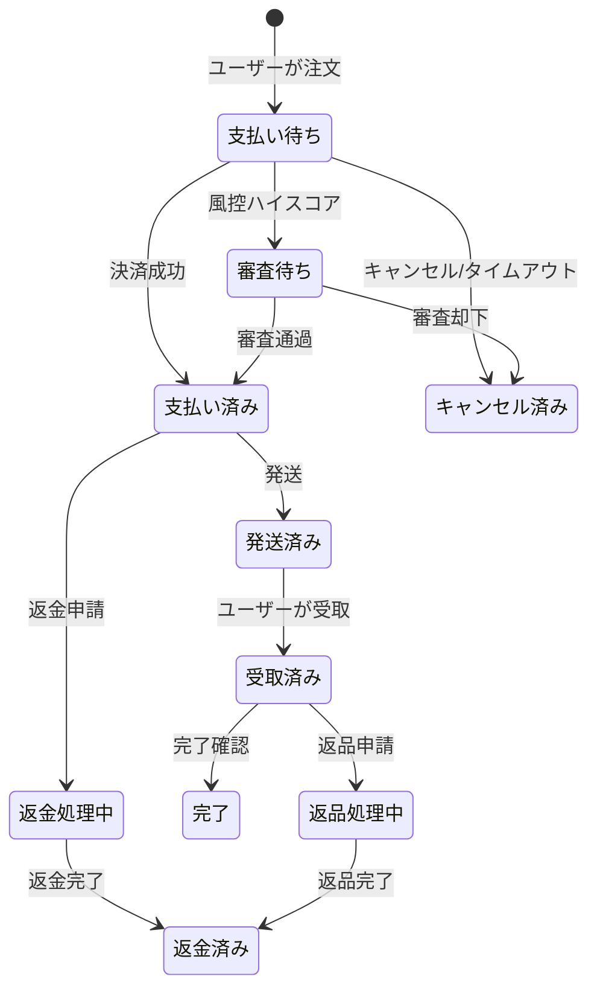
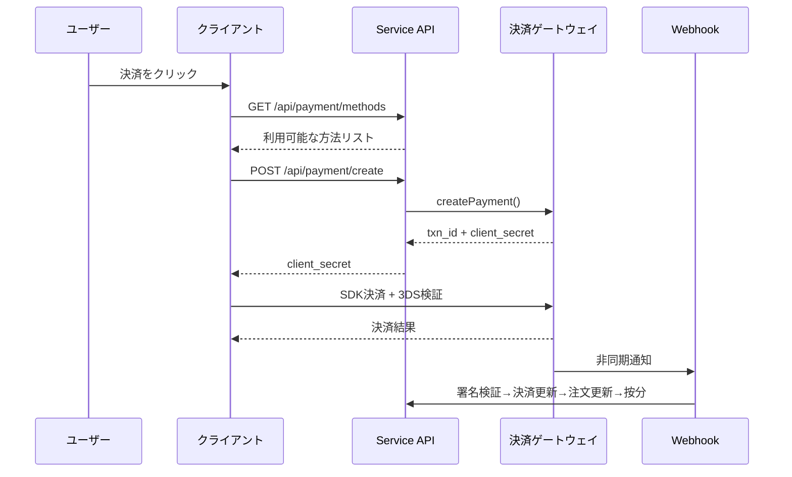
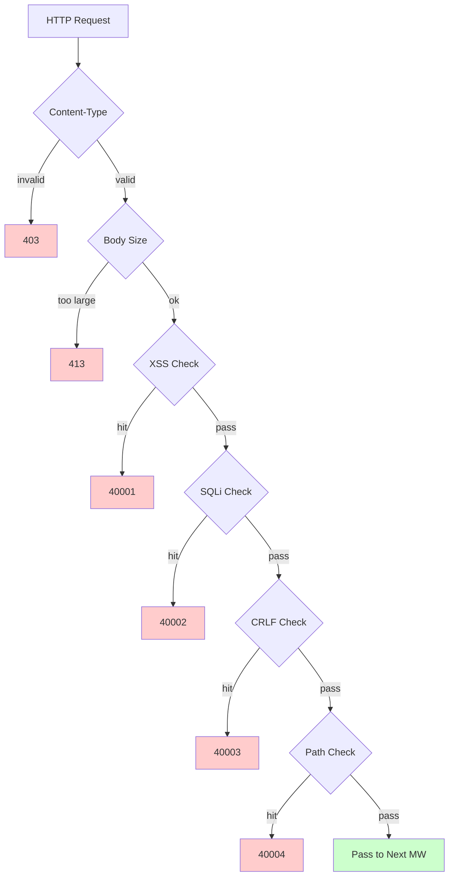

# 越境ECプラットフォーム — 機能設計ドキュメント

Copyright (c) 2026 erik <erik@erik.xyz> — https://erik.xyz

---


## プラットフォーム追跡

### 8プラットフォーム識別

| プラットフォーム | Header | Flutter | Admin |
|------|--------|---------|-------|
| iOS | `ios` | Platform.isIOS + TargetPlatform.iOS | UA iPhone |
| iPadOS | `ipados` | Platform.isIOS + !TargetPlatform.iOS | UA iPad |
| macOS | `macos` | Platform.isMacOS | UA Macintosh |
| Windows | `windows` | Platform.isWindows | UA Windows |
| Linux | `linux` | Platform.isLinux | UA Linux |
| Android | `android` | Platform.isAndroid | UA Android |
| HarmonyOS | `harmonyos` | — | UA HarmonyOS |
| Web | `web` | kIsWeb | デフォルト |

### DB追跡フィールド

| テーブル | フィールド | 説明 |
|----|------|------|
| erik_orders | platform VARCHAR(16) | 注文プラットフォーム |
| erik_payments | platform VARCHAR(16) | 決済プラットフォーム |
| erik_operation_logs | platform VARCHAR(16) | 操作プラットフォーム |
| erik_users | last_login_platform VARCHAR(16) | ログインプラットフォーム |
| erik_search_logs | platform VARCHAR(16) | 検索プラットフォーム |
| erik_chat_messages | platform VARCHAR(16) | メッセージの出所 |

## 1. 機能総覧

### 1.0 カバレッジ総覧

| 次元 | カバー内容 | 深さ |
|------|---------|------|
| **B2C小売** | 多言語商品、通貨別価格設定、SKU、カート、注文、決済(Stripe/PayPal/Klarna)、返金、返品 | 完全 |
| **B2B卸売** | 段階価格設定(MOQ)、法人認証(税番号/営業許可証)、見積もり照会 | 完全 |
| **多セラー出店** | セラー審査、商品審査、分成分账 | 完全 |
| **越境コンプライアンス** | HS Codeコード庫(6桁基碼)、関税ルール(目的国+HS→税率)、VAT/IOSS、コンプライアンスラベル(FDA/CE/RoHSなど10類) | 完全 |
| **国際物流** | 物流分区送料(重量段階)、DHL/UPS/FedEx/EMS、海外倉庫(発送+返品)、HS申告(電池/液体表示)、商業インボイスPDF/梱包明細 | 完全 |
| **決済** | Stripe PaymentIntent+3DS、PayPal REST、Klarna BNPL、Adyen、Webhook署名検証+按分 | Stripe完全、他はプレースホルダー |
| **マーケティング** | クーポン(分区+新規/既存客限定)、カルーセル(地域表示)、タイムセール(時間・数量限定)、グループ購入(成団人数+有効期限)、販売代理店(リンク+コミッション+引き出し) | 完全 |
| **多プラットフォーム** | Amazon/eBay/Shopee/Lazada/Temu商品刊登+注文集約、多店舗管理 | 完全 |
| **サプライチェーン** | サプライヤー档案+評価、購買注文(審査→発送→受取→品質検査)、品質検査(入庫+出庫ゲート/外観/機能/コンプライアンスラベル検査)、在庫台帳(不変台帳:入庫/出庫/調撥/棚卸) | 完全 |
| **風控コンプライアンス** | ルールエンジン(バイパス採点:アドレス検証/郵便番号一致/3DS/一括登録/貨物価額異常)、KYC実名、GDPR/CCPAデータリクエスト、Cookie Consentバージョン管理 | 完全 |
| **セキュリティ防護** | SecurityMiddleware が security-php の31検出器をカプセル化: XSS(13条)/SQLインジェクション(13条)/CRLF/パストラバーサル(エンコード+null byte)/Bodyサイズ/Content-Type/ファイルアップロード/HTTPセキュリティヘッダー/ブルートフォース(Redisカウンター)/XXE/SSRF/メソッド/Host/機密マスキング/CORS | 完全 |
| **高並行処理** | トークンバケット限流(スライディングウィンドウ+6エンドポイントルール)、DB読み書き分離(2リードレプリカ+sticky)、コネクションプール(DB 50/10+Redis 30/5)、OPCache(128MB, Docker環境) | 完全 |
| **会員成長** | 会員レベル+特典、ポイントルール+明細、ギフトカード(残高+引き換え)、値下げ/入荷通知、お気に入り、商品比較、閲覧履歴、サブスクリプション周期購、ABテスト(トラフィック分配+信頼度) | 完全 |
| **コンテンツ管理** | CMS多言語ページ(Landing/Blog)、FAQ多言語、知識庫多言語、サイズ換算表(衣料/靴+US/UK/EU/JP/CN変換)、メールテンプレート(多言語)、商品Feed(Google/Meta+定期同期) | 完全 |
| **カスタマーサポート** | WebSocketリアルタイムIM(chat_sessions/chat_messages)、知識庫多言語 | テーブル構造は完全、WSは実装待ち |
| **インフラ** | Snowflake分散ID(bigint非自增)、HashidsインターフェースID難読化、JWT認証(HS256+access/refreshデュアルトークン更新)、AES暗号化復号(インターフェース+DB三層暗号化)、GeoIP地域識別(MaxMind)、Poster人機認証(スライダー/パズル/クリック) | 完全 |
| **多端カバー** | Flutter 5プラットフォーム(iOS/Android/macOS/Windows/Linux/iPadOS) + HarmonyOS(ArkTS 9ページ) + Web Admin(LayUI+ECharts) + API | Flutter 25ファイル、HarmonyOS 14ファイル、Admin 239ファイル |
| **プラットフォーム追跡** | 8プラットフォーム識別(iOS/iPadOS/macOS/Windows/Linux/Android/HarmonyOS/Web)+X-Platform header+6テーブル記録(orders/payments/operation_logs/users/search_logs/chat_messages) | 完全 |
| **テスト** | 22 tests / 45 assertions — ALL PASS (SecurityTest 12: XSS+SQLi+XXE+SSRF+Path / JwtTest 4 / ApiResponseTest 3 / RedisFacadeTest 3) | ユニットテストは完全、統合テストは追加待ち |

### 1.1 モジュールマトリックス

| 一次モジュール | 二次モジュール | 優先度 | ステータス |
|---------|---------|--------|------|
| ユーザーシステム | 登録/ログイン/ソーシャルログイン/KYC実名/住所/お気に入り/会員/ポイント/ギフトカード | P0-P2 | ✅ |
| 商品システム | カテゴリ/SKU/多言語/多通貨/画像/属性/コンプライアンス/HS Code/ES検索/Feed | P0-P1 | ✅ |
| 取引システム | カート/注文/決済(Stripe+PayPal+Klarna)/返金/返品/インボイス | P0 | ✅ |
| 物流システム | 国際物流会社/分区送料/海外倉庫/発送(HS申告)/物流保険 | P0-P1 | ✅ |
| 税関税務 | HS Code庫/関税ルール/VAT/IOSS/各国コンプライアンス制限 | P0 | ✅ |
| マーケティングシステム | クーポン/カルーセル/タイムセール/グループ購入/販売代理店 | P1-P2 | ✅ |
| サプライチェーン | サプライヤー/購買注文/品質検査/在庫台帳 | P1 | ✅ |
| 風控コンプライアンス | ルールエンジン/GDPR/CCPA/Cookie Consent/プラットフォーム追跡 | P1 | ✅ |
| セキュリティ防護 | XSS/SQLインジェクション/CRLF/パストラバーサル/Content-Type/リクエストボディ | P0 | ✅ |
| 多プラットフォーム | Amazon/eBay/Shopee刊登+注文集約/多セラー出店 | P2 | ✅ |
| コンテンツ管理 | CMS/FAQ/知識庫/メールテンプレート/通知/サイズ表 | P2 | ✅ |
| 成長ツール | B2B卸売/サブスクリプション周期購/ABテスト | P2-P3 | ✅ |
| カスタマーサポート | WebSocketリアルタイムIM/知識庫 | P3 | ✅ |
| インフラ | Snowflake ID/JWT/Hashids/Encryption/Poster/APIバージョン/GeoIP | P0 | ✅ |

---

## 2. コア業務フロー図

### 2.1 注文ステートマシン



### 2.2 決済シーケンス



### 2.3 セキュリティ検知パイプライン



---

## 3. コア業務フロー

### 3.1 ユーザー登録ログイン

```
EMAIL登録: email+password → PosterVerify人機認証 → bcrypt(password+salt)
          → SnowflakeでID生成 → JWT {access_token, expires_in} を返す

ソーシャルログイン: Google/Apple/Facebook OAuth → id_token を検証
        → erik_user_social_accounts で紐付け確認
        → 紐付け済み:ログイン / 未紐付け:ユーザー自動作成+紐付け → JWTを返す

ログイン: email+password → password_verify(password+salt)
    → last_login_at/ip/platform を更新 → JWTを発行

Token更新: refresh_token → Jwt::decode → 新しい access_token
```

### 3.2 商品閲覧と検索

```
リスト: GET /api/products
  → フィルタ: category_id/status/keyword/price_range
  → 並び順: default/price_asc/price_desc/sales/newest
  → 多言語: ProductTranslations を locale でフィルタ
  → 通貨別: ProductSkuPrices を currency_code でマッチ
  → ページング: 20件/ページ

ES検索: GET /api/search?keyword=xxx
  → Erikwang2013\WebmanScout\Searchable → ES多言語アナライザー
  → 集約: category/price/brand
  → フォールバック: ES利用不可時はMySQL LIKE

詳細: GET /api/products/{hashid}
  → HashidsDecodeミドルウェアでデコード → Eager Load
  → 多言語+通貨別+コンプライアンス+HS Code+サイズ変換+税込/税別+VAT
```

### 3.3 カートと注文

```
カート: POST /api/cart {sku_id, quantity}
  → SKUの存在|出品中|在庫充足を検証
  → 同一SKUは加算 / 無ければ新規作成

注文: POST /api/orders {address_id, coupon_id, currency_code}
  → 1.受取住所を検証 → 2.カート選択済みを取得 → 3.商品ごとに検証(在庫+コンプライアンス)
  → 4.価格を計算(通貨別+クーポン) → 5.注文番号を生成
  → 6.Order+OrderItemsを作成 → 7.在庫を減算 → 8.OrderLogを書き込み
  → 9.風控採点(RiskEngine::score) → 10.購入済みカートをクリア

キャンセル: POST /api/orders/{id}/cancel
  → 状態=0(支払い待ち)を検証 → 在庫を戻す → status=5(キャンセル済み)
```

### 3.4 決済フロー

```
利用可能な方法: GET /api/payment/methods?country=DE&currency=EUR
  → PaymentGatewayMethods(country+currencyでフィルタ)

決済作成: POST /api/payment/create
  → PaymentGateway::make(gateway)→createPayment()
  → Stripe: PaymentIntent → client_secret → フロントSDK(+3DS)

Webhook: POST /webhook/payment/stripe
  → 署名検証 → payment_intent.succeeded:
     → Payment.status=支払い済み → Order.status=支払い済み
     → PlatformSettlement(プラットフォーム手数料+ゲートウェイ費+サプライヤー+販売代理店)
```

### 3.5 返品フロー

```
申請: POST /api/returns {order_id, reason_id}
  → 返品チャネルを判定: 現地倉(type=1)/国内返送(type=2)/返金のみ(type=3)

審査: Admin審査 → 通過:ReturnLabelを生成 / 却下:理由を記録

返送: ラベルをダウンロード→返送→物流更新→倉庫が受取→status=受取済み

返金: status=完了 → 関連Refund → PaymentGateway::refund→元の経路で返金
```

### 3.6 関税見積もり

```
GET /api/tariff/estimate?product_id=xxx&dest_country_id=xxx&declared_value=100

1. ProductHsCodes → HsCode
2. TariffRules(dest_country_id + hs_code_id) → duty_rate + duty_free_threshold
3. VatSettings(country_id) → vat_rate + vat_free_threshold
4. duty = value>=threshold ? value*duty_rate/100 : 0
   vat = (value+duty)>=threshold ? (value+duty)*vat_rate/100 : 0
5. return {duty_rate, vat_rate, estimated_duty, estimated_vat, estimated_total, hs_code, disclaimer}
```

---

## 4. セキュリティ防護 (SecurityMiddleware が security-php の31検出器をカプセル化)

### 4.1 検知ルール総表

| # | 攻撃タイプ | 主な検知方法 | エラーコード | Service | Admin |
|---|---------|------------|--------|---------|-------|
| 1 | XSSクロスサイトスクリプティング | 13条の正規表現: script/iframe/onイベント/svg+on/style/expression/javascript:/embed/object/link/meta | 40001 | ✅ | ✅ |
| 2 | SQLインジェクション | 13条の正規表現: UNION SELECT/SELECT FROM WHERE/sleep/benchmark/pg_sleep/ブール型/文字列型/コメント記号/MySQL特殊コメント/schema列挙/load_file/into outfile/ストアドプロシージャ/waitfor/delay | 40002 | ✅ | ✅ |
| 3 | CRLFヘッダーインジェクション | `[\r\n]` in: Authorization/X-Platform/API-Version/X-Forwarded-For/Referer/Origin | 40003 | ✅ | ✅ |
| 4 | パストラバーサル | `../` + `%2e%2f`エンコード + `%252e%252f`二重エンコード + null byte `\0` + `.env`/`.git`/`phpmyadmin`/`wp-admin`/`/etc/`/`/proc/`/`composer.json` | 40004 | ✅ | ✅ |
| 5 | リクエストボディ制限 | Content-Length > 10MB(Service) / 20MB(Admin) | 40005 | ✅ | ✅ |
| 6 | Content-Type制限 | JSON/form-data/form-urlencoded のみ | 40006 | ✅ | ✅ |
| 7 | **ファイルアップロード検証** | ブラックリスト拡張子(php/phtml/sh/exe/js/...)+二重拡張子攻撃+空拡張子 | 40009 | ✅ | ✅ |
| 8 | **HTTPセキュリティレスポンスヘッダー** | nosniff/DENY/XSS-Protection/Referrer-Policy/Permissions-Policy/Cache-Control/Server非表示 | — | ✅ | ✅ |
| 9 | **ブルートフォース防護** | Redisカウンター: API 10回/60s, Admin 5回/300s | 40008 | ✅ | ✅ |
| 10 | **XXEエンティティインジェクション** | `<!ENTITY SYSTEM>`, `<!DOCTYPE [` | 40010 | ✅ | ✅ |
| 11 | **SSRFサーバーサイドリクエストフォージェリ** | 内部IP(127/10/172.16/192.168/0.0/169.254.169.254)+localhost+metadata.google.internal | 40011 | ✅ | ✅ |
| 12 | **HTTPメソッド検証** | GET/POST/PUT/DELETE/PATCH/OPTIONS/HEAD のみ | 40012 | ✅ | ✅ |
| 13 | **Hostヘッダー検証** | ベアIPでの直接アクセスを拒否 | 40013 | ✅ | — |
| 14 | **機密データマスキング** | ログ/エラーレスポンスで password/token/secret をフィルタ | — | ✅ | ✅ |
| 15 | **CORSホワイトリスト** | 設定可能な origin 制限 | — | ⚠️ | ⚠️ |

### 4.2 ミドルウェアパイプライン

```
Service: Cors → Security → Platform → GeoIp → Locale → HashidsDecode
        → VersionRoute → (PosterVerify) → (JwtAuth) → HashidsEncode

Admin: Security → Platform → HashidsDecode → AccessControl → HashidsEncode
```

### 4.3 プラットフォーム出所追跡

| プラットフォーム | Header値 | 識別方法 |
|------|---------|---------|
| iOS | `ios` | Flutter `Platform.isIOS` |
| iPadOS | `ipados` | Flutter `TargetPlatform.iOS` 判定 |
| macOS | `macos` | Flutter `Platform.isMacOS` |
| Windows | `windows` | Flutter `Platform.isWindows` |
| Linux | `linux` | Flutter `Platform.isLinux` |
| Android | `android` | Flutter `Platform.isAndroid` |
| HarmonyOS | `harmonyos` | ArkTS ハードコード |
| Web | `web` | UA フォールバック / デフォルト |

---


## 5. 高並行処理とパフォーマンス

### 5.1 限流ルール

| エンドポイント | アルゴリズム | ウィンドウ | 制限 |
|------|------|------|------|
| /api/auth/login | スライディングウィンドウ | 60s | 10回 |
| /api/auth/register | スライディングウィンドウ | 300s | 5回 |
| /api/payment | スライディングウィンドウ | 60s | 5回 |
| /api/orders | スライディングウィンドウ | 10s | 3回 |
| /api/search | スライディングウィンドウ | 1s | 10回 |
| デフォルト | スライディングウィンドウ | 60s | 100回 |

### 5.2 Redis の用途

| 用途 | 実装 |
|------|------|
| 限流トークンバケット | Redis ZSET スライディングウィンドウ |
| 人機認証 | PosterVerify 認証コード状態 |
| Session 保存 | Redis KV ストレージ |

業務データはアプリケーション層キャッシュをせず、MySQL を直接読み取ります（読み書き分離 + コネクションプール）。

### 5.3 コネクションプール

| リソース | 最大 | 最小 | タイムアウト |
|------|------|------|------|
| MySQL | 50 | 10 | 2s |
| Redis | 30 | 5 | — |

## 6. データテーブル関係図

```
erik_users ──┬── addresses, social_accounts, wishlists, kyc
             ├── carts, orders → order_items → payments
             ├── reviews, coupons(through user_coupons)
             ├── notifications, subscriptions, point_logs
             ├── affiliate_links, chat_sessions, b2b_verifications
             └── privacy_requests

erik_products ──┬── translations(product_id, locale)
                ├── skus → sku_prices(sku_id, currency_code)
                ├── images, reviews, compliance → compliance_categories
                ├── hs_codes → hs_codes, recommendations
                ├── b2b_prices, platform_listings
                └── product_comparisons

erik_orders ──┬── order_items, order_logs
              ├── payments, refunds, return_orders → return_labels
              ├── order_documents, shipments
              ├── platform_settlements, risk_logs
              └── subscription_orders

erik_countries ──┬── vat_settings, tariff_rules(dest_country_id)
                 ├── country_compliance_rules
                 ├── shipping_zones(JSON countries)
                 └── warehouses(country_id)
```

---

## 7. APIインターフェース

完全な API エンドポイント一覧（公開インターフェース 23 個 + 認証インターフェース 47 個 + Webhook + Admin/Health）については、[APIインターフェースドキュメント](api.md) を参照。

---

## 8. テスト検証

```bash
cd service && php vendor/bin/phpunit tests/
```

| テストクラス | Tests | カバー内容 |
|--------|-------|------|
| SecurityTest | 12 | XSS(3条)+SQLi(2条)+XXE(2条)+SSRF(1条)+Path(2条)+カード情報漏洩(1条)+正常通過(1条) |
| JwtTest | 4 | encode三段式JWT + decode往復 + 無効token→null + 空token→null |
| ApiResponseTest | 3 | success(code=0) + fail(error code) + paginate(list+metaページング) |
| RedisFacadeTest | 3 | ping + set/get往復 + redis() ヘルパー関数（Redis 利用不可時は skip） |
| **合計** | **22** | **45 assertions — ALL PASS** |
