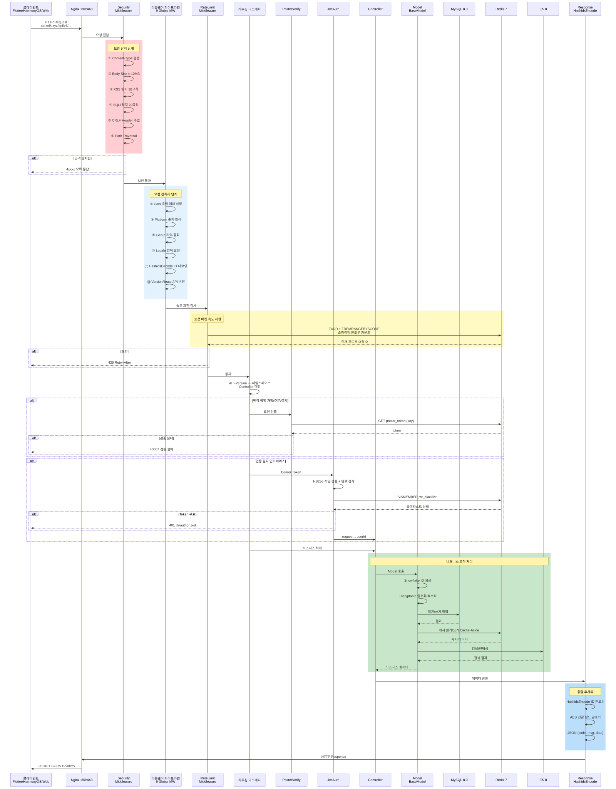

> 이 문서는 원본 중국어 문서의 기계 번역입니다. 원문은 [中文原版](../../../README.md)을 참조하세요.

# Erik Shop — 크로스보더 전자상거래 플랫폼 전체판(Full)

Copyright (c) 2026 erik <erik@erik.xyz> — https://erik.xyz

## 버전

> 간소화판 (MIT 오픈소스): `lite` | 표준판 (상용): `standard` | 전체판 (상용): `full`
>
> 상용 라이선스 문의: **erik@erik.xyz** | 버전 비교: [VERSIONS.md](VERSIONS.md)

## 언어 / Languages

| 언어 | 링크 |
|------|------|
| 중국어 | [README.md](../../../README.md) |
| 영어 | [docs/i18n/en/README.md](../en/README.md) |
| 한국어 | [docs/i18n/ko/README.md](../ko/README.md) |
| 러시아어 | [docs/i18n/ru/README.md](../ru/README.md) |
| 독일어 | [docs/i18n/de/README.md](../de/README.md) |
| 프랑스어 | [docs/i18n/fr/README.md](../fr/README.md) |
| 스페인어 | [docs/i18n/es/README.md](../es/README.md) |
| 포르투갈어 | [docs/i18n/pt/README.md](../pt/README.md) |
| 힌디어 | [docs/i18n/hi/README.md](../hi/README.md) |
| 아랍어 | [docs/i18n/ar/README.md](../ar/README.md) |
| 벵골어 | [docs/i18n/bn/README.md](../bn/README.md) |
| 인도네시아어 | [docs/i18n/id/README.md](../id/README.md) |
| 일본어 | [docs/i18n/ja/README.md](../ja/README.md) |

## 프로젝트 소개

webman 풀스택 제품군 기반의 풀스택 크로스보더 전자상거래 플랫폼으로, B2C/B2B 시나리오와 제3자 셀러 입점을 지원합니다.

### 기술 아키텍처

| 계층 | 기술 | 디렉터리 |
|------|------|------|
| 비즈니스 API | webman + illuminate/database + erikwang2013/* | `service/` |
| 관리 백엔드 | webman-admin + LayUI + ECharts | `admin/` |
| 클라이언트 | Flutter (iOS/Android/macOS/Windows/Linux) | `apps/flutter/` |
| HarmonyOS 클라이언트 | ArkTS + ArkUI (HarmonyOS NEXT) | `apps/harmonyos/` |

### 기술 스택

**서버:** PHP 8.3+, webman 2.1, MySQL 8.0, Redis 7, Elasticsearch 8
**핵심 패키지:** snowflake-php, hashids, jwt-webman, encryption, encryptable, poster-php, webman-scout, season
**결제:** Stripe, PayPal（완전 지원）；Klarna, Adyen（플레이스홀더, `PaymentGateway::make` 미구현, PLAN.md 참조）
**클라이언트:** Flutter 3.x (Riverpod + GoRouter + Dio), HarmonyOS API 12+ (ArkTS + ArkUI)

## 아키텍처 다이어그램

> 전체 다이어그램 및 확대 보기: [diagrams.md](diagrams.md)

### 시스템 아키텍처 다이어그램


### 요청 처리 흐름도


### 기능 모듈 전체도


### 요청 라이프사이클 다이어그램



> 더 자세한 내용은 [전체 아키텍처 다이어그램](diagrams.md) 참조（주문 라이프사이클, 배포 아키텍처, 보안 아키텍처, 다중 통화 결제 등 8개 다이어그램 포함）

### 보안 아키텍처 다이어그램



### 다중 통화 결제 흐름도


### 다중 통화 결제 설명

**다중 통화 가격 책정**: 상품 SKU를 `currency_code`별로 통화 단위 가격을 책정하며, 주문 시 결제 통화(USD / EUR / GBP / CNY 등)를 고정합니다.

**환율 서비스**: `erik_exchange_rates` 환율 테이블은 manual 수동 유지보수와 exchangerate-api 자동 연동을 지원하며, `effective_at` 적용 시점 기준으로 버전 관리되고, 결제 시점의 환율 스냅샷을 기준으로 정산합니다.

**원화 표시 통화 차감**: Stripe / PayPal은 주문 통화 기준 원화 그대로 차감하며(Klarna/Adyen은 플레이스홀더로 미연동), Webhook 서명 검증으로 입금을 확인한 후 결제 및 주문 상태를 업데이트합니다.

**분배 정산**: 결제 성공 후 자동으로 `PlatformSettlements` 플랫폼 분배(주문 총액 + 플랫폼 수수료 + 결제 게이트웨이 수수료, 주문 통화로 기장)가 생성됩니다. 셀러 정산 `MerchantSettlements`(주문 금액 → 수수료율 → 정산 금액), 공급업체 정산 `SupplierSettlements`, 유통 커미션 출금 `AffiliatePayouts` 4개 라인이 독립적으로 정산되며, 상태 0 정산 대기 / 1 정산 완료입니다.

**환차손익**: `CurrencyExchangeGainsLosses`가 결제 통화와 정산 통화의 차이를 추적하며, 결제 시점 환율과 정산 시점 환율을 비교합니다. 양수 = 환차익, 음수 = 환차손으로, 크로스보더 전자상거래 다중 통화 대사 및 감사를 지원합니다.

## 빠른 시작

### 방법 1: 웹 원클릭 설치 (권장)

```bash
# 1. admin 의존성 설치
cd admin && composer install

# 2. 관리 백엔드 시작
php start.php start -d

# 3. 브라우저에서 설치 마법사 열기
# http://127.0.0.1:8788/app/admin/install/step1
# 데이터베이스 정보 입력 → 관리자 계정 설정 → 완료

# 4. 의존성 설치 후 API 시작
cd ../service && composer install && php start.php start -d
```

> 설치 마법사가 자동 완성: DB 생성 → 117개 테이블 임포트 → service/.env 및 admin/.env 생성（랜덤 키 포함） → 관리자 생성 → 서비스 리로드

### 방법 2: 커맨드라인 수동 설치

자세한 내용은 [INSTALL.md](../../INSTALL.md) 참조

### Docker 배포

```bash
# 환경 변수 설정
cp .env.example .env  # 또는 DB_PASS / JWT_SECRET 등 변수 설정

# 전체 서비스 원클릭 시작
docker-compose up -d
# nginx:80 → service:8787 + admin:8788
# MySQL:3306, Redis:6379, ES:9200
```

자세한 내용은 [배포 문서](deployment.md) 참조

## 프로젝트 구조

```
shop-php/
  install.sql       # 원클릭 설치 SQL（117개 테이블）, Web 설치 마법사 자동 임포트
  service/          PHP 비즈니스 API (webman)        — 39개 컨트롤러 + 111개 모델 + 14개 미들웨어
  admin/            관리 백엔드 (webman-admin)      — 82개 컨트롤러 + 76개 모델 + ECharts 대시보드 + Web 설치 마법사
  apps/flutter/     Flutter 클라이언트              — 11개 페이지 + 5개 언어 + PC 반응형
  apps/harmonyos/   HarmonyOS 클라이언트            — 9개 페이지 + ArkTS
  docker/           Docker 배포                  — Nginx + PHP + MySQL + Redis + ES
  docs/             설계 문서
```

## 기능 범위

| 차원 | 커버 내용 |
|------|---------|
| **B2C 소매** | 다국어 상품, 통화별 가격, SKU, 장바구니, 주문, 결제, 환불, 반품 |
| **B2B 도매** | 계단형 가격(MOQ), 기업 인증(사업자번호/사업자등록증), 견적 요청 |
| **다중 셀러 입점** | 셀러 심사, 상품 심사, 수익 분배 정산 |
| **크로스보더 컴플라이언스** | HS Code 코드 라이브러리, 관세 규칙, VAT/IOSS, 국가별 컴플라이언스 라벨(FDA/CE/RoHS) |
| **국제 물류** | 물류 존별 운임, 해외 창고(출하창고+반품창고), 상업 송장/포장 명세서, HS 신고（계획 중） |
| **결제** | Stripe/PayPal（완전 지원）, Klarna/Adyen（플레이스홀더）, BNPL 선구매 후결제（플레이스홀더）, 3DS 인증 |
| **마케팅** | 쿠폰(존별+신규/기존 고객), 캐러셀 배너(지역별 노출), 플래시 세일, 공동구매, 유통(링크+커미션+출금) |
| **다중 플랫폼** | Amazon/eBay/Shopee/Lazada/Temu 상품 등록 + 주문 집계 |
| **공급망** | 공급업체 등급, 구매→검품→입고, 재고 거래 내역(불변 장부), 이관 |
| **리스크 컴플라이언스** | 규칙 엔진(바이패스 스코어링), KYC 실명 인증, GDPR/CCPA 데이터 요청, Cookie Consent |
| **보안 방어** | 31종 공격 탐지(XSS/SQL 인젝션/XXE/SSRF/CRLF/경로 탐색/파일 업로드/무차별 대입/HTTP 메서드/Host/CORS 등) |
| **고성능** | 토큰 버킷 속도 제한, 서킷 브레이커(결제/소셜 로그인, 5회 실패→30s 차단+반개 복구), DB 읽기/쓰기 분리, 커넥션 풀 최적화 |
| **CDN** | 멀티 프로바이더 Origin-Pull (Cloudflare/CloudFront/Aliyun/Tencent), `Cdn::url()`이 `https://{CDN_DOMAIN}{path}`로 재작성, admin CDN 관리 페이지(Config/Purge/Logs), 자동 purge fail-open, 엣지 캐시 7일 immutable |
| **회원 성장** | 포인트 규칙, 회원 등급 혜택, 기프트 카드, 가격 인하 알림, 구독 정기 구매, AB 테스트 |
| **콘텐츠 관리** | CMS 다국어 페이지, FAQ, 지식 베이스, 사이즈 표, 이메일 템플릿, 상품 Feed 동기화 |
| **고객 서비스** | WebSocket 실시간 IM, 지식 베이스(테이블 구조 생성 완료) |
| **인프라** | Snowflake 분산 ID, Hashids 인터페이스 난독화, JWT 인증, AES 암호화, GeoIP 지역 식별 |
| **다중 단말 지원** | Flutter(iOS/Android/macOS/Windows/Linux/iPadOS)+HarmonyOS(ArkTS)+Web Admin |
| **플랫폼 추적** | 8개 플랫폼 출처 식별(iOS/iPadOS/macOS/Windows/Linux/Android/HarmonyOS/Web)+DB 기록 |
| **테스트** | 22 tests / 45 assertions — ALL PASS (Security+Jwt+ApiResponse+Redis) |

## 핵심 설계

- **Snowflake 기본 키**: 117개 테이블 모두 `erikwang2013/snowflake-php`가 생성한 bigint ID 사용
- **Hashids 인터페이스**: 미들웨어가 자동 인코딩/디코딩, 컨트롤러 무감지
- **Encryptable 암호화**: email/mobile/address 등 민감 필드 데이터베이스 레벨 암호화
- **JWT 인증**: HS256 + access/refresh 이중 토큰 자동 갱신
- **API 버전**: `API-Version` 헤더 라우팅, URL에 없음
- **Poster 검증**: 민감 작업(가입/주문/결제) 랜덤 휴먼 인증

## 문서

| 문서 | 설명 |
|------|------|
| [README-EN.md](../../README-EN.md) | English documentation |
| [INSTALL.md](../../INSTALL.md) | 설치 가이드（Web 원클릭 설치 + 수동 설치） |
| [AUDIT-REPORT.md](../../AUDIT-REPORT.md) | 설치 시스템 감사 보고서 |
| [프로젝트 계획](PLAN.md) | 팀이 산출한 단계별 프로젝트 계획（4단계 로드맵 + 핵심 리스크 + Quick Wins） |
| [팀 조사 상세](PLAN-RESEARCH.md) | 7개 영역 현황 조사: 구현됨 / 격차 / 리스크 / 제안 |
| [기능 설계 문서](features.md) | 완전한 기능 매트릭스, 비즈니스 프로세스, 상태 머신 |
| [아키텍처 다이어그램](diagrams.md) | 아키텍처 다이어그램, 흐름도, 기능 다이어그램, 라이프사이클 다이어그램, 배포 다이어그램, 다중 통화 결제 다이어그램（8개 Mermaid 다이어그램） |
| [아키텍처 설계 문서](architecture-full.md) | 시스템 아키텍처 다이어그램, 미들웨어 파이프라인, 데이터 아키텍처, 보안 아키텍처, 결제 아키텍처 |
| [설계 문서](design.md) | 데이터베이스 테이블 설계, API 규범, 보안 설계, 국제화 |
| [아키텍처 문서](architecture.md) | 디렉터리 구조, 모델 상속 체인, 핵심 패키지 |
| [API 인터페이스 문서](api.md) | 71개 API 엔드포인트 (정적 문서) |
| [hg/apidoc 인터페이스 문서](http://localhost:8787/apidoc/) | hg/apidoc 자동 생성 (6개 그룹: 인증/상품/거래/물류 통관/사용자 마케팅/운영) |
| [배포 문서](deployment.md) | Docker/수동 배포, 환경 변수(CDN 포함), 운영 명령어 |


## 오픈소스는 쉽지 않습니다, 응원 부탁드립니다

| 위챗 | 알리페이 |
|:---:|:---:|
|  |  |

### 글로벌 은행 송금 (ZA Bank)

**수취인 정보**

- 수취인 이름：WANG KEXUN
- 수취 계좌 번호：881015918251

**수취 은행**

- SWIFT Code：AABLHKHHXXX
- 은행 이름：ZA Bank Limited
- 은행 번호：387
- 은행 주소：Core F, Cyberport 3, 100 Cyberport Road, Hong Kong

**해외 송금 대리 은행 (필요 시)**

> 이는 해외 송금 대리 은행(중개 은행) 정보로, 수취 은행 정보가 아닙니다. 송금 은행에 제공 필요 여부를 문의하세요.

- **홍콩 달러, 위안화 및 미국 달러 입금**（대리 은행 Citibank）：
  - 은행 이름：Citibank N.A. Hong Kong
  - SWIFT Code：CITIHKHXXXX
  - 은행 번호：006
  - 지점 이름：Hong Kong Branch
  - 지점 번호：391
  - 은행 주소：Citibank Tower, Citibank Plaza, 3 Garden Road, Central, Hong Kong
- **기타 통화 입금**（대리 은행 BNY Mellon）：
  - 은행 이름：THE BANK OF NEW YORK MELLON
  - SWIFT Code：IRVTUS3NXXX
  - 은행 주소：THE BANK OF NEW YORK MELLON, 240 GREENWICH STREET, NEW YORK, United States

### 암호화폐 후원 (Crypto Donation)

이 프로젝트가 도움이 되셨다면, QR 코드를 스캔하여 후원해 주세요. 감사합니다!

| <br>**BNB Smart Chain (BEP20)**<br>`0x355d429f97511897ccb4e271ec888205f9ab6629` | <br>**Tron (TRC20)**<br>`TEdDHWLajt1XvqtPDWmQctdrJaC3pzZZzz` |
| <br>**Ethereum (ERC20)**<br>`0x355d429f97511897ccb4e271ec888205f9ab6629` | <br>**Aptos**<br>`0x836e3780edfc3f7b2372b39e2a1a3a5d7adfaccd96c726f21cfde1b50dd68030` |
| <br>**Plasma**<br>`0x355d429f97511897ccb4e271ec888205f9ab6629` | <br>**Polygon POS**<br>`0x355d429f97511897ccb4e271ec888205f9ab6629` |
| <br>**Solana**<br>`2hfhboHdmdrYsY25XfQSsEWxq5ip4EQsR7f4AzSRMUyr` | <br>**The Open Network (TON)**<br>`UQB9kFQohzmXUir9QSSZq01iwl9aQZIDdBpNmDklljRtCoGK` |
| <br>**Arbitrum One**<br>`0x355d429f97511897ccb4e271ec888205f9ab6629` | <br>**AVAX C-Chain**<br>`0x355d429f97511897ccb4e271ec888205f9ab6629` |

---


## 테스트

```bash
make test             # 권장 방식
cd service && php vendor/bin/phpunit tests/   # 네이티브 명령
# 22 tests, 45 assertions — ALL PASS

# 의존성 보안 감사（알려진 저위험 CVE 1건: CVE-2025-45769 firebase/php-jwt <7.0.0,
# jwt-webman ^6.0 제약으로 업그레이드 불가, HS256 대칭 서명 사용 방식은 영향 없음）
composer audit
```

## 개발 도구

```bash
make help             # 모든 명령어 보기
make lint             # PHP 문법 검사
make check            # phpstan 정적 분석
make fix              # php-cs-fixer 코드 포맷팅
```

CI/CD: `.github/workflows/ci.yml` — PHP 8.3/8.4 매트릭스 테스트

## License

Copyright (c) 2026 erik <erik@erik.xyz> — https://erik.xyz
