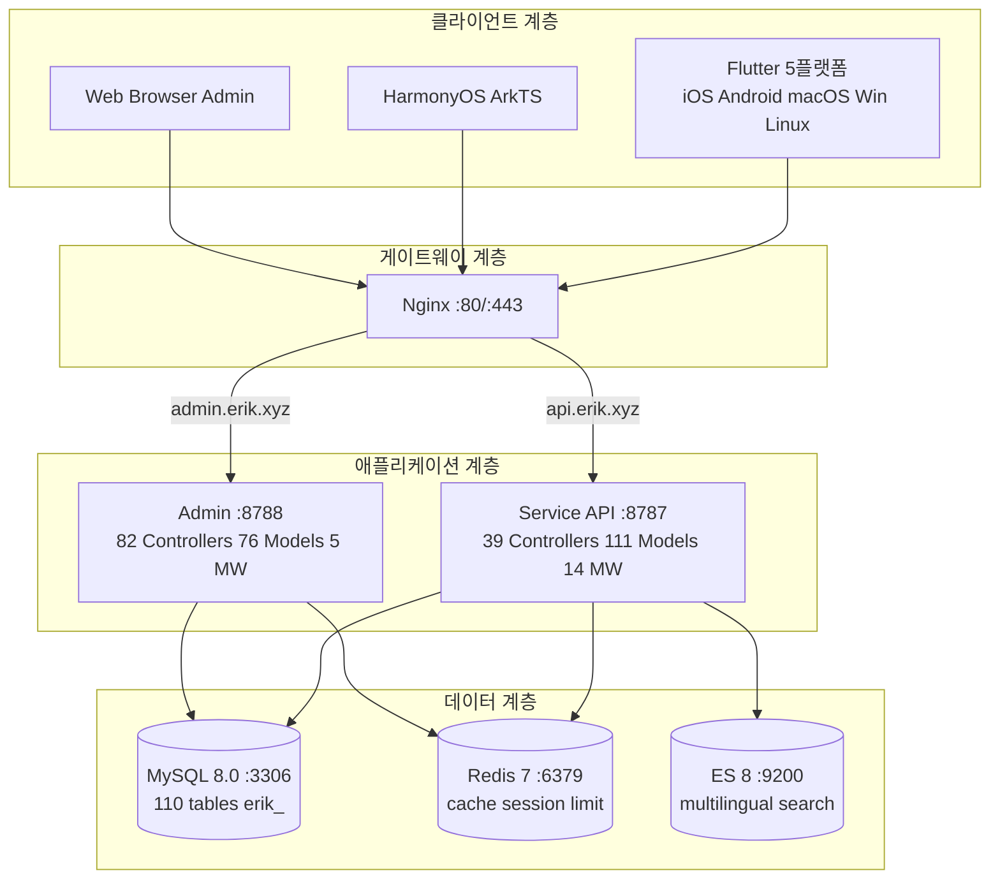
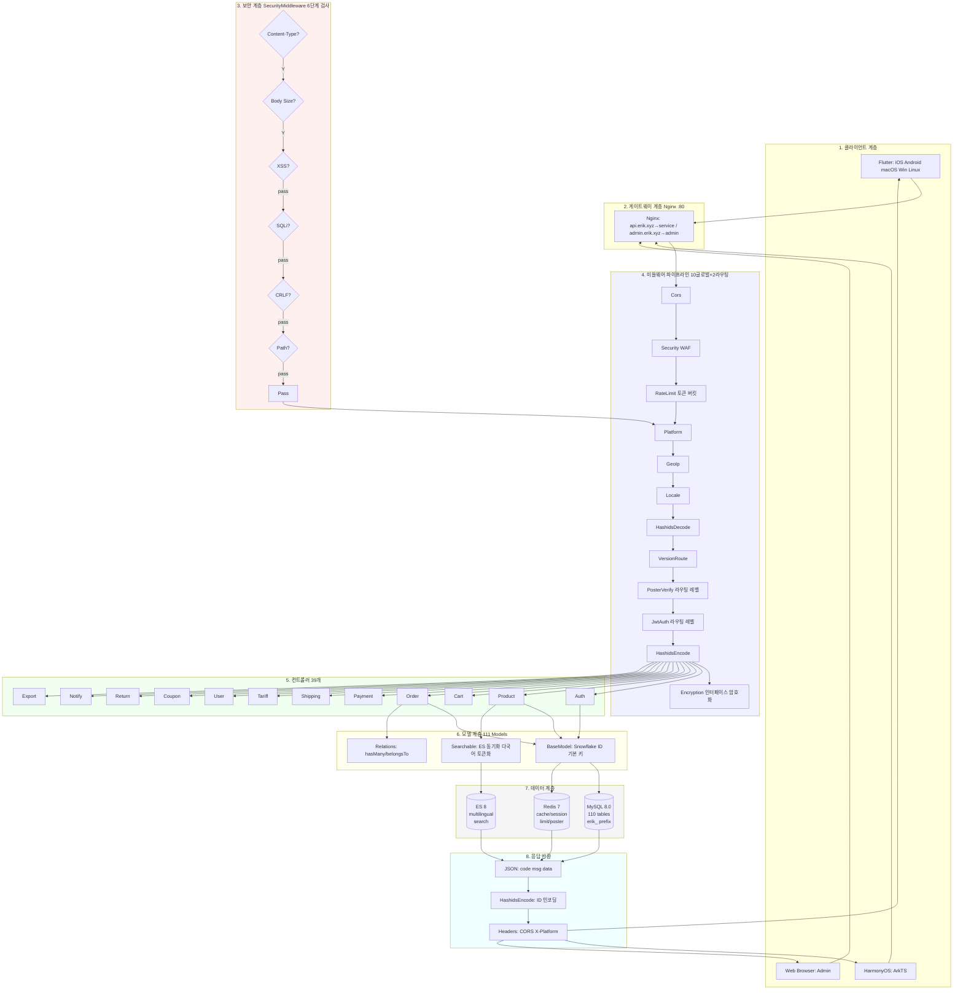
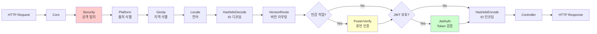
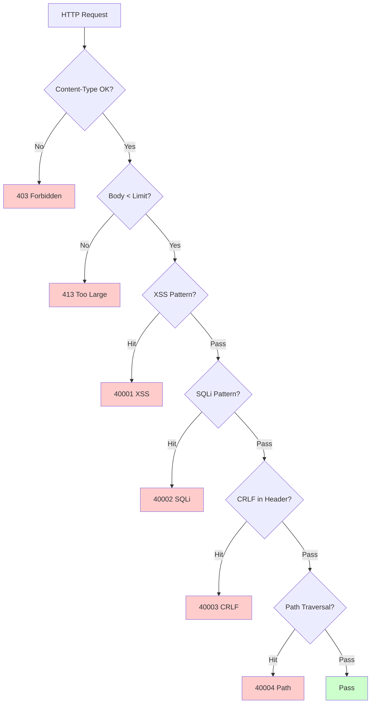
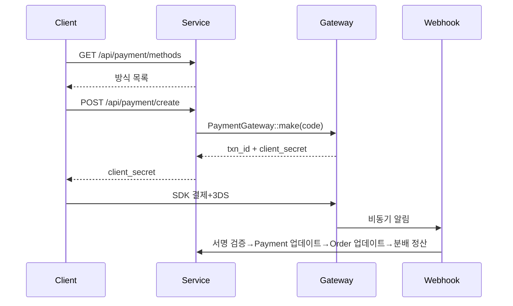
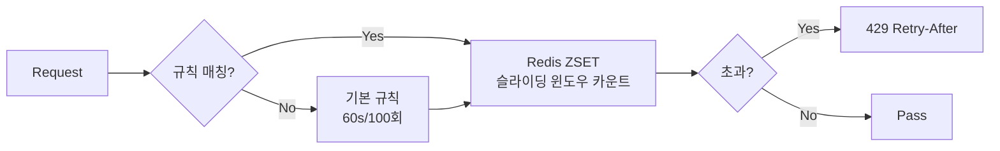

# 크로스보더 전자상거래 플랫폼 — 아키텍처 설계 문서

Copyright (c) 2026 erik <erik@erik.xyz> — https://erik.xyz

---

## 1. 시스템 개요

### 1.1 포지셔닝

webman 고성능 프레임워크 기반의 풀스택 크로스보더 전자상거래 플랫폼으로, B2C, B2B, 제3자 셀러 입점을 지원합니다.

| 컴포넌트 | 기술 스택 | 규모 |
|------|--------|------|
| Service API | PHP 8.3 / webman 2.1 / illuminate database | 39컨트롤러 + 111모델 + 14미들웨어 |
| Admin | webman-admin / LayUI / ECharts | 82컨트롤러 + 76모델 + 5미들웨어 |
| Flutter | Riverpod / GoRouter / Dio | 25 Dart파일 / 11페이지 |
| HarmonyOS | ArkTS / ArkUI | 14 ETS파일 / 9페이지 |
| 데이터베이스 | MySQL 8.0 + Redis 7 + ES 8 | 117개 테이블 (110 `erik_` + 7 `wa_`) |

### 1.2 핵심 지표

| 지표 | 값 |
|------|-----|
| API P99 | <200ms |
| 동시성 | 10000+ (32 worker 상주 메모리) |
| 테이블 수 | 110 |
| 엔드포인트 | 73 |
| 미들웨어 | 14 (service:10글로벌+2라우팅+AdminKey+StaticFile / admin:4글로벌+1내장) |
| 언어 | zh_CN, zh_HK, en, ja, ko |
| 통화 | 19종 독립 가격 책정 |
| 결제 | Stripe / PayPal / Klarna / Adyen |

---

## 2. 시스템 아키텍처 다이어그램



### 2.1 전체 설계 흐름도



**흐름도 설명:**

| 계층 | 설명 |
|----|------|
| 1.클라이언트 계층 | Flutter 5플랫폼 + HarmonyOS + Web Admin, 모두 HTTP/JSON 통신 |
| 2.게이트웨이 계층 | Nginx가 도메인별 분기: api→service, admin→admin |
| 3.보안 계층 | SecurityMiddleware 31종 공격 탐지기, 탐지 시 오류 코드/403 반환 |
| 4.미들웨어 파이프라인 | 10개 글로벌 MW 직렬 처리 + 2개 라우팅 레벨 MW(PosterVerify 민감 작업, JwtAuth 인증 인터페이스) |
| 5.컨트롤러 계층 | 39개 API 컨트롤러가 기능별 그룹화, 전체 비즈니스 로직 처리 |
| 6.모델 계층 | 111개 Eloquent 모델, BaseModel이 Snowflake ID 기본 키 제공, 45개 모델이 테이블별 SoftDelete 활성화 |
| 7.데이터 계층 | MySQL(110개 테이블 erik_ 접두사/snowflake 기본 키) + Redis(캐시/Session/속도 제한/Poster) + ES(다국어 검색) |
| 8.응답 반환 | JSON 통일 형식 → HashidsEncode ID 인코딩 → Encryption 암호화(X-Encrypt-Response) → 클라이언트 반환 |

### 2.2 프로세스 모델

```
webman Master (:8787)
  ├── HTTP Worker x32 (CPU×4, 상주 메모리, DB 커넥션 풀)
  ├── Monitor Process (파일 모니터링+메모리 모니터링)
  └── SnowflakeWorker (시작 시 Snowflake 싱글턴 초기화)
```

---

## 3. 미들웨어 파이프라인

### 3.1 Service API 전체 파이프라인



### 3.2 Service 미들웨어 상세

| # | 미들웨어 | 유형 | 기능 |
|---|--------|------|------|
| 1 | Cors | 글로벌 | Access-Control-* 응답 헤더, OPTIONS 사전 요청 200 반환 |
| 2 | SecurityMiddleware | 글로벌 | XSS/SQL 인젝션/CRLF/경로 탐색/Content-Type/요청 본문 10MB |
| 3 | RateLimitMiddleware | 글로벌 | 토큰 버킷 속도 제한(Redis ZSET 슬라이딩 윈도우, 6엔드포인트 규칙) |
| 4 | PlatformMiddleware | 글로벌 | X-Platform header + UA 폴백으로 8개 플랫폼 식별 |
| 5 | GeoIpMiddleware | 글로벌 | MaxMind GeoIP2 비로그인 사용자 지역/통화/언어 식별 |
| 6 | LocaleMiddleware | 글로벌 | Accept-Language 파싱, 5개 언어 정확 매칭→폴백→기본값 |
| 7 | HashidsDecode | 글로벌 | URL/Body의 `*_id` 필드 hashid→snowflake ID |
| 8 | VersionRoute | 글로벌 | API-Version header→컨트롤러 네임스페이스(v1/v2) 매핑 |
| 9 | PosterVerify | 라우팅 | 가입/주문/결제 Redis token 검증 |
| 10 | JwtAuth | 라우팅 | Bearer Token HS256 검증+만료+userId 주입 |
| 11 | HashidsEncode | 글로벌 | 응답 JSON 재귀 순회, snowflake ID→hashid |
| 12 | EncryptionMiddleware | 라우팅 | 인터페이스 AES 암복호화(X-Encrypt-Response/X-Encrypted) |
| 13 | AdminKeyMiddleware | 라우팅 | 내부 관리 작업 키 검증 |
| 14 | StaticFile | 글로벌 | webman 정적 리소스 서비스 |

### 3.3 Admin 파이프라인

```
요청 → SecurityMiddleware → PlatformMiddleware → HashidsDecode
     → webman-admin AccessControl(내장 RBAC) → HashidsEncode → 컨트롤러
```

| # | Admin 미들웨어 | 기능 |
|---|------------|------|
| 1 | SecurityMiddleware | XSS/SQL 인젝션/CRLF/경로 탐색/Content-Type/20MB |
| 2 | PlatformMiddleware | X-Platform + UA 8플랫폼 식별 |
| 3 | HashidsDecode | 요청 hashid→snowflake ID |
| - | AccessControl(내장) | 관리자 역할 권한 검증 |
| 4 | HashidsEncode | 응답 snowflake ID→hashid |

---

## 4. 보안 아키텍처

### 4.1 공격 탐지 파이프라인 (SecurityMiddleware)



### 4.2 SecurityMiddleware 공격 탐지 규칙 상세 (15종 커스텀)

| # | 공격 유형 | 주요 탐지 방식 | Service | Admin | 오류 코드 |
|---|---------|------------|---------|-------|--------|
| 1 | XSS 크로스 사이트 스크립팅 | 13개 정규식: script/iframe/on 이벤트/svg+on/style/expression/javascript:/embed/object/link/meta | ✅ | ✅ | 40001 |
| 2 | SQL 인젝션 | 13개 정규식: UNION SELECT/SELECT FROM WHERE/sleep/benchmark/pg_sleep/불리언형/문자열형/주석 기호/MySQL 특수 주석/schema 열거/load_file/into outfile/저장 프로시저/waitfor/delay | ✅ | ✅ | 40002 |
| 3 | CRLF Header 인젝션 | `[\r\n]` in: Authorization/X-Platform/API-Version/X-Forwarded-For/Referer/Origin | ✅ | ✅ | 40003 |
| 4 | 경로 탐색 | `../` + `%2e%2f` 인코딩 + `%252e%252f` 2중 인코딩 + null byte `\0` + `.env`/`.git`/`phpmyadmin`/`wp-admin`/`/etc/`/`/proc/`/`composer.json` | ✅ | ✅ | 40004 |
| 5 | 요청 본문 제한 | Content-Length > 10MB(Service) / 20MB(Admin) | ✅ | ✅ | 40005 |
| 6 | Content-Type | JSON/form-data/form-urlencoded만 허용 | ✅ | ✅ | 40006 |
| 7 | 파일 업로드 검증 | 블랙리스트 확장자(php/phtml/sh/exe/js/...)+이중 확장자+빈 확장자 | ✅ | ✅ | 40009 |
| 8 | HTTP 보안 응답 헤더 | nosniff/DENY/XSS-Protection/Referrer-Policy/Permissions-Policy/Cache-Control/Server 숨김 | ✅ | ✅ | — |
| 9 | 무차별 대입 방어 | Redis 카운터: API 10회/60s, Admin 5회/300s | ✅ | ✅ | 40008 |
| 10 | XXE 엔티티 인젝션 | `<!ENTITY SYSTEM>`, `<!DOCTYPE [` | ✅ | ✅ | 40010 |
| 11 | SSRF 서버 요청 위조 | 내부 IP(127/10/172.16/192.168/0.0/169.254.169.254)+localhost+metadata.google.internal | ✅ | ✅ | 40011 |
| 12 | HTTP 메서드 검증 | GET/POST/PUT/DELETE/PATCH/OPTIONS/HEAD만 허용 | ✅ | ✅ | 40012 |
| 13 | Host 헤더 검증 | 순수 IP 직접 연결 거부 | ✅ | — | 40013 |
| 14 | 민감 데이터 마스킹 | 로그/오류 응답에서 password/token/secret 필터링 | ✅ | ✅ | — |
| 15 | CORS 화이트리스트 | 설정 가능한 origin 제한 | ⚠️ | ⚠️ | — |

### 4.3 인증 흐름

```
가입: email+password → PosterVerify(휴먼 인증) → bcrypt(password+salt)
     → Snowflake ID 생성 → JWT 반환

로그인: email+password → password_verify(password+salt, bcrypt_hash)
     → last_login_at/ip/platform 업데이트 → JWT 발급

요청: Authorization: Bearer <token>
     → JwtAuth → Jwt::decode → HS256 검증+만료 → request->userId 주입

갱신: POST /api/auth/refresh {refresh_token} → Jwt::decode → 새 access_token
```

### 4.4 데이터 보안 (3계층 암호화)

| 계층 | 기술 | 패키지 | 필드 |
|------|------|-----|------|
| 전송 계층 | AES-256-CBC | erikwang2013/encryption | POST body 민감 필드 |
| 데이터베이스 계층 | Encryptable trait | erikwang2013/encryptable (Maize) | email, mobile, name, phone, detail, tax_id |
| ID 난독화 | Hashids 인코딩 | erikwang2013/hashids | 인터페이스 계층의 모든 snowflake ID |

### 4.5 플랫폼 출처 추적

| 플랫폼 | 식별 방식 | Header 값 |
|------|---------|---------|
| iOS | Flutter `Platform.isIOS` + `TargetPlatform.iOS` | `ios` |
| iPadOS | Flutter `Platform.isIOS` + `!TargetPlatform.iOS` | `ipados` |
| macOS | Flutter `Platform.isMacOS` / UA `Macintosh` | `macos` |
| Windows | Flutter `Platform.isWindows` / UA `Windows` | `windows` |
| Linux | Flutter `Platform.isLinux` / UA `Linux` | `linux` |
| Android | Flutter `Platform.isAndroid` / UA `Android` | `android` |
| HarmonyOS | ArkTS 하드코딩 / UA `HarmonyOS` | `harmonyos` |
| Web | UA 미매칭 / 기본값 | `web` |

기록 테이블: `erik_orders.platform`, `erik_payments.platform`, `erik_operation_logs.platform`, `erik_users.last_login_platform`, `erik_search_logs.platform`, `erik_chat_messages.platform`

---

## 5. 데이터 아키텍처

### 5.1 기본 키 전략

```
Snowflake 64bit: [1bit|42bit타임스탬프|5bitDC|5bitWID|12bit일련번호]
- 전역 고유 / 추세 증가 / 비자동증가
- PHP $keyType='string' (오버플로 방지)
- Service worker_id=1, Admin worker_id=2
- 생성: Snowflake::nextId()
```

### 5.2 모델 상속

```
Illuminate\Database\Eloquent\Model
  └── app\model\BaseModel
        ├── $incrementing=false, $keyType='string', $guarded=[]
        ├── boot(): Snowflake::nextId()
        └── 110개 비즈니스 모델
              ├── 45개 use SoftDeletes (deleted_at 컬럼이 있는 테이블 대상)
              ├── 일부 use Encryptable (민감 필드: email/mobile/name 등)
              ├── use Searchable (Product→ES)
              └── hasMany/belongsTo 연관
```

### 5.3 다국어/다통화

- **번역**: `erik_product_translations(product_id,locale)` 독립 테이블, locale별 조회
- **가격 책정**: `erik_product_sku_prices(sku_id,currency_code)` 통화별 독립 가격

---

## 6. 결제 아키텍처



```
PaymentGatewayInterface
  ├── createPayment(data): array
  ├── capturePayment(txnId): array
  ├── refundPayment(txnId, amount): array
  └── verifyWebhook(payload, sig): bool
```

---

## 7. 고동시성 아키텍처

### 7.1 속도 제한 전략 (RateLimitMiddleware)



| 엔드포인트 | 윈도우 | 제한 | 설명 |
|------|------|------|------|
| /api/auth/login | 60s | 10회 | 자격 증명 스터핑 방지 |
| /api/auth/register | 300s | 5회 | 대량 가입 방지 |
| /api/payment | 60s | 5회 | 카드 남용 방지 |
| /api/orders | 10s | 3회 | 주문 조작 방지 |
| /api/search | 1s | 10회 | 크롤러 방지 |
| 기본값 | 60s | 100회 | 일반 API |

### 7.2 Redis 용도

Redis는 속도 제한 토큰 버킷, 휴먼 인증 코드 및 Session 저장(미들웨어 계층)에 사용됩니다. 비즈니스 데이터는 애플리케이션 계층 캐시를 하지 않고 MySQL(읽기/쓰기 분리 + 커넥션 풀)을 직접 읽습니다.

### 7.4 커넥션 풀 최적화

| 리소스 | 최대 연결 | 최소 연결 | 대기 타임아웃 | 유휴 타임아웃 | 하트비트 |
|------|---------|---------|---------|---------|------|
| MySQL | 50 | 10 | 2s | 60s | 45s |
| Redis | 30 | 5 | — | 60s | — |

### 7.5 느린 작업 처리

| 작업 | 구현 |
|------|------|
| 환율 업데이트 | ExchangeRateCron(매시간, 외부 API) |
| Feed 동기화 | ProductFeedCron(6시간마다 TSV 생성 및 로그 기록) |
| 추천 계산 | RecommendationCron(매일, 구매 동시발생) |
| 결제 대사 | PaymentReconcileCron(6시간마다, Stripe/PayPal) |
| 분배 정산 | SettlementCron(매일) |
| 물류 추적 | ShipmentTrackingCron(30분마다, API 설정 필요) |
| 플랫폼 주문 동기화 | PlatformOrderSyncCron(5분마다, API 설정 필요) |
| 반품 타임아웃 | ReturnExpireCron(매시간) |
| 가격 인하/입고 알림 | PriceAlertCron(10분마다) |
| 컴플라이언스 규칙 업데이트 | ComplianceCron(매일, API 설정 필요) |

## 8. 배포 아키텍처

```
docker-compose.yml:
  nginx (alpine) :80 :443
  service (php:8.3) :8787 internal, 32 workers
  admin (php:8.3) :8788 internal
  mysql (8.0) :3306 / redis (7) :6379 / es (8) :9200
네트워크: erik-net bridge | 데이터 볼륨 영구화
라우팅: api.erik.xyz→service | admin.erik.xyz→admin
```

---


## 8. 국제화 (i18n)

| 계층 | 구현 |
|------|------|
| Service | LocaleMiddleware + 5개 언어 번역 파일(45 key/언어) |
| Admin | 5개 언어 번역 파일 |
| Flutter | AppLocalizations + Riverpod Provider |
| API | Accept-Language header 자동 주입 |

## 9. API 문서 (hg/apidoc)

| 컴포넌트 | 설명 |
|------|------|
| 패키지 | hg/apidoc v5.3 |
| 설정 | config/plugin/hg/apidoc/app.php (6개 그룹) |
| 어노테이션 | @Apidoc\Title/Desc/Method/Url/Param/Returned |
| 접속 | http://localhost:8787/apidoc/ |

## 11. 테스트

```bash
cd service && php vendor/bin/phpunit tests/
```

| 테스트 클래스 | Tests | 커버리지 |
|--------|-------|------|
| SecurityTest | 12 | XSS+SQLi+XXE+SSRF+Path |
| JwtTest | 4 | encode/decode/invalid |
| ApiResponseTest | 3 | success/fail/paginate |
| RedisFacadeTest | 3 | ping/set/get/redis() |
| **합계** | **22** | **45 assertions PASS** |

---

## 12. 프로젝트 통계

| 차원 | 수량 |
|------|------|
| PHP 소스 파일 | service:210 + admin:214 = 424 |
| Dart (Flutter) | 25 |
| ArkTS (HarmonyOS) | 14 |
| 데이터베이스 테이블 | 110 |
| API 엔드포인트 | 73 |
| 미들웨어 | 14 |
| 유틸리티 클래스 | 8 |
| 스케줄 작업 | 12 |
| 설정 항목 | 35+ |
| 테스트 | 22 tests, 45 assertions |
| Skills | 38 |
| 문서 | 9 |
| **총계** | **~700** |
