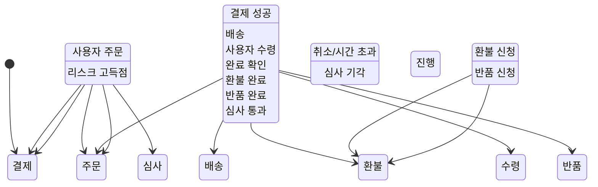
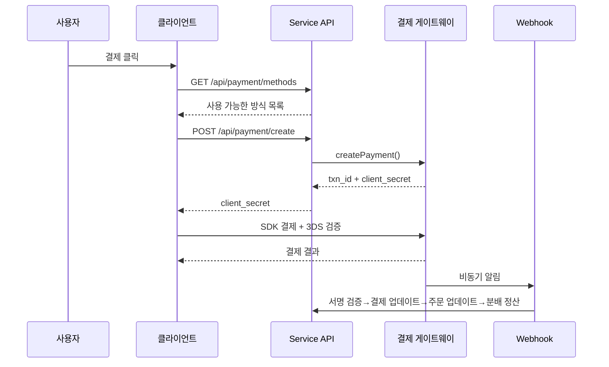
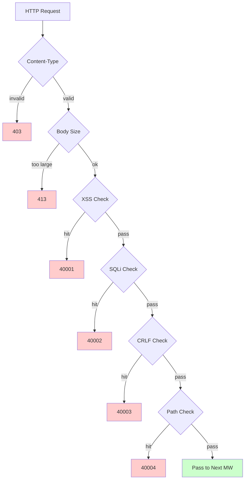

# 크로스보더 전자상거래 플랫폼 — 기능 설계 문서

Copyright (c) 2026 erik <erik@erik.xyz> — https://erik.xyz

---


## 플랫폼 추적

### 8플랫폼 식별

| 플랫폼 | Header | Flutter | Admin |
|------|--------|---------|-------|
| iOS | `ios` | Platform.isIOS + TargetPlatform.iOS | UA iPhone |
| iPadOS | `ipados` | Platform.isIOS + !TargetPlatform.iOS | UA iPad |
| macOS | `macos` | Platform.isMacOS | UA Macintosh |
| Windows | `windows` | Platform.isWindows | UA Windows |
| Linux | `linux` | Platform.isLinux | UA Linux |
| Android | `android` | Platform.isAndroid | UA Android |
| HarmonyOS | `harmonyos` | — | UA HarmonyOS |
| Web | `web` | kIsWeb | 기본값 |

### DB 추적 필드

| 테이블 | 필드 | 설명 |
|----|------|------|
| erik_orders | platform VARCHAR(16) | 주문 플랫폼 |
| erik_payments | platform VARCHAR(16) | 결제 플랫폼 |
| erik_operation_logs | platform VARCHAR(16) | 운영 플랫폼 |
| erik_users | last_login_platform VARCHAR(16) | 로그인 플랫폼 |
| erik_search_logs | platform VARCHAR(16) | 검색 플랫폼 |
| erik_chat_messages | platform VARCHAR(16) | 메시지 출처 |

## 1. 기능 총람

### 1.0 커버리지 총람

| 차원 | 커버 내용 | 깊이 |
|------|---------|------|
| **B2C 소매** | 다국어 상품, 통화별 가격, SKU, 장바구니, 주문, 결제(Stripe/PayPal/Klarna), 환불, 반품 | 완전 |
| **B2B 도매** | 계단형 가격(MOQ), 기업 인증(사업자번호/사업자등록증), 견적 요청 | 완전 |
| **다중 셀러 입점** | 셀러 심사, 상품 심사, 수익 분배 정산 | 완전 |
| **크로스보더 컴플라이언스** | HS Code 코드 라이브러리(6자리 기본 코드), 관세 규칙(목적국+HS→세율), VAT/IOSS, 컴플라이언스 라벨(FDA/CE/RoHS 등 10종) | 완전 |
| **국제 물류** | 물류 구역별 운임(중량 계단), DHL/UPS/FedEx/EMS, 해외 창고(출하+반품), HS 신고(배터리/액체 표시), 상업 송장 PDF/포장 명세서 | 완전 |
| **결제** | Stripe PaymentIntent+3DS, PayPal REST, Klarna BNPL, Adyen, Webhook 서명 검증+분배 정산 | Stripe 완전, 기타 플레이스홀더 |
| **마케팅** | 쿠폰(구역+신규/기존 고객 한정), 캐러셀 배너(지역 노출), 플래시 세일(기간·수량 제한), 공동구매(인원+유효기간), 유통(링크+수수료+출금) | 완전 |
| **다중 플랫폼** | Amazon/eBay/Shopee/Lazada/Temu 상품 등록+주문 집계, 다중 스토어 관리 | 완전 |
| **공급망** | 공급업체 프로필+등급, 구매 주문(심사→출하→수령→검품), 검품(입고+출고 게이트/외관/기능/컴플라이언스 라벨 검사), 재고 거래 내역(불변 장부: 입고/출고/이관/실사) | 완전 |
| **리스크 컴플라이언스** | 규칙 엔진(바이패스 스코어링: 주소 검증/우편번호 매칭/3DS/대량 가입/화물 가액 이상), KYC 실명, GDPR/CCPA 데이터 요청, Cookie Consent 버전 관리 | 완전 |
| **보안 방어** | SecurityMiddleware가 security-php 31개 탐지기 래핑: XSS(13개)/SQL 인젝션(13개)/CRLF/경로 탐색(인코딩+null byte)/Body 크기/Content-Type/파일 업로드/HTTP 보안 헤더/무차별 대입(Redis 카운터)/XXE/SSRF/메서드/Host/민감 데이터 마스킹/CORS | 완전 |
| **고동시성** | 토큰 버킷 속도 제한(슬라이딩 윈도우+6엔드포인트 규칙), DB 읽기/쓰기 분리(2개 읽기 복제본+sticky), 커넥션 풀(DB 50/10+Redis 30/5), OPCache(128MB, Docker 환경) | 완전 |
| **회원 성장** | 회원 등급+혜택, 포인트 규칙+거래 내역, 기프트 카드(잔액+교환), 가격 인하/입고 알림, 즐겨찾기, 상품 비교, 조회 기록, 구독 정기 구매, AB 테스트(트래픽 배분+신뢰도) | 완전 |
| **콘텐츠 관리** | CMS 다국어 페이지(Landing/Blog), FAQ 다국어, 지식 베이스 다국어, 사이즈 대조표(의류/신발+US/UK/EU/JP/CN 변환), 이메일 템플릿(다국어), 상품 Feed(Google/Meta+정기 동기화) | 완전 |
| **고객 서비스** | WebSocket 실시간 IM(chat_sessions/chat_messages), 지식 베이스 다국어 | 테이블 구조 완전, WS 구현 대기 |
| **인프라** | Snowflake 분산 ID(bigint 비자동증가), Hashids 인터페이스 ID 난독화, JWT 인증(HS256+access/refresh 이중 token 갱신), AES 암복호화(인터페이스+DB 3계층 암호화), GeoIP 지역 식별(MaxMind), Poster 휴먼 인증(슬라이더/퍼즐/클릭) | 완전 |
| **다중 단말** | Flutter 5플랫폼(iOS/Android/macOS/Windows/Linux/iPadOS) + HarmonyOS(ArkTS 9페이지) + Web Admin(LayUI+ECharts) + API | Flutter 25파일, HarmonyOS 14파일, Admin 239파일 |
| **플랫폼 추적** | 8플랫폼 식별(iOS/iPadOS/macOS/Windows/Linux/Android/HarmonyOS/Web)+X-Platform header+6개 테이블 기록(orders/payments/operation_logs/users/search_logs/chat_messages) | 완전 |
| **테스트** | 22 tests / 45 assertions — ALL PASS (SecurityTest 12: XSS+SQLi+XXE+SSRF+Path / JwtTest 4 / ApiResponseTest 3 / RedisFacadeTest 3) | 단위 테스트 완전, 통합 테스트 보강 대기 |

### 1.1 모듈 매트릭스

| 1차 모듈 | 2차 모듈 | 우선순위 | 상태 |
|---------|---------|--------|------|
| 사용자 시스템 | 가입/로그인/소셜 로그인/KYC 실명/주소/즐겨찾기/회원/포인트/기프트 카드 | P0-P2 | ✅ |
| 상품 시스템 | 분류/SKU/다국어/다통화/이미지/속성/컴플라이언스/HS Code/ES 검색/Feed | P0-P1 | ✅ |
| 거래 시스템 | 장바구니/주문/결제(Stripe+PayPal+Klarna)/환불/반품/인보이스 | P0 | ✅ |
| 물류 시스템 | 국제 물류사/구역 운임/해외 창고/출하(HS 신고)/물류 보험 | P0-P1 | ✅ |
| 통관 세금 | HS Code 라이브러리/관세 규칙/VAT/IOSS/국가별 컴플라이언스 제한 | P0 | ✅ |
| 마케팅 시스템 | 쿠폰/캐러셀 배너/플래시 세일/공동구매/유통 | P1-P2 | ✅ |
| 공급망 | 공급업체/구매 주문/검품/재고 거래 내역 | P1 | ✅ |
| 리스크 컴플라이언스 | 규칙 엔진/GDPR/CCPA/Cookie Consent/플랫폼 추적 | P1 | ✅ |
| 보안 방어 | XSS/SQL 인젝션/CRLF/경로 탐색/Content-Type/요청 본문 | P0 | ✅ |
| 다중 플랫폼 | Amazon/eBay/Shopee 등록+주문 집계/다중 셀러 입점 | P2 | ✅ |
| 콘텐츠 관리 | CMS/FAQ/지식 베이스/이메일 템플릿/알림/사이즈 표 | P2 | ✅ |
| 성장 도구 | B2B 도매/구독 정기 구매/AB 테스트 | P2-P3 | ✅ |
| 고객 서비스 | WebSocket 실시간 IM/지식 베이스 | P3 | ✅ |
| 인프라 | Snowflake ID/JWT/Hashids/Encryption/Poster/API 버전/GeoIP | P0 | ✅ |

---

## 2. 핵심 비즈니스 흐름도

### 2.1 주문 상태 머신



### 2.2 결제 시퀀스



### 2.3 보안 탐지 파이프라인



---

## 3. 핵심 비즈니스 프로세스

### 3.1 사용자 가입 로그인

```
EMAIL 가입: email+password → PosterVerify 휴먼 인증 → bcrypt(password+salt)
          → Snowflake ID 생성 → JWT {access_token, expires_in} 반환

소셜 로그인: Google/Apple/Facebook OAuth → id_token 검증
        → erik_user_social_accounts 바인딩 조회
        → 바인딩됨: 로그인 / 미바인딩: 사용자 자동 생성+바인딩 → JWT 반환

로그인: email+password → password_verify(password+salt)
    → last_login_at/ip/platform 업데이트 → JWT 발급

Token 갱신: refresh_token → Jwt::decode → 새 access_token
```

### 3.2 상품 브라우징과 검색

```
목록: GET /api/products
  → 필터: category_id/status/keyword/price_range
  → 정렬: default/price_asc/price_desc/sales/newest
  → 다국어: ProductTranslations를 locale 기준 필터링
  → 통화별: ProductSkuPrices를 currency_code 기준 매칭
  → 페이징: 페이지당 20건

ES 검색: GET /api/search?keyword=xxx
  → Erikwang2013\WebmanScout\Searchable → ES 다국어 분석기
  → 집계: category/price/brand
  → 폴백: ES 불가 시 MySQL LIKE

상세: GET /api/products/{hashid}
  → HashidsDecode 미들웨어 디코딩 → Eager Load
  → 다국어+통화별+컴플라이언스+HS Code+사이즈 변환+세금 포함/미포함+VAT
```

### 3.3 장바구니와 주문

```
장바구니: POST /api/cart {sku_id, quantity}
  → SKU 존재|판매 중|재고 충분 검증
  → 동일 SKU 누적 / 없으면 생성

주문: POST /api/orders {address_id, coupon_id, currency_code}
  → 1.배송지 검증 → 2.장바구니 선택 항목 조회 → 3.상품별 검증(재고+컴플라이언스)
  → 4.가격 계산(통화별+쿠폰) → 5.주문 번호 생성
  → 6.Order+OrderItems 생성 → 7.재고 차감 → 8.OrderLog 기록
  → 9.리스크 스코어링(RiskEngine::score) → 10.구매 완료 장바구니 비움

취소: POST /api/orders/{id}/cancel
  → 상태=0(결제 대기) 검증 → 재고 복원 → status=5(주문 취소)
```

### 3.4 결제 프로세스

```
사용 가능 방식: GET /api/payment/methods?country=DE&currency=EUR
  → PaymentGatewayMethods(country+currency 기준 필터링)

결제 생성: POST /api/payment/create
  → PaymentGateway::make(gateway)→createPayment()
  → Stripe: PaymentIntent → client_secret → 프론트엔드 SDK(+3DS)

Webhook: POST /webhook/payment/stripe
  → 서명 검증 → payment_intent.succeeded:
     → Payment.status=결제 완료 → Order.status=결제 완료
     → PlatformSettlement(플랫폼 수수료+게이트웨이 수수료+공급업체+유통)
```

### 3.5 반품 프로세스

```
신청: POST /api/returns {order_id, reason_id}
  → 반품 경로 판단: 현지 창고(type=1)/국내 반송(type=2)/환불만(type=3)

심사: Admin 심사 → 통과:ReturnLabel 생성 / 기각:사유 기록

반송: 송장 다운로드→반송→물류 업데이트→창고 수령→status=수령 완료

환불: status=주문 완료 → Refund 연결 → PaymentGateway::refund→원래 경로 환불
```

### 3.6 관세 추정

```
GET /api/tariff/estimate?product_id=xxx&dest_country_id=xxx&declared_value=100

1. ProductHsCodes → HsCode
2. TariffRules(dest_country_id + hs_code_id) → duty_rate + duty_free_threshold
3. VatSettings(country_id) → vat_rate + vat_free_threshold
4. duty = value>=threshold ? value*duty_rate/100 : 0
   vat = (value+duty)>=threshold ? (value+duty)*vat_rate/100 : 0
5. return {duty_rate, vat_rate, estimated_duty, estimated_vat, estimated_total, hs_code, disclaimer}
```

---

## 4. 보안 방어 (SecurityMiddleware가 security-php 31개 탐지기 래핑)

### 4.1 탐지 규칙 총표

| # | 공격 유형 | 주요 탐지 방식 | 오류 코드 | Service | Admin |
|---|---------|------------|--------|---------|-------|
| 1 | XSS 크로스 사이트 스크립팅 | 13개 정규식: script/iframe/on 이벤트/svg+on/style/expression/javascript:/embed/object/link/meta | 40001 | ✅ | ✅ |
| 2 | SQL 인젝션 | 13개 정규식: UNION SELECT/SELECT FROM WHERE/sleep/benchmark/pg_sleep/불리언형/문자열형/주석 기호/MySQL 특수 주석/schema 열거/load_file/into outfile/저장 프로시저/waitfor/delay | 40002 | ✅ | ✅ |
| 3 | CRLF Header 인젝션 | `[\r\n]` in: Authorization/X-Platform/API-Version/X-Forwarded-For/Referer/Origin | 40003 | ✅ | ✅ |
| 4 | 경로 탐색 | `../` + `%2e%2f` 인코딩 + `%252e%252f` 2중 인코딩 + null byte `\0` + `.env`/`.git`/`phpmyadmin`/`wp-admin`/`/etc/`/`/proc/`/`composer.json` | 40004 | ✅ | ✅ |
| 5 | 요청 본문 제한 | Content-Length > 10MB(Service) / 20MB(Admin) | 40005 | ✅ | ✅ |
| 6 | Content-Type 제한 | JSON/form-data/form-urlencoded만 허용 | 40006 | ✅ | ✅ |
| 7 | **파일 업로드 검증** | 블랙리스트 확장자(php/phtml/sh/exe/js/...)+이중 확장자 공격+빈 확장자 | 40009 | ✅ | ✅ |
| 8 | **HTTP 보안 응답 헤더** | nosniff/DENY/XSS-Protection/Referrer-Policy/Permissions-Policy/Cache-Control/Server 숨김 | — | ✅ | ✅ |
| 9 | **무차별 대입 방어** | Redis 카운터: API 10회/60s, Admin 5회/300s | 40008 | ✅ | ✅ |
| 10 | **XXE 엔티티 인젝션** | `<!ENTITY SYSTEM>`, `<!DOCTYPE [` | 40010 | ✅ | ✅ |
| 11 | **SSRF 서버 요청 위조** | 내부 IP(127/10/172.16/192.168/0.0/169.254.169.254)+localhost+metadata.google.internal | 40011 | ✅ | ✅ |
| 12 | **HTTP 메서드 검증** | GET/POST/PUT/DELETE/PATCH/OPTIONS/HEAD만 허용 | 40012 | ✅ | ✅ |
| 13 | **Host 헤더 검증** | 순수 IP 직접 접속 거부 | 40013 | ✅ | — |
| 14 | **민감 데이터 마스킹** | 로그/오류 응답에서 password/token/secret 필터링 | — | ✅ | ✅ |
| 15 | **CORS 화이트리스트** | 설정 가능한 origin 제한 | — | ⚠️ | ⚠️ |

### 4.2 미들웨어 파이프라인

```
Service: Cors → Security → Platform → GeoIp → Locale → HashidsDecode
        → VersionRoute → (PosterVerify) → (JwtAuth) → HashidsEncode

Admin: Security → Platform → HashidsDecode → AccessControl → HashidsEncode
```

### 4.3 플랫폼 출처 추적

| 플랫폼 | Header 값 | 식별 방식 |
|------|---------|---------|
| iOS | `ios` | Flutter `Platform.isIOS` |
| iPadOS | `ipados` | Flutter `TargetPlatform.iOS` 판단 |
| macOS | `macos` | Flutter `Platform.isMacOS` |
| Windows | `windows` | Flutter `Platform.isWindows` |
| Linux | `linux` | Flutter `Platform.isLinux` |
| Android | `android` | Flutter `Platform.isAndroid` |
| HarmonyOS | `harmonyos` | ArkTS 하드코딩 |
| Web | `web` | UA 폴백 / 기본값 |

---


## 5. 고동시성과 성능

### 5.1 속도 제한 규칙

| 엔드포인트 | 알고리즘 | 윈도우 | 제한 |
|------|------|------|------|
| /api/auth/login | 슬라이딩 윈도우 | 60s | 10회 |
| /api/auth/register | 슬라이딩 윈도우 | 300s | 5회 |
| /api/payment | 슬라이딩 윈도우 | 60s | 5회 |
| /api/orders | 슬라이딩 윈도우 | 10s | 3회 |
| /api/search | 슬라이딩 윈도우 | 1s | 10회 |
| 기본값 | 슬라이딩 윈도우 | 60s | 100회 |

### 5.2 Redis 용도

| 용도 | 구현 |
|------|------|
| 속도 제한 토큰 버킷 | Redis ZSET 슬라이딩 윈도우 |
| 휴먼 인증 | PosterVerify 인증 코드 상태 |
| Session 저장 | Redis KV 저장 |

비즈니스 데이터는 애플리케이션 계층 캐시를 하지 않고 MySQL(읽기/쓰기 분리 + 커넥션 풀)을 직접 읽습니다.

### 5.3 커넥션 풀

| 리소스 | 최대 | 최소 | 타임아웃 |
|------|------|------|------|
| MySQL | 50 | 10 | 2s |
| Redis | 30 | 5 | — |

## 6. 데이터 테이블 관계도

```
erik_users ──┬── addresses, social_accounts, wishlists, kyc
             ├── carts, orders → order_items → payments
             ├── reviews, coupons(through user_coupons)
             ├── notifications, subscriptions, point_logs
             ├── affiliate_links, chat_sessions, b2b_verifications
             └── privacy_requests

erik_products ──┬── translations(product_id, locale)
                ├── skus → sku_prices(sku_id, currency_code)
                ├── images, reviews, compliance → compliance_categories
                ├── hs_codes → hs_codes, recommendations
                ├── b2b_prices, platform_listings
                └── product_comparisons

erik_orders ──┬── order_items, order_logs
              ├── payments, refunds, return_orders → return_labels
              ├── order_documents, shipments
              ├── platform_settlements, risk_logs
              └── subscription_orders

erik_countries ──┬── vat_settings, tariff_rules(dest_country_id)
                 ├── country_compliance_rules
                 ├── shipping_zones(JSON countries)
                 └── warehouses(country_id)
```

---

## 7. API 인터페이스

전체 API 엔드포인트 목록(공개 인터페이스 23개 + 인증 인터페이스 47개 + Webhook + Admin/Health), 자세한 내용은 [API 인터페이스 문서](api.md)를 참조하세요.

---

## 8. 테스트 검증

```bash
cd service && php vendor/bin/phpunit tests/
```

| 테스트 클래스 | Tests | 커버리지 |
|--------|-------|------|
| SecurityTest | 12 | XSS(3건)+SQLi(2건)+XXE(2건)+SSRF(1건)+Path(2건)+카드 유출(1건)+정상 통과(1건) |
| JwtTest | 4 | encode 3부분 JWT + decode 왕복 + 무효 token→null + 빈 token→null |
| ApiResponseTest | 3 | success(code=0) + fail(error code) + paginate(list+meta 페이징) |
| RedisFacadeTest | 3 | ping + set/get 왕복 + redis() 헬퍼 함수(Redis 불가 시 skip) |
| **합계** | **22** | **45 assertions — ALL PASS** |
