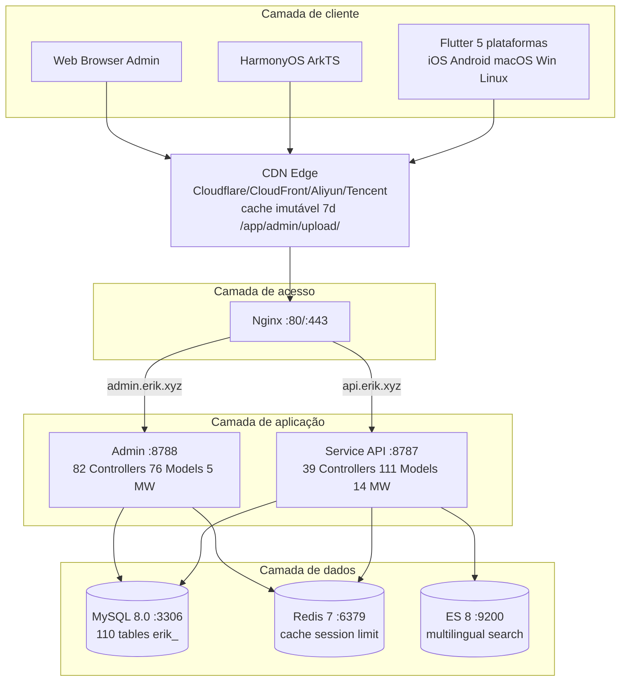
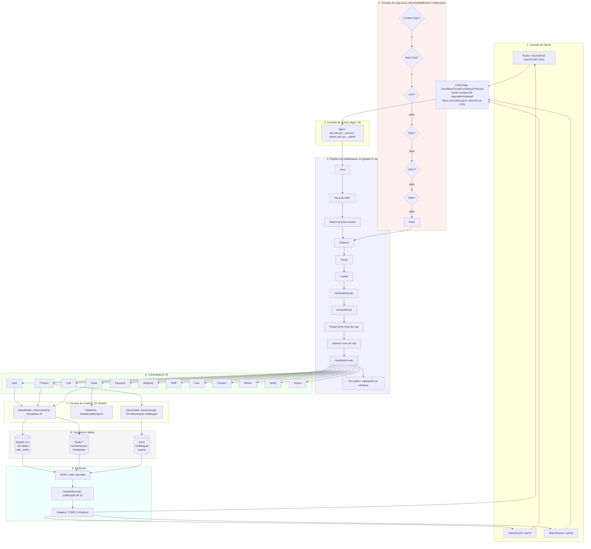
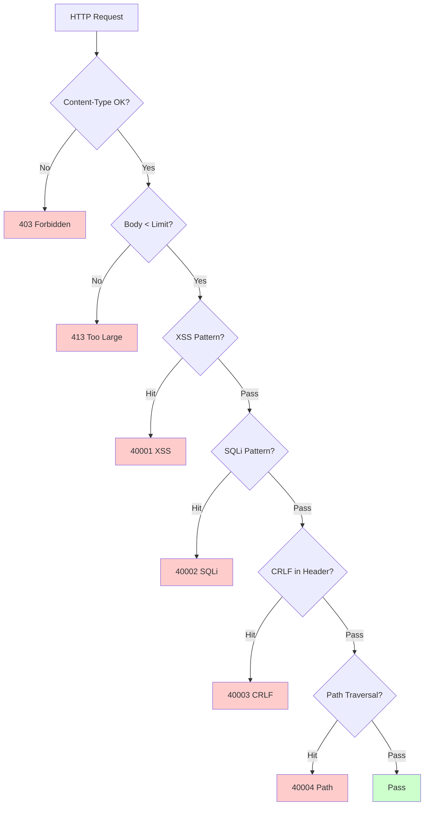
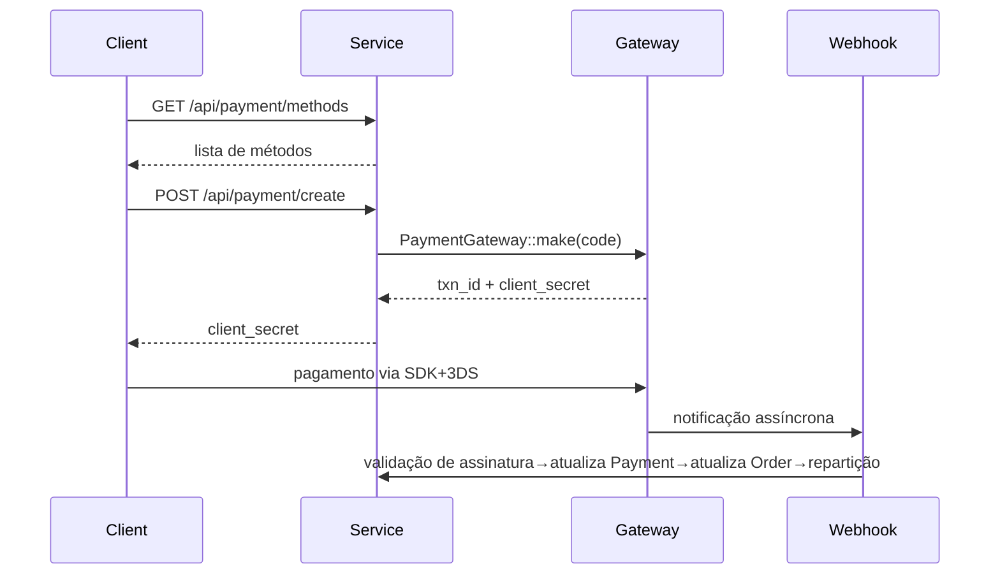
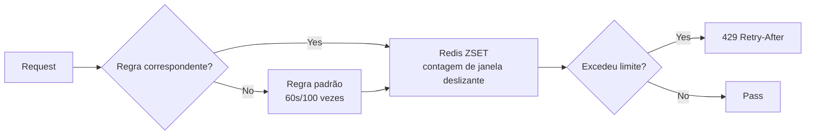

# Plataforma de Comércio Eletrônico Transfronteiriço — Documento de Design de Arquitetura

Copyright (c) 2026 erik <erik@erik.xyz> — https://erik.xyz

---

## 1. Visão geral do sistema

### 1.1 Posicionamento

Plataforma full-stack de comércio eletrônico transfronteiriço baseada no framework webman de alta performance, com suporte a B2C, B2B e integração de vendedores terceirizados.

| Componente | Stack tecnológico | Escala |
|------|--------|------|
| Service API | PHP 8.3 / webman 2.1 / illuminate database | 39 controladores + 111 modelos + 14 middlewares |
| Admin | webman-admin / LayUI / ECharts | 82 controladores + 76 modelos + 5 middlewares |
| Flutter | Riverpod / GoRouter / Dio | 25 arquivos Dart / 11 páginas |
| HarmonyOS | ArkTS / ArkUI | 14 arquivos ETS / 9 páginas |
| Banco de dados | MySQL 8.0 + Redis 7 + ES 8 | 117 tabelas (110 `erik_` + 7 `wa_`) |

### 1.2 Indicadores principais

| Indicador | Valor |
|------|-----|
| API P99 | <200ms |
| Concorrência | 10000+ (32 workers residentes em memória) |
| Nº de tabelas | 110 |
| Endpoints | 73 |
| Middlewares | 14 (service: 10 globais + 2 de rota + AdminKey + StaticFile / admin: 4 globais + 1 embutido) |
| Idiomas | zh_CN, zh_HK, en, ja, ko |
| Moedas | 19 moedas com precificação independente |
| Pagamento | Stripe / PayPal / Klarna / Adyen |

---

## 2. Diagrama de arquitetura do sistema



### 2.1 Diagrama completo do fluxo de design



**Explicação do fluxograma:**

| Camada | Descrição |
|----|------|
| 1. Camada de cliente | Flutter 5 plataformas + HarmonyOS + Web Admin, todos comunicando via HTTP/JSON |
| 2. Camada de borda CDN | Edge CDN (origin-pull, Cloudflare/CloudFront/Aliyun/Tencent): recursos estáticos `/app/admin/upload/` com cache imutável (7 dias); URLs reescritas por `Cdn::url()` para `https://{CDN_DOMAIN}{path}` |
| 3. Camada de acesso | Nginx roteia por domínio: api→service, admin→admin |
| 4. Camada de segurança | SecurityMiddleware com 31 detectores de ataques, em caso de detecção retorna código de erro/403 |
| 5. Pipeline de middlewares | 10 MW globais processados em série + 2 MW de rota (PosterVerify em operações sensíveis, JwtAuth em interfaces autenticadas) |
| 6. Camada de controladores | 39 controladores de API agrupados por função, tratando toda a lógica de negócio |
| 7. Camada de modelos | 111 modelos Eloquent, BaseModel fornece chave primária Snowflake ID, 45 modelos com SoftDelete habilitado por tabela |
| 8. Camada de dados | MySQL (110 tabelas prefixo erik_/chave primária snowflake) + Redis (cache/Session/limite de taxa/Poster) + ES (busca multilíngue) |
| 9. Resposta | Formato JSON unificado → HashidsEncode codifica IDs → Encryption criptografa (X-Encrypt-Response) → retorna ao cliente |

### 2.2 Modelo de processos

```
webman Master (:8787)
  ├── HTTP Worker x32 (CPU×4, memória residente, pool de conexões DB)
  ├── Monitor Process (monitoramento de arquivos + memória)
  └── SnowflakeWorker (inicializa o singleton Snowflake na inicialização)
```

---

## 3. Pipeline de middlewares

### 3.1 Pipeline completo do Service API

```mermaid
graph LR
    A[HTTP Request] --> B[Cors]
    B --> C[Security<br/>detecção de ataques]
    C --> D[Platform<br/>identificação de origem]
    D --> E[GeoIp<br/>identificação de região]
    E --> F[Locale<br/>idioma]
    F --> G[HashidsDecode<br/>decodificação de ID]
    G --> H[VersionRoute<br/>roteamento de versão]
    H --> I{Operação sensível?}
    I -->|Yes| J[PosterVerify<br/>verificação humano]
    I -->|No| K{Protegido por JWT?}
    J --> K
    K -->|Yes| L[JwtAuth<br/>validação de Token]
    K -->|No| M[HashidsEncode<br/>codificação de ID]
    L --> M
    M --> N[Controller]
    N --> O[HTTP Response]
    style C fill:#fcc
    style J fill:#ffc
    style L fill:#cfc
```



### 3.2 Detalhes dos middlewares do Service

| # | Middleware | Tipo | Função |
|---|--------|------|------|
| 1 | Cors | Global | Cabeçalhos de resposta Access-Control-*, preflight OPTIONS retorna 200 |
| 2 | SecurityMiddleware | Global | XSS/Injeção SQL/CRLF/Path Traversal/Content-Type/corpo da requisição 10MB |
| 3 | RateLimitMiddleware | Global | Limitação por token bucket (janela deslizante Redis ZSET, regras para 6 endpoints) |
| 4 | PlatformMiddleware | Global | Cabeçalho X-Platform + identificação de 8 plataformas com fallback via UA |
| 5 | GeoIpMiddleware | Global | MaxMind GeoIP2 identifica região/moeda/idioma de usuários não logados |
| 6 | LocaleMiddleware | Global | Parse de Accept-Language, correspondência exata de 5 idiomas→fallback→padrão |
| 7 | HashidsDecode | Global | Campos `*_id` na URL/Body: hashid→snowflake ID |
| 8 | VersionRoute | Global | Cabeçalho API-Version→mapeamento de namespace de controlador (v1/v2) |
| 9 | PosterVerify | Rota | Registro/pedido/pagamento, verificação de token no Redis |
| 10 | JwtAuth | Rota | Bearer Token: verificação HS256 + expiração + injeção de userId |
| 11 | HashidsEncode | Global | Varredura recursiva do JSON de resposta, snowflake ID→hashid |
| 12 | EncryptionMiddleware | Rota | Criptografia/descriptografia AES da interface (X-Encrypt-Response/X-Encrypted) |
| 13 | AdminKeyMiddleware | Rota | Validação de chave para operações administrativas internas |
| 14 | StaticFile | Global | Serviço de recursos estáticos do webman |

### 3.3 Pipeline do Admin

```
Requisição → SecurityMiddleware → PlatformMiddleware → HashidsDecode
     → webman-admin AccessControl (RBAC embutido) → HashidsEncode → Controlador
```

| # | Middleware do Admin | Função |
|---|------------|------|
| 1 | SecurityMiddleware | XSS/Injeção SQL/CRLF/Path Traversal/Content-Type/20MB |
| 2 | PlatformMiddleware | X-Platform + identificação de 8 plataformas via UA |
| 3 | HashidsDecode | Requisição: hashid→snowflake ID |
| - | AccessControl (embutido) | Validação de permissões por papel de administrador |
| 4 | HashidsEncode | Resposta: snowflake ID→hashid |

---

## 4. Arquitetura de segurança

### 4.1 Pipeline de detecção de ataques (SecurityMiddleware)



### 4.2 Detalhes das regras de detecção de ataques do SecurityMiddleware (15 tipos personalizados)

| # | Tipo de ataque | Principal método de detecção | Service | Admin | Código de erro |
|---|---------|------------|---------|-------|--------|
| 1 | XSS script entre sites | 13 regex: script/iframe/on-eventos/svg+on/style/expression/javascript:/embed/object/link/meta | ✅ | ✅ | 40001 |
| 2 | Injeção SQL | 13 regex: UNION SELECT/SELECT FROM WHERE/sleep/benchmark/pg_sleep/booleano/tipo string/comentários/comentários especiais MySQL/enumeração de schema/load_file/into outfile/procedimentos armazenados/waitfor/delay | ✅ | ✅ | 40002 |
| 3 | Injeção em cabeçalho CRLF | `[\r\n]` em: Authorization/X-Platform/API-Version/X-Forwarded-For/Referer/Origin | ✅ | ✅ | 40003 |
| 4 | Path Traversal | `../` + codificação `%2e%2f` + codificação dupla `%252e%252f` + byte nulo `\0` + `.env`/`.git`/`phpmyadmin`/`wp-admin`/`/etc/`/`/proc/`/`composer.json` | ✅ | ✅ | 40004 |
| 5 | Limite do corpo da requisição | Content-Length > 10MB (Service) / 20MB (Admin) | ✅ | ✅ | 40005 |
| 6 | Content-Type | Apenas JSON/form-data/form-urlencoded | ✅ | ✅ | 40006 |
| 7 | Validação de upload de arquivos | Extensões em blacklist (php/phtml/sh/exe/js/...) + dupla extensão + extensão vazia | ✅ | ✅ | 40009 |
| 8 | Cabeçalhos HTTP de segurança | nosniff/DENY/XSS-Protection/Referrer-Policy/Permissions-Policy/Cache-Control/ocultação do Server | ✅ | ✅ | — |
| 9 | Proteção contra força bruta | Contador Redis: API 10 vezes/60s, Admin 5 vezes/300s | ✅ | ✅ | 40008 |
| 10 | Injeção de entidade XXE | `<!ENTITY SYSTEM>`, `<!DOCTYPE [` | ✅ | ✅ | 40010 |
| 11 | Falsificação de servidor SSRF | IPs internos (127/10/172.16/192.168/0.0/169.254.169.254) + localhost + metadata.google.internal | ✅ | ✅ | 40011 |
| 12 | Validação de métodos HTTP | Apenas GET/POST/PUT/DELETE/PATCH/OPTIONS/HEAD | ✅ | ✅ | 40012 |
| 13 | Validação do cabeçalho Host | Rejeita conexão direta por IP nu | ✅ | — | 40013 |
| 14 | Mascaramento de dados sensíveis | Filtra password/token/secret em logs/respostas de erro | ✅ | ✅ | — |
| 15 | Whitelist CORS | Restrição de origin configurável | ⚠️ | ⚠️ | — |

### 4.3 Fluxo de autenticação

```
Registro: email+password → PosterVerify (verificação humano) → bcrypt(password+salt)
     → geração de ID via Snowflake → retorna JWT

Login: email+password → password_verify(password+salt, bcrypt_hash)
     → atualiza last_login_at/ip/platform → emite JWT

Requisição: Authorization: Bearer <token>
     → JwtAuth → Jwt::decode → valida assinatura HS256 + expiração → injeta request->userId

Refresh: POST /api/auth/refresh {refresh_token} → Jwt::decode → novo access_token
```

### 4.4 Segurança de dados (criptografia em três camadas)

| Camada | Tecnologia | Pacote | Campos |
|------|------|-----|------|
| Camada de transporte | AES-256-CBC | erikwang2013/encryption | Campos sensíveis do corpo do POST |
| Camada de banco de dados | Trait Encryptable | erikwang2013/encryptable (Maize) | email, mobile, name, phone, detail, tax_id |
| Ofuscação de ID | Codificação Hashids | erikwang2013/hashids | Todos os snowflake IDs na camada de interface |

### 4.5 Rastreamento de origem da plataforma

| Plataforma | Método de identificação | Valor do Header |
|------|---------|---------|
| iOS | Flutter `Platform.isIOS` + `TargetPlatform.iOS` | `ios` |
| iPadOS | Flutter `Platform.isIOS` + `!TargetPlatform.iOS` | `ipados` |
| macOS | Flutter `Platform.isMacOS` / UA `Macintosh` | `macos` |
| Windows | Flutter `Platform.isWindows` / UA `Windows` | `windows` |
| Linux | Flutter `Platform.isLinux` / UA `Linux` | `linux` |
| Android | Flutter `Platform.isAndroid` / UA `Android` | `android` |
| HarmonyOS | Codificado ArkTS / UA `HarmonyOS` | `harmonyos` |
| Web | UA sem correspondência / valor padrão | `web` |

Tabelas de registro: `erik_orders.platform`, `erik_payments.platform`, `erik_operation_logs.platform`, `erik_users.last_login_platform`, `erik_search_logs.platform`, `erik_chat_messages.platform`

---

## 5. Arquitetura de dados

### 5.1 Estratégia de chave primária

```
Snowflake 64bit: [1bit|42bit timestamp|5bitDC|5bitWID|12bit sequência]
- Único globalmente / incremental em tendência / não auto-incrementado
- PHP $keyType='string' (evita estouro)
- Service worker_id=1, Admin worker_id=2
- Geração: Snowflake::nextId()
```

### 5.2 Herança de modelos

```
Illuminate\Database\Eloquent\Model
  └── app\model\BaseModel
        ├── $incrementing=false, $keyType='string', $guarded=[]
        ├── boot(): Snowflake::nextId()
        └── 110 modelos de negócio
              ├── 45 usam SoftDeletes (correspondem a tabelas com coluna deleted_at)
              ├── alguns usam Encryptable (campos sensíveis: email/mobile/name etc.)
              ├── usam Searchable (Product→ES)
              └── relacionamentos hasMany/belongsTo
```

### 5.3 Multilíngue / multimoeda

- **Tradução**: `erik_product_translations(product_id,locale)` tabela independente, consultada por locale
- **Precificação**: `erik_product_sku_prices(sku_id,currency_code)` preços independentes por moeda

---

## 6. Arquitetura de pagamento



```
PaymentGatewayInterface
  ├── createPayment(data): array
  ├── capturePayment(txnId): array
  ├── refundPayment(txnId, amount): array
  └── verifyWebhook(payload, sig): bool
```

---

## 7. Arquitetura de alta concorrência

### 7.1 Estratégia de limitação de taxa (RateLimitMiddleware)



| Endpoint | Janela | Limite | Descrição |
|------|------|------|------|
| /api/auth/login | 60s | 10 vezes | Prevenção de ataques de dicionário |
| /api/auth/register | 300s | 5 vezes | Prevenção de registro em massa |
| /api/payment | 60s | 5 vezes | Prevenção de uso fraudulento |
| /api/orders | 10s | 3 vezes | Prevenção de pedidos falsos |
| /api/search | 1s | 10 vezes | Prevenção de crawlers |
| Padrão | 60s | 100 vezes | API geral |

### 7.2 Usos do Redis

O Redis é usado para token bucket de limitação de taxa, códigos de verificação humano e armazenamento de Session (camada de middleware); os dados de negócio não têm cache em nível de aplicação, são lidos diretamente do MySQL (separação leitura/escrita + pool de conexões). Recursos estáticos (uploads) são servidos pelo edge CDN com cache imutável (nginx `/app/admin/upload/`, `expires 7d`); invalidação por purge automático no CRUD de produtos/banners, fail-open (expiração natural de 7 dias como reserva).

### 7.4 Otimização de pool de conexões

| Recurso | Conexões máximas | Conexões mínimas | Timeout de espera | Timeout ocioso | Heartbeat |
|------|---------|---------|---------|---------|------|
| MySQL | 50 | 10 | 2s | 60s | 45s |
| Redis | 30 | 5 | — | 60s | — |

### 7.5 Tratamento de operações lentas

| Operação | Implementação |
|------|------|
| Atualização de câmbio | ExchangeRateCron (a cada hora, API externa) |
| Sincronização de Feed | ProductFeedCron (gera TSV a cada 6 horas e registra logs) |
| Cálculo de recomendações | RecommendationCron (diário, co-ocorrência de compras) |
| Conciliação de pagamentos | PaymentReconcileCron (a cada 6 horas, Stripe/PayPal) |
| Liquidação de repartições | SettlementCron (diário) |
| Rastreamento logístico | ShipmentTrackingCron (a cada 30 minutos, requer configuração de API) |
| Sincronização de pedidos de plataforma | PlatformOrderSyncCron (a cada 5 minutos, requer configuração de API) |
| Timeout de devolução | ReturnExpireCron (a cada hora) |
| Notificação de queda de preço/chegada | PriceAlertCron (a cada 10 minutos) |
| Atualização de regras de conformidade | ComplianceCron (diário, requer configuração de API) |

## 8. Arquitetura de implantação

```
docker-compose.yml:
  nginx (alpine) :80 :443
  service (php:8.3) :8787 internal, 32 workers
  admin (php:8.3) :8788 internal
  mysql (8.0) :3306 / redis (7) :6379 / es (8) :9200
Rede: erik-net bridge | persistência em volumes de dados
Rotas: api.erik.xyz→service | admin.erik.xyz→admin | CDN: edge origin-pull (Cloudflare/CloudFront/Aliyun/Tencent; nginx /app/admin/upload/ expires 7d + immutable; CNAME→admin) | Volumes: admin_uploads:/app/plugin/admin/public/upload, service_public:/app/public/documents
```

---

## 8. Internacionalização (i18n)

| Camada | Implementação |
|------|------|
| Service | LocaleMiddleware + arquivos de tradução de 5 idiomas (45 chaves/idioma) |
| Admin | Arquivos de tradução de 5 idiomas |
| Flutter | AppLocalizations + Provider Riverpod |
| API | Injeção automática via cabeçalho Accept-Language |

## 9. Documentação da API (hg/apidoc)

| Componente | Descrição |
|------|------|
| Pacote | hg/apidoc v5.3 |
| Configuração | config/plugin/hg/apidoc/app.php (6 grupos) |
| Anotações | @Apidoc\Title/Desc/Method/Url/Param/Returned |
| Acesso | http://localhost:8787/apidoc/ |

## 11. Testes

```bash
cd service && php vendor/bin/phpunit tests/
```

| Classe de teste | Tests | Cobertura |
|--------|-------|------|
| SecurityTest | 12 | XSS+SQLi+XXE+SSRF+Path |
| JwtTest | 4 | encode/decode/invalid |
| ApiResponseTest | 3 | success/fail/paginate |
| RedisFacadeTest | 3 | ping/set/get/redis() |
| **Total** | **22** | **45 assertions PASS** |

---

## 12. Estatísticas do projeto

| Dimensão | Quantidade |
|------|------|
| Arquivos-fonte PHP | service:210 + admin:214 = 424 |
| Dart (Flutter) | 25 |
| ArkTS (HarmonyOS) | 14 |
| Tabelas de banco de dados | 110 |
| Endpoints de API | 73 |
| Middlewares | 14 |
| Classes utilitárias | 8 |
| Tarefas agendadas | 12 |
| Itens de configuração | 36+ |
| Testes | 22 tests, 45 assertions |
| Skills | 38 |
| Documentos | 9 |
| **Total** | **~700** |
