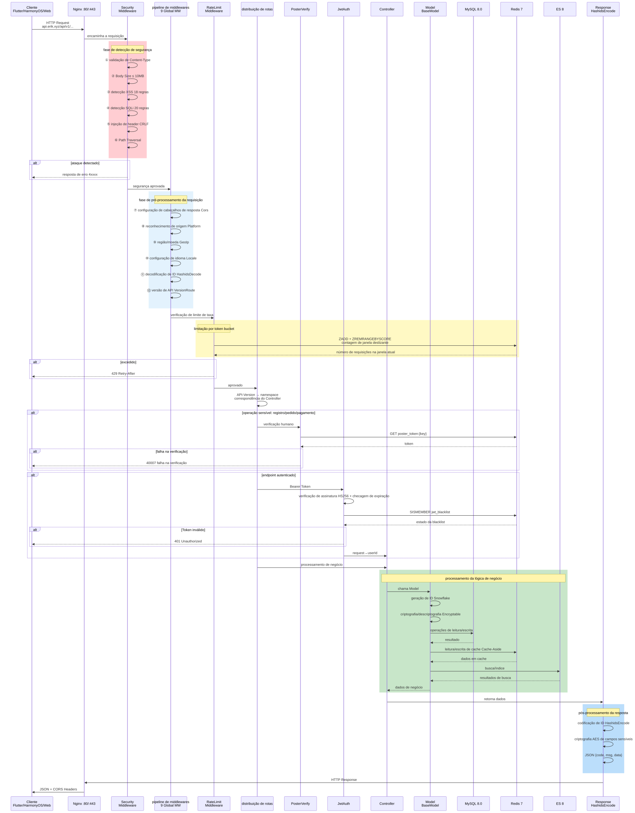

# Plataforma de Comércio Eletrônico Transfronteiriço — Conjunto de Diagramas de Arquitetura

Copyright (c) 2026 erik <erik@erik.xyz> — https://erik.xyz

---

## 1. Diagrama de Arquitetura do Sistema

---

## 2. Diagrama de Fluxo de Processamento de Requisições (pipeline de middlewares)

---

## 3. Mapa Geral de Módulos Funcionais

---

## 4. Diagrama de Ciclo de Vida da Requisição

---

## 5. Diagrama de Ciclo de Vida do Pedido

---

## 6. Diagrama de Arquitetura de Implantação

---

## 7. Diagrama de Arquitetura de Segurança

### Visão geral da proteção de segurança

| Camada | Linha de defesa | Tecnologia/pacote | Cobertura |
|------|------|---------|---------|
| Primeira camada | Perímetro de rede | Nginx SSL + proxy reverso + validação de Host | Service + Admin |
| Segunda camada | Detecção de ataques WAF | 31 detectores do `erikwang2013/security-php` | XSS/SQLi/CRLF/Path Traversal/XXE/SSRF/upload de arquivos/métodos/Host/Content-Type/Body etc. |
| Terceira camada | Controle de tráfego + resiliência de dependências | RateLimitMiddleware + contador Redis de força bruta + CircuitBreaker | Limitação por token bucket (6 endpoints) + proteção de login/registro + disjuntor de pagamento/login social (5 falhas→30s, recuperação semiaberta) |
| Quarta camada | Autenticação de identidade | PosterVerify + JwtAuth HS256 | Verificação humano (slider/quebra-cabeça/clique) + Bearer Token + renovação de token duplo |
| Quinta camada | Segurança de dados | Hashids + AES-256-CBC + Encryptable | Criptografia em três camadas: ofuscação de ID/criptografia de transporte/criptografia de campos do banco |
| Sexta camada | Segurança de resposta | Cabeçalhos HTTP de segurança + mascaramento de dados sensíveis | nosniff/DENY/XSS-Protection/Referrer-Policy/mascaramento em logs |
| Contínua | Auditoria e rastreamento | PlatformMiddleware + OperationLogs | Rastreamento de origem de 8 plataformas + registro em 6 tabelas + logs de operação |

---

## 8. Diagrama de Fluxo de Liquidação Multi-Moeda

### Explicação da Liquidação Multi-Moeda

**Precificação multi-moeda:** os SKUs de produtos são precificados por moeda conforme `currency_code`; ao fazer o pedido, a moeda de recebimento é fixada (USD / EUR / GBP / CNY etc.).

**Serviço de câmbio:** a tabela de câmbio `erik_exchange_rates` suporta manutenção manual e busca automática via exchangerate-api, versionada pelo horário de vigência `effective_at`; na liquidação é usado o snapshot da taxa de câmbio do momento do pagamento.

**Débito na moeda original:** Stripe / PayPal / Klarna / Adyen debitam na moeda original do pedido; após a confirmação de recebimento via verificação de assinatura do Webhook, os status de pagamento e pedido são atualizados.

**Liquidação por repartição:** após o pagamento bem-sucedido, são gerados automaticamente os repartições de plataforma `PlatformSettlements` (total do pedido + comissão da plataforma + taxa do gateway de pagamento, contabilizados na moeda do pedido); liquidação do vendedor `MerchantSettlements` (valor do pedido → taxa de comissão → valor liquidado), liquidação do fornecedor `SupplierSettlements`, saque de comissões de afiliados `AffiliatePayouts` — quatro linhas independentes de liquidação, status 0 pendente de liquidação / 1 liquidado.

**Ganhos/perdas cambiais:** `CurrencyExchangeGainsLosses` acompanha a diferença entre a moeda de recebimento e a moeda de liquidação, comparando a taxa de câmbio do pagamento com a da liquidação; positivo = ganho cambial, negativo = perda cambial, dando suporte à conciliação e auditoria multi-moeda do comércio transfronteiriço.

---

## Índice de Diagramas

| Nº | Nome do diagrama | Tipo | Uso |
|------|------|------|------|
| 1 | Diagrama de arquitetura do sistema | Arquitetura | Mostra a visão geral do sistema: cliente→acesso→aplicação→dados→serviços externos |
| 2 | Diagrama de fluxo de processamento de requisições | Fluxo | Mostra o caminho completo do HTTP request pelos 12 middlewares do pipeline (10 globais + 2 de rota) |
| 3 | Mapa geral de módulos funcionais | Funcional | Mostra os 17 grandes módulos funcionais e seus subpontos |
| 4 | Diagrama de ciclo de vida da requisição | Ciclo de vida | Mostra a sequência completa da requisição à resposta e as interações de cada etapa |
| 5 | Diagrama de ciclo de vida do pedido | Ciclo de vida | Mostra todas as transições de estado do pedido, do carrinho à conclusão/reembolso |
| 6 | Diagrama de arquitetura de implantação | Arquitetura | Mostra a orquestração de contêineres Docker Compose, rede e volumes de dados |
| 7 | Diagrama de arquitetura de segurança | Arquitetura | Mostra o sistema de defesa em profundidade de 6 camadas: perímetro→WAF→tráfego/resiliência (limitação de taxa + disjuntor)→autenticação→dados→resposta |
| 8 | Diagrama de fluxo de liquidação multi-moeda | Fluxo | Mostra a cadeia completa de precificação por moeda→pagamento→repartição→liquidação→ganhos/perdas cambiais |
