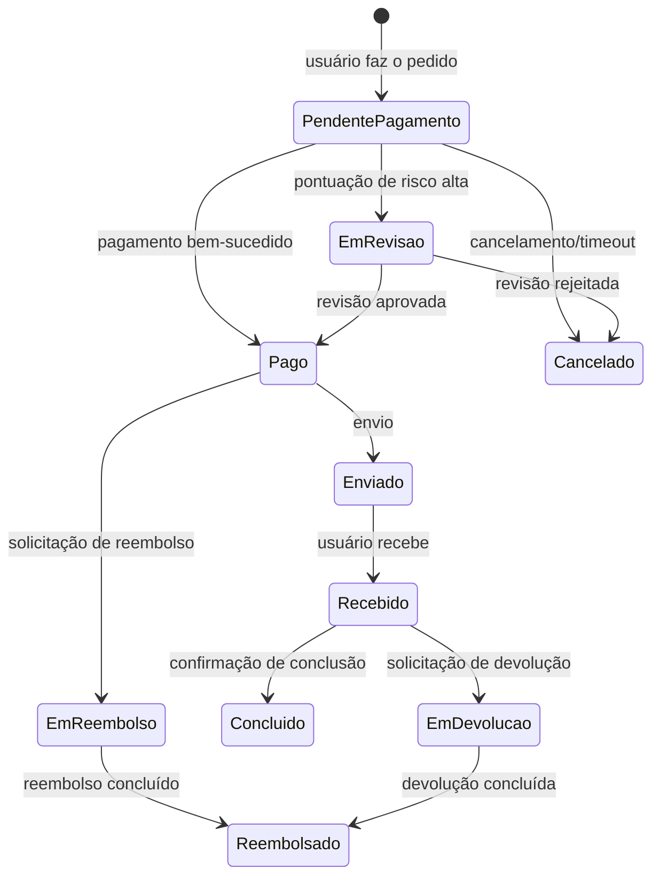
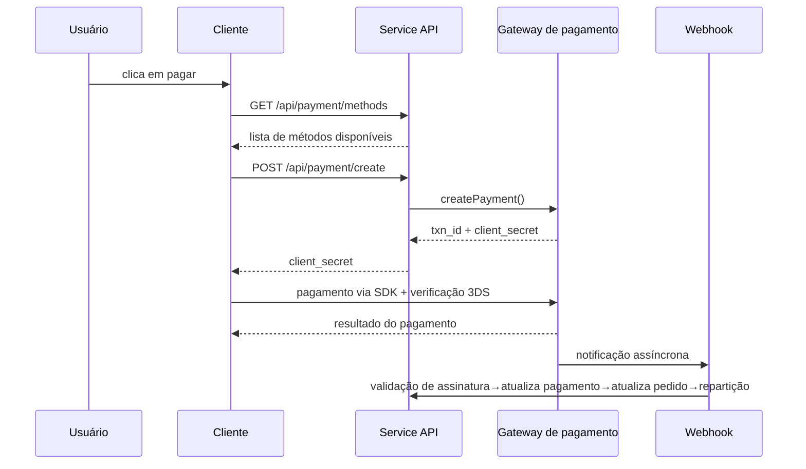
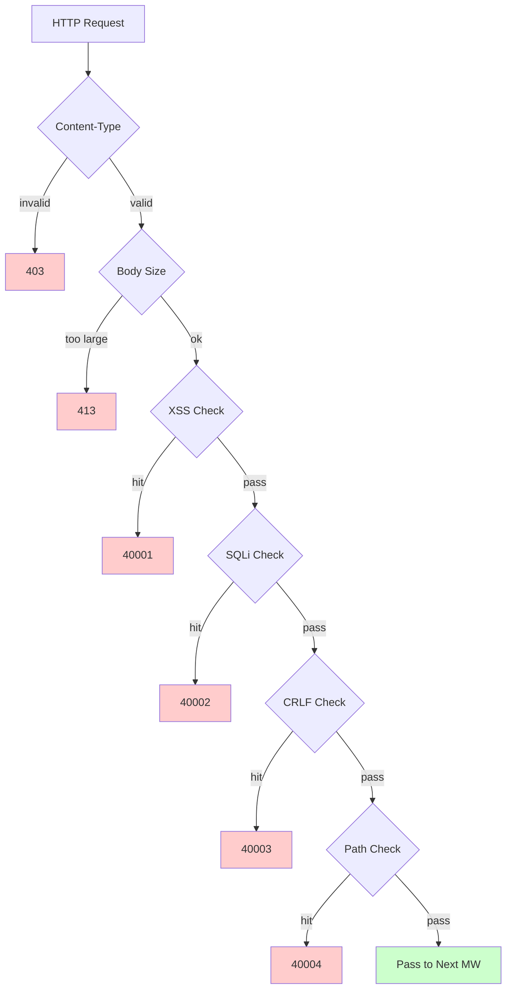

# Plataforma de Comércio Eletrônico Transfronteiriço — Documento de Design Funcional

Copyright (c) 2026 erik <erik@erik.xyz> — https://erik.xyz

---


## Rastreamento de plataforma

### Identificação de 8 plataformas

| Plataforma | Header | Flutter | Admin |
|------|--------|---------|-------|
| iOS | `ios` | Platform.isIOS + TargetPlatform.iOS | UA iPhone |
| iPadOS | `ipados` | Platform.isIOS + !TargetPlatform.iOS | UA iPad |
| macOS | `macos` | Platform.isMacOS | UA Macintosh |
| Windows | `windows` | Platform.isWindows | UA Windows |
| Linux | `linux` | Platform.isLinux | UA Linux |
| Android | `android` | Platform.isAndroid | UA Android |
| HarmonyOS | `harmonyos` | — | UA HarmonyOS |
| Web | `web` | kIsWeb | Padrão |

### Campos de rastreamento no DB

| Tabela | Campo | Descrição |
|----|------|------|
| erik_orders | platform VARCHAR(16) | Plataforma do pedido |
| erik_payments | platform VARCHAR(16) | Plataforma do pagamento |
| erik_operation_logs | platform VARCHAR(16) | Plataforma da operação |
| erik_users | last_login_platform VARCHAR(16) | Plataforma do login |
| erik_search_logs | platform VARCHAR(16) | Plataforma da busca |
| erik_chat_messages | platform VARCHAR(16) | Origem da mensagem |

## 1. Visão geral de funcionalidades

### 1.0 Visão geral de cobertura

| Dimensão | Conteúdo coberto | Profundidade |
|------|---------|------|
| **Varejo B2C** | Produtos multi-idioma, precificação por moeda, SKU, carrinho, pedidos, pagamento (Stripe/PayPal/Klarna), reembolso, devolução | Completa |
| **Atacado B2B** | Preços escalonados (MOQ), certificação empresarial (nº de contribuinte/licença comercial), consulta de preços | Completa |
| **Integração de múltiplos vendedores** | Revisão de vendedores, revisão de produtos, repartição de comissões | Completa |
| **Conformidade transfronteiriça** | Biblioteca de códigos HS (código base de 6 dígitos), regras tarifárias (país de destino + HS→taxa), VAT/IOSS, rótulos de conformidade (FDA/CE/RoHS entre 10 tipos) | Completa |
| **Logística internacional** | Frete por zona logística (faixas de peso), DHL/UPS/FedEx/EMS, armazém no exterior (envio + devolução), declaração HS (identificação de bateria/líquido), fatura comercial em PDF/lista de embalagem | Completa |
| **Pagamento** | Stripe PaymentIntent+3DS, PayPal REST, Klarna BNPL, Adyen, verificação de assinatura de Webhook + repartição | Stripe completo, outros placeholders |
| **Marketing** | Cupons (por zona + clientes novos/antigos), banners (visibilidade por região), vendas relâmpago (tempo limitado e quantidade limitada), compra em grupo (nº de participantes + validade), distribuição (link + comissão + saque) | Completa |
| **Multi-plataforma** | Publicação de produtos e agregação de pedidos Amazon/eBay/Shopee/Lazada/Temu, gestão de múltiplas lojas | Completa |
| **Cadeia de suprimentos** | Cadastro de fornecedores + classificação, ordens de compra (revisão→envio→recebimento→inspeção), inspeção de qualidade (portões de entrada/saída de estoque/aparência/funcionalidade/verificação de rótulos de conformidade), registro de inventário (livro-razão imutável: entrada/saída/transferência/contagem) | Completa |
| **Gestão de risco e conformidade** | Motor de regras (pontuação paralela: validação de endereço/correspondência de CEP/3DS/registro em massa/valor anormal), KYC, solicitações de dados GDPR/CCPA, gerenciamento de versões de Cookie Consent | Completa |
| **Proteção de segurança** | SecurityMiddleware encapsula os 31 detectores do security-php: XSS (13 regras)/Injeção SQL (13 regras)/CRLF/Path Traversal (codificação + null byte)/tamanho do Body/Content-Type/upload de arquivos/cabeçalhos HTTP de segurança/força bruta (contador Redis)/XXE/SSRF/métodos/Host/mascaramento de dados sensíveis/CORS | Completa |
| **Alta concorrência** | Limitação por token bucket (janela deslizante + regras para 6 endpoints), separação leitura/escrita do DB (2 réplicas de leitura + sticky), pool de conexões (DB 50/10 + Redis 30/5), OPCache (128MB, ambiente Docker) | Completa |
| **Crescimento de membros** | Níveis de membro + benefícios, regras de pontos + extrato, cartões-presente (saldo + resgate), alerta de queda de preço/chegada, favoritos, comparação de produtos, histórico de navegação, compra por assinatura, testes AB (distribuição de tráfego + nível de confiança) | Completa |
| **Gestão de conteúdo** | Páginas CMS multi-idioma (Landing/Blog), FAQ multi-idioma, base de conhecimento multi-idioma, tabela de tamanhos (vestuário/calçados + conversão US/UK/EU/JP/CN), modelos de e-mail (multi-idioma), Feed de produtos (Google/Meta + sincronização agendada) | Completa |
| **Atendimento ao cliente** | IM em tempo real via WebSocket (chat_sessions/chat_messages), base de conhecimento multi-idioma | Estrutura de tabelas completa, WS pendente |
| **Infraestrutura** | ID distribuído Snowflake (bigint não auto-incremento), ofuscação de ID na interface via Hashids, autenticação JWT (HS256 + renovação de token duplo access/refresh), criptografia/descriptografia AES (interface + banco, três camadas), identificação de região GeoIP (MaxMind), verificação humano Poster (slider/quebra-cabeça/clique) | Completa |
| **Cobertura multi-dispositivo** | Flutter 5 plataformas (iOS/Android/macOS/Windows/Linux/iPadOS) + HarmonyOS (ArkTS 9 páginas) + Web Admin (LayUI+ECharts) + API | Flutter 25 arquivos, HarmonyOS 14 arquivos, Admin 239 arquivos |
| **Rastreamento de plataforma** | Identificação de 8 plataformas (iOS/iPadOS/macOS/Windows/Linux/Android/HarmonyOS/Web) + header X-Platform + registro em 6 tabelas (orders/payments/operation_logs/users/search_logs/chat_messages) | Completa |
| **Testes** | 22 tests / 45 assertions — ALL PASS (SecurityTest 12: XSS+SQLi+XXE+SSRF+Path / JwtTest 4 / ApiResponseTest 3 / RedisFacadeTest 3) | Testes unitários completos, integração pendente |

### 1.1 Matriz de módulos

| Módulo de nível 1 | Módulo de nível 2 | Prioridade | Status |
|---------|---------|--------|------|
| Sistema de usuários | Registro/login/login social/KYC/endereços/favoritos/membro/pontos/cartão-presente | P0-P2 | ✅ |
| Sistema de produtos | Categorias/SKU/multi-idioma/multi-moeda/imagens/atributos/conformidade/HS Code/busca ES/Feed | P0-P1 | ✅ |
| Sistema de transações | Carrinho/pedidos/pagamento (Stripe+PayPal+Klarna)/reembolso/devolução/fatura | P0 | ✅ |
| Sistema logístico | Transportadoras internacionais/frete por zona/armazém no exterior/envio (declaração HS)/seguro logístico | P0-P1 | ✅ |
| Alfândega e impostos | Biblioteca HS Code/regras tarifárias/VAT/IOSS/restrições de conformidade por país | P0 | ✅ |
| Sistema de marketing | Cupons/banners/vendas relâmpago/compra em grupo/distribuição | P1-P2 | ✅ |
| Cadeia de suprimentos | Fornecedores/ordens de compra/inspeção de qualidade/registro de inventário | P1 | ✅ |
| Gestão de risco e conformidade | Motor de regras/GDPR/CCPA/Cookie Consent/rastreamento de plataforma | P1 | ✅ |
| Proteção de segurança | XSS/Injeção SQL/CRLF/Path Traversal/Content-Type/corpo da requisição | P0 | ✅ |
| Multi-plataforma | Publicação Amazon/eBay/Shopee + agregação de pedidos/integração de múltiplos vendedores | P2 | ✅ |
| Gestão de conteúdo | CMS/FAQ/base de conhecimento/modelos de e-mail/notificações/tabela de tamanhos | P2 | ✅ |
| Ferramentas de crescimento | Atacado B2B/compra por assinatura/testes AB | P2-P3 | ✅ |
| Atendimento ao cliente | IM em tempo real via WebSocket/base de conhecimento | P3 | ✅ |
| Infraestrutura | Snowflake ID/JWT/Hashids/Encryption/Poster/versão de API/GeoIP | P0 | ✅ |

---

## 2. Diagramas de fluxo de negócio principais

### 2.1 Máquina de estados do pedido



### 2.2 Sequência de pagamento



### 2.3 Pipeline de detecção de segurança



---

## 3. Fluxos de negócio principais

### 3.1 Registro e login de usuários

```
Registro por e-mail: email+password → PosterVerify (verificação humano) → bcrypt(password+salt)
          → geração de ID via Snowflake → retorna JWT {access_token, expires_in}

Login social: Google/Apple/Facebook OAuth → valida id_token
        → verifica vínculo em erik_user_social_accounts
        → vinculado: login / não vinculado: cria usuário automaticamente + vincula → retorna JWT

Login: email+password → password_verify(password+salt)
    → atualiza last_login_at/ip/platform → emite JWT

Refresh de token: refresh_token → Jwt::decode → novo access_token
```

### 3.2 Navegação e busca de produtos

```
Lista: GET /api/products
  → filtros: category_id/status/keyword/price_range
  → ordenação: default/price_asc/price_desc/sales/newest
  → multilíngue: ProductTranslations filtrado por locale
  → multi-moeda: ProductSkuPrices combinado por currency_code
  → paginação: 20 itens/página

Busca ES: GET /api/search?keyword=xxx
  → Erikwang2013\WebmanScout\Searchable → analisador multilíngue do ES
  → agregações: category/price/brand
  → fallback: MySQL LIKE quando o ES está indisponível

Detalhe: GET /api/products/{hashid}
  → decodificação via middleware HashidsDecode → Eager Load
  → multilíngue + multi-moeda + compliance + HS Code + conversão de tamanho + com/sem imposto + VAT
```

### 3.3 Carrinho e pedido

```
Carrinho: POST /api/cart {sku_id, quantity}
  → valida se o SKU existe | está ativo | tem estoque suficiente
  → acumula para o mesmo SKU / cria se não existir

Pedido: POST /api/orders {address_id, coupon_id, currency_code}
  → 1. valida endereço de entrega → 2. obtém itens selecionados do carrinho → 3. valida item a item (estoque + compliance)
  → 4. calcula preço (multi-moeda + cupom) → 5. gera número do pedido
  → 6. cria Order+OrderItems → 7. baixa estoque → 8. grava OrderLog
  → 9. pontuação de risco (RiskEngine::score) → 10. limpa o carrinho comprado

Cancelamento: POST /api/orders/{id}/cancel
  → valida status=0 (aguardando pagamento) → restaura estoque → status=5 (cancelado)
```

### 3.4 Fluxo de pagamento

```
Métodos disponíveis: GET /api/payment/methods?country=DE&currency=EUR
  → PaymentGatewayMethods (filtrado por country+currency)

Criar pagamento: POST /api/payment/create
  → PaymentGateway::make(gateway)→createPayment()
  → Stripe: PaymentIntent → client_secret → SDK do frontend (+3DS)

Webhook: POST /webhook/payment/stripe
  → valida assinatura → payment_intent.succeeded:
     → Payment.status=pago → Order.status=pago
     → PlatformSettlement (comissão da plataforma + taxa do gateway + fornecedor + distribuição)
```

### 3.5 Fluxo de devolução

```
Solicitação: POST /api/returns {order_id, reason_id}
  → define o canal de devolução: armazém local (type=1)/devolução ao país (type=2)/somente reembolso (type=3)

Revisão: revisão Admin → aprovado: gera ReturnLabel / rejeitado: registra motivo

Envio de volta: baixa etiqueta → envia de volta → atualização logística → recebimento no armazém → status=recebido

Reembolso: status=concluído → vincula Refund → PaymentGateway::refund → estorno na via original
```

### 3.6 Estimativa de tarifas

```
GET /api/tariff/estimate?product_id=xxx&dest_country_id=xxx&declared_value=100

1. ProductHsCodes → HsCode
2. TariffRules(dest_country_id + hs_code_id) → duty_rate + duty_free_threshold
3. VatSettings(country_id) → vat_rate + vat_free_threshold
4. duty = value>=threshold ? value*duty_rate/100 : 0
   vat = (value+duty)>=threshold ? (value+duty)*vat_rate/100 : 0
5. return {duty_rate, vat_rate, estimated_duty, estimated_vat, estimated_total, hs_code, disclaimer}
```

---

## 4. Proteção de segurança (SecurityMiddleware encapsula os 31 detectores do security-php)

### 4.1 Tabela geral de regras de detecção

| # | Tipo de ataque | Principal método de detecção | Código de erro | Service | Admin |
|---|---------|------------|--------|---------|-------|
| 1 | XSS script entre sites | 13 regex: script/iframe/on-eventos/svg+on/style/expression/javascript:/embed/object/link/meta | 40001 | ✅ | ✅ |
| 2 | Injeção SQL | 13 regex: UNION SELECT/SELECT FROM WHERE/sleep/benchmark/pg_sleep/booleano/tipo string/comentários/comentários especiais MySQL/enumeração de schema/load_file/into outfile/procedimentos armazenados/waitfor/delay | 40002 | ✅ | ✅ |
| 3 | Injeção em cabeçalho CRLF | `[\r\n]` em: Authorization/X-Platform/API-Version/X-Forwarded-For/Referer/Origin | 40003 | ✅ | ✅ |
| 4 | Path Traversal | `../` + codificação `%2e%2f` + codificação dupla `%252e%252f` + byte nulo `\0` + `.env`/`.git`/`phpmyadmin`/`wp-admin`/`/etc/`/`/proc/`/`composer.json` | 40004 | ✅ | ✅ |
| 5 | Limite do corpo da requisição | Content-Length > 10MB (Service) / 20MB (Admin) | 40005 | ✅ | ✅ |
| 6 | Limite de Content-Type | Apenas JSON/form-data/form-urlencoded | 40006 | ✅ | ✅ |
| 7 | **Validação de upload de arquivos** | Extensões em blacklist (php/phtml/sh/exe/js/...) + ataque de dupla extensão + extensão vazia | 40009 | ✅ | ✅ |
| 8 | **Cabeçalhos HTTP de segurança** | nosniff/DENY/XSS-Protection/Referrer-Policy/Permissions-Policy/Cache-Control/ocultação do Server | — | ✅ | ✅ |
| 9 | **Proteção contra força bruta** | Contador Redis: API 10 vezes/60s, Admin 5 vezes/300s | 40008 | ✅ | ✅ |
| 10 | **Injeção de entidade XXE** | `<!ENTITY SYSTEM>`, `<!DOCTYPE [` | 40010 | ✅ | ✅ |
| 11 | **Falsificação de servidor SSRF** | IPs internos (127/10/172.16/192.168/0.0/169.254.169.254) + localhost + metadata.google.internal | 40011 | ✅ | ✅ |
| 12 | **Validação de métodos HTTP** | Apenas GET/POST/PUT/DELETE/PATCH/OPTIONS/HEAD | 40012 | ✅ | ✅ |
| 13 | **Validação do cabeçalho Host** | Rejeita acesso direto por IP nu | 40013 | ✅ | — |
| 14 | **Mascaramento de dados sensíveis** | Filtra password/token/secret em logs/respostas de erro | — | ✅ | ✅ |
| 15 | **Whitelist CORS** | Restrição de origin configurável | — | ⚠️ | ⚠️ |

### 4.2 Pipeline de middlewares

```
Service: Cors → Security → Platform → GeoIp → Locale → HashidsDecode
        → VersionRoute → (PosterVerify) → (JwtAuth) → HashidsEncode

Admin: Security → Platform → HashidsDecode → AccessControl → HashidsEncode
```

### 4.3 Rastreamento de origem da plataforma

| Plataforma | Valor do Header | Método de identificação |
|------|---------|---------|
| iOS | `ios` | Flutter `Platform.isIOS` |
| iPadOS | `ipados` | Verificação via Flutter `TargetPlatform.iOS` |
| macOS | `macos` | Flutter `Platform.isMacOS` |
| Windows | `windows` | Flutter `Platform.isWindows` |
| Linux | `linux` | Flutter `Platform.isLinux` |
| Android | `android` | Flutter `Platform.isAndroid` |
| HarmonyOS | `harmonyos` | Codificado ArkTS |
| Web | `web` | Fallback via UA / padrão |

---


## 5. Alta concorrência e desempenho

### 5.1 Regras de limitação de taxa

| Endpoint | Algoritmo | Janela | Limite |
|------|------|------|------|
| /api/auth/login | Janela deslizante | 60s | 10 vezes |
| /api/auth/register | Janela deslizante | 300s | 5 vezes |
| /api/payment | Janela deslizante | 60s | 5 vezes |
| /api/orders | Janela deslizante | 10s | 3 vezes |
| /api/search | Janela deslizante | 1s | 10 vezes |
| Padrão | Janela deslizante | 60s | 100 vezes |

### 5.2 Usos do Redis

| Uso | Implementação |
|------|------|
| Token bucket de limitação | Janela deslizante Redis ZSET |
| Verificação humano | Estado do código de verificação PosterVerify |
| Armazenamento de Session | Armazenamento KV Redis |

Os dados de negócio não têm cache em nível de aplicação, são lidos diretamente do MySQL (separação leitura/escrita + pool de conexões).

### 5.3 Pool de conexões

| Recurso | Máximo | Mínimo | Timeout |
|------|------|------|------|
| MySQL | 50 | 10 | 2s |
| Redis | 30 | 5 | — |

## 6. Diagrama de relações de tabelas

```
erik_users ──┬── addresses, social_accounts, wishlists, kyc
             ├── carts, orders → order_items → payments
             ├── reviews, coupons(through user_coupons)
             ├── notifications, subscriptions, point_logs
             ├── affiliate_links, chat_sessions, b2b_verifications
             └── privacy_requests

erik_products ──┬── translations(product_id, locale)
                ├── skus → sku_prices(sku_id, currency_code)
                ├── images, reviews, compliance → compliance_categories
                ├── hs_codes → hs_codes, recommendations
                ├── b2b_prices, platform_listings
                └── product_comparisons

erik_orders ──┬── order_items, order_logs
              ├── payments, refunds, return_orders → return_labels
              ├── order_documents, shipments
              ├── platform_settlements, risk_logs
              └── subscription_orders

erik_countries ──┬── vat_settings, tariff_rules(dest_country_id)
                 ├── country_compliance_rules
                 ├── shipping_zones(JSON countries)
                 └── warehouses(country_id)
```

---

## 7. Interfaces de API

A lista completa de endpoints de API (23 interfaces públicas + 47 interfaces autenticadas + Webhook + Admin/Health), consulte [Documentação da API](api.md).

---

## 8. Verificação de testes

```bash
cd service && php vendor/bin/phpunit tests/
```

| Classe de teste | Tests | Cobertura |
|--------|-------|------|
| SecurityTest | 12 | XSS (3 regras)+SQLi (2 regras)+XXE (2 regras)+SSRF (1 regra)+Path (2 regras)+vazamento de cartão (1 regra)+passagem normal (1 regra) |
| JwtTest | 4 | encode JWT de três partes + round-trip decode + token inválido→null + token vazio→null |
| ApiResponseTest | 3 | success(code=0) + fail(código de erro) + paginate(paginação list+meta) |
| RedisFacadeTest | 3 | ping + round-trip set/get + função auxiliar redis() (skip quando Redis indisponível) |
| **Total** | **22** | **45 assertions — ALL PASS** |
