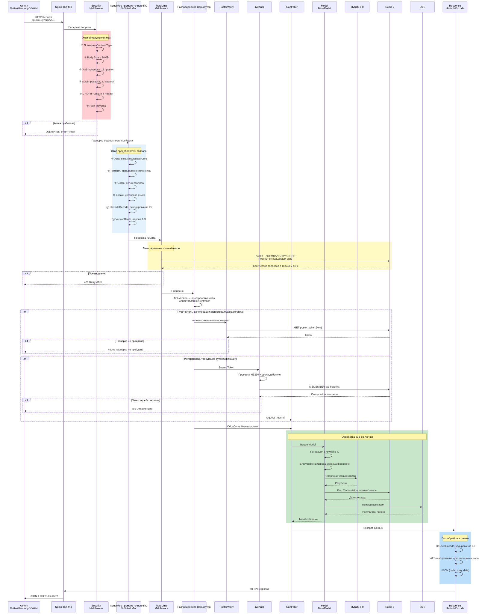

# Erik Shop — Платформа трансграничной электронной коммерции, полная версия (Full)

> Этот документ — машинный перевод оригинальной китайской документации. Оригинал: [中文原版](../../../README.md).

Copyright (c) 2026 erik <erik@erik.xyz> — https://erik.xyz

## Версии

> Упрощённая версия (MIT, открытый исходный код): `lite` | Стандартная версия (коммерческая): `standard` | Полная версия (коммерческая): `full`
>
> Контакты для коммерческого лицензирования: **erik@erik.xyz** | Сравнение версий: [VERSIONS.md](VERSIONS.md)

## Языки / Languages

| Язык | Ссылка |
|------|------|
| Китайский | [README.md](README.md) |
| Английский | [docs/i18n/en/README.md](../en/README.md) |
| Корейский | [docs/i18n/ko/README.md](../ko/README.md) |
| Русский | [docs/i18n/ru/README.md](../ru/README.md) |
| Немецкий | [docs/i18n/de/README.md](../de/README.md) |
| Французский | [docs/i18n/fr/README.md](../fr/README.md) |
| Испанский | [docs/i18n/es/README.md](../es/README.md) |
| Португальский | [docs/i18n/pt/README.md](../pt/README.md) |
| Хинди | [docs/i18n/hi/README.md](../hi/README.md) |
| Арабский | [docs/i18n/ar/README.md](../ar/README.md) |
| Бенгальский | [docs/i18n/bn/README.md](../bn/README.md) |
| Индонезийский | [docs/i18n/id/README.md](../id/README.md) |
| Японский | [docs/i18n/ja/README.md](../ja/README.md) |

## О проекте

Полнофункциональная платформа трансграничной электронной коммерции, построенная на экосистеме webman; охватывает сценарии B2C/B2B и привлечение сторонних продавцов.

### Техническая архитектура

| Уровень | Технология | Каталог |
|------|------|------|
| Бизнес-API | webman + illuminate/database + erikwang2013/* | `service/` |
| Админ-панель | webman-admin + LayUI + ECharts | `admin/` |
| Клиент | Flutter (iOS/Android/macOS/Windows/Linux) | `apps/flutter/` |
| Клиент HarmonyOS | ArkTS + ArkUI (HarmonyOS NEXT) | `apps/harmonyos/` |

### Технологический стек

**Серверная часть:** PHP 8.3+, webman 2.1, MySQL 8.0, Redis 7, Elasticsearch 8
**Ключевые пакеты:** snowflake-php, hashids, jwt-webman, encryption, encryptable, poster-php, webman-scout, season
**Оплата:** Stripe, PayPal (полная реализация); Klarna, Adyen (заглушки, `PaymentGateway::make` не реализован, см. docs/PLAN.md)
**Клиенты:** Flutter 3.x (Riverpod + GoRouter + Dio), HarmonyOS API 12+ (ArkTS + ArkUI)

## Схемы архитектуры

> Полный набор схем и просмотр в большом размере: [diagrams.md](diagrams.md)

### Схема системной архитектуры


### Схема обработки запросов


### Обзор функциональных модулей


### Жизненный цикл запроса



> Подробнее см. [полный набор схем](diagrams.md) (8 схем: жизненный цикл заказа, архитектура развёртывания, архитектура безопасности, мультивалютные расчёты и др.)

### Схема архитектуры безопасности



### Схема мультивалютных расчётов


### Пояснения к мультивалютным расчётам

**Мультивалютное ценообразование**：SKU товаров оценивается по каждой валюте через `currency_code`; при оформлении заказа фиксируется валюта получения оплаты (USD / EUR / GBP / CNY и т. д.).

**Сервис курсов валют**：таблица курсов `erik_exchange_rates` поддерживает ручное ведение (manual) и автоматическую загрузку через exchangerate-api; курсы версионируются по времени действия `effective_at`; при расчётах используется снимок курса на момент оплаты.

**Списание в исходной валюте**：Stripe / PayPal списывают средства в валюте заказа (Klarna/Adyen — заглушки, не подключены); после проверки подписи Webhook и подтверждения зачисления обновляются статусы платежа и заказа.

**Расщепление расчётов**：после успешной оплаты автоматически формируются расчёты платформы `PlatformSettlements` (сумма заказа + комиссия платформы + комиссия платёжного шлюза, учёт в валюте заказа); расчёты продавца `MerchantSettlements` (сумма заказа → ставка комиссии → сумма расчёта), расчёты поставщика `SupplierSettlements`, выплаты партнёрских комиссий `AffiliatePayouts` — четыре независимые линии расчётов, статус 0 — ожидает расчёта / 1 — рассчитано.

**Курсовые разницы**：`CurrencyExchangeGainsLosses` отслеживает разницу между валютой получения и валютой расчёта, сравнивая курс на момент оплаты и на момент расчёта; положительное значение = курсовая прибыль, отрицательное = курсовой убыток; это обеспечивает мультивалютную сверку и аудит для трансграничной торговли.

## Быстрый старт

### Способ 1: установка в один клик через Web (рекомендуется)

```bash
# 1. Установка зависимостей admin
cd admin && composer install

# 2. Запуск админ-панели
php start.php start -d

# 3. Открыть мастер установки в браузере
# http://127.0.0.1:8788/app/admin/install/step1
# Указать данные БД → создать учётную запись администратора → готово

# 4. Установка зависимостей и запуск API
cd ../service && composer install && php start.php start -d
```

> Установочный мастер автоматически выполняет: создание БД → импорт 117 таблиц → генерацию service/.env и admin/.env (со случайными ключами) → создание администратора → перезагрузку служб

### Способ 2: ручная установка через командную строку

Подробнее см. [INSTALL.md](../../INSTALL.md)

### Развёртывание через Docker

```bash
# Настройка переменных окружения
cp .env.example .env  # или задайте переменные DB_PASS / JWT_SECRET и т.д.

# Запуск всех сервисов одной командой
docker-compose up -d
# nginx:80 → service:8787 + admin:8788
# MySQL:3306, Redis:6379, ES:9200
```

Подробнее см. [документацию по развёртыванию](deployment.md)

## Структура проекта

```
shop-php/
  install.sql       # установочный SQL одной командой (117 таблиц), авто-импорт через Web-мастер
  service/          бизнес-API на PHP (webman)    — 39 контроллеров + 111 моделей + 14 промежуточных ПО
  admin/            админ-панель (webman-admin)   — 82 контроллера + 76 моделей + дашборд ECharts + Web-мастер установки
  apps/flutter/     Flutter-клиент                — 11 страниц + 5 языков + адаптация под ПК
  apps/harmonyos/   HarmonyOS-клиент              — 9 страниц + ArkTS
  docker/           Docker-развёртывание          — Nginx + PHP + MySQL + Redis + ES
  docs/             проектная документация
```

## Охват функций

| Направление | Содержание |
|------|---------|
| **Розница B2C** | Многоязычные товары, ценообразование по валютам, SKU, корзина, заказы, оплата, возвраты, обмены |
| **Опт B2B** | Ступенчатое ценообразование (MOQ), корпоративная верификация (ИНН/лицензия), запросы котировок |
| **Привлечение продавцов** | Модерация продавцов, модерация товаров, комиссионные расчёты |
| **Трансграничное соответствие** | База кодов HS Code, правила пошлин, VAT/IOSS, метки соответствия стран (FDA/CE/RoHS) |
| **Международная логистика** | Зональные тарифы доставки, зарубежные склады (отгрузочный + возвратный), коммерческий инвойс/упаковочный лист, декларация HS (в планах) |
| **Оплата** | Stripe/PayPal (полная реализация), Klarna/Adyen (заглушки), BNPL «покупай сейчас, плати позже» (заглушка), проверка 3DS |
| **Маркетинг** | Купоны (по зонам + новые/постоянные клиенты), карусели (по регионам), flash-распродажи, групповые покупки, партнёрская программа (ссылки + комиссии + вывод) |
| **Мультиплатформенность** | Линковка товаров и агрегация заказов Amazon/eBay/Shopee/Lazada/Temu |
| **Цепочка поставок** | Рейтинг поставщиков, закупка → контроль качества → приёмка на склад, складской журнал (неизменяемая книга), перемещения |
| **Риски и соответствие** | Движок правил (байпас-оценка), KYC-верификация, GDPR/CCPA-запросы данных, Cookie Consent |
| **Защита** | Обнаружение 31 типа атак (XSS/SQL-инъекции/XXE/SSRF/CRLF/обход путей/загрузка файлов/брутфорс/HTTP-методы/Host/CORS и др.) |
| **Высокая нагрузка** | Ограничение частоты запросов (token bucket), предохранитель (платежи/вход через соцсети, 5 сбоев → размыкание на 30s + полуоткрытое восстановление), разделение чтения/записи БД, оптимизация пула соединений |
| **Рост аудитории** | Правила баллов, привилегии уровней, подарочные карты, уведомления о снижении цен, подписочные покупки, AB-тесты |
| **Управление контентом** | Многоязычные страницы CMS, FAQ, база знаний, таблицы размеров, шаблоны писем, синхронизация товарных фидов |
| **Поддержка клиентов** | WebSocket-чат в реальном времени, база знаний (структура таблиц создана) |
| **Инфраструктура** | Snowflake-распределённые ID, обфускация интерфейсов Hashids, JWT-аутентификация, AES-шифрование, GeoIP-определение региона |
| **Покрытие платформ** | Flutter (iOS/Android/macOS/Windows/Linux/iPadOS) + HarmonyOS (ArkTS) + Web Admin |
| **Трекинг платформ** | Определение 8 источников (iOS/iPadOS/macOS/Windows/Linux/Android/HarmonyOS/Web) + запись в БД |
| **Тестирование** | 22 tests / 45 assertions — ALL PASS (Security+Jwt+ApiResponse+Redis) |

## Ключевые решения

- **Первичные ключи Snowflake**：все 117 таблиц используют bigint ID, генерируемые `erikwang2013/snowflake-php`
- **Hashids-интерфейс**：промежуточное ПО автоматически кодирует/декодирует, контроллеры не замечают этого
- **Шифрование Encryptable**：полевые данные email/mobile/address и другие чувствительные поля шифруются на уровне БД
- **JWT-аутентификация**：HS256 + автоматическое обновление пары токенов access/refresh
- **Версионирование API**：маршрутизация по заголовку `API-Version`, не в URL
- **Проверка Poster**：случайная проверка «человек или робот» для чувствительных операций (регистрация/оформление заказа/оплата)

## Документация

| Документ | Описание |
|------|------|
| [README-EN.md](../../README-EN.md) | English documentation |
| [INSTALL.md](../../INSTALL.md) | Руководство по установке (установка в один клик через Web + ручная установка) |
| [AUDIT-REPORT.md](../../AUDIT-REPORT.md) | Отчёт об аудите системы установки |
| [План проекта](PLAN.md) | Поэтапное планирование проекта командой (дорожная карта из 4 этапов + ключевые риски + Quick Wins) |
| [Исследования команды](PLAN-RESEARCH.md) | Исследование текущего состояния по 7 областям: реализовано / пробелы / риски / рекомендации |
| [Функциональный дизайн](features.md) | Полная матрица функций, бизнес-процессы, конечные автоматы |
| [Набор схем](diagrams.md) | Схемы архитектуры, потоков, функций, жизненного цикла, развёртывания, мультивалютных расчётов (8 схем Mermaid) |
| [Проектирование архитектуры](architecture-full.md) | Схема системной архитектуры, конвейер промежуточного ПО, архитектура данных, безопасности, оплаты |
| [Проектирование](design.md) | Проектирование таблиц БД, спецификация API, решения по безопасности, интернационализация |
| [Архитектура](architecture.md) | Структура каталогов, цепочка наследования моделей, ключевые пакеты |
| [API](api.md) | 71 конечная точка API (статическая документация) |
| [Документация API hg/apidoc](http://localhost:8787/apidoc/) | Автогенерация hg/apidoc (6 групп: аутентификация/товары/транзакции/логистика и таможня/пользователи и маркетинг/операции) |
| [Развёртывание](deployment.md) | Docker/ручное развёртывание, переменные окружения, команды эксплуатации |

## Открытый исходный код — это нелегко; поддержите проект

| WeChat | Alipay |
|:---:|:---:|
|  |  |

### Глобальный банковский перевод (ZA Bank)

**Информация о получателе**

- Имя получателя: WANG KEXUN
- Номер счёта получателя: 881015918251

**Банк получателя**

- SWIFT Code: AABLHKHHXXX
- Название банка: ZA Bank Limited
- Банковский код: 387
- Адрес банка: Core F, Cyberport 3, 100 Cyberport Road, Hong Kong

**Банк-посредник для трансграничных переводов (при необходимости)**

> Это информация о банке-посреднике (промежуточном банке) для трансграничных переводов, а не о банке получателя. Уточните в банке отправителя, требуется ли её предоставлять.

- **Для переводов в гонконгских долларах, юанях и долларах США** (банк-посредник Citibank):
  - Название банка: Citibank N.A. Hong Kong
  - SWIFT Code: CITIHKHXXXX
  - Банковский код: 006
  - Наименование отделения: Hong Kong Branch
  - Код отделения: 391
  - Адрес банка: Citibank Tower, Citibank Plaza, 3 Garden Road, Central, Hong Kong
- **Для переводов в других валютах** (банк-посредник BNY Mellon):
  - Название банка: THE BANK OF NEW YORK MELLON
  - SWIFT Code: IRVTUS3NXXX
  - Адрес банка: THE BANK OF NEW YORK MELLON, 240 GREENWICH STREET, NEW YORK, United States

---

## Тестирование

```bash
make test             # рекомендуемый способ
cd service && php vendor/bin/phpunit tests/   # нативная команда
# 22 tests, 45 assertions — ALL PASS

# Аудит безопасности зависимостей (известен 1 низкорисковый CVE: CVE-2025-45769 firebase/php-jwt <7.0.0,
# ограничено jwt-webman ^6.0, обновление невозможно; использование HS256-подписи не затронуто)
composer audit
```

## Инструменты разработки

```bash
make help             # просмотр всех команд
make lint             # проверка синтаксиса PHP
make check            # статический анализ phpstan
make fix              # форматирование кода php-cs-fixer
```

CI/CD: `.github/workflows/ci.yml` — матрица тестов PHP 8.3/8.4

## License

Copyright (c) 2026 erik <erik@erik.xyz> — https://erik.xyz
