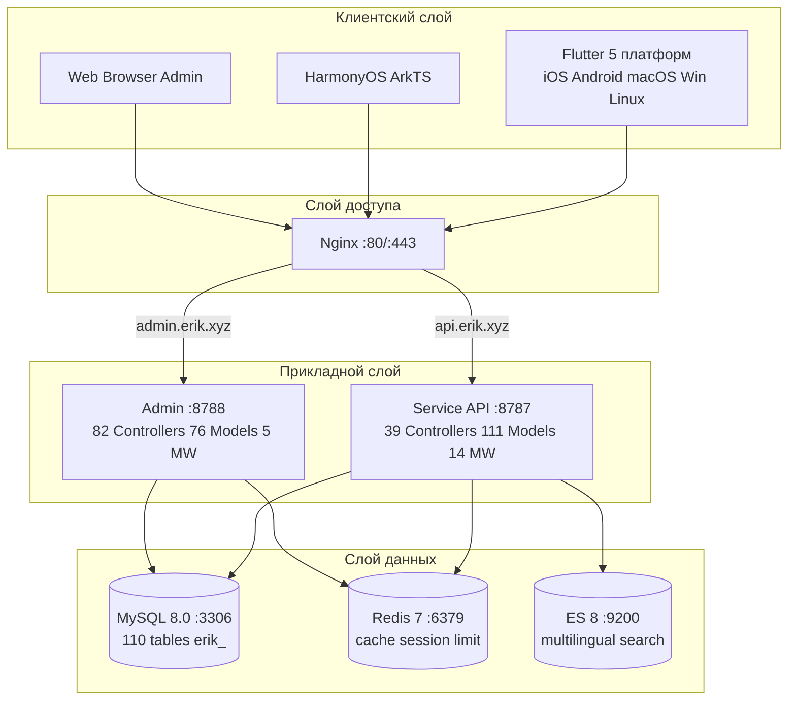
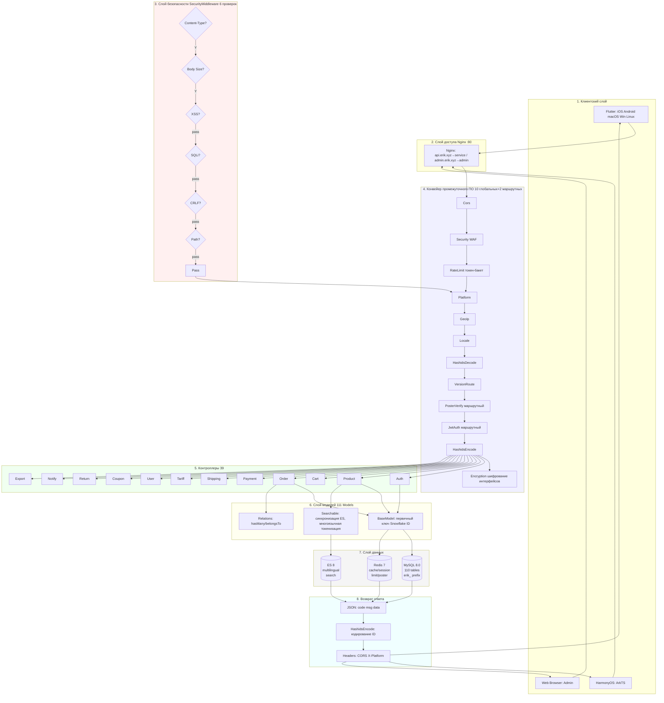
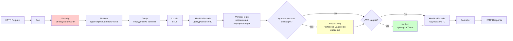
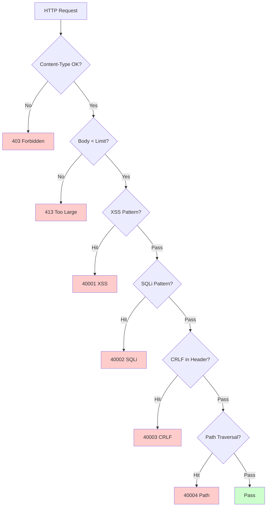
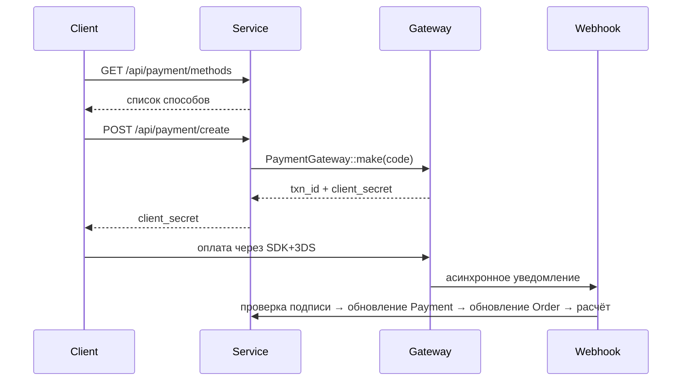
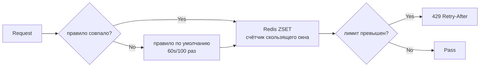

# Платформа трансграничной электронной коммерции — документ по архитектуре

Copyright (c) 2026 erik <erik@erik.xyz> — https://erik.xyz

---

## 1. Обзор системы

### 1.1 Позиционирование

Полностековая платформа трансграничной электронной коммерции на высокопроизводительном фреймворке webman, поддерживает B2C, B2B и привлечение сторонних продавцов.

| Компонент | Технологический стек | Масштаб |
|------|--------|------|
| Service API | PHP 8.3 / webman 2.1 / illuminate database | 39 контроллеров + 111 моделей + 14 промежуточных ПО |
| Admin | webman-admin / LayUI / ECharts | 82 контроллера + 76 моделей + 5 промежуточных ПО |
| Flutter | Riverpod / GoRouter / Dio | 25 Dart-файлов / 11 страниц |
| HarmonyOS | ArkTS / ArkUI | 14 ETS-файлов / 9 страниц |
| База данных | MySQL 8.0 + Redis 7 + ES 8 | 117 таблиц (110 `erik_` + 7 `wa_`) |

### 1.2 Ключевые показатели

| Показатель | Значение |
|------|-----|
| P99 API | <200ms |
| Конкурентность | 10000+ (32 worker в резидентной памяти) |
| Количество таблиц | 110 |
| Количество конечных точек | 73 |
| Промежуточное ПО | 14 (service: 10 глобальных + 2 маршрутных + AdminKey + StaticFile / admin: 4 глобальных + 1 встроенное) |
| Языки | zh_CN, zh_HK, en, ja, ko |
| Валюты | 19 видов независимого ценообразования |
| Оплата | Stripe / PayPal / Klarna / Adyen |

---

## 2. Схема системной архитектуры



### 2.1 Полная схема проектирования



**Пояснение к схеме:**

| Слой | Описание |
|----|------|
| 1. Клиентский слой | Flutter 5 платформ + HarmonyOS + Web Admin, вся связь через HTTP/JSON |
| 2. Слой доступа | Nginx распределяет по доменам: api → service, admin → admin |
| 3. Слой безопасности | SecurityMiddleware, 31 детектор атак, при срабатывании возвращается код ошибки/403 |
| 4. Конвейер промежуточного ПО | 10 глобальных MW последовательно + 2 маршрутных MW (PosterVerify для чувствительных операций, JwtAuth для аутентифицируемых интерфейсов) |
| 5. Слой контроллеров | 39 API-контроллеров, сгруппированы по функциям, обрабатывают всю бизнес-логику |
| 6. Слой моделей | 111 моделей Eloquent, BaseModel предоставляет первичный ключ Snowflake ID, 45 моделей используют SoftDelete |
| 7. Слой данных | MySQL (110 таблиц с префиксом erik_ / первичный ключ snowflake) + Redis (кэш/Session/лимитирование/Poster) + ES (многоязычный поиск) |
| 8. Возврат ответа | Единый формат JSON → HashidsEncode кодирует ID → Encryption шифрует (X-Encrypt-Response) → возврат клиенту |

### 2.2 Модель процессов

```
webman Master (:8787)
  ├── HTTP Worker x32 (CPU×4, резидентная память, пул соединений DB)
  ├── Monitor Process (мониторинг файлов + мониторинг памяти)
  └── SnowflakeWorker (инициализация синглтона Snowflake при запуске)
```

---

## 3. Конвейер промежуточного ПО

### 3.1 Полный конвейер Service API



### 3.2 Детали промежуточного ПО Service

| # | Промежуточное ПО | Тип | Функция |
|---|--------|------|------|
| 1 | Cors | Глобальное | Заголовки ответа Access-Control-*, предварительный запрос OPTIONS возвращает 200 |
| 2 | SecurityMiddleware | Глобальное | XSS/SQL-инъекции/CRLF/обход пути/Content-Type/тело запроса 10MB |
| 3 | RateLimitMiddleware | Глобальное | Токен-бакет (ZSET Redis, скользящее окно, правила 6 конечных точек) |
| 4 | PlatformMiddleware | Глобальное | Header X-Platform + понижение по UA для идентификации 8 платформ |
| 5 | GeoIpMiddleware | Глобальное | MaxMind GeoIP2, определение региона/валюты/языка для неавторизованных пользователей |
| 6 | LocaleMiddleware | Глобальное | Разбор Accept-Language, точное совпадение 5 языков → понижение → по умолчанию |
| 7 | HashidsDecode | Глобальное | Поля `*_id` в URL/Body: hashid → snowflake ID |
| 8 | VersionRoute | Глобальное | Заголовок API-Version → сопоставление с пространством имён контроллеров (v1/v2) |
| 9 | PosterVerify | Маршрутное | Проверка token в Redis для регистрации/заказа/оплаты |
| 10 | JwtAuth | Маршрутное | Bearer Token, проверка HS256 + срок действия + внедрение userId |
| 11 | HashidsEncode | Глобальное | Рекурсивный обход JSON ответа, snowflake ID → hashid |
| 12 | EncryptionMiddleware | Маршрутное | AES-шифрование/дешифрование интерфейсов (X-Encrypt-Response/X-Encrypted) |
| 13 | AdminKeyMiddleware | Маршрутное | Проверка ключа внутренних административных операций |
| 14 | StaticFile | Глобальное | Обслуживание статических ресурсов webman |

### 3.3 Конвейер Admin

```
Запрос → SecurityMiddleware → PlatformMiddleware → HashidsDecode
     → webman-admin AccessControl (встроенный RBAC) → HashidsEncode → контроллер
```

| # | Промежуточное ПО Admin | Функция |
|---|------------|------|
| 1 | SecurityMiddleware | XSS/SQL-инъекции/CRLF/обход пути/Content-Type/20MB |
| 2 | PlatformMiddleware | X-Platform + UA, идентификация 8 платформ |
| 3 | HashidsDecode | Запрос: hashid → snowflake ID |
| - | AccessControl (встроенное) | Проверка ролей и прав администратора |
| 4 | HashidsEncode | Ответ: snowflake ID → hashid |

---

## 4. Архитектура безопасности

### 4.1 Конвейер обнаружения атак (SecurityMiddleware)



### 4.2 Детали правил обнаружения атак SecurityMiddleware (15 типов собственных)

| # | Тип атаки | Основной способ обнаружения | Service | Admin | Код ошибки |
|---|---------|------------|---------|-------|--------|
| 1 | XSS, межсайтовый скриптинг | 13 регулярных выражений: script/iframe/on-события/svg+on/style/expression/javascript:/embed/object/link/meta | ✅ | ✅ | 40001 |
| 2 | SQL-инъекция | 13 регулярных выражений: UNION SELECT/SELECT FROM WHERE/sleep/benchmark/pg_sleep/булев тип/строковый тип/символы комментариев/специальные комментарии MySQL/перечисление schema/load_file/into outfile/хранимые процедуры/waitfor/delay | ✅ | ✅ | 40002 |
| 3 | CRLF-инъекция заголовков | `[\r\n]` в: Authorization/X-Platform/API-Version/X-Forwarded-For/Referer/Origin | ✅ | ✅ | 40003 |
| 4 | Обход пути | `../` + кодирование `%2e%2f` + двухуровневое кодирование `%252e%252f` + null byte `\0` + `.env`/`.git`/`phpmyadmin`/`wp-admin`/`/etc/`/`/proc/`/`composer.json` | ✅ | ✅ | 40004 |
| 5 | Ограничение тела запроса | Content-Length > 10MB (Service) / 20MB (Admin) | ✅ | ✅ | 40005 |
| 6 | Content-Type | Только JSON/form-data/form-urlencoded | ✅ | ✅ | 40006 |
| 7 | Проверка загрузки файлов | Чёрный список расширений (php/phtml/sh/exe/js/...) + двойное расширение + пустое расширение | ✅ | ✅ | 40009 |
| 8 | HTTP-безопасные заголовки ответа | nosniff/DENY/XSS-Protection/Referrer-Policy/Permissions-Policy/Cache-Control/скрытие Server | ✅ | ✅ | — |
| 9 | Защита от перебора | Счётчики Redis: API 10 раз/60s, Admin 5 раз/300s | ✅ | ✅ | 40008 |
| 10 | XXE-инъекция сущностей | `<!ENTITY SYSTEM>`, `<!DOCTYPE [` | ✅ | ✅ | 40010 |
| 11 | SSRF, подделка запросов на сервер | Внутренние IP (127/10/172.16/192.168/0.0/169.254.169.254) + localhost + metadata.google.internal | ✅ | ✅ | 40011 |
| 12 | Проверка HTTP-методов | Только GET/POST/PUT/DELETE/PATCH/OPTIONS/HEAD | ✅ | ✅ | 40012 |
| 13 | Проверка заголовка Host | Запрет прямого подключения по голому IP | ✅ | — | 40013 |
| 14 | Маскирование конфиденциальных данных | Фильтрация password/token/secret в логах и ошибочных ответах | ✅ | ✅ | — |
| 15 | Белый список CORS | Ограничение origin через конфигурацию | ⚠️ | ⚠️ | — |

### 4.3 Процесс аутентификации

```
Регистрация: email+password → PosterVerify (человеко-машинная проверка) → bcrypt(password+salt)
     → генерация ID Snowflake → возврат JWT

Вход: email+password → password_verify(password+salt, bcrypt_hash)
     → обновление last_login_at/ip/platform → выдача JWT

Запрос: Authorization: Bearer <token>
     → JwtAuth → Jwt::decode → проверка HS256 + срока действия → внедрение request->userId

Обновление: POST /api/auth/refresh {refresh_token} → Jwt::decode → новый access_token
```

### 4.4 Безопасность данных (трёхуровневое шифрование)

| Уровень | Технология | Пакет | Поля |
|------|------|-----|------|
| Транспортный | AES-256-CBC | erikwang2013/encryption | Чувствительные поля POST body |
| Уровень БД | Trait Encryptable | erikwang2013/encryptable (Maize) | email, mobile, name, phone, detail, tax_id |
| Обфускация ID | Кодирование Hashids | erikwang2013/hashids | Все snowflake ID на уровне интерфейсов |

### 4.5 Отслеживание источника платформ

| Платформа | Способ идентификации | Значение Header |
|------|---------|---------|
| iOS | Flutter `Platform.isIOS` + `TargetPlatform.iOS` | `ios` |
| iPadOS | Flutter `Platform.isIOS` + `!TargetPlatform.iOS` | `ipados` |
| macOS | Flutter `Platform.isMacOS` / UA `Macintosh` | `macos` |
| Windows | Flutter `Platform.isWindows` / UA `Windows` | `windows` |
| Linux | Flutter `Platform.isLinux` / UA `Linux` | `linux` |
| Android | Flutter `Platform.isAndroid` / UA `Android` | `android` |
| HarmonyOS | Жёстко задано в ArkTS / UA `HarmonyOS` | `harmonyos` |
| Web | Нет совпадения по UA / значение по умолчанию | `web` |

Таблицы записи: `erik_orders.platform`, `erik_payments.platform`, `erik_operation_logs.platform`, `erik_users.last_login_platform`, `erik_search_logs.platform`, `erik_chat_messages.platform`

---

## 5. Архитектура данных

### 5.1 Стратегия первичных ключей

```
Snowflake 64bit: [1bit|42bit временная метка|5bitDC|5bitWID|12bit порядковый номер]
- глобально уникален / монотонно растёт / не автоинкремент
- PHP $keyType='string' (защита от переполнения)
- Service worker_id=1, Admin worker_id=2
- генерация: Snowflake::nextId()
```

### 5.2 Наследование моделей

```
Illuminate\Database\Eloquent\Model
  └── app\model\BaseModel
        ├── $incrementing=false, $keyType='string', $guarded=[]
        ├── boot(): Snowflake::nextId()
        └── 110 бизнес-моделей
              ├── 45 используют SoftDeletes (таблицы с колонкой deleted_at)
              ├── часть использует Encryptable (чувствительные поля: email/mobile/name и т.д.)
              ├── use Searchable (Product→ES)
              └── связи hasMany/belongsTo
```

### 5.3 Многоязычность / мультивалютность

- **Переводы**: `erik_product_translations(product_id,locale)` отдельная таблица, запрос по locale
- **Ценообразование**: `erik_product_sku_prices(sku_id,currency_code)` независимые цены по валютам

---

## 6. Архитектура оплаты



```
PaymentGatewayInterface
  ├── createPayment(data): array
  ├── capturePayment(txnId): array
  ├── refundPayment(txnId, amount): array
  └── verifyWebhook(payload, sig): bool
```

---

## 7. Архитектура высокой нагрузки

### 7.1 Стратегия лимитирования (RateLimitMiddleware)



| Конечная точка | Окно | Лимит | Описание |
|------|------|------|------|
| /api/auth/login | 60s | 10 раз | Защита от перебора базы паролей |
| /api/auth/register | 300s | 5 раз | Защита от массовой регистрации |
| /api/payment | 60s | 5 раз | Защита от мошенничества с картами |
| /api/orders | 10s | 3 раза | Защита от накрутки заказов |
| /api/search | 1s | 10 раз | Защита от краулеров |
| По умолчанию | 60s | 100 раз | Общие API |

### 7.2 Использование Redis

Redis используется для токен-бакета лимитирования, кодов человеко-машинной проверки и хранения Session (на уровне промежуточного ПО); бизнес-данные не кэшируются на уровне приложения, читаются напрямую из MySQL (разделение чтения/записи + пул соединений).

### 7.4 Оптимизация пула соединений

| Ресурс | Макс. соединений | Мин. соединений | Тайм-аут ожидания | Тайм-аут простоя | Heartbeat |
|------|---------|---------|---------|---------|------|
| MySQL | 50 | 10 | 2s | 60s | 45s |
| Redis | 30 | 5 | — | 60s | — |

### 7.5 Обработка медленных операций

| Операция | Реализация |
|------|------|
| Обновление курсов | ExchangeRateCron (каждый час, внешний API) |
| Синхронизация Feed | ProductFeedCron (каждые 6 часов, генерация TSV и запись лога) |
| Расчёт рекомендаций | RecommendationCron (ежедневно, совместные покупки) |
| Сверка платежей | PaymentReconcileCron (каждые 6 часов, Stripe/PayPal) |
| Расчёт долей | SettlementCron (ежедневно) |
| Отслеживание логистики | ShipmentTrackingCron (каждые 30 минут, требуется настройка API) |
| Синхронизация заказов платформ | PlatformOrderSyncCron (каждые 5 минут, требуется настройка API) |
| Тайм-аут возвратов | ReturnExpireCron (каждый час) |
| Уведомления о снижении цены/поступлении | PriceAlertCron (каждые 10 минут) |
| Обновление правил соответствия | ComplianceCron (ежедневно, требуется настройка API) |

## 8. Архитектура развёртывания

```
docker-compose.yml:
  nginx (alpine) :80 :443
  service (php:8.3) :8787 internal, 32 workers
  admin (php:8.3) :8788 internal
  mysql (8.0) :3306 / redis (7) :6379 / es (8) :9200
Сеть: erik-net bridge | персистентные тома данных
Маршрутизация: api.erik.xyz→service | admin.erik.xyz→admin
```

---


## 8. Интернационализация (i18n)

| Уровень | Реализация |
|------|------|
| Service | LocaleMiddleware + файлы переводов на 5 языков (45 ключей/язык) |
| Admin | Файлы переводов на 5 языков |
| Flutter | AppLocalizations + Riverpod Provider |
| API | Автоматическая инъекция заголовка Accept-Language |

## 9. Документация API (hg/apidoc)

| Компонент | Описание |
|------|------|
| Пакет | hg/apidoc v5.3 |
| Конфигурация | config/plugin/hg/apidoc/app.php (6 групп) |
| Аннотации | @Apidoc\Title/Desc/Method/Url/Param/Returned |
| Доступ | http://localhost:8787/apidoc/ |

## 11. Тестирование

```bash
cd service && php vendor/bin/phpunit tests/
```

| Тестовый класс | Tests | Покрытие |
|--------|-------|------|
| SecurityTest | 12 | XSS+SQLi+XXE+SSRF+Path |
| JwtTest | 4 | encode/decode/invalid |
| ApiResponseTest | 3 | success/fail/paginate |
| RedisFacadeTest | 3 | ping/set/get/redis() |
| **Итого** | **22** | **45 утверждений PASS** |

---

## 12. Статистика проекта

| Измерение | Количество |
|------|------|
| PHP-файлы исходников | service: 210 + admin: 214 = 424 |
| Dart (Flutter) | 25 |
| ArkTS (HarmonyOS) | 14 |
| Таблицы базы данных | 110 |
| Конечные точки API | 73 |
| Промежуточное ПО | 14 |
| Классы утилит | 8 |
| Планировщики задач | 12 |
| Параметры конфигурации | 35+ |
| Тесты | 22 теста, 45 утверждений |
| Skills | 38 |
| Документы | 9 |
| **Итого** | **~700** |
