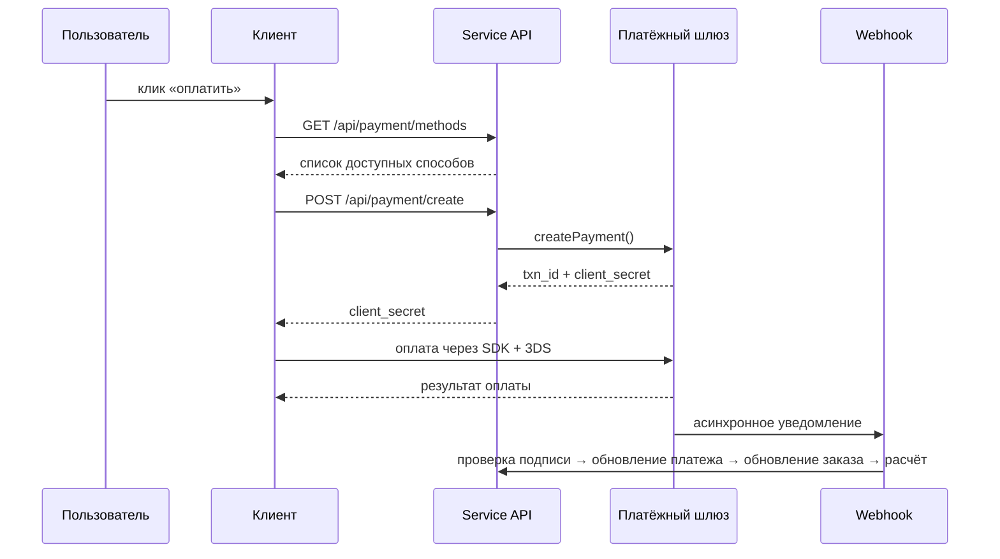
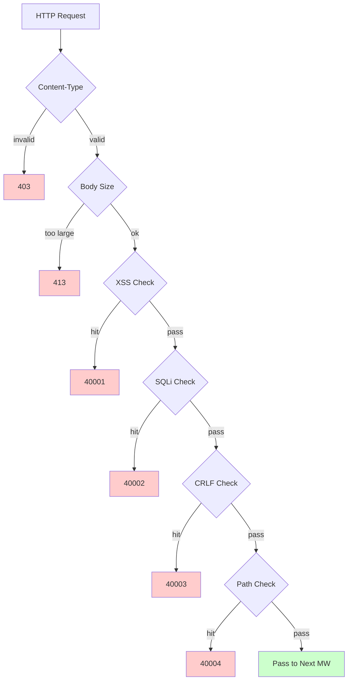

# Платформа трансграничной электронной коммерции — документ по функциональному дизайну

Copyright (c) 2026 erik <erik@erik.xyz> — https://erik.xyz

---


## Отслеживание платформ

### Идентификация 8 платформ

| Платформа | Header | Flutter | Admin |
|------|--------|---------|-------|
| iOS | `ios` | Platform.isIOS + TargetPlatform.iOS | UA iPhone |
| iPadOS | `ipados` | Platform.isIOS + !TargetPlatform.iOS | UA iPad |
| macOS | `macos` | Platform.isMacOS | UA Macintosh |
| Windows | `windows` | Platform.isWindows | UA Windows |
| Linux | `linux` | Platform.isLinux | UA Linux |
| Android | `android` | Platform.isAndroid | UA Android |
| HarmonyOS | `harmonyos` | — | UA HarmonyOS |
| Web | `web` | kIsWeb | по умолчанию |

### Поля отслеживания в БД

| Таблица | Поле | Описание |
|----|------|------|
| erik_orders | platform VARCHAR(16) | Платформа оформления заказа |
| erik_payments | platform VARCHAR(16) | Платёжная платформа |
| erik_operation_logs | platform VARCHAR(16) | Платформа операций |
| erik_users | last_login_platform VARCHAR(16) | Платформа входа |
| erik_search_logs | platform VARCHAR(16) | Платформа поиска |
| erik_chat_messages | platform VARCHAR(16) | Источник сообщения |

## 1. Обзор функций

### 1.0 Общий охват

| Измерение | Охват | Глубина |
|------|---------|------|
| **B2C-розница** | Многоязычные товары, ценообразование по валютам, SKU, корзина, заказы, оплата (Stripe/PayPal/Klarna), возврат средств, возвраты | Полная |
| **B2B-опт** | Ступенчатые цены (MOQ), корпоративная верификация (налоговый номер/лицензия), запрос котировок | Полная |
| **Привлечение продавцов** | Проверка продавцов, модерация товаров, распределение долей | Полная |
| **Трансграничное соответствие** | База кодов HS (6-значные базовые коды), правила пошлин (страна назначения + HS → ставка), VAT/IOSS, метки соответствия (FDA/CE/RoHS и др., 10 категорий) | Полная |
| **Международная логистика** | Логистические зоны с тарифами (весовые ступени), DHL/UPS/FedEx/EMS, зарубежные склады (отгрузка + возврат), декларация HS (метки батарея/жидкость), коммерческий инвойс PDF/упаковочный лист | Полная |
| **Оплата** | Stripe PaymentIntent+3DS, PayPal REST, Klarna BNPL, Adyen, проверка подписи Webhook + распределение | Stripe полная, остальные заглушки |
| **Маркетинг** | Купоны (по зонам + ограничение новых/старых клиентов), карусели (видимость по регионам), флеш-распродажи (ограничение по времени и количеству), групповые покупки (минимальное число участников + срок действия), партнёрская программа (ссылки + комиссии + вывод) | Полная |
| **Мультиплатформенность** | Публикация на Amazon/eBay/Shopee/Lazada/Temu + агрегация заказов, управление несколькими магазинами | Полная |
| **Цепочка поставок** | Карточки поставщиков + рейтинг, закупочные ордера (проверка → отгрузка → приёмка → контроль качества), контроль качества (вход/выход со склада/внешний вид/функции/проверка меток соответствия), складской журнал (неизменяемый учёт: приход/расход/перемещение/инвентаризация) | Полная |
| **Риски и соответствие** | Движок правил (параллельная оценка: проверка адреса/совпадение почтового индекса/3DS/массовая регистрация/аномалии стоимости), KYC-верификация, GDPR/CCPA-запросы данных, управление версиями Cookie Consent | Полная |
| **Защита** | SecurityMiddleware инкапсулирует 31 детектор security-php: XSS (13 правил)/SQL-инъекции (13 правил)/CRLF/путь (кодирование + null byte)/размер тела/Content-Type/загрузка файлов/HTTP-безопасные заголовки/защита от перебора (счётчики Redis)/XXE/SSRF/методы/Host/маскирование данных/CORS | Полная |
| **Высокая нагрузка** | Токен-бакет (скользящее окно + правила 6 конечных точек), предохранитель (платежи/вход через соцсети, 5 сбоев → размыкание на 30s + полуоткрытое восстановление), разделение чтения/записи БД (2 читающих реплики + sticky), пул соединений (DB 50/10 + Redis 30/5), OPCache (128MB, среда Docker) | Полная |
| **Рост участников** | Уровни членства + привилегии, правила баллов + журнал, подарочные карты (баланс + активация), уведомления о снижении цены/поступлении, избранное, сравнение товаров, история просмотров, подписочные покупки, AB-тесты (распределение трафика + достоверность) | Полная |
| **Управление контентом** | Многоязычные CMS-страницы (Landing/Blog), многоязычный FAQ, многоязычная база знаний, таблицы размеров (одежда/обувь + конвертация US/UK/EU/JP/CN), шаблоны писем (многоязычные), товарные Feed (Google/Meta + периодическая синхронизация) | Полная |
| **Поддержка** | Веб-сокеты, real-time IM (chat_sessions/chat_messages), многоязычная база знаний | Структура таблиц готова, WS предстоит |
| **Инфраструктура** | Snowflake распределённый ID (bigint, не автоинкремент), Hashids обфускация ID интерфейсов, JWT-аутентификация (HS256 + пара access/refresh с обновлением), шифрование AES (трёхуровневое шифрование интерфейсов и БД), определение региона GeoIP (MaxMind), Poster человеко-машинная проверка (слайдер/пазл/клик), CDN origin-pull (Cloudflare/CloudFront/Aliyun/Tencent, `Cdn::url()`, автоочистка fail-open) | Полная |
| **Мультиплатформенное покрытие** | Flutter 5 платформ (iOS/Android/macOS/Windows/Linux/iPadOS) + HarmonyOS (ArkTS 9 страниц) + Web Admin (LayUI+ECharts) + API | Flutter 25 файлов, HarmonyOS 14 файлов, Admin 239 файлов |
| **Отслеживание платформ** | Идентификация 8 платформ (iOS/iPadOS/macOS/Windows/Linux/Android/HarmonyOS/Web) + header X-Platform + запись в 6 таблиц (orders/payments/operation_logs/users/search_logs/chat_messages) | Полная |
| **Тестирование** | 22 теста / 45 утверждений — ALL PASS (SecurityTest 12: XSS+SQLi+XXE+SSRF+Path / JwtTest 4 / ApiResponseTest 3 / RedisFacadeTest 3) | Модульное тестирование полное, интеграционное предстоит |

### 1.1 Матрица модулей

| Модуль первого уровня | Модуль второго уровня | Приоритет | Статус |
|---------|---------|--------|------|
| Пользовательская система | Регистрация/вход/социальный вход/KYC-верификация/адреса/избранное/членство/баллы/подарочные карты | P0-P2 | ✅ |
| Система товаров | Категории/SKU/многоязычность/мультивалютность/изображения/атрибуты/соответствие/HS Code/ES-поиск/Feed | P0-P1 | ✅ |
| Транзакционная система | Корзина/заказы/оплата (Stripe+PayPal+Klarna)/возврат средств/возвраты/инвойсы | P0 | ✅ |
| Логистическая система | Международные перевозчики/зональные тарифы/зарубежные склады/отгрузка (декларация HS)/страхование логистики | P0-P1 | ✅ |
| Таможня и налоги | База кодов HS/правила пошлин/VAT/IOSS/ограничения соответствия по странам | P0 | ✅ |
| Маркетинговая система | Купоны/карусели/флеш-распродажи/групповые покупки/партнёрская программа | P1-P2 | ✅ |
| Цепочка поставок | Поставщики/закупочные ордера/контроль качества/складской журнал | P1 | ✅ |
| Риски и соответствие | Движок правил/GDPR/CCPA/Cookie Consent/отслеживание платформ | P1 | ✅ |
| Защита | XSS/SQL-инъекции/CRLF/путь/Content-Type/тело запроса | P0 | ✅ |
| Мультиплатформенность | Публикация Amazon/eBay/Shopee + агрегация заказов/привлечение продавцов | P2 | ✅ |
| Управление контентом | CMS/FAQ/база знаний/шаблоны писем/уведомления/таблицы размеров | P2 | ✅ |
| Инструменты роста | B2B-опт/подписочные покупки/AB-тесты | P2-P3 | ✅ |
| Поддержка | Веб-сокеты, real-time IM/база знаний | P3 | ✅ |
| Инфраструктура | Snowflake ID/JWT/Hashids/Encryption/Poster/версии API/GeoIP/CDN | P0 | ✅ |

---

## 2. Основные бизнес-процессы

### 2.1 Конечный автомат заказа

```mermaid
stateDiagram-v2
    [*] --> "Ожидает оплаты": заказ пользователя
    "Ожидает оплаты" --> "Оплачен": оплата успешна
    "Ожидает оплаты" --> "Отменён": отмена/тайм-аут
    "Ожидает оплаты" --> "На проверке": высокий риск-скоринг
    "Оплачен" --> "Отправлен": отгрузка
    "Оплачен" --> "Возврат средств": запрос возврата средств
    "Отправлен" --> "Получен": получение товара
    "Получен" --> "Завершён": подтверждение завершения
    "Получен" --> "Возврат товара": запрос возврата товара
    "Возврат средств" --> "Возвращён": возврат средств выполнен
    "Возврат товара" --> "Возвращён": возврат товара выполнен
    "На проверке" --> "Оплачен": проверка пройдена
    "На проверке" --> "Отменён": проверка отклонена
```

### 2.2 Последовательность оплаты



### 2.3 Конвейер обнаружения атак



---

## 3. Основные бизнес-процессы

### 3.1 Регистрация и вход пользователя

```
Регистрация по email: email+password → PosterVerify (человеко-машинная проверка) → bcrypt(password+salt)
          → генерация ID Snowflake → возврат JWT {access_token, expires_in}

Социальный вход: Google/Apple/Facebook OAuth → проверка id_token
        → erik_user_social_accounts: поиск привязки
        → привязан: вход / не привязан: автосоздание пользователя + привязка → возврат JWT

Вход: email+password → password_verify(password+salt)
    → обновление last_login_at/ip/platform → выдача JWT

Обновление токена: refresh_token → Jwt::decode → новый access_token
```

### 3.2 Просмотр товаров и поиск

```
Список: GET /api/products
  → фильтрация: category_id/status/keyword/price_range
  → сортировка: default/price_asc/price_desc/sales/newest
  → многоязычность: ProductTranslations, фильтрация по locale
  → цены по валютам: ProductSkuPrices, сопоставление по currency_code
  → пагинация: 20 записей/стр

Поиск ES: GET /api/search?keyword=xxx
  → Erikwang2013\WebmanScout\Searchable → многоязычный анализатор ES
  → агрегация: category/price/brand
  → деградация: MySQL LIKE при недоступности ES

Детали: GET /api/products/{hashid}
  → декодирование в промежуточном ПО HashidsDecode → Eager Load
  → многоязычность+валюты+соответствие+HS Code+конвертация размеров+с/без налога+VAT
```

### 3.3 Корзина и оформление заказа

```
Корзина: POST /api/cart {sku_id, quantity}
  → проверка: SKU существует | опубликован | достаточно запасов
  → суммирование для того же SKU / создание, если отсутствует

Оформление заказа: POST /api/orders {address_id, coupon_id, currency_code}
  → 1. проверка адреса доставки → 2. получение выбранного из корзины → 3. проверка каждого товара (запасы+соответствие)
  → 4. расчёт цены (валюты+купон) → 5. генерация номера заказа
  → 6. создание Order+OrderItems → 7. списание запасов → 8. запись OrderLog
  → 9. риск-скоринг (RiskEngine::score) → 10. очистка корзины

Отмена: POST /api/orders/{id}/cancel
  → проверка статуса=0 (ожидает оплаты) → восстановление запасов → status=5 (отменён)
```

### 3.4 Платёжный процесс

```
Доступные способы: GET /api/payment/methods?country=DE&currency=EUR
  → PaymentGatewayMethods (фильтр по country+currency)

Создание платежа: POST /api/payment/create
  → PaymentGateway::make(gateway)→createPayment()
  → Stripe: PaymentIntent → client_secret → SDK на фронтенде (+3DS)

Webhook: POST /webhook/payment/stripe
  → проверка подписи → payment_intent.succeeded:
     → Payment.status=оплачен → Order.status=оплачен
     → PlatformSettlement (комиссия платформы+платёжный сбор+поставщик+дистрибуция)
```

### 3.5 Процесс возврата

```
Заявка: POST /api/returns {order_id, reason_id}
  → выбор канала возврата: местный склад (type=1)/возврат в Китай (type=2)/только возврат средств (type=3)

Проверка: проверка админом → одобрено: генерация ReturnLabel / отклонено: запись причины

Отправка назад: скачать этикетку → отправить → обновление логистики → приёмка на складе → status=получен

Возврат средств: status=завершён → связывание Refund → PaymentGateway::refund → возврат на исходный способ оплаты
```

### 3.6 Оценка пошлин

```
GET /api/tariff/estimate?product_id=xxx&dest_country_id=xxx&declared_value=100

1. ProductHsCodes → HsCode
2. TariffRules(dest_country_id + hs_code_id) → duty_rate + duty_free_threshold
3. VatSettings(country_id) → vat_rate + vat_free_threshold
4. duty = value>=threshold ? value*duty_rate/100 : 0
   vat = (value+duty)>=threshold ? (value+duty)*vat_rate/100 : 0
5. return {duty_rate, vat_rate, estimated_duty, estimated_vat, estimated_total, hs_code, disclaimer}
```

---

## 4. Защита (SecurityMiddleware инкапсулирует 31 детектор security-php)

### 4.1 Сводная таблица правил обнаружения

| # | Тип атаки | Основной способ обнаружения | Код ошибки | Service | Admin |
|---|---------|------------|--------|---------|-------|
| 1 | XSS, межсайтовый скриптинг | 13 регулярных выражений: script/iframe/on-события/svg+on/style/expression/javascript:/embed/object/link/meta | 40001 | ✅ | ✅ |
| 2 | SQL-инъекция | 13 регулярных выражений: UNION SELECT/SELECT FROM WHERE/sleep/benchmark/pg_sleep/булев тип/строковый тип/символы комментариев/специальные комментарии MySQL/перечисление schema/load_file/into outfile/хранимые процедуры/waitfor/delay | 40002 | ✅ | ✅ |
| 3 | CRLF-инъекция заголовков | `[\r\n]` в: Authorization/X-Platform/API-Version/X-Forwarded-For/Referer/Origin | 40003 | ✅ | ✅ |
| 4 | Обход пути | `../` + кодирование `%2e%2f` + двухуровневое кодирование `%252e%252f` + null byte `\0` + `.env`/`.git`/`phpmyadmin`/`wp-admin`/`/etc/`/`/proc/`/`composer.json` | 40004 | ✅ | ✅ |
| 5 | Ограничение тела запроса | Content-Length > 10MB (Service) / 20MB (Admin) | 40005 | ✅ | ✅ |
| 6 | Ограничение Content-Type | Только JSON/form-data/form-urlencoded | 40006 | ✅ | ✅ |
| 7 | **Проверка загрузки файлов** | Чёрный список расширений (php/phtml/sh/exe/js/...) + атака двойного расширения + пустое расширение | 40009 | ✅ | ✅ |
| 8 | **HTTP-безопасные заголовки ответа** | nosniff/DENY/XSS-Protection/Referrer-Policy/Permissions-Policy/Cache-Control/скрытие Server | — | ✅ | ✅ |
| 9 | **Защита от перебора** | Счётчики Redis: API 10 раз/60s, Admin 5 раз/300s | 40008 | ✅ | ✅ |
| 10 | **XXE-инъекция сущностей** | `<!ENTITY SYSTEM>`, `<!DOCTYPE [` | 40010 | ✅ | ✅ |
| 11 | **SSRF, подделка запросов на сервер** | Внутренние IP (127/10/172.16/192.168/0.0/169.254.169.254) + localhost + metadata.google.internal | 40011 | ✅ | ✅ |
| 12 | **Проверка HTTP-методов** | Только GET/POST/PUT/DELETE/PATCH/OPTIONS/HEAD | 40012 | ✅ | ✅ |
| 13 | **Проверка заголовка Host** | Запрет прямого доступа по голому IP | 40013 | ✅ | — |
| 14 | **Маскирование конфиденциальных данных** | Фильтрация password/token/secret в логах и ошибочных ответах | — | ✅ | ✅ |
| 15 | **Белый список CORS** | Ограничение origin через конфигурацию | — | ⚠️ | ⚠️ |

### 4.2 Конвейер промежуточного ПО

```
Service: Cors → Security → Platform → GeoIp → Locale → HashidsDecode
        → VersionRoute → (PosterVerify) → (JwtAuth) → HashidsEncode

Admin: Security → Platform → HashidsDecode → AccessControl → HashidsEncode
```

### 4.3 Отслеживание источника платформ

| Платформа | Значение Header | Способ идентификации |
|------|---------|---------|
| iOS | `ios` | Flutter `Platform.isIOS` |
| iPadOS | `ipados` | Flutter `TargetPlatform.iOS` |
| macOS | `macos` | Flutter `Platform.isMacOS` |
| Windows | `windows` | Flutter `Platform.isWindows` |
| Linux | `linux` | Flutter `Platform.isLinux` |
| Android | `android` | Flutter `Platform.isAndroid` |
| HarmonyOS | `harmonyos` | Жёстко задано в ArkTS |
| Web | `web` | Понижение по UA / по умолчанию |

---


## 5. Высокая нагрузка и производительность

### 5.1 Правила лимитирования

| Конечная точка | Алгоритм | Окно | Лимит |
|------|------|------|------|
| /api/auth/login | Скользящее окно | 60s | 10 раз |
| /api/auth/register | Скользящее окно | 300s | 5 раз |
| /api/payment | Скользящее окно | 60s | 5 раз |
| /api/orders | Скользящее окно | 10s | 3 раза |
| /api/search | Скользящее окно | 1s | 10 раз |
| По умолчанию | Скользящее окно | 60s | 100 раз |

### 5.2 Использование Redis

| Назначение | Реализация |
|------|------|
| Токен-бакет лимитирования | ZSET Redis, скользящее окно |
| Человеко-машинная проверка | Статус кода PosterVerify |
| Хранилище сессий | KV-хранилище Redis |

Бизнес-данные не кэшируются на уровне приложения, читаются напрямую из MySQL (разделение чтения/записи + пул соединений).

### 5.3 Пул соединений

| Ресурс | Максимум | Минимум | Тайм-аут |
|------|------|------|------|
| MySQL | 50 | 10 | 2s |
| Redis | 30 | 5 | — |

## 6. Схема связей таблиц

```
erik_users ──┬── addresses, social_accounts, wishlists, kyc
             ├── carts, orders → order_items → payments
             ├── reviews, coupons(through user_coupons)
             ├── notifications, subscriptions, point_logs
             ├── affiliate_links, chat_sessions, b2b_verifications
             └── privacy_requests

erik_products ──┬── translations(product_id, locale)
                ├── skus → sku_prices(sku_id, currency_code)
                ├── images, reviews, compliance → compliance_categories
                ├── hs_codes → hs_codes, recommendations
                ├── b2b_prices, platform_listings
                └── product_comparisons

erik_orders ──┬── order_items, order_logs
              ├── payments, refunds, return_orders → return_labels
              ├── order_documents, shipments
              ├── platform_settlements, risk_logs
              └── subscription_orders

erik_countries ──┬── vat_settings, tariff_rules(dest_country_id)
                 ├── country_compliance_rules
                 ├── shipping_zones(JSON countries)
                 └── warehouses(country_id)
```

---

## 7. API-интерфейсы

Полный список конечных точек API (23 публичных интерфейса + 47 аутентифицированных + Webhook + Admin/Health) см. в [документации API](api.md).

---

## 8. Проверка тестами

```bash
cd service && php vendor/bin/phpunit tests/
```

| Тестовый класс | Tests | Покрытие |
|--------|-------|------|
| SecurityTest | 12 | XSS (3) + SQLi (2) + XXE (2) + SSRF (1) + Path (2) + утечка карт (1) + нормальный пропуск (1) |
| JwtTest | 4 | encode трёхсегментного JWT + round-trip decode + недействительный token → null + пустой token → null |
| ApiResponseTest | 3 | success (code=0) + fail (error code) + paginate (list+meta, пагинация) |
| RedisFacadeTest | 3 | ping + round-trip set/get + вспомогательная функция redis() (skip, когда Redis недоступен) |
| **Итого** | **22** | **45 утверждений — ALL PASS** |
